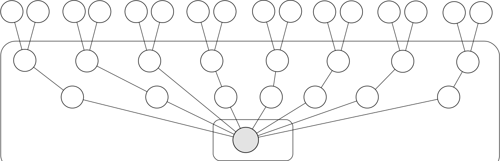

============
Introduction
============

*NOTE*: This document is still under development.

Diffusion models have established themselves as the de-facto standard
for modeling data from simple decision making tasks. Each decision is
modeled as a drift process which generates a response once a
boundary is crossed. This simple assumption about the underlying
psychological process has the intriguing property of reproducing
reaction time distributions and choice probability in simple two-choice
decision making tasks.

Hierarchical Bayesian methods are quickly gaining popularity in
cognitive sciences. Traditionally, psychological models where either
fit separately to individual subjects (thus not taking similarities of
subjects into account) or to the whole group (thus not taking
differences of subjects into account). Hierarchical Bayesian methods
provide a remedy for this problem by allowing group and subject
parameters to be estimated simultaniously at different hierarchies. In
essence, subject parameters are assumed to come from a group
distribution. In addition, because these methods are Bayesian they
deal naturally with uncertainty and variability in the parameter
estimations.

HDDM_ (Hierarchical Drift Diffusion Modeling) is an open-source
software package written in Python_ which allows (i) the construction
of hierarchical Bayesian drift models and (ii) the estimation of its
posterior parameter distributions via PyMC_. For efficiency, all
runtime critical functions are coded in Cython_, heavily optimized and
compiled natively. User-defined models can be constructed via a simple
configuration files or directly via HDDM library calls. To assess
model fit, HDDM generates different statistics and comes with various
plotting capabilities. For illustrative purposes, HDDM includes a
graphical demo applet which simulates individual drift processes under
user-specified parameter combinations. The code is test-covered to
assure correct function and is properly documented. Online
documentation and tutorials are provided.

In sum, the presented software allows researches to construct and fit
complex, user-specified models using state-of-the-art estimation
methods without requiring a strong computer science or math
background.

----------------
Diffusion Models
----------------

HDDM implements two types of drift models, (i) the Ratcliff drift
diffusion model (DDM) and (ii) the linear ballistic accumulator
(LBA). Both of these models implement decision making as an evidence
accumulation process that executes a response upon crossing one of two
decision boundaries. The speed of which the accumulation process
approaches one of the two boundaries is called the drift rate *v* and
influences how swiftly a particular reponse is executed. The distance
between the two boundaries (i.e. threshold *a*) influences how much
evidence must be accumulated until a reponse is executed. A lower
threshold makes responding faster in general but more random while a
higher threshold leads to more cautious responding. Reaction time,
however, is not solely comprised of the decision making process --
perception, movement initiation and execution all take time and are
summarized into one variable called non-decision time *ter*.

Ratcliff Drift Diffusion Model
------------------------------

The Ratcliff DDM models decision making in two-choice tasks. Each
choice is represented as and upper and lower boundary. A drift process
accumulates evidence over time until it crosses one of the two
boundaries and initiates the corresponding response. Because there is
noise in the drift process, the time of the boundary crossing and the
selected response will vary between trials. The starting point of the
drift process relative to the two boundaries can influence if one
response has a prepotent bias *z*. This pattern gives rise to the
reaction time distributions of both choices and will henceforth be
called the simple DDM (see figure 1).

..  figure:: DDM_drifts_w_labels.svg

Later on, it was noticed that this simple DDM could not account for
two phenomena observed in decision making tasks -- early and late
errors. This lead to the inclusion of inter-trial variability in the
drift-rate, the non-decision time and the starting point. Models that
take this into account are henceforth called full DDM.

Linear Ballistic Accumulator
----------------------------

While the Linear Ballistic Accumulator (LBA) model also belongs to the
class of drift models, it separates itself from the Ratcliff DDM in
multiple ways. First, instead of one drift process and two boundaries,
the LBA contains one drift process for each response. Thus, the LBA
can model decision making when more than two responses are possible

Moreover, unlike the DDM, the LBA drift process has no intra-trial
variance. RT variability is obtained by including inter-trial
variability in the drift-rate and the starting point distribution.

------------------------------
Hierarchical Bayesian Modeling
------------------------------

Bayesian estimation of posterior distributions differs from other
approaches such as maximum likelihood (ML) by not only finding the one
parameter value with the highest probability, but instead estimating
the likelihood of each parameter value (i.e. the posterior
distribution). The posterior can be computed with Bayes formula:

.. math::

    P(\theta|data) = \frac{P(data|\theta) * P(\theta)}{P(data)}

Where P(data|\theta) is the likelihood and P(\theta) is the prior
probability. To compute P(data) we have to integrate (or sum in the
discrete case) across all parameter values.

Note that in most scenarios this integral is analytically
intractable. Sampling methods like Markov-Chain Monte Carlo (MCMC)
have been developed that instead approximate the posterior directly by
drawing samples from it, rather than analytically solving the above
formula. These methods have been used with great success in many
different scenarios. The theoretical background of these sampling
methods is out of the scope of this paper.

Another nice property of the Bayesian method is that it lends itself
naturally to a hierarchical design. In such a design, parameters for
one distribution can themselves come from a different distribution
which allows chaining together of distributions of arbitrary
complexity and map the structure of the data onto the model.

This hierarchical property has a particular benefit to cognitive
modeling where data is often scarce. Traditionally, multiple subjects
are tested on the same task and a model is fit to explain the
subject's behavior. Using maximum likelihood we can either fit
individual models to individual subjects and neglect that they are
most likely more similar than not and that what we learn from one
subject could be used for inference on other subjects. Alternatively,
we could fit one model to all subjects and neglect the individual
differences that most likely exist. A hierarchical model helps us to
capture this specific design of our data: we can create one
distribution for each individual subject parameter but let the
parameters for these distributions be modeled according to a group
distribution. This way, the individual subject distributions restrict
the group distribution and vice versa.

----------------------------------------------
Hierarchical Bayesian Drift Diffusion Modeling
----------------------------------------------

The structure of our simple hierarchical DDM can be appreciated in figure 2.

.. _HDDM: http://github.com/twiecki/hddm
.. _Python: http://www.python.org/
.. _PyMC: http://code.google.com/p/pymc/
.. _Cython: http://www.cython.org/
