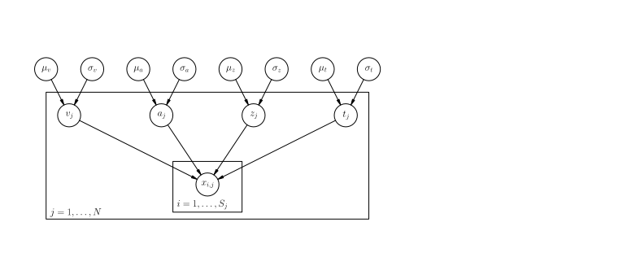

============
Introduction
============

*NOTE*: This document is still under development.

Sequential sampling models (SSMs) (:cite:`TownsendAshby83`) have
established themselves as the de-facto standard for modeling
reaction-time data from simple decision making tasks
(:cite:`SmithRatcliff04`). Each decision is modeled as a continuous
accumulation of information from the environment and/or internal
representations. Once the accumulated evidence crosses a threshold, a
corresponding response is executed. This simple assumption about the
underlying psychological process has the intriguing property of
reproducing reaction time distributions and choice probability in
simple two-choice decision making tasks. Models of this class have
been used successfully in mathematical psychology since the 60s and
more recently found their way into cognitive neuroscience. While data
collection is not a major constrain for traditional psychological
experiments, cognitive neuroscience experiments often record brain
activity (e.g. fMRI) which makes collection of large amounts of data a
much more costly enterprise. Consequently, trial numbers in cognitive
neuroscience experiments are often low.

Meanwhile, Bayesian methods are quickly gaining popularity in the
cognitive sciences because of their many desirable properties
(:cite:`LeeWagenmakersIP`, :cite:`Kruschke11`). In particular,
hierarchical modeling is quite easily formulated in a Bayesian
framework. Traditionally, psychological models were either fit
separately to individual subjects (thus not taking similarities of
subjects into account) or to the whole group (thus not taking
differences of subjects into account). It is important to realize that
this limitation is imposed by the estimation method (see
below). Hierarchical Bayesian methods provide a remedy for this
problem by allowing group and subject parameters to be estimated
simultaniously at different hierarchies. In essence, subject
parameters are assumed to come from a group distribution. In addition,
because these methods are Bayesian they deal naturally with
uncertainty and variability in the parameter estimations.

HDDM_ is an open-source software package written in Python_ which
allows (i) the flexible construction of hierarchical Bayesian drift
diffusion models and (ii) the estimation of its posterior parameter
distributions via PyMC_ (:cite:`PatilHuardFonnesbeck10`). User-defined
models can be specified via a configuration file thus requiring no
Python knowledge. Alternatively, more sophisticated usage of the
toolbox is available interactively via, for example, IPython_ or by
writing Python scripts. All runtime critical functions are coded in
Cython_ (:cite:`BehnelBredshawCitroEtAl11`) and compiled natively for
speed which allows estimation of complex models in minutes. HDDM
includes many commonly used statistics and plotting functionality
generally used to assess model fit. The code is released under the
permissive BSD 3-clause license, test-covered to assure correct
behavior and well documented.

With HDDM we aim to place a userfriendly but powerful tool into the
hands of experimental scientists to construct and fit complex,
user-specified models using state-of-the-art estimation methods to
test their hypotheses.

**************************
Methods
**************************

--------------------------
Sequential Sampling Models
--------------------------

SSMs generally fall into one of two classes: (i) diffusion models
which assume that *relative* evidence is accumulated over time
and (ii) race models which assume independent evidence accumulation
and response commitment once the first accumulator crossed a boundary
(:cite:`LaBerge62`, :cite:`Vickers70`). HDDM includes two of the most
commonly used SSMs: the drift diffusion model (DDM)
(:cite:`RatcliffRouder98`, :cite:`RatcliffMcKoon08`) belonging to the
class of diffusion models and the linear ballistic accumulator (LBA)
(:cite:`BrownHeathcote08`) belonging to the class of race models.

Drift Diffusion Model
=====================

The DDM models decision making in two-choice tasks. Each choice is
represented as an upper and lower boundary. A drift-process
accumulates evidence over time until it crosses one of the two
boundaries and initiates the corresponding response
(:cite:`RatcliffRouder98`, :cite:`SmithRatcliff04`). The speed with
which the accumulation process approaches one of the two boundaries is
called drift-rate *v* and represents the relative evidence for or
against a particular response. Because there is noise in the drift
process, the time of the boundary crossing and the selected response
will vary between trials. The distance between the two boundaries
(i.e. threshold *a*) influences how much evidence must be accumulated
until a response is executed. A lower threshold makes responding
faster in general but increases the influence of noise on decision
making while a higher threshold leads to more cautious
responding. Reaction time, however, is not solely comprised of the
decision making process -- perception, movement initiation and
execution all take time and are summarized into one variable called
non-decision time *t*. The starting point of the drift process
relative to the two boundaries can influence if one response has a
prepotent bias *z*. The termination times of this generative process
gives rise to the reaction time distributions of both choices (see
figure :ref:`ddm`).

.. _ddm:

.. figure:: DDM_drifts_w_labels.svg

    Trajectories of multiple drift-processs (blue and red lines,
    middle panel). Evidence is accumulated over time (x-axis) with
    drift-rate v until one of two boundaries (separated by
    threshold a) is crossed and a response is initiated. Upper (blue)
    and lower (red) panels contain histograms over
    boundary-crossing-times for two possible responses. The histogram
    shapes match closely to that observed in reaction time
    measurements of research participants.

An analytical solution to the resulting probability distribution of
the termination times was provided by :cite:`Feller68`:

.. math::

    f(t|v, a, z) = \frac{\pi}{a^2} \, \text{exp} \left( -vaz-\frac{v^2\,t}{2} \right) \times \sum_{k=1}^{\infty} k\, \text{exp} \left( -\frac{k^2\pi^2 t}{2a^2} \right) \text{sin}\left(k\pi z\right)

Note that the infinite sum requiers some form of approximation. HDDM
uses the likelihood formulation provided by :cite:`NavarroFuss09`.

Later on, the DDM was extended to include inter-trial variability in
the drift-rate, the non-decision time and the starting point in order
to account for two phenomena observed in decision making tasks --
early and late errors. Models that take this into account are referred
to as the full DDM (:cite:`RatcliffRouder98`). HDDM uses analytical
integration of the likelihood function for variability in drift-rate
and numerical integration for variability in non-decision time and
bias. More information on the model specifics can be found in
Sofer, Wiecki, & Frank (in preparation).

Linear Ballistic Accumulator
============================

The Linear Ballistic Accumulator (LBA) model belongs to the class of
race models (:cite:`BrownHeathcote08`). Instead of one drift process
and two boundaries, the LBA contains one drift process for each
possible response with a single boundary each. Thus, the LBA can model
decision making when more than two responses are possible. Moreover,
unlike the DDM, the LBA drift process has no intra-trial variance. RT
variability is obtained by including inter-trial variability in the
drift-rate and the starting point distribution (see figure
:ref:`lba`). Note that the simplifying assumption of a noiseless
drift-process simplifies the math significantly leading to a
computationally faster likelihood function for this model.

In a simulation study it was shown that the LBA and DDM lead to
similar results as to which parameters are affected by certain
manipulations (:cite:`DonkinBrownHeathcoteEtAl11`).

.. _lba:

.. figure:: lba.png

    Two linear ballistic accumulators (left and right) with different
    noiseless drifts (arrows) sampled from a normal distribution
    initiated at different starting points sampled from uniform
    distribution. In this case, accumulator for response alternative 1
    reaches criterion first and gets executed. Because of this race
    between two accumulators towards a common threshold these model
    are called race-models. Reproduced from
    :cite:`DonkinBrownHeathcoteEtAl11`.

Relationship to cognitive neuroscience
======================================

SSMs were originally developed from a pure information processing
point of view and primarily used in psychology as a high-level
approximation of the decision process. More recent efforts in
cognitive neuroscience have simultaneously (i) validated core
assumptions of the model by showing that neurons indeed integrate
evidence probabilistically during decision making
(:cite:`SmithRatcliff04`,:cite:`GoldShadlen07`) and (ii) applied this
model to understand and describe neural correlates of cognitive
processes (:cite:`ForstmannDutilhBrownEtAl08`,
:cite:`CavanaghWieckiCohenEtAl11`).

Multiple routes to decision threshold modulation have been
identified. Decision threshold in the speed-accuracy trade-off is
modulated by changes in the functional connectivity between pre-SMA
and striatum (:cite:`ForstmannDutilhBrownEtAl08`). Neural network
modeling (:cite:`Frank06`, :cite:`RatcliffFrank12`) validated by studies of PD
patients with a deep-brain-stimulator (DBS) in their subthalamic
nucleus (STN) (:cite:`FrankSamantaMoustafaEtAl07`) suggest that this
node is implicated in raising the decision threshold when there is
conflict between two options associated with similar rewards. This
result was further corroborated by (:cite:`CavanaghWieckiCohenEtAl11`)
who found that frontal theta power (as measured by
electroencelophagraphy and thought to correspond to conflict
(:cite:`CavanaghZambrano-VazquezAllen12`)) is correlated with decision
threshold increase on a trial-by-trial basis. As predicted, this
relationship was broken in PD patients with DBS turned on (but,
critically, not when DBS was turned off thus showing the effect is not
a result of the disease). In other words, by interfering with STN
function through stimulation we were able to show that this brain area
is casually involved in decision threshold modulation despite intact
experience of conflict (as measured by theta power). Interestingly,
these results provide a computational cognitive explanation for the
clinical symptom of impulsivity observed in PD patients receiving DBS
(:cite:`FrankSamantaMoustafaEtAl07`).

------------------------------
Hierarchical Bayesian Estimation
------------------------------

Statistics and machine learning have developed efficient and versatile
Bayesian methods to solve various inference problems
:cite:`Poirier06`. More recently, they have seen wider adoption in
applied fields such as genetics :cite:`StephensBalding09` and
psychology :cite:`ClemensDeSelenEtAl11`. One reason for this
Bayesian revolution is the ability to quantify the certainty one has
in a particular estimation. Moreover, hierarchical Bayesian models
provide an elegant solution to the problem of estimating parameters of
individual subjects outlined above. Under the assumption that
participants within each group are similar to each other, but not
identical, a hierarchical model can be constructed where individual
parameter estimates are constrained by group-level distributions
(:cite:`NilssonRieskampWagenmakers11`, :cite:`ShiffrinLeeKim08`).

Bayesian methods require specification of a generative process in form
of a likelihood function that produced the observed data :math:`x` given
some parameters :math:`\theta`. By specifying our prior belief we can use
Bayes formula to invert the generative model and make inference on the
probability of parameters :math:`\theta`:

.. _bayes:

.. math::

    P(\theta|x) = \frac{P(x|\theta) \times P(\theta)}{P(x)}

Where :math:`P(x|\theta)` is the likelihood and :math:`P(\theta)` is
the prior probability. Computation of the marginal likelihood :math:`P(x)`
requires integration (or summation in the discrete case) over the
complete parameter space :math:`\Theta`:

.. math::

    P(x) = \int_\Theta P(x|\theta) \, \mathrm{d}\theta

Note that in most scenarios this integral is analytically
intractable. Sampling methods like Markov-Chain Monte Carlo (MCMC)
:cite:`GamermanLopes06` circumvent this problem by providing a way to
produce samples from the posterior distribution. These methods have
been used with great success in many different scenarios
:cite:`GelmanCarlinSternEtAl03` and will be discussed in more detail
below.

Another nice property of the Bayesian method is that it lends itself
naturally to a hierarchical design. In such a design, parameters for
one distribution can themselves come from a different distribution
which allows chaining together of distributions of arbitrary
complexity and map the structure of the data onto the model.

This hierarchical property has a particular benefit to cognitive
modeling where data is often scarce. We can construct a hierarchical
model to more adequately capture the likely similarity structure of
our data. As above, observed data points of each subject
:math:`x_{i,j}` (where :math:`i = 1, \dots, S_j` data points per
subject and :math:`j = 1, \dots, N` for :math:`N` subjects) are
distributed according to some likelihood function :math:`f | \theta`.
We now assume that individual subject parameters :math:`\theta_j` are
normal distributed around a group mean with a specific group variance
(:math:`\lambda = (\mu, \sigma)` with hyperprior :math:`G_0`)
resulting in the following generative description:

.. math::

  \mu, \sigma \sim G_0() \\
  \theta_j \sim \mathcal{N}(\mu, \sigma^2) \\
  x_{i, j} \sim f(\theta_j)

See figure :ref:`graphical_hierarchical` for the corresponding graphical model description.

Another way to look at this hierarchical model is to consider that our
fixed prior on :math:`\theta` from formula (:ref:`bayes`) is actually
a random variable (in our case a normal distribution) parameterized by
:math:`\lambda` which leads to the following posterior formulation:

.. math::

    P(\theta, \lambda | x) = \frac{P(x|\theta) \times P(\theta|\lambda) \times P(\lambda)}{P(x)}

.. _graphical_hierarchical:

.. figure:: graphical_hierarchical.svg

    Graphical notation of a hierarchical model. Circles represent
    continuous random variables. Arrows connecting circles specify
    conditional dependence between random variables. Shaded circles
    represent observed data. Finally, plates around graphical nodes
    mean that multiple identical, independent distributed random
    variables exist.

Note that we can factorize :math:`P(x|\theta)` and
:math:`P(\theta|\lambda)` due to their conditional independence. This
formulation also makes apparent that the posterior contains estimation
of the individual subject parameters :math:`\theta_j` and group
parameters :math:`\lambda`.

-----------------------------------
Hierarcical Drift-Diffusion Models used in HDDM
-----------------------------------

HDDM includes several hierarchical Bayesian model formulations for the
DDM and LBA. For illustrative purposes we present the graphical model
depiction of the default DDM hierarchical model in
:ref:`graphical_hddm`.

.. _graphical_hddm:

    Basic graphical hierarchical model implemented by HDDM for
    estimation of the drift-diffusion model.

Individual graphical nodes are distributed as follows.

.. math::

    \mu_{a} &\sim \mathcal{N}(0, 1) \\
    \mu_{z} &\sim \mathcal{N}(0, 1) \\
    \mu_{v} &\sim \mathcal{N}(0, 1) \\
    \mu_{ter} &\sim \mathcal{N}(0, 1) \\
    \mu_{sv} &\sim \mathcal{N}(0, 1) \\
    \mu_{sz} &\sim \mathcal{N}(0, 1) \\
    \mu_{ster} &\sim \mathcal{N}(0, 1) \\
    \\
    \sigma_{a} &\sim \mathcal{U}(1e^{-10}, 100) \\
    \sigma_{z} &\sim \mathcal{U}(1e^{-10}, 100) \\
    \sigma_{v} &\sim \mathcal{U}(1e^{-10}, 100) \\
    \sigma_{ter} &\sim \mathcal{U}(1e^{-10}, 100) \\
        \sigma_{sv} &\sim \mathcal{U}(1e^{-10}, 100) \\
    \sigma_{sz} &\sim \mathcal{U}(1e^{-10}, 100) \\
    \sigma_{ster} &\sim \mathcal{U}(1e^{-10}, 100) \\
    \\
    a_{j} &\sim \mathcal{N}(\mu_{a}, \sigma_{a}^2) \\
    z_{j} &\sim \mathcal{N}(\mu_{z}, \sigma_{z}^2) \\
    v_{j} &\sim \mathcal{N}(\mu_{v}, \sigma_{v}^2) \\
    ter_{j} &\sim \mathcal{N}(\mu_{ter}, \sigma_{ter}^2) \\
    sv_{j} &\sim \mathcal{N}(\mu_{sv}, \sigma_{sv}^2) \\
    sz_{j} &\sim \mathcal{N}(\mu_{sz}, \sigma_{sz}^2) \\
    ster_{j} &\sim \mathcal{N}(\mu_{ster}, \sigma_{ster}^2) \\
    \\
    x_{i, j} &\sim F(a_{i}, z_{i}, v_{i}, ter_{i}, sv_{i}, sz_{i}, ster_{i})

where :math:`x_{i, j}` represents the observed data consisting of
reaction time and choice and :math:`F` represents the DDM likelihood
function as formulated by :cite:`NavarroFuss09`. As can be seen,
individual subject parameters are expected to be normal distributed
around a group mean :math:`\mu` with variance :math:`\sigma^2`. HDDM
then uses MCMC to estimate the joint posterior distribution of all
model parameters.

Note that the exact form of the model will be user-dependent; consider
as an example a model where separate drift-rates *v* are estimated for
two conditions in an experiment: easy and hard. In this case, HDDM
will create a hierarchical model with group parameters
:math:`\mu_{v_{\text{easy}}}`, :math:`\sigma_{v_{\text{easy}}}`,
:math:`\mu_{v_{\text{hard}}}`, :math:`\sigma_{v_{\text{hard}}}`,and individual subject parameters :math:`v_{j_{\text{easy}}}`, and :math:`v_{j_{\text{hard}}}`.

.. bibliography:: hddm.bib

.. _HDDM: http://github.com/twiecki/hddm
.. _Python: http://www.python.org/
.. _PyMC: http://code.google.com/p/pymc/
.. _Cython: http://www.cython.org/
