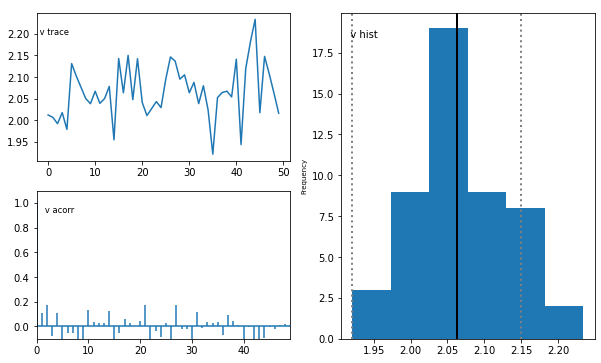
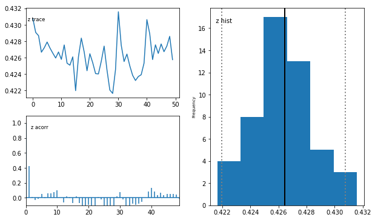
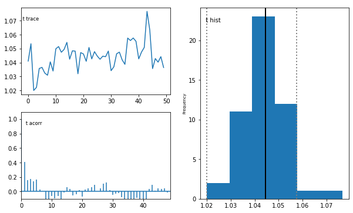
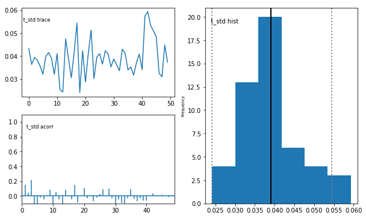
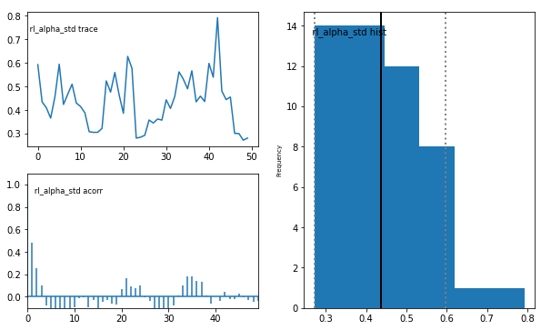
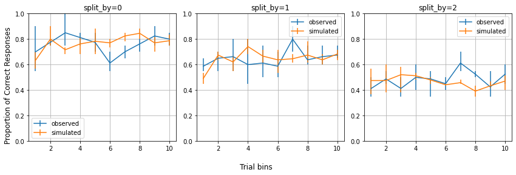
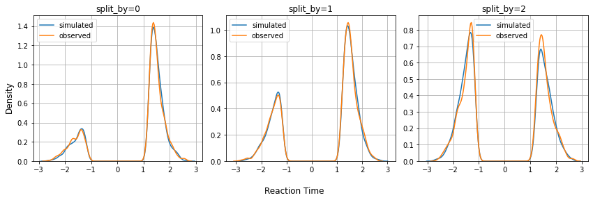

.. index:: Tutorials
.. _chap_rl:

Tutorial for analyzing instrumental learning data with the HDDMnnRL module
==========================================================================

.. code:: ipython3

    import hddm
    import pickle
    import pandas as pd

Load the data
^^^^^^^^^^^^^

.. code:: ipython3

    with open('./angle_d1_c3_s20_t500.pickle', 'rb') as handle:
        datafile = pickle.load(handle)
    
    # Here, datafile is saved as a list of datasets. We pick the first dataset.
    dataset = datafile[0]

.. parsed-literal::

    1

.. code:: ipython3

    # Reformat the dataset as a dataframe
    data = hddm.utils.get_dataset_as_dataframe_rlssm(dataset)

Initialize the HDDMnnRL model and sample
^^^^^^^^^^^^^^^^^^^^^^^^^^^^^^^^^^^^^^^^

.. code:: ipython3

    # Specify number of samples and burnins
    nsamples = 100
    nburn = 50

.. code:: ipython3

    m = hddm.HDDMnnRL(data, model='angle', rl_rule='RWupdate', non_centered=True, include=['v', 'a', 't', 'z', 'theta', 'rl_alpha'], p_outlier = 0.0)
    m.sample(nsamples, burn=nburn, dbname='traces.db', db='pickle')

.. parsed-literal::

    
    Printing model specifications -- 
    ssm:  angle
    rl rule:  RWupdate
    using non-centered dist.:  False
    Using default priors: Uninformative
    Supplied model_config specifies params_std_upper for  z as  None.
    Changed to 10
    Supplied model_config specifies params_std_upper for  rl_alpha as  None.
    Changed to 10
     [-----------------101%-----------------] 101 of 100 complete in 256.1 sec

.. parsed-literal::

    <pymc.MCMC.MCMC at 0x7f5b5c224f10>

Save the model
^^^^^^^^^^^^^^

.. code:: ipython3

    # Save the model
    m.save('rlssm_model')

.. code:: ipython3

    # Load the model
    # model = hddm.load('rlssm_model')

Check the posterior results
^^^^^^^^^^^^^^^^^^^^^^^^^^^

.. code:: ipython3

    m.plot_posteriors()

.. parsed-literal::

    Plotting v
    Plotting v_std
    Plotting a
    Plotting a_std
    Plotting z
    Plotting z_std
    Plotting t
    Plotting t_std
    Plotting theta
    Plotting theta_std
    Plotting rl_alpha
    Plotting rl_alpha_std

.. image:: demo_HDDMnnRL_files/demo_HDDMnnRL_12_2.png

.. image:: demo_HDDMnnRL_files/demo_HDDMnnRL_12_3.png

.. image:: demo_HDDMnnRL_files/demo_HDDMnnRL_12_4.png

.. image:: demo_HDDMnnRL_files/demo_HDDMnnRL_12_6.png

.. image:: demo_HDDMnnRL_files/demo_HDDMnnRL_12_9.png

.. image:: demo_HDDMnnRL_files/demo_HDDMnnRL_12_10.png

.. image:: demo_HDDMnnRL_files/demo_HDDMnnRL_12_11.png

.. code:: ipython3

    # Load the trace
    with open('./traces.db', 'rb') as handle:
        tracefile = pickle.load(handle)

.. code:: ipython3

    # Re-format traces as a dataframe
    traces = hddm.utils.get_traces_rlssm(tracefile)

.. code:: ipython3

    model_ssm = 'angle'
    model_rl = 'RWupdate'
    
    config_ssm = hddm.model_config.model_config[model_ssm]
    config_rl = hddm.model_config_rl.model_config_rl[model_rl]

.. code:: ipython3

    hddm.plotting.plot_posterior_pairs_rlssm(tracefile, config_ssm['params'] + config_rl['params'])

Posterior Predictive Checks
^^^^^^^^^^^^^^^^^^^^^^^^^^^

.. code:: ipython3

    num_posterior_samples = 3
    p_lower = {0: 0.15, 1:0.30, 2:0.45}
    p_upper = {0: 0.85, 1:0.70, 2:0.55}
    ppc_sdata = hddm.plotting.gen_ppc_rlssm(model_ssm, config_ssm, model_rl, config_rl, data, traces, num_posterior_samples, p_lower, p_upper, save_data=True, save_name='ppc_data')

.. parsed-literal::

    100%|██████████| 3/3 [05:49<00:00, 116.55s/it]

.. parsed-literal::

    ppc data saved at ./ppc_data.csv

.. code:: ipython3

    # Load the saved ppc data
    # ppc_sdata = pd.read_csv('./ppc_data.csv')

.. code:: ipython3

    _ = hddm.plotting.plot_ppc_choice_rlssm(data, ppc_sdata, 40, 10)

.. code:: ipython3

    _ = hddm.plotting.plot_ppc_rt_rlssm(data, ppc_sdata, 40, 0.06)

