Tutorial for analyzing instrumental learning data with the HDDMrl module
========================================================================

This is a tutorial for using the HDDMrl module to simultaneously
estimate reinforcement learning parameters and decision parameters
within a fully hierarchical bayesian estimation framework, including
steps for sampling, assessing convergence, model fit, parameter
recovery, and posterior predictive checks (model validation). The module
uses the reinforcement learning drift diffusion model (RLDDM), a
reinforcement learning model that replaces the standard “softmax” choice
function with a drift diffusion process. The softmax and drift diffusion
process is equivalent for capturing choice proportions, but the DDM also
takes RT distributions into account; options are provided to also only
fit RL parameters without RT. The RLDDM estimates trial-by-trial drift
rate as a scaled difference in expected rewards (expected reward for
upper bound alternative minus expected reward for lower bound
alternative). Expected rewards are updated with a delta learning rule
using either a single learning rate or with separate learning rates for
positive and negative prediction errors. The model also includes the
standard DDM-parameters. The RLDDM is described in detail in `Pedersen,
Frank & Biele
(2017). <http://ski.clps.brown.edu/papers/PedersenEtAl_RLDDM.pdf>`__
(Note this approach differs from Frank et al (2015) who used HDDM to fit
instrumental learning but did not allow for simultaneous estimation of
learning parameters).

OUTLINE
-------

`1. Background <#1.-Background>`__ `2. Installing the
module <#2.-Installing-the-module>`__ `3. How the RLDDM
works <#3.-How-the-RLDDM-works>`__ `4. Structuring
data <#4.-Structuring-data>`__ `5. Running basic
model <#5.-Running-basic-model>`__ `6. Checking
results <#6.-Checking-results>`__ `7. Posterior predictive
checks <#7.-Posterior-predictive-checks>`__\  `8. Parameter
recovery <#8.-Parameter-recovery>`__\  `9. Separate learning rates for
positive and negative prediction
errors <#9.-Separate-learning-rates-for-positive-and-negative-prediction-errors>`__\ 
`10. depends_on vs. split_by <#10.-depends_on-vs.-split_by>`__\  `11.
Probabilistic binary outcomes vs. normally distributed
outcomes <#11.-Probabilistic-binary-outcomes-vs.-normally-distributed-outcomes>`__\ 
`12. HDDMrlRegressor <#12.-HDDMrlRegressor>`__\  `13. Regular RL without
RT <#13.-Regular-RL-without-RT>`__

1. Background
-------------

Traditional RL models typically assume static decision processes
(e.g. softmax), and the DDM typically assumes static decision variables
(stimuli are modeled with the same drift rate across trials). The RLDDM
combines dynamic decision variables from RL and dynamic choice process
from DDM by assuming trial-by-trial drift rate that depends on the
difference in expected rewards, which are updated on each trial by a
rate of the prediction error dependent on the learning rate. The
potential benefit of the RLDDM is thus to gain a better insight into
decision processes in instrumental learning by also accounting for speed
of decision making.

2. Installing the module
------------------------

The new version of HDDM (version 0.7.1) that includes the RLDDM is
currently not uploaded to conda. So to install you would either have to
use pip: ‘pip install hddm’ OR docker: ‘pull madslupe/hddm’, which runs
hddm in jupyter notebook

3. How the RLDDM works
----------------------

The main idea of the RLDDM is that reward-based choices can be captured
by an accumulation-to-bound process where drift rate is proportional to
the difference in expected reward between options, and where expected
rewards subsequently are updated in a trial-by-trial basis via
reinforcement learning. **drift rate on each trial depends on difference
in expected rewards for the two alternatives (q_up and q_low):** drift
rate = (q_up - q_low) \* scaling *where the scaling parameter describes
the weight to put on the difference in q-values.*\  **expeceted reward
(q) for chosen option is updated according to delta learning rule :**
q_chosen = q_chosen + alpha \* (feedback-q_chosen) *where alpha weights
the rate of learning on each trial.*\  So in principle all you need is
the Wiener first passage time likelihood-function. The reason why HDDM
is useful (and hence also HDDMrl) is that it automates the process of
setting up and running your model, which tends to be very time
consuming. So after structuring the data it is simple to run a model
with HDDMrl. In particular it separates subjects and conditions (using
the split_by-column, see next section) so that the updating process
works correctly, which can be especially difficult to do for RL models.

4. Structuring data
-------------------

The HDDMrl module was created to make it easier to model instrumental
learning data with the RLDDM. If you are familiar with using HDDM it
shouldn’t be a big step to start using HDDMrl. Please refresh your
memory by starting with the `tutorial for
HDDM <http://ski.clps.brown.edu/hddm_docs/index.html>`__ first
(especially critical if you have not used HDDM at all). Running HDDMrl
does require a few extra steps compared to HDDM, and because the model
includes increased potential for parameter colinearity (typically
learning rate and the scaling parameter on drift rate) it is even more
important to assess model fit, which will be covered below. Here are the
most important steps for structuring your dataframe: 1. Sort trials in
ascending order within subject and condition, to ensure proper updating
of expected rewards. 2. Include a column called **‘split_by’** which
identifies the different task conditions (**as integers**), to ensure
reward updating will work properly for each condition without mixing
values learned from one trial type to another. 3. Code the response
column with [stimulus-coding]
(http://ski.clps.brown.edu/hddm_docs/howto.html#code-subject-responses).
Although stimulus-coding and accuracy-coding often are the same in
instrumental learning it is important that the upper and lower
boundaries are represented by the same alternative within a condition,
because expected rewards are linked to the thresholds/boundaries. 4.
**feedback**-column. This should be the reward received for the chosen
option on each trial. 5. **q_init**. Adjusting initial q-values is
something that can improve model fit quite a bit. To allow the user to
set their own initial values we therefore require that the dataframe
includes a column called q_init. The function will set all initial
q-values according to the first value in q_init. So this is not the most
elegant method of allowing users to set inital value for expected
rewards, but it works for now.

Required columns in data:
~~~~~~~~~~~~~~~~~~~~~~~~~

-  **rt**: in seconds, same as in HDDM
-  **response**: 0 or 1. defines chosen stimulus, not accuracy.
-  **split_by**: needs to be an integer. Split_by defines conditions
   (trial-types) that should have the same variables (e.g. Q values)
   within subject: the trials need to be split by condition to ensure
   proper updating of expected rewards that do not bleed over into other
   trial-types. (e.g. if you have stimulus A and get reward you want
   that updated value to impact choice only for the next stimulus A
   trial but not necessarily the immediate trial afterwards, which may
   be of a different condition)
-  **subj_idx**: same as in HDDM, but even more important here because
   it is used to split trials
-  **feedback**: feedback on the current trial. can be any value.
-  **q_init**: used to initialize expected rewards. can be any value,
   but an unbiased initial value should be somewhere between the minimum
   and and maximum reward values (e.g. 0.5 for tasks with rewards of 0
   and 1).

5. Running basic model
----------------------

To illustrate how to run the model we will use example data from the
learning phase of the probabilistic selection task (PST). During the
learning phase of the PST subjects choose between two stimuli presented
as Hiragana-letters (here represented as letters from the latin
alphabet). There are three conditions with different probabilities of
receiving reward (feedback=1) and non-reward (feedback=0). In the AB
condition A is rewarded with 80% probability, B with 20%. In the CD
condition C is rewarded with 70% probability and D with 30%, while in
the EF condition E is rewarded with a 60% probability and F with 40%.
The dataset is included in the data-folder in your installation of HDDM.

.. code:: ipython3

    # import
    import pandas as pd
    import numpy as np
    import hddm
    from scipy import stats
    import seaborn as sns
    import matplotlib.pyplot as plt
    import pymc
    import kabuki
    
    sns.set(style="white")
    %matplotlib inline
    from tqdm import tqdm
    import warnings
    
    warnings.filterwarnings("ignore", category=np.VisibleDeprecationWarning)

.. parsed-literal::

    /Users/madslundpedersen/anaconda/envs/py36/lib/python3.6/site-packages/IPython/parallel.py:13: ShimWarning: The `IPython.parallel` package has been deprecated since IPython 4.0. You should import from ipyparallel instead.
      "You should import from ipyparallel instead.", ShimWarning)

.. code:: ipython3

    # load data. you will find this dataset in your hddm-folder under hddm/examples/rlddm_data.csv
    data = hddm.load_csv("rlddm_data.csv")
    # check structure
    data.head()

.. raw:: html

    

    
    <table border="1" class="dataframe">
      <thead>
        <tr style="text-align: right;">
          <th></th>
          <th>subj_idx</th>
          <th>response</th>
          <th>cond</th>
          <th>rt</th>
          <th>trial</th>
          <th>split_by</th>
          <th>feedback</th>
          <th>q_init</th>
        </tr>
      </thead>
      <tbody>
        <tr>
          <th>0</th>
          <td>42</td>
          <td>0.0</td>
          <td>CD</td>
          <td>1.255</td>
          <td>1.0</td>
          <td>1</td>
          <td>0.0</td>
          <td>0.5</td>
        </tr>
        <tr>
          <th>1</th>
          <td>42</td>
          <td>1.0</td>
          <td>EF</td>
          <td>0.778</td>
          <td>1.0</td>
          <td>2</td>
          <td>0.0</td>
          <td>0.5</td>
        </tr>
        <tr>
          <th>2</th>
          <td>42</td>
          <td>1.0</td>
          <td>AB</td>
          <td>0.647</td>
          <td>1.0</td>
          <td>0</td>
          <td>1.0</td>
          <td>0.5</td>
        </tr>
        <tr>
          <th>3</th>
          <td>42</td>
          <td>1.0</td>
          <td>AB</td>
          <td>0.750</td>
          <td>2.0</td>
          <td>0</td>
          <td>1.0</td>
          <td>0.5</td>
        </tr>
        <tr>
          <th>4</th>
          <td>42</td>
          <td>0.0</td>
          <td>EF</td>
          <td>0.772</td>
          <td>2.0</td>
          <td>2</td>
          <td>1.0</td>
          <td>0.5</td>
        </tr>
      </tbody>
    </table>
    

The columns in the datafile represent: **subj_idx** (subject id),
**response** (1=best option), **cond** (identifies condition, but not
used in model), **rt** (in seconds), 0=worst option), **trial** (the
trial-iteration for a subject within each condition), **split_by**
(identifying condition, used for running the model), **feedback**
(whether the response given was rewarded or not), **q_init** (the
initial q-value used for the model, explained above).

.. code:: ipython3

    # run the model by calling hddm.HDDMrl (instead of hddm.HDDM for normal HDDM)
    m = hddm.HDDMrl(data)
    # set sample and burn-in
    m.sample(1500, burn=500, dbname="traces.db", db="pickle")
    # print stats to get an overview of posterior distribution of estimated parameters
    m.print_stats()

.. parsed-literal::

     [-----------------100%-----------------] 1500 of 1500 complete in 151.7 sec                    mean         std       2.5q        25q        50q        75q     97.5q       mc err
    a                1.75114   0.0837255    1.59815    1.69574    1.74802    1.80376   1.92983   0.00291067
    a_std            0.41232   0.0656654   0.308913   0.367279   0.405368   0.447927   0.56776   0.00289675
    a_subj.3         2.00788    0.102676    1.82598    1.93802    2.00144    2.07171   2.23154   0.00493845
    a_subj.4         1.89902   0.0536733     1.8001    1.86271    1.89701    1.93338   2.00713   0.00230884
    a_subj.5         1.48871   0.0715107    1.35642    1.43919     1.4863    1.53484   1.63991   0.00325001
    a_subj.6         2.40214   0.0937021    2.22399    2.33902    2.40306    2.46714   2.58429   0.00398112
    a_subj.8         2.50645    0.143083    2.24263    2.39808    2.50384    2.60774   2.78264   0.00698664
    a_subj.12        1.90226   0.0674087    1.77675     1.8556    1.89957    1.94815   2.04225   0.00320297
    a_subj.17        1.40972   0.0847752    1.22943    1.35608    1.40973     1.4647   1.58511   0.00491962
    a_subj.18        1.91654    0.124726    1.67828    1.83025    1.90977    1.99927   2.18669   0.00673609
    a_subj.19        2.08417   0.0794147    1.93045    2.03586    2.07986    2.13421   2.24956   0.00371623
    a_subj.20        1.71138   0.0843558    1.54864    1.65762    1.71167    1.76404   1.88942   0.00415579
    a_subj.22        1.19208   0.0324851    1.13197    1.17101    1.19101    1.21212   1.26011   0.00145357
    a_subj.23        1.93444    0.102446    1.74689    1.86325    1.92864    1.99758   2.15107   0.00503582
    a_subj.24        1.69065   0.0895549    1.53553    1.62691    1.68709     1.7483   1.87742    0.0040531
    a_subj.26        2.23017   0.0812178    2.08111    2.17227    2.22704     2.2827   2.39238   0.00361254
    a_subj.33        1.56584    0.069505    1.43544    1.52022    1.56458    1.61061   1.70839   0.00293951
    a_subj.34        1.82111   0.0925344    1.63987    1.75834    1.81963    1.88833   1.99193   0.00392129
    a_subj.35        1.83364   0.0910862    1.66166    1.77008    1.83076    1.89022   2.02515   0.00434047
    a_subj.36        1.32831   0.0711046    1.19866    1.27959    1.32398     1.3726    1.4815   0.00326779
    a_subj.39        1.57092   0.0570179    1.46831    1.53323    1.56933    1.60591   1.69108   0.00254816
    a_subj.42        1.72289   0.0780534    1.58344     1.6716    1.71808    1.77379    1.8881     0.003965
    a_subj.50        1.46373   0.0561168    1.36497    1.42376    1.46046    1.50046    1.5824   0.00367163
    a_subj.52        2.12277   0.0877004     1.9546    2.06291    2.11955    2.17823    2.3141   0.00422443
    a_subj.56        1.47434   0.0491814    1.38212    1.44175    1.47195    1.50692   1.57668   0.00236224
    a_subj.59        1.30969   0.0844833     1.1589    1.24941    1.31109    1.36849   1.48692   0.00618501
    a_subj.63        1.87185   0.0892341    1.71495    1.80829    1.86594    1.93234   2.06417   0.00389064
    a_subj.71        1.24574   0.0337506    1.18058    1.22069    1.24465     1.2673   1.31452   0.00144168
    a_subj.75       0.980626   0.0403033    0.90314   0.954133   0.978959    1.00467   1.06114   0.00181344
    a_subj.80        2.19842   0.0996843    2.00149    2.13232    2.19346    2.26375   2.39521   0.00447729
    v                4.15839    0.799926    2.70281    3.61434    4.11883    4.69384   5.82079    0.0512965
    v_std            3.17944    0.582619    2.24768    2.73327    3.12028    3.57136   4.51764    0.0380689
    v_subj.3         5.40933     2.40655    1.26099    3.71918    5.11575    6.79629   11.0188     0.186314
    v_subj.4        0.935868     0.13627   0.687918    0.84222   0.929464    1.02821   1.21449   0.00574671
    v_subj.5         5.53473     2.53813    1.29287    3.73108    5.17908    7.11548   11.2961     0.172848
    v_subj.6         5.07554     2.29577    1.82701    3.34519    4.68917    6.43253   10.5485     0.187447
    v_subj.8         3.19083      1.1531    1.76428    2.43081     2.9948    3.64642   6.33461     0.087577
    v_subj.12        1.80427    0.222639    1.40465    1.65858      1.796    1.93888   2.27892   0.00974675
    v_subj.17        7.71563     2.30556    3.88888    6.02563    7.55031    9.12299   12.7238     0.182644
    v_subj.18        6.87545     1.94651    3.83483    5.50429    6.56637    8.00345   11.3874      0.15955
    v_subj.19        11.8954     2.02558    8.68551    10.3678    11.7157    13.1091   16.4924     0.149489
    v_subj.20        4.80234     1.28635    2.96684    3.93358    4.52135    5.36143   8.30574     0.109046
    v_subj.22        2.21094    0.293277    1.62874    2.02192    2.20417    2.41537    2.7777    0.0132941
    v_subj.23         2.8458     1.98089   0.960886    1.48088    2.03871    3.77161   8.22177     0.174202
    v_subj.24        5.15582    0.764892    3.67864    4.64563    5.15715    5.65935   6.65519    0.0285252
    v_subj.26       0.539671     0.59661   0.254778   0.404612   0.480991   0.553289  0.877278    0.0407894
    v_subj.33        2.77334     2.13257   0.295247    1.13338    2.15707    4.00407   8.14233      0.12317
    v_subj.34        4.20132     2.39341    1.17239    2.25712    3.63896    5.72171   9.86739     0.177777
    v_subj.35        3.17444     1.95745    1.12509    1.74651    2.53013    4.17782   8.26337     0.165034
    v_subj.36        3.79907      2.4476    1.36971    2.15898    2.87502    4.67084   10.8683      0.21156
    v_subj.39        2.27064     1.97675   0.351198    0.93656    1.50589    3.11784   7.49375       0.1472
    v_subj.42        5.47322     2.08405    2.49925    3.95688    5.08889    6.58481   10.7829      0.18176
    v_subj.50        5.70079     2.01626    2.97595    4.19379    5.32492    6.75934   10.6905     0.167811
    v_subj.52        2.56559     1.27486    1.14649    1.72739    2.22896    3.00905   5.93314     0.103506
    v_subj.56        1.87343     1.94759   0.212418     0.6233    1.10997    2.31925   7.51623     0.148776
    v_subj.59        11.2906     1.94818    7.97466    9.83034    11.1653    12.6626   15.1351      0.14348
    v_subj.63        2.05387     1.17635   0.989297    1.45023    1.76468     2.2066   5.22357    0.0898511
    v_subj.71        2.32088     1.91716   0.634099    1.10631    1.53357     2.8856   7.62118     0.163783
    v_subj.75        3.76763    0.515318    2.81054    3.40891    3.73677    4.11781   4.78664    0.0226513
    v_subj.80        4.15577     2.33956   0.982954    2.46786    3.77248    5.33636   10.1362     0.175881
    t               0.434731   0.0449488   0.349777   0.402709   0.432116   0.465472  0.530516   0.00202517
    t_std           0.236392   0.0433431   0.169573   0.204342   0.230946   0.263389  0.335781   0.00225172
    t_subj.3         1.06328   0.0269397    1.00059    1.04824    1.06656    1.08227   1.10795   0.00125471
    t_subj.4        0.527271   0.0172907   0.490716   0.515989   0.527876    0.53992  0.557357  0.000658754
    t_subj.5        0.527646    0.014447   0.496233   0.518696   0.528208    0.53814  0.554243  0.000635292
    t_subj.6        0.397077   0.0299213   0.336127   0.377453   0.400033   0.418076  0.450114    0.0012808
    t_subj.8        0.658242   0.0471014   0.555228   0.629207   0.663679    0.69109  0.739203   0.00230504
    t_subj.12       0.409272   0.0138971   0.380402   0.399887   0.409665   0.419001  0.435401    0.0006559
    t_subj.17       0.498748   0.0187879   0.465868   0.489276   0.498427   0.505531  0.561609   0.00129853
    t_subj.18       0.434937   0.0272817   0.376619   0.418105   0.439607   0.455449  0.477842   0.00145894
    t_subj.19       0.419517   0.0147876   0.388266   0.410812   0.420257   0.429526  0.447385  0.000714105
    t_subj.20       0.516323   0.0130322    0.48754   0.508106   0.517514   0.524971  0.539053  0.000629322
    t_subj.22       0.335449  0.00512245   0.324519    0.33239   0.335702   0.338995   0.34542  0.000217804
    t_subj.23       0.481071   0.0256616   0.421632   0.467006   0.483806   0.498627  0.520986   0.00132232
    t_subj.24       0.453832   0.0134345   0.427156   0.445554   0.454765   0.463269  0.477105  0.000596106
    t_subj.26       0.444783   0.0328836   0.374369   0.423034   0.451583   0.469492  0.495256   0.00151257
    t_subj.33       0.195056    0.016176   0.162122   0.185433   0.195017   0.205708  0.226932  0.000650143
    t_subj.34       0.343165   0.0315926   0.271023   0.327582   0.343388   0.361161  0.412591   0.00137201
    t_subj.35        0.32677   0.0242391   0.277956   0.311416   0.326512   0.340882  0.378627   0.00110084
    t_subj.36       0.446884   0.0144441   0.412717   0.440513   0.450059   0.456836  0.467726  0.000633566
    t_subj.39       0.618878     0.01217   0.595016   0.611293   0.619984   0.626443  0.641677  0.000581635
    t_subj.42       0.393969   0.0156021   0.360875   0.385018   0.394406   0.405246  0.420589  0.000713536
    t_subj.50        0.52176    0.020651   0.482413    0.50144   0.530288   0.538845  0.548235   0.00142198
    t_subj.52       0.514314   0.0241081   0.464691   0.500631   0.515679   0.528825  0.562804    0.0010807
    t_subj.56       0.117367    0.010816  0.0938512   0.110853   0.118345   0.124671   0.13743  0.000534744
    t_subj.59       0.380717    0.023454   0.333847   0.363709   0.378302   0.403572  0.415476   0.00188964
    t_subj.63       0.476737   0.0209237   0.427639   0.465293   0.478463   0.490654  0.513883  0.000911725
    t_subj.71       0.162961  0.00548919   0.150952   0.159712   0.163301   0.166739  0.172795  0.000229584
    t_subj.75       0.260312  0.00688929   0.243917   0.257628   0.261829    0.26465   0.27016  0.000329039
    t_subj.80      0.0403546   0.0169699  0.0110397  0.0275679  0.0396382  0.0518146   0.07515  0.000796892
    alpha            -2.4752     0.38727   -3.27381   -2.72039   -2.46563   -2.22027  -1.73132     0.024173
    alpha_std        1.50582     0.28705    1.02513    1.30159    1.47813    1.67341   2.16245    0.0177882
    alpha_subj.3    -3.44582    0.761229   -4.50645   -3.90142    -3.5688   -3.16481   -1.1172     0.063098
    alpha_subj.4    0.237126    0.613602  -0.794058   -0.17478   0.175653   0.598227    1.7028    0.0264375
    alpha_subj.5    -3.40368    0.788364   -4.55092   -3.93851   -3.51397   -3.05458  -1.16324    0.0541566
    alpha_subj.6    -3.93563    0.597556   -4.97378   -4.34796    -4.0016   -3.55438  -2.62741    0.0500632
    alpha_subj.8     -2.3184    0.608761   -3.68071    -2.6901   -2.27008   -1.89455  -1.26035    0.0450248
    alpha_subj.12  -0.713202    0.387328   -1.51458  -0.951136  -0.720293  -0.466909    0.1033    0.0170274
    alpha_subj.17   -2.98879    0.456849   -3.78019   -3.28732   -3.03176   -2.73572  -1.96528    0.0365151
    alpha_subj.18   -2.91076    0.412397   -3.68444   -3.17673   -2.92772   -2.65501  -2.10694    0.0324668
    alpha_subj.19   -3.72053    0.228938   -4.18767   -3.86342   -3.71741   -3.56332  -3.28838    0.0162997
    alpha_subj.20   -2.40625    0.434508   -3.33223   -2.69369   -2.38142   -2.12126  -1.53731    0.0357525
    alpha_subj.22  -0.994157    0.211281   -1.39653   -1.14136  -0.989873  -0.846522 -0.569635   0.00958114
    alpha_subj.23   -2.44627     1.09817   -4.44185   -3.36588   -2.36064   -1.63009 -0.449431    0.0952876
    alpha_subj.24   -1.48682    0.224823    -1.9422   -1.62148   -1.48105   -1.34561   -1.0569    0.0074061
    alpha_subj.26   0.604183     1.36559   -4.01713   0.185604   0.726365    1.29128   2.58996    0.0988941
    alpha_subj.33   -3.23136     1.39147   -5.53349   -4.23992   -3.46426   -2.21955 -0.533487     0.086119
    alpha_subj.34    -3.0473     0.91459   -4.56504   -3.74049   -3.17223   -2.40633  -1.11687    0.0676703
    alpha_subj.35   -2.69845    0.991454   -4.42691   -3.51339   -2.71695   -1.94905  -0.79832     0.083924
    alpha_subj.36   -2.18601     1.08057   -4.18804   -3.01064   -2.13118    -1.3696 -0.219222    0.0888798
    alpha_subj.39   -3.19389     1.34091   -5.70502   -4.26935   -3.14082   -2.15396 -0.850496     0.101065
    alpha_subj.42    -3.2365     0.58383   -4.28719   -3.64026   -3.23312   -2.83965   -2.0334    0.0511965
    alpha_subj.50   -3.80546    0.669532   -4.96325   -4.25891   -3.86233   -3.43775  -2.36238    0.0550394
    alpha_subj.52   -2.98914    0.634666   -4.32377   -3.40425   -2.95264   -2.53491   -1.8269    0.0504978
    alpha_subj.56   -3.65603     1.46117   -6.20744   -4.73829   -3.64526   -2.63292 -0.808278     0.107188
    alpha_subj.59   -2.57749    0.239341   -3.02079   -2.73683   -2.58904   -2.41926  -2.10183    0.0153308
    alpha_subj.63   -1.87078    0.918292   -3.93444   -2.37009   -1.78878   -1.27689 -0.298987    0.0646095
    alpha_subj.71   -2.94137     1.59686   -5.55049   -4.28727   -2.76687   -1.96191  0.648818     0.127415
    alpha_subj.75   -1.41741    0.395315    -2.1895    -1.6736   -1.41537   -1.14351  -0.64445    0.0169447
    alpha_subj.80    -3.2501    0.804037   -4.57126   -3.78446   -3.33574   -2.83023  -1.42305    0.0617733
    DIC: 10122.571164
    deviance: 10056.119971
    pD: 66.451192

**Interpreting output from print_stats:** The model estimates group mean
and standard deviation parameters and subject parameters for the
following latent variables: a = decision threshold v = scaling parameter
t = non-decision time alpha = learning rate, note that it’s not bound
between 0 and 1. to transform take inverse logit:
np.exp(alpha)/(1+np.exp(alpha)) The columns represent the mean, standard
deviation and quantiles of the approximated posterior distribution of
each parameter

HDDMrl vs. HDDM
~~~~~~~~~~~~~~~

**There are a few things to note that is different from the normal HDDM
model.** First of all, the estimated learning rate does not necessarily
fall between 0 and 1. This is because it is estimated as a normal
distribution for purposes of sampling hierarchically and then
transformed by an inverse logit function to 0<alpha<1. So to interpret
alpha as learning rate you have to transform the samples in the trace
back with np.exp(alpha)/(1+np.exp(alpha)). And if you estimate separate
learning rates for positive and negative prediction errors (`see
here <#9.-Separate-learning-rates-for-positive-and-negative-prediction-errors>`__)
then you get learning rate for negative prediction errors with
np.exp(alpha)/(1+np.exp(alpha)) and positive prediction errors with
np.exp(pos_alpha)/(1+np.exp(pos_alpha)). Second, the v-parameter in the
output is the scaling factor that is multiplied by the difference in
q-values, so it is not the actual drift rate (or rather, it is the
equivalent drift rate when the difference in Q values is exactly 1).

6. Checking results
-------------------

.. code:: ipython3

    # plot the posteriors of parameters
    m.plot_posteriors()

.. parsed-literal::

    Plotting a
    Plotting a_std
    Plotting v
    Plotting v_std
    Plotting t
    Plotting t_std
    Plotting alpha
    Plotting alpha_std

.. image:: demo_RLHDDMtutorial_files/demo_RLHDDMtutorial_13_1.png

.. image:: demo_RLHDDMtutorial_files/demo_RLHDDMtutorial_13_2.png

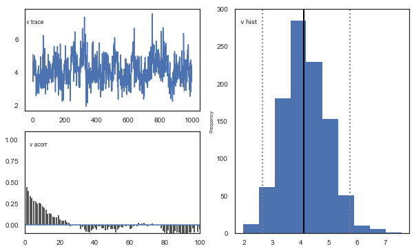

.. image:: demo_RLHDDMtutorial_files/demo_RLHDDMtutorial_13_4.png

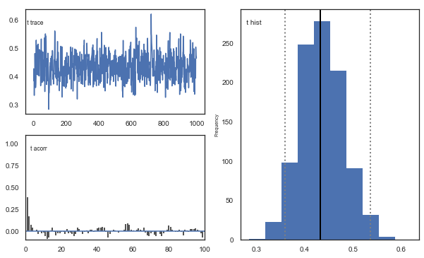

.. image:: demo_RLHDDMtutorial_files/demo_RLHDDMtutorial_13_6.png

.. image:: demo_RLHDDMtutorial_files/demo_RLHDDMtutorial_13_7.png

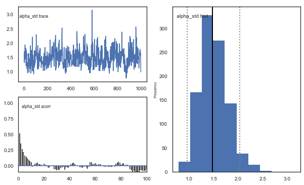

**Fig**. The mixing of the posterior distribution and autocorrelation
looks ok.

Convergence of chains
~~~~~~~~~~~~~~~~~~~~~

The Gelman-Rubin statistic is a test of whether the chains in the model
converges. The Gelman-Ruben statistic measures the degree of variation
between and within chains. Values close to 1 indicate convergence and
that there is small variation between chains, i.e. that they end up as
the same distribution across chains. A common heuristic is to assume
convergence if all values are below 1.1. To run this you need to run
multiple models, combine them and perform the Gelman-Rubin statistic:

.. code:: ipython3

    # estimate convergence
    from kabuki.analyze import gelman_rubin
    
    models = []
    for i in range(3):
        m = hddm.HDDMrl(data=data)
        m.sample(1500, burn=500, dbname="traces.db", db="pickle")
        models.append(m)
    
    gelman_rubin(models)

.. parsed-literal::

     [-----------------100%-----------------] 1500 of 1500 complete in 148.3 sec

.. parsed-literal::

    /Users/madslundpedersen/anaconda/envs/py36/lib/python3.6/site-packages/kabuki/analyze.py:148: FutureWarning: 
    .ix is deprecated. Please use
    .loc for label based indexing or
    .iloc for positional indexing
    
    See the documentation here:
    http://pandas.pydata.org/pandas-docs/stable/user_guide/indexing.html#ix-indexer-is-deprecated
      samples[i,:] = model.nodes_db.ix[name, 'node'].trace()
    /Users/madslundpedersen/anaconda/envs/py36/lib/python3.6/site-packages/pandas/core/indexing.py:961: FutureWarning: 
    .ix is deprecated. Please use
    .loc for label based indexing or
    .iloc for positional indexing
    
    See the documentation here:
    http://pandas.pydata.org/pandas-docs/stable/user_guide/indexing.html#ix-indexer-is-deprecated
      return getattr(section, self.name)[new_key]

.. parsed-literal::

    {'a': 1.0032460874018214,
     'a_std': 1.0009841521872085,
     'a_subj.3': 1.0004396186849591,
     'a_subj.4': 0.9999534502455131,
     'a_subj.5': 1.003486683386713,
     'a_subj.6': 1.0019388857243001,
     'a_subj.8': 1.0011512646603846,
     'a_subj.12': 0.999566242847165,
     'a_subj.17': 0.9997315595714608,
     'a_subj.18': 1.007802746170568,
     'a_subj.19': 1.0006648642694451,
     'a_subj.20': 0.9997046168477743,
     'a_subj.22': 0.999761021617672,
     'a_subj.23': 0.999981103582067,
     'a_subj.24': 0.9999604239014099,
     'a_subj.26': 0.9999505203703547,
     'a_subj.33': 1.0000641985256977,
     'a_subj.34': 1.0019030857893532,
     'a_subj.35': 0.9995619813519606,
     'a_subj.36': 1.0009696684307878,
     'a_subj.39': 1.0030366187047326,
     'a_subj.42': 1.0004536365990904,
     'a_subj.50': 1.0009246525621893,
     'a_subj.52': 0.9998106391663311,
     'a_subj.56': 1.002833217938155,
     'a_subj.59': 1.0037497197540834,
     'a_subj.63': 0.9999025733097772,
     'a_subj.71': 1.0009484787096814,
     'a_subj.75': 1.0130098962514307,
     'a_subj.80': 0.9996362431035328,
     'v': 1.0205809795803613,
     'v_std': 1.017843838450935,
     'v_subj.3': 1.0084966266683277,
     'v_subj.4': 0.9995268898509083,
     'v_subj.5': 1.0055342540841103,
     'v_subj.6': 1.006091261867606,
     'v_subj.8': 1.0363142858648078,
     'v_subj.12': 0.9999768301313733,
     'v_subj.17': 1.0071442953265444,
     'v_subj.18': 1.0091310053160127,
     'v_subj.19': 1.025227632557955,
     'v_subj.20': 1.0047516808487722,
     'v_subj.22': 0.9995696752962354,
     'v_subj.23': 1.0207703297420343,
     'v_subj.24': 1.0003032086685848,
     'v_subj.26': 1.0063047977790485,
     'v_subj.33': 1.007422885046991,
     'v_subj.34': 1.0000055617828756,
     'v_subj.35': 1.004080679982615,
     'v_subj.36': 1.025998215179402,
     'v_subj.39': 1.0176678234231622,
     'v_subj.42': 1.0446533107136062,
     'v_subj.50': 1.0162948205722397,
     'v_subj.52': 1.0329846199571966,
     'v_subj.56': 1.0187113333213196,
     'v_subj.59': 1.0013982327012232,
     'v_subj.63': 1.0084242116205158,
     'v_subj.71': 1.0034722375822482,
     'v_subj.75': 1.0011359012034806,
     'v_subj.80': 1.0071658884593422,
     't': 1.0005057563118305,
     't_std': 1.0022540551935895,
     't_subj.3': 1.000335111817265,
     't_subj.4': 0.9995572720794353,
     't_subj.5': 1.0010911542829217,
     't_subj.6': 1.0005078503952383,
     't_subj.8': 1.000937902509564,
     't_subj.12': 1.0002256652751758,
     't_subj.17': 1.0036774720777926,
     't_subj.18': 1.0057241781128603,
     't_subj.19': 1.000598016225987,
     't_subj.20': 1.0000045946218536,
     't_subj.22': 0.99983171259197,
     't_subj.23': 1.0005420765808288,
     't_subj.24': 1.0016080999110242,
     't_subj.26': 0.999512841375442,
     't_subj.33': 0.9998364286694233,
     't_subj.34': 1.0000670998014844,
     't_subj.35': 0.9996132338974929,
     't_subj.36': 1.0042098480709771,
     't_subj.39': 1.0006515809595558,
     't_subj.42': 1.000771348791104,
     't_subj.50': 1.002215744431939,
     't_subj.52': 1.001052279977618,
     't_subj.56': 1.0017299690798878,
     't_subj.59': 1.0046305114183551,
     't_subj.63': 0.9995008742263429,
     't_subj.71': 1.001174121937735,
     't_subj.75': 1.0153800235690629,
     't_subj.80': 0.9999996479882802,
     'alpha': 1.0117546794208931,
     'alpha_std': 1.016548833490214,
     'alpha_subj.3': 1.0095453823767975,
     'alpha_subj.4': 0.9999967981599148,
     'alpha_subj.5': 1.0013067894285956,
     'alpha_subj.6': 1.0015822997094852,
     'alpha_subj.8': 1.028833703352052,
     'alpha_subj.12': 0.999682056083204,
     'alpha_subj.17': 1.002551456868468,
     'alpha_subj.18': 1.0128686930345914,
     'alpha_subj.19': 1.0216644572624185,
     'alpha_subj.20': 1.003469044949529,
     'alpha_subj.22': 0.9998485992621597,
     'alpha_subj.23': 1.0211627966678443,
     'alpha_subj.24': 1.0029351365812929,
     'alpha_subj.26': 1.0082171167684313,
     'alpha_subj.33': 1.0088110869085494,
     'alpha_subj.34': 1.000806268244852,
     'alpha_subj.35': 0.9997657478647997,
     'alpha_subj.36': 1.016349397314595,
     'alpha_subj.39': 1.0154377853905259,
     'alpha_subj.42': 1.0380447906771046,
     'alpha_subj.50': 1.014307146980194,
     'alpha_subj.52': 1.0421339866800452,
     'alpha_subj.56': 1.0345554568486672,
     'alpha_subj.59': 1.0004809998032806,
     'alpha_subj.63': 1.0167696837574038,
     'alpha_subj.71': 1.0030045474552403,
     'alpha_subj.75': 1.000110789496688,
     'alpha_subj.80': 1.0061715847351584}

.. code:: ipython3

    np.max(list(gelman_rubin(models).values()))

.. parsed-literal::

    1.0446533107136062

The model seems to have converged, i.e. the Gelman-Rubin statistic is
below 1.1 for all parameters. It is important to always run this test,
especially for more complex models (`as with separate learning rates for
positive and negative prediction
errors <#9.-Separate-learning-rates-for-positive-and-negative-prediction-errors>`__).
So now we can combine these three models to get a better approximation
of the posterior distribution.

.. code:: ipython3

    # Combine the models we ran to test for convergence.
    m = kabuki.utils.concat_models(models)

Joint posterior distribution
~~~~~~~~~~~~~~~~~~~~~~~~~~~~

Another test of the model is to look at collinearity. If the estimation
of parameters is very codependent (correlation is strong) it can
indicate that their variance trades off, in particular if there is a
negative correlation. The following plot shows there is generally low
correlation across all combinations of parameters. It does not seem to
be the case for this dataset, but common for RLDDM is a negative
correlation between learning rate and the scaling factor, similar to
what’s usually observed between learning rate and inverse temperature
for RL models that uses softmax as the choice rule (e.g. `Daw,
2011 <https://www.oxfordscholarship.com/view/10.1093/acprof:oso/9780199600434.001.0001/acprof-9780199600434-chapter-001>`__).

.. code:: ipython3

    alpha, t, a, v = m.nodes_db.node[["alpha", "t", "a", "v"]]
    samples = {"alpha": alpha.trace(), "t": t.trace(), "a": a.trace(), "v": v.trace()}
    samp = pd.DataFrame(data=samples)
    
    
    def corrfunc(x, y, **kws):
        r, _ = stats.pearsonr(x, y)
        ax = plt.gca()
        ax.annotate("r = {:.2f}".format(r), xy=(0.1, 0.9), xycoords=ax.transAxes)
    
    
    g = sns.PairGrid(samp, palette=["red"])
    g.map_upper(plt.scatter, s=10)
    g.map_diag(sns.distplot, kde=False)
    g.map_lower(sns.kdeplot, cmap="Blues_d")
    g.map_lower(corrfunc)
    g.savefig("matrix_plot.png")

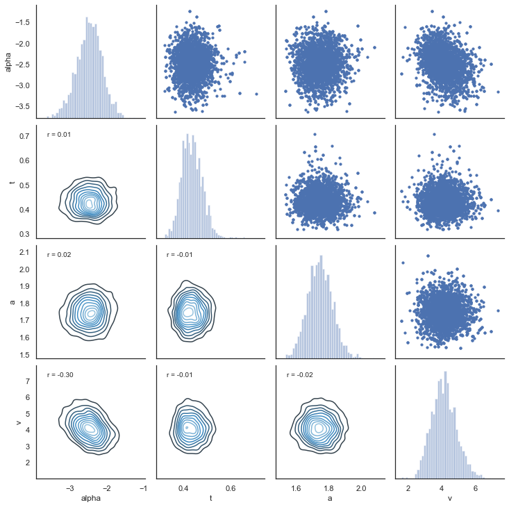

7. Posterior predictive checks
------------------------------

An important test of the model is its ability to recreate the observed
data. This can be tested with posterior predictive checks, which
involves simulating data using estimated parameters and comparing
observed and simulated results.

extract traces
~~~~~~~~~~~~~~

The first step then is to extract the traces from the estimated model.
The function get_traces() gives you the samples (row) from the
approaximated posterior distribution for all of the estimated group and
subject parameters (column).

.. code:: ipython3

    traces = m.get_traces()
    traces.head()

.. raw:: html

    

    
    <table border="1" class="dataframe">
      <thead>
        <tr style="text-align: right;">
          <th></th>
          <th>a</th>
          <th>a_std</th>
          <th>a_subj.3</th>
          <th>a_subj.4</th>
          <th>a_subj.5</th>
          <th>a_subj.6</th>
          <th>a_subj.8</th>
          <th>a_subj.12</th>
          <th>a_subj.17</th>
          <th>a_subj.18</th>
          <th>...</th>
          <th>alpha_subj.39</th>
          <th>alpha_subj.42</th>
          <th>alpha_subj.50</th>
          <th>alpha_subj.52</th>
          <th>alpha_subj.56</th>
          <th>alpha_subj.59</th>
          <th>alpha_subj.63</th>
          <th>alpha_subj.71</th>
          <th>alpha_subj.75</th>
          <th>alpha_subj.80</th>
        </tr>
      </thead>
      <tbody>
        <tr>
          <th>0</th>
          <td>1.663258</td>
          <td>0.379335</td>
          <td>1.999766</td>
          <td>1.964781</td>
          <td>1.501228</td>
          <td>2.558870</td>
          <td>2.134354</td>
          <td>1.808065</td>
          <td>1.428145</td>
          <td>1.904139</td>
          <td>...</td>
          <td>-2.569240</td>
          <td>-2.348125</td>
          <td>-2.279293</td>
          <td>-3.002542</td>
          <td>-2.038603</td>
          <td>-2.255088</td>
          <td>-0.153830</td>
          <td>-1.809325</td>
          <td>-1.738580</td>
          <td>-2.323516</td>
        </tr>
        <tr>
          <th>1</th>
          <td>1.623170</td>
          <td>0.359708</td>
          <td>1.912802</td>
          <td>1.967012</td>
          <td>1.462844</td>
          <td>2.466133</td>
          <td>2.347265</td>
          <td>2.031387</td>
          <td>1.476833</td>
          <td>1.883079</td>
          <td>...</td>
          <td>-2.593007</td>
          <td>-2.564579</td>
          <td>-2.787299</td>
          <td>-2.817155</td>
          <td>0.128265</td>
          <td>-2.358720</td>
          <td>-0.709526</td>
          <td>-1.876886</td>
          <td>-1.428454</td>
          <td>-3.140597</td>
        </tr>
        <tr>
          <th>2</th>
          <td>1.817655</td>
          <td>0.312626</td>
          <td>2.013651</td>
          <td>1.870517</td>
          <td>1.438784</td>
          <td>2.332917</td>
          <td>2.426746</td>
          <td>2.079006</td>
          <td>1.264283</td>
          <td>1.939135</td>
          <td>...</td>
          <td>-3.187908</td>
          <td>-2.566549</td>
          <td>-3.341771</td>
          <td>-3.206621</td>
          <td>-0.724311</td>
          <td>-2.446694</td>
          <td>-1.133453</td>
          <td>-2.153231</td>
          <td>-1.589570</td>
          <td>-2.702218</td>
        </tr>
        <tr>
          <th>3</th>
          <td>1.762559</td>
          <td>0.573961</td>
          <td>1.852805</td>
          <td>1.920585</td>
          <td>1.456088</td>
          <td>2.437470</td>
          <td>2.679242</td>
          <td>2.099067</td>
          <td>1.311264</td>
          <td>1.902507</td>
          <td>...</td>
          <td>-2.045972</td>
          <td>-2.466571</td>
          <td>-3.093191</td>
          <td>-3.204751</td>
          <td>-3.220443</td>
          <td>-2.381405</td>
          <td>-1.060397</td>
          <td>-1.521510</td>
          <td>-1.892220</td>
          <td>-2.902676</td>
        </tr>
        <tr>
          <th>4</th>
          <td>1.725824</td>
          <td>0.472488</td>
          <td>1.907957</td>
          <td>1.954045</td>
          <td>1.462033</td>
          <td>2.394734</td>
          <td>2.389626</td>
          <td>1.928428</td>
          <td>1.334218</td>
          <td>1.790217</td>
          <td>...</td>
          <td>-2.035124</td>
          <td>-2.679132</td>
          <td>-3.821553</td>
          <td>-3.372584</td>
          <td>-1.139438</td>
          <td>-2.372234</td>
          <td>-0.895417</td>
          <td>-1.900813</td>
          <td>-2.196233</td>
          <td>-3.063793</td>
        </tr>
      </tbody>
    </table>
    
5 rows × 120 columns

    

simulating data
~~~~~~~~~~~~~~~

**Now that we have the traces the next step is to simulate data using
the estimated parameters. The RLDDM includes a function to simulate
data. Here’s an example of how to use the simulation-function for RLDDM.
This example explains how to generate data with binary outcomes.
See**\ `here <#11.-Probabilistic-binary-outcomes-vs.-normally-distributed-outcomes>`__\ **for
an example on simulating data with normally distributed outcomes. Inputs
to function: a** = decision threshold **t** = non-decision time
**alpha** = learning rate **pos_alpha** = defaults to 0. if given it
defines the learning rate for positive prediction errors. alpha then
becomes the learning rate\_ for negative prediction errors. **scaler** =
the scaling factor that is multiplied with the difference in q-values to
calculate trial-by-trial drift rate **p_upper** = the probability of
reward for the option represented by the upper boundary. The current
version thus only works for outcomes that are either 1 or 0 **p_lower**
= the probability of reward for the option represented by the lower
boundary. **subjs** = number of subjects to simulate data for.
**split_by** = define the condition which makes it easier to append data
from different conditions. **size** = number of trials per subject.

.. code:: ipython3

    hddm.generate.gen_rand_rlddm_data(
        a=1,
        t=0.3,
        alpha=0.2,
        scaler=2,
        p_upper=0.8,
        p_lower=0.2,
        subjs=1,
        split_by=0,
        size=10,
    )

.. raw:: html

    

    
    <table border="1" class="dataframe">
      <thead>
        <tr style="text-align: right;">
          <th></th>
          <th>q_up</th>
          <th>q_low</th>
          <th>sim_drift</th>
          <th>response</th>
          <th>rt</th>
          <th>feedback</th>
          <th>subj_idx</th>
          <th>split_by</th>
          <th>trial</th>
        </tr>
      </thead>
      <tbody>
        <tr>
          <th>0</th>
          <td>0.5000</td>
          <td>0.50000</td>
          <td>0.00000</td>
          <td>1.0</td>
          <td>0.770</td>
          <td>1.0</td>
          <td>0</td>
          <td>0</td>
          <td>1</td>
        </tr>
        <tr>
          <th>1</th>
          <td>0.6000</td>
          <td>0.50000</td>
          <td>0.20000</td>
          <td>0.0</td>
          <td>0.403</td>
          <td>0.0</td>
          <td>0</td>
          <td>0</td>
          <td>2</td>
        </tr>
        <tr>
          <th>2</th>
          <td>0.6000</td>
          <td>0.40000</td>
          <td>0.40000</td>
          <td>0.0</td>
          <td>0.612</td>
          <td>0.0</td>
          <td>0</td>
          <td>0</td>
          <td>3</td>
        </tr>
        <tr>
          <th>3</th>
          <td>0.6000</td>
          <td>0.32000</td>
          <td>0.56000</td>
          <td>0.0</td>
          <td>0.404</td>
          <td>1.0</td>
          <td>0</td>
          <td>0</td>
          <td>4</td>
        </tr>
        <tr>
          <th>4</th>
          <td>0.6000</td>
          <td>0.45600</td>
          <td>0.28800</td>
          <td>1.0</td>
          <td>0.564</td>
          <td>1.0</td>
          <td>0</td>
          <td>0</td>
          <td>5</td>
        </tr>
        <tr>
          <th>5</th>
          <td>0.6800</td>
          <td>0.45600</td>
          <td>0.44800</td>
          <td>1.0</td>
          <td>0.416</td>
          <td>1.0</td>
          <td>0</td>
          <td>0</td>
          <td>6</td>
        </tr>
        <tr>
          <th>6</th>
          <td>0.7440</td>
          <td>0.45600</td>
          <td>0.57600</td>
          <td>0.0</td>
          <td>0.430</td>
          <td>0.0</td>
          <td>0</td>
          <td>0</td>
          <td>7</td>
        </tr>
        <tr>
          <th>7</th>
          <td>0.7440</td>
          <td>0.36480</td>
          <td>0.75840</td>
          <td>0.0</td>
          <td>0.409</td>
          <td>0.0</td>
          <td>0</td>
          <td>0</td>
          <td>8</td>
        </tr>
        <tr>
          <th>8</th>
          <td>0.7440</td>
          <td>0.29184</td>
          <td>0.90432</td>
          <td>1.0</td>
          <td>0.361</td>
          <td>1.0</td>
          <td>0</td>
          <td>0</td>
          <td>9</td>
        </tr>
        <tr>
          <th>9</th>
          <td>0.7952</td>
          <td>0.29184</td>
          <td>1.00672</td>
          <td>1.0</td>
          <td>0.537</td>
          <td>0.0</td>
          <td>0</td>
          <td>0</td>
          <td>10</td>
        </tr>
      </tbody>
    </table>
    

**How to interpret columns in the resulting dataframe** **q_up** =
expected reward for option represented by upper boundary **q_low** =
expected reward for option represented by lower boundary **sim_drift** =
the drift rate for each trial calculated as: (q_up-q_low)*scaler
**response** = simulated choice **rt** = simulated response time
**feedback** = observed feedback for chosen option **subj_idx** =
subject id (starts at 0) **split_by** = condition as integer **trial** =
current trial (starts at 1)

Simulate data with estimated parameter values and compare to observed data
~~~~~~~~~~~~~~~~~~~~~~~~~~~~~~~~~~~~~~~~~~~~~~~~~~~~~~~~~~~~~~~~~~~~~~~~~~

Now that we know how to extract traces and simulate data we can combine
this to create a dataset similar to our observed data. This process is
currently not automated but the following is an example code using the
dataset we analyzed above.

.. code:: ipython3

    from tqdm import tqdm  # progress tracker
    
    # create empty dataframe to store simulated data
    sim_data = pd.DataFrame()
    # create a column samp to be used to identify the simulated data sets
    data["samp"] = 0
    # load traces
    traces = m.get_traces()
    # decide how many times to repeat simulation process. repeating this multiple times is generally recommended,
    # as it better captures the uncertainty in the posterior distribution, but will also take some time
    for i in tqdm(range(1, 51)):
        # randomly select a row in the traces to use for extracting parameter values
        sample = np.random.randint(0, traces.shape[0] - 1)
        # loop through all subjects in observed data
        for s in data.subj_idx.unique():
            # get number of trials for each condition.
            size0 = len(
                data[(data["subj_idx"] == s) & (data["split_by"] == 0)].trial.unique()
            )
            size1 = len(
                data[(data["subj_idx"] == s) & (data["split_by"] == 1)].trial.unique()
            )
            size2 = len(
                data[(data["subj_idx"] == s) & (data["split_by"] == 2)].trial.unique()
            )
            # set parameter values for simulation
            a = traces.loc[sample, "a_subj." + str(s)]
            t = traces.loc[sample, "t_subj." + str(s)]
            scaler = traces.loc[sample, "v_subj." + str(s)]
            alphaInv = traces.loc[sample, "alpha_subj." + str(s)]
            # take inverse logit of estimated alpha
            alpha = np.exp(alphaInv) / (1 + np.exp(alphaInv))
            # simulate data for each condition changing only values of size, p_upper, p_lower and split_by between conditions.
            sim_data0 = hddm.generate.gen_rand_rlddm_data(
                a=a,
                t=t,
                scaler=scaler,
                alpha=alpha,
                size=size0,
                p_upper=0.8,
                p_lower=0.2,
                split_by=0,
            )
            sim_data1 = hddm.generate.gen_rand_rlddm_data(
                a=a,
                t=t,
                scaler=scaler,
                alpha=alpha,
                size=size1,
                p_upper=0.7,
                p_lower=0.3,
                split_by=1,
            )
            sim_data2 = hddm.generate.gen_rand_rlddm_data(
                a=a,
                t=t,
                scaler=scaler,
                alpha=alpha,
                size=size2,
                p_upper=0.6,
                p_lower=0.4,
                split_by=2,
            )
            # append the conditions
            sim_data0 = sim_data0.append([sim_data1, sim_data2], ignore_index=True)
            # assign subj_idx
            sim_data0["subj_idx"] = s
            # identify that these are simulated data
            sim_data0["type"] = "simulated"
            # identify the simulated data
            sim_data0["samp"] = i
            # append data from each subject
            sim_data = sim_data.append(sim_data0, ignore_index=True)
    # combine observed and simulated data
    ppc_data = data[
        ["subj_idx", "response", "split_by", "rt", "trial", "feedback", "samp"]
    ].copy()
    ppc_data["type"] = "observed"
    ppc_sdata = sim_data[
        ["subj_idx", "response", "split_by", "rt", "trial", "feedback", "type", "samp"]
    ].copy()
    ppc_data = ppc_data.append(ppc_sdata)
    ppc_data.to_csv("ppc_data_tutorial.csv")

.. parsed-literal::

    100%|██████████| 50/50 [31:09<00:00, 37.39s/it]
    /Users/madslundpedersen/anaconda/envs/py36/lib/python3.6/site-packages/pandas/core/frame.py:7138: FutureWarning: Sorting because non-concatenation axis is not aligned. A future version
    of pandas will change to not sort by default.
    
    To accept the future behavior, pass 'sort=False'.
    
    To retain the current behavior and silence the warning, pass 'sort=True'.
    
      sort=sort,

Plotting
~~~~~~~~

Now that we have a dataframe with both observed and simulated data we
can plot to see whether the simulated data are able to capture observed
choice and reaction times. To capture the uncertainty in the simulated
data we want to identify how much choice and reaction differs across the
simulated data sets. A good measure of this is to calculate the highest
posterior density/highest density interval for summary scores of the
generated data. Below we calculate highest posterior density with an
alpha set to 0.1, which means that we are describing the range of the
90% most likely values.

.. code:: ipython3

    # for practical reasons we only look at the first 40 trials for each subject in a given condition
    plot_ppc_data = ppc_data[ppc_data.trial < 41].copy()

Choice
~~~~~~

.. code:: ipython3

    # bin trials to for smoother estimate of response proportion across learning
    plot_ppc_data["bin_trial"] = pd.cut(
        plot_ppc_data.trial, 11, labels=np.linspace(0, 10, 11)
    ).astype("int64")
    # calculate means for each sample
    sums = (
        plot_ppc_data.groupby(["bin_trial", "split_by", "samp", "type"])
        .mean()
        .reset_index()
    )
    # calculate the overall mean response across samples
    ppc_sim = sums.groupby(["bin_trial", "split_by", "type"]).mean().reset_index()
    # initiate columns that will have the upper and lower bound of the hpd
    ppc_sim["upper_hpd"] = 0
    ppc_sim["lower_hpd"] = 0
    for i in range(0, ppc_sim.shape[0]):
        # calculate the hpd/hdi of the predicted mean responses across bin_trials
        hdi = pymc.utils.hpd(
            sums.response[
                (sums["bin_trial"] == ppc_sim.bin_trial[i])
                & (sums["split_by"] == ppc_sim.split_by[i])
                & (sums["type"] == ppc_sim.type[i])
            ],
            alpha=0.1,
        )
        ppc_sim.loc[i, "upper_hpd"] = hdi[1]
        ppc_sim.loc[i, "lower_hpd"] = hdi[0]
    # calculate error term as the distance from upper bound to mean
    ppc_sim["up_err"] = ppc_sim["upper_hpd"] - ppc_sim["response"]
    ppc_sim["low_err"] = ppc_sim["response"] - ppc_sim["lower_hpd"]
    ppc_sim["model"] = "RLDDM_single_learning"
    ppc_sim.to_csv("ppc_choicedata_tutorial.csv")

.. code:: ipython3

    # plotting evolution of choice proportion for best option across learning for observed and simulated data.
    fig, axs = plt.subplots(figsize=(15, 5), nrows=1, ncols=3, sharex=True, sharey=True)
    for i in range(0, 3):
        ax = axs[i]
        d = ppc_sim[(ppc_sim.split_by == i) & (ppc_sim.type == "simulated")]
        ax.errorbar(
            d.bin_trial,
            d.response,
            yerr=[d.low_err, d.up_err],
            label="simulated",
            color="orange",
        )
        d = ppc_sim[(ppc_sim.split_by == i) & (ppc_sim.type == "observed")]
        ax.plot(d.bin_trial, d.response, linewidth=3, label="observed")
        ax.set_title("split_by = %i" % i, fontsize=20)
        ax.set_ylabel("mean response")
        ax.set_xlabel("trial")
    plt.legend()
    fig.savefig("PPCchoice.pdf")

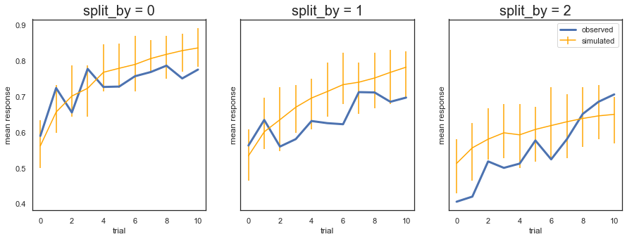

**Fig.** The plots display the rate of choosing the best option
(response = 1) across learning and condition. The model generates data
(orange) that closely follows the observed behavior (blue), with the
exception of overpredicting performance early in the most difficult
condition (split_by=2). Uncertainty in the generated data is captured by
the 90% highest density interval of the means across simulated datasets.

RT
~~

.. code:: ipython3

    # set reaction time to be negative for lower bound responses (response=0)
    plot_ppc_data["reaction time"] = np.where(
        plot_ppc_data["response"] == 1, plot_ppc_data.rt, 0 - plot_ppc_data.rt
    )
    # plotting evolution of choice proportion for best option across learning for observed and simulated data. We use bins of trials because plotting individual trials would be very noisy.
    g = sns.FacetGrid(plot_ppc_data, col="split_by", hue="type")
    g.map(sns.kdeplot, "reaction time", bw=0.05).set_ylabels("Density")
    g.add_legend()
    g.savefig("PPCrt_dist.pdf")

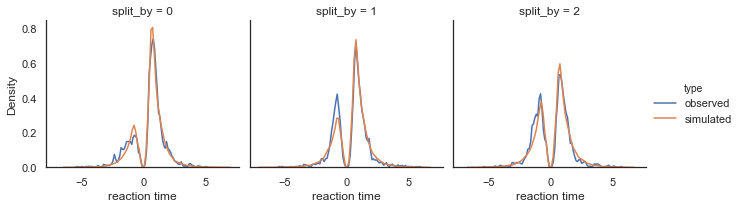

**Fig.** Density plots of observed and predicted reaction time across
conditions. RTs for lower boundary choices (i.e. worst option choices)
are set to be negative (0-RT) to be able to separate upper and lower
bound responses.

8. Parameter recovery
---------------------

To validate the RLDDM we ran a parameter recovery study to test to which
degree the model can recover the parameter values used to simulate data.
To do this we generated 81 synthetic datasets with 50 subjects
performing 70 trials each. The 81 datasets were simulated using all
combinations of three plausible parameter values for decision threshold,
non-decision time, learning rate and the scaling parameter onto drift
rate.

Estimated values split by simulated vales
~~~~~~~~~~~~~~~~~~~~~~~~~~~~~~~~~~~~~~~~~

We can plot simulated together with the estimated values to test the
models ability to recover parameters, and to see if there are any values
that are more difficult to recover than others.

.. code:: ipython3

    param_recovery = hddm.load_csv("recovery_sim_est_rlddm.csv")

.. code:: ipython3

    g = sns.catplot(x="a", y="e_a", data=param_recovery, palette="Set1")
    g.set_axis_labels("Simulated threshold", "Estimated threshold")
    plt.title("Decision threshold")
    g.savefig("Threshold_recovery.pdf")

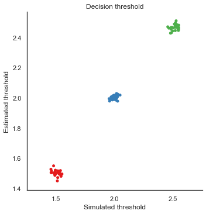

.. code:: ipython3

    g = sns.catplot(x="alpha", y="e_alphaT", data=param_recovery, palette="Set1")
    g.set_axis_labels("Simulated alpha", "Estimated alpha")
    plt.title("Learning rate")
    g.savefig("Alpha_recovery.pdf")

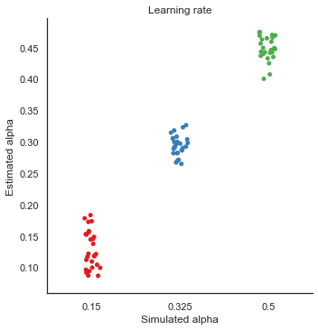

.. code:: ipython3

    g = sns.catplot(x="scaler", y="e_v", data=param_recovery, palette="Set1")
    g.set_axis_labels("Simulated scaling", "Estimated scaling")
    plt.title("Scaling drift rate")
    g.savefig("Scaler_recovery.pdf")

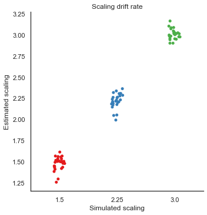

.. code:: ipython3

    g = sns.catplot(x="t", y="e_t", data=param_recovery, palette="Set1")
    g.set_axis_labels("Simulated NDT", "Estimated NDT")
    plt.title("Non-decision time")
    g.savefig("NDT_recovery.pdf")

.. image:: demo_RLHDDMtutorial_files/demo_RLHDDMtutorial_46_0.png

**Fig.** The correlation between simulated and estimated parameter
values are high, which means recovery is good. There is somewhat worse
recovery for the learning rate and scaling parameter, which makes sense
given that they to a degree can explain the same variance (see below).

9. Separate learning rates for positive and negative prediction errors
----------------------------------------------------------------------

Several studies have reported differences in updating of expected
rewards following positive and negative prediction errors (e.g. to
capture differences between D1 and D2 receptor function). To model
asymmetric updating rates for positive and negative prediction errors
you can set dual=True in the model. This will produce two estimated
learning rates; alpha and pos_alpha, of which alpha then becomes the
estimated learning rate for negative prediction errors.

.. code:: ipython3

    # set dual=True to model separate learning rates for positive and negative prediction errors.
    m_dual = hddm.HDDMrl(data, dual=True)
    # set sample and burn-in
    m_dual.sample(1500, burn=500, dbname="traces.db", db="pickle")
    # print stats to get an overview of posterior distribution of estimated parameters
    m_dual.print_stats()

.. parsed-literal::

     [-----------------100%-----------------] 1500 of 1500 complete in 191.8 sec                        mean         std       2.5q        25q         50q        75q      97.5q       mc err
    a                    1.82633   0.0783844    1.67345    1.77512     1.82217    1.87568     1.9965   0.00295453
    a_std               0.410321   0.0674141   0.306268   0.364889    0.401635   0.450473   0.564012   0.00270026
    a_subj.3             2.17033    0.115262    1.95375    2.09614     2.16539    2.24181     2.4254   0.00548993
    a_subj.4             1.89897   0.0579531    1.79347    1.85788     1.89605     1.9393    2.01907   0.00277538
    a_subj.5             1.61113    0.082302    1.45691    1.55496      1.6061    1.66577    1.77686   0.00381988
    a_subj.6             2.43691    0.101778     2.2429    2.36614     2.43347    2.50934    2.62957   0.00431407
    a_subj.8             2.59792    0.144576    2.34397      2.499     2.59463     2.6892    2.92774   0.00726993
    a_subj.12            2.06029   0.0799839    1.91855    2.00623     2.05359    2.11537    2.22798   0.00361356
    a_subj.17            1.54875    0.100305    1.35735     1.4863     1.54396    1.61257     1.7653    0.0054701
    a_subj.18            1.96151    0.122684    1.73789    1.87154     1.96274    2.04099    2.20959   0.00660454
    a_subj.19            2.27976    0.108427     2.0839    2.20405     2.27507    2.34357    2.53175   0.00537144
    a_subj.20              1.757   0.0906857    1.57908    1.70036     1.75772    1.81488    1.94106   0.00475469
    a_subj.22            1.40039   0.0492764     1.3153    1.36434     1.39905    1.43278    1.50517   0.00258208
    a_subj.23            1.95365    0.099402    1.77161    1.88705      1.9462    2.01884    2.15432   0.00426745
    a_subj.24            1.68369   0.0978159    1.52375    1.61216     1.67733    1.74375    1.90374    0.0047914
    a_subj.26            2.23402   0.0798351    2.08258    2.17478     2.23315    2.28916    2.38973   0.00366055
    a_subj.33            1.57319   0.0707342    1.44946    1.52259     1.56998    1.62238    1.71148   0.00299887
    a_subj.34            1.84701   0.0917249    1.67547    1.78566     1.84312    1.90886    2.02471   0.00440968
    a_subj.35            1.85894   0.0913431    1.68528    1.79731     1.86485    1.92094    2.03658   0.00379595
    a_subj.36            1.32917   0.0657278    1.20156    1.28636     1.32837    1.36863    1.46548   0.00299776
    a_subj.39            1.58224   0.0571074    1.48113    1.54243     1.57864    1.61699    1.70573   0.00272969
    a_subj.42            1.85728   0.0910291    1.68796    1.79839     1.85521    1.91323    2.04917   0.00501664
    a_subj.50            1.57842   0.0593103    1.47311    1.53575     1.57541    1.61701    1.70146   0.00315943
    a_subj.52            2.29593    0.104286    2.10454    2.22466      2.2942    2.35891    2.51119   0.00558897
    a_subj.56            1.47579   0.0489699    1.38374    1.44303     1.47525    1.50802    1.57638   0.00203615
    a_subj.59            1.41423   0.0838355    1.25798     1.3551     1.41686    1.47376    1.58004   0.00482176
    a_subj.63            1.98606    0.105647    1.79733    1.91055     1.97667    2.05667    2.21026   0.00515372
    a_subj.71            1.37492   0.0416381    1.29913    1.34635     1.37351    1.40374    1.45383   0.00193188
    a_subj.75            1.04381   0.0424396   0.963908    1.01437     1.04343    1.07007     1.1287   0.00215329
    a_subj.80            2.20728   0.0949151     2.0232    2.14268     2.20566    2.27035    2.40363   0.00343694
    v                    3.66306    0.432881    2.80263    3.36481     3.67691    3.94446    4.53137    0.0179453
    v_std                2.16051    0.347665    1.59481    1.92183     2.11674    2.36274    2.98355    0.0183554
    v_subj.3             4.05807    0.584568    3.05244     3.6736     4.01923    4.43582    5.33269    0.0211871
    v_subj.4             0.93029    0.149903   0.668345   0.825182    0.921209     1.0267    1.25353   0.00749321
    v_subj.5             3.10298    0.410738    2.35251    2.81169     3.11047    3.37633    3.94636    0.0155184
    v_subj.6             4.37315     1.51163    2.02799    3.22323     4.26505     5.3469    7.84778     0.115543
    v_subj.8             2.10131    0.291351    1.55417    1.89635     2.10656     2.2918    2.68403    0.0102131
    v_subj.12            3.30997     0.27209    2.79541    3.12027     3.30714    3.51814     3.8123   0.00979875
    v_subj.17            4.77054    0.654596    3.61074    4.32052     4.71783    5.15654    6.20269    0.0344306
    v_subj.18            5.60507    0.914642    4.05708    4.95358     5.50239    6.14505    7.59222    0.0525223
    v_subj.19            6.79667    0.531696    5.84821    6.41609     6.78247    7.15707    7.86691    0.0256374
    v_subj.20            5.06997    0.751946    3.80191    4.51495     4.99583    5.54233    6.76405    0.0508111
    v_subj.22            7.74229    0.554212    6.66899    7.38473     7.72739    8.10784    8.88024    0.0226088
    v_subj.23            1.65386    0.326853    1.05624    1.43946     1.64962    1.84378    2.35648    0.0147053
    v_subj.24             4.9282    0.716149    3.58835    4.46113     4.91188    5.38852    6.49608    0.0250187
    v_subj.26           0.554038    0.159071   0.317581   0.447227    0.538658   0.634405   0.891184   0.00738979
    v_subj.33            1.99289      1.5563 -0.0917214   0.979077     1.61419    2.62817    6.07535    0.0882033
    v_subj.34            2.67755    0.743488    1.48379    2.19459     2.61205    3.01255     4.4251    0.0343761
    v_subj.35            2.11529    0.418304    1.36401    1.83141     2.11525    2.37647    3.02335    0.0155763
    v_subj.36            3.05497     1.16149     1.3637    2.20115     2.92209    3.67182    5.81363    0.0818964
    v_subj.39            3.14393     1.01339    1.10825    2.48491     3.15981    3.77087    5.16142    0.0524964
    v_subj.42            3.77651    0.368915    3.04478    3.53231     3.76981    4.00682    4.52743    0.0147786
    v_subj.50            5.24503    0.428943    4.40896    4.98034     5.23241    5.51769    6.08356    0.0187869
    v_subj.52            3.50906    0.403754     2.7295    3.22648     3.50778    3.78182    4.30659    0.0166646
    v_subj.56            1.31785    0.983386   0.326642   0.749425     1.12579    1.50799    4.35855    0.0773137
    v_subj.59            8.77448     1.21852    6.60213    7.93194     8.66269    9.53013     11.496    0.0836054
    v_subj.63            2.23256    0.338367    1.62264    1.98565     2.22861    2.45895    2.91907    0.0129532
    v_subj.71            3.79805    0.327746    3.15876    3.57293     3.79705    4.01523    4.43214    0.0119512
    v_subj.75            4.97022    0.447116    4.13118    4.65435     4.96064    5.27331    5.81798    0.0167969
    v_subj.80            2.12787    0.971202   0.846467    1.41587     1.88945      2.589    4.74006    0.0674847
    t                   0.428604    0.044101   0.353065   0.396248    0.425327   0.457601   0.525839   0.00218668
    t_std               0.234719   0.0433914   0.164275   0.202987    0.229153   0.262883   0.333006   0.00233875
    t_subj.3             1.06301   0.0242696    1.00809    1.04874     1.06433    1.08068     1.1041   0.00106904
    t_subj.4            0.528016   0.0181393   0.489347   0.516371    0.529422   0.541093   0.560231   0.00082801
    t_subj.5            0.521158   0.0134301   0.491967   0.512937    0.522271   0.530159   0.546061  0.000601849
    t_subj.6            0.393535    0.031081   0.332742   0.371696    0.394455   0.414439   0.452232   0.00136618
    t_subj.8            0.645487    0.046208   0.548299   0.616548    0.650334   0.677856   0.726427   0.00214894
    t_subj.12           0.400791   0.0142303   0.371308   0.392207    0.401693   0.411239   0.427577  0.000644815
    t_subj.17            0.49389   0.0160554    0.46639   0.484731    0.493694   0.501411   0.544435  0.000937253
    t_subj.18           0.437714    0.024544   0.381513   0.423714     0.44101   0.455774    0.47827   0.00118883
    t_subj.19           0.408016   0.0164337   0.370056   0.398919    0.408948   0.419889   0.434781  0.000790638
    t_subj.20           0.514031   0.0132655   0.485829   0.505598    0.515052   0.522825   0.537302  0.000720981
    t_subj.22           0.325148  0.00616492   0.311362   0.321639     0.32567   0.329167    0.33589  0.000321026
    t_subj.23            0.48052   0.0231803   0.427495   0.466163    0.481808   0.497029   0.519889  0.000967584
    t_subj.24           0.453918   0.0141035   0.424352   0.444748    0.454901   0.463995   0.478395  0.000737631
    t_subj.26           0.443235   0.0347691   0.371609   0.418196    0.448561   0.469806   0.499016   0.00161531
    t_subj.33            0.19289   0.0161553   0.163663   0.181761    0.191735   0.203197   0.227826  0.000650216
    t_subj.34           0.341855   0.0304285   0.275627   0.325666    0.343243   0.358593   0.411272   0.00135037
    t_subj.35           0.323872   0.0241005   0.275647   0.309315    0.323585    0.33817   0.371883  0.000954075
    t_subj.36           0.448459   0.0124212   0.418934   0.441661    0.450627   0.457502   0.467191  0.000592505
    t_subj.39           0.619463   0.0115061   0.593632   0.612822    0.620391   0.627636   0.639284  0.000519217
    t_subj.42            0.38756   0.0160417   0.353556   0.377524    0.388542   0.398015    0.41576  0.000875023
    t_subj.50           0.520546   0.0172755   0.482822   0.510046    0.524875   0.533784    0.54486  0.000986671
    t_subj.52           0.507414   0.0233708   0.455127   0.493376    0.509698   0.523056   0.550123   0.00114481
    t_subj.56           0.116896    0.011136  0.0907044   0.110031    0.117803   0.124486   0.136371  0.000481042
    t_subj.59           0.367431   0.0187911    0.33152   0.355044    0.368221   0.377594   0.408335    0.0012207
    t_subj.63           0.470553   0.0214161   0.423916   0.457205    0.471826   0.484268   0.508559  0.000923657
    t_subj.71           0.156369  0.00617554   0.144548   0.152355    0.156495    0.16055   0.168231  0.000277601
    t_subj.75           0.257439  0.00715949   0.240442   0.254217     0.25945   0.262397   0.266872  0.000398967
    t_subj.80          0.0402711   0.0164579  0.0108391  0.0281409   0.0399061    0.05107  0.0745975  0.000551567
    alpha               -4.78158    0.898295   -6.75036   -5.29889    -4.70286   -4.15113   -3.26662    0.0521409
    alpha_std            3.73289     1.06489     2.1336    2.99392     3.52618    4.33781    6.30655    0.0831372
    alpha_subj.3        -7.05258     2.50159   -13.1917   -8.32234    -6.52649   -5.18567   -3.96031     0.124696
    alpha_subj.4        0.426963     1.11459  -0.944668  -0.230608    0.250964   0.808489    2.92571    0.0541998
    alpha_subj.5        -6.91208     2.70265   -14.1073   -8.38504    -6.20221   -4.93885   -3.59952     0.135496
    alpha_subj.6         -7.8891      2.5143   -13.9728   -9.12846    -7.44981   -6.13023   -4.37058     0.130676
    alpha_subj.8        -2.72998    0.994146   -4.36336   -2.88409    -2.58956   -2.32116   -1.87981    0.0494222
    alpha_subj.12       -8.06559     2.69454   -14.9298   -9.48851    -7.54959    -6.1212   -4.43814     0.144476
    alpha_subj.17       -6.60254     2.96442   -14.1679   -7.99399     -5.9254   -4.45374   -2.86398     0.158913
    alpha_subj.18       -6.07482     2.68135   -13.1222   -7.13457    -5.22561   -4.18235   -3.13356     0.136542
    alpha_subj.19       -3.92613    0.285418   -4.64184   -4.07693    -3.89082   -3.72418   -3.45543    0.0101292
    alpha_subj.20       -3.50676    0.516536   -4.68548   -3.79117    -3.49135   -3.17623   -2.56029    0.0285649
    alpha_subj.22        -9.2371     2.06096    -13.833   -10.3452    -8.81722   -7.74703   -6.32702    0.0931406
    alpha_subj.23       -4.31396     2.64539   -11.1804   -5.27713    -3.51936   -2.54338   -1.35995     0.136443
    alpha_subj.24       -1.55403    0.339719   -2.20419   -1.76759      -1.541   -1.34377  -0.857031    0.0101265
    alpha_subj.26         2.3789     2.61685   -0.93534    1.21823     2.23266    3.52459    7.21916     0.174057
    alpha_subj.33         -5.213      4.0036   -13.9326   -7.62198    -5.00017   -2.53649    1.71173     0.184676
    alpha_subj.34       -5.53051     2.76871   -12.5893   -6.87964    -4.73883   -3.58031   -2.30041     0.141782
    alpha_subj.35       -6.38576     3.13276   -14.0043    -7.9697    -5.83136    -4.1429   -2.09597     0.146654
    alpha_subj.36       -1.79782     2.08031   -8.22385   -2.23937    -1.26025   -0.71467   0.467845     0.114779
    alpha_subj.39       -5.44883     3.89269   -13.4074   -7.56688    -5.38491    -3.9298    2.91726     0.306435
    alpha_subj.42       -5.04472     2.33085   -11.3301   -5.17445    -4.30883    -3.8231   -3.27149     0.132284
    alpha_subj.50       -8.08276     2.46464    -14.181   -9.24783    -7.53744   -6.25954     -4.971     0.126942
    alpha_subj.52       -3.82568    0.752882   -5.04399   -4.00424    -3.71483   -3.47445   -3.12819    0.0371159
    alpha_subj.56       -5.44862     3.41322   -13.5386   -7.36032    -4.89808   -3.09328   -0.30246      0.18234
    alpha_subj.59       -3.44337    0.488828   -4.45293   -3.66276    -3.39263   -3.14521   -2.72879    0.0247054
    alpha_subj.63       -6.90635     2.82143   -13.3582   -8.47125    -6.38258   -4.78577   -3.09205     0.119088
    alpha_subj.71       -8.45649     2.63845   -15.2664   -9.69164    -7.92428   -6.56692   -5.18337     0.138627
    alpha_subj.75       -7.48641     2.73537   -14.0637   -8.70384    -6.88744   -5.49349   -3.90752     0.134957
    alpha_subj.80       -5.58797     3.14239    -13.527   -7.20775    -4.67266   -3.26561   -1.78386     0.173523
    pos_alpha          -0.895935    0.339247   -1.54324   -1.11526   -0.909311  -0.674954  -0.160331    0.0180688
    pos_alpha_std        1.45037    0.313221   0.953754    1.23314     1.42053     1.6352    2.12882    0.0199312
    pos_alpha_subj.3   -0.739699    0.608631   -1.89483   -1.10114   -0.748097  -0.389608   0.549614    0.0252056
    pos_alpha_subj.4    0.501533    0.880432  -0.924143  -0.107416    0.414538    1.00973    2.65335    0.0414756
    pos_alpha_subj.5    0.343363       0.823  -0.927268  -0.207032     0.20958   0.824743    2.30273    0.0313956
    pos_alpha_subj.6    -3.57442    0.488523   -4.37085   -3.91692    -3.64022   -3.26027   -2.50903    0.0374053
    pos_alpha_subj.8    0.449901    0.783986  -0.861785 -0.0643286    0.390448   0.894634    2.34131    0.0299916
    pos_alpha_subj.12   0.402094     0.39053  -0.288765   0.152244    0.383246   0.612424    1.26959    0.0123956
    pos_alpha_subj.17   -1.03625    0.728279   -2.28107   -1.47547    -1.09125  -0.741944   0.869704    0.0404402
    pos_alpha_subj.18   -1.95641    0.360458   -2.68864   -2.18083    -1.95473   -1.71167   -1.28532     0.016443
    pos_alpha_subj.19   -1.67176    0.221585   -2.15427   -1.80486    -1.65991   -1.51665   -1.28461   0.00811834
    pos_alpha_subj.20    -2.1366    0.329426   -2.81754   -2.35952    -2.11302   -1.90687   -1.52181    0.0211777
    pos_alpha_subj.22   -1.52007    0.125742   -1.78746   -1.59736    -1.51762   -1.43222   -1.28096   0.00531203
    pos_alpha_subj.23  0.0529679     1.00904   -1.98607  -0.507643  0.00876946   0.620401    2.14044    0.0414709
    pos_alpha_subj.24   -1.34182    0.309116   -1.93674   -1.55106    -1.33801   -1.14381   -0.73865    0.0112161
    pos_alpha_subj.26  0.0893943    0.970026   -1.58794  -0.484993    -0.01053   0.619843    2.44391    0.0521637
    pos_alpha_subj.33   -2.24994      1.2274   -4.38351   -3.11987    -2.30015   -1.48697   0.414115    0.0705896
    pos_alpha_subj.34  -0.704432     1.05906   -2.88173   -1.33173   -0.550406  0.0335074    1.12025    0.0505609
    pos_alpha_subj.35  -0.739327    0.629917   -2.36813   -1.05908   -0.672616  -0.324667   0.371349    0.0253342
    pos_alpha_subj.36   -1.56092      1.5089   -3.96919   -2.71246      -1.819   -0.56486    1.61682     0.107652
    pos_alpha_subj.39   0.185904     1.77976   -4.36138  -0.191296    0.508164    1.23217      2.711     0.155413
    pos_alpha_subj.42  -0.603407    0.253323   -1.11295  -0.760958   -0.598121  -0.435014  -0.103201   0.00879472
    pos_alpha_subj.50   -1.37377    0.262776   -1.90291    -1.5452    -1.37773   -1.20679  -0.872482   0.00894318
    pos_alpha_subj.52  0.0772404     0.36944  -0.635686  -0.178077   0.0697795   0.304712   0.851372     0.011965
    pos_alpha_subj.56   -1.51497     1.97144   -5.41133   -2.83118    -1.37977   -0.24753    2.36421     0.128189
    pos_alpha_subj.59   -2.10815    0.279822   -2.66591    -2.2839    -2.11047   -1.92215   -1.56226    0.0176411
    pos_alpha_subj.63    1.29028    0.873231  -0.164205    0.68542     1.18272     1.8369    3.14479    0.0375058
    pos_alpha_subj.71   -1.70335     0.21584    -2.1278   -1.83928    -1.70867   -1.56798   -1.24251   0.00688448
    pos_alpha_subj.75  -0.502723    0.297922   -1.07137  -0.704546   -0.508679  -0.304064  0.0950879    0.0107456
    pos_alpha_subj.80   -1.61934     1.26102   -3.49573   -2.52006    -1.82877  -0.950009    1.36519    0.0865199
    DIC: 9186.303547
    deviance: 9083.079636
    pD: 103.223911

.. code:: ipython3

    m_dual.plot_posteriors()

.. parsed-literal::

    Plotting a
    Plotting a_std
    Plotting v
    Plotting v_std
    Plotting t
    Plotting t_std
    Plotting alpha
    Plotting alpha_std
    Plotting pos_alpha
    Plotting pos_alpha_std

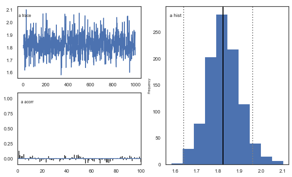

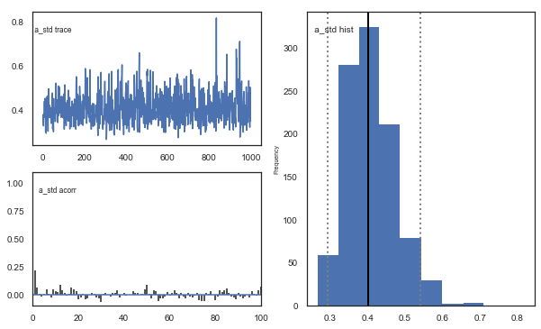

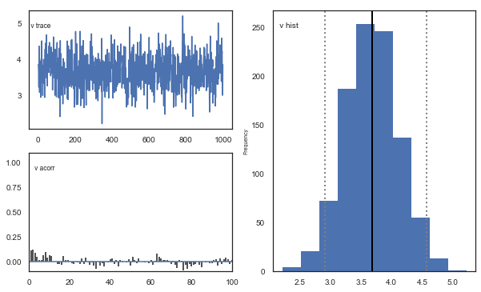

.. image:: demo_RLHDDMtutorial_files/demo_RLHDDMtutorial_50_4.png

.. image:: demo_RLHDDMtutorial_files/demo_RLHDDMtutorial_50_5.png

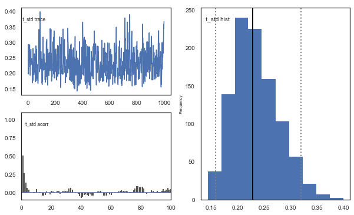

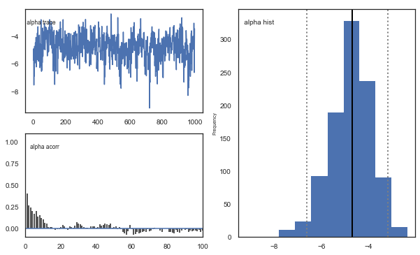

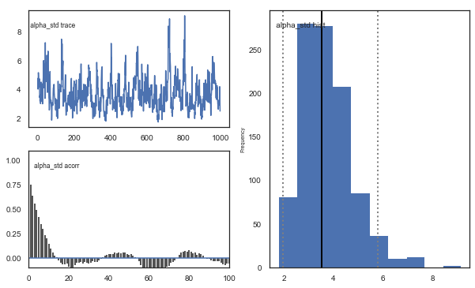

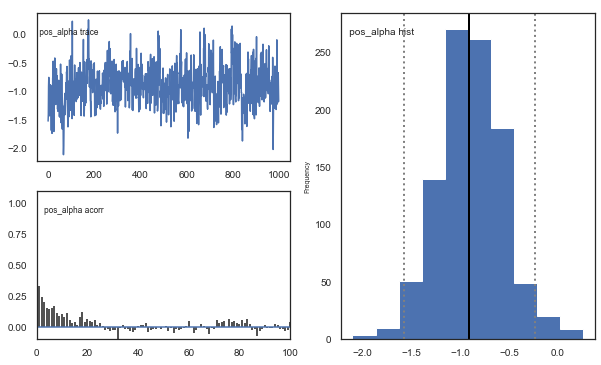

.. image:: demo_RLHDDMtutorial_files/demo_RLHDDMtutorial_50_10.png

**Fig.** There’s more autocorrelation in this model compared to the one
with a single learning rate. First, let’s test whether it converges.

.. code:: ipython3

    # estimate convergence
    models = []
    for i in range(3):
        m = hddm.HDDMrl(data=data, dual=True)
        m.sample(1500, burn=500, dbname="traces.db", db="pickle")
        models.append(m)
    
    # get max gelman-statistic value. shouldn't be higher than 1.1
    np.max(list(gelman_rubin(models).values()))

.. parsed-literal::

     [-----------------100%-----------------] 1501 of 1500 complete in 190.3 sec

.. parsed-literal::

    /Users/madslundpedersen/anaconda/envs/py36/lib/python3.6/site-packages/kabuki/analyze.py:148: FutureWarning: 
    .ix is deprecated. Please use
    .loc for label based indexing or
    .iloc for positional indexing
    
    See the documentation here:
    http://pandas.pydata.org/pandas-docs/stable/user_guide/indexing.html#ix-indexer-is-deprecated
      samples[i,:] = model.nodes_db.ix[name, 'node'].trace()
    /Users/madslundpedersen/anaconda/envs/py36/lib/python3.6/site-packages/pandas/core/indexing.py:961: FutureWarning: 
    .ix is deprecated. Please use
    .loc for label based indexing or
    .iloc for positional indexing
    
    See the documentation here:
    http://pandas.pydata.org/pandas-docs/stable/user_guide/indexing.html#ix-indexer-is-deprecated
      return getattr(section, self.name)[new_key]

.. parsed-literal::

    1.014473317822456

.. code:: ipython3

    gelman_rubin(models)

.. parsed-literal::

    {'a': 1.000125615977507,
     'a_std': 1.000293824141093,
     'a_subj.3': 0.9995587497036598,
     'a_subj.4': 0.9995663288755461,
     'a_subj.5': 1.002412638832063,
     'a_subj.6': 0.9997479711112068,
     'a_subj.8': 1.0010518773251582,
     'a_subj.12': 0.9997234039050327,
     'a_subj.17': 1.0004801627764193,
     'a_subj.18': 1.0001624055351832,
     'a_subj.19': 0.9996592350878782,
     'a_subj.20': 1.0029800834579676,
     'a_subj.22': 1.0012450357713991,
     'a_subj.23': 0.9996812901217333,
     'a_subj.24': 1.0017171481263634,
     'a_subj.26': 0.9997923090627893,
     'a_subj.33': 1.0023439140007413,
     'a_subj.34': 0.9998184112544697,
     'a_subj.35': 0.9998414872289898,
     'a_subj.36': 0.9999848867852217,
     'a_subj.39': 0.9996300864110935,
     'a_subj.42': 1.0011762287987338,
     'a_subj.50': 0.999964638152394,
     'a_subj.52': 1.0006531924956916,
     'a_subj.56': 1.0002379308081606,
     'a_subj.59': 1.0036030711499442,
     'a_subj.63': 1.0037500688653909,
     'a_subj.71': 1.000132861501354,
     'a_subj.75': 0.9997763551013711,
     'a_subj.80': 0.9996110136879114,
     'v': 1.0001729942650572,
     'v_std': 1.0007050210999138,
     'v_subj.3': 1.00089570652398,
     'v_subj.4': 1.0024232190875875,
     'v_subj.5': 1.000031484184937,
     'v_subj.6': 1.000246348222359,
     'v_subj.8': 0.9998188908969313,
     'v_subj.12': 1.0002972651898785,
     'v_subj.17': 1.0053152485244228,
     'v_subj.18': 1.0035678009993956,
     'v_subj.19': 1.0007676729224628,
     'v_subj.20': 1.0138533173993516,
     'v_subj.22': 1.0001920445137138,
     'v_subj.23': 1.0001643719289113,
     'v_subj.24': 1.0003166942511994,
     'v_subj.26': 1.012037804264053,
     'v_subj.33': 1.008822207930599,
     'v_subj.34': 1.001232834456808,
     'v_subj.35': 1.0025938840649362,
     'v_subj.36': 1.000069726432657,
     'v_subj.39': 0.9998994943313908,
     'v_subj.42': 0.9996973440151383,
     'v_subj.50': 1.001143117423489,
     'v_subj.52': 1.0002753174216377,
     'v_subj.56': 0.9999573151498712,
     'v_subj.59': 1.0104883818941242,
     'v_subj.63': 1.00189569663142,
     'v_subj.71': 0.9995411611089315,
     'v_subj.75': 0.9995588725849562,
     'v_subj.80': 1.0136685141891846,
     't': 1.0004114901695569,
     't_std': 1.0007933788432173,
     't_subj.3': 0.9996171871762616,
     't_subj.4': 1.0001300490519083,
     't_subj.5': 1.0028746028937425,
     't_subj.6': 0.9997742835195009,
     't_subj.8': 1.001323887846369,
     't_subj.12': 0.9996809520992331,
     't_subj.17': 1.004979239177261,
     't_subj.18': 1.001443056131703,
     't_subj.19': 1.001276450267826,
     't_subj.20': 1.0017222614492018,
     't_subj.22': 1.0014446464850104,
     't_subj.23': 1.0001854182394025,
     't_subj.24': 1.0021360259836916,
     't_subj.26': 0.9998130722506594,
     't_subj.33': 1.0041403512850227,
     't_subj.34': 1.000662368674309,
     't_subj.35': 0.9997816559126319,
     't_subj.36': 1.000389429370145,
     't_subj.39': 1.0004989245164477,
     't_subj.42': 1.003660719681535,
     't_subj.50': 0.9996523807207587,
     't_subj.52': 1.0001385838960493,
     't_subj.56': 1.000436582928671,
     't_subj.59': 1.0097109617328988,
     't_subj.63': 1.0023205899326733,
     't_subj.71': 1.0008294977192809,
     't_subj.75': 0.9996035166755558,
     't_subj.80': 0.9999656516467259,
     'alpha': 1.0008526268630051,
     'alpha_std': 1.0053219932778943,
     'alpha_subj.3': 0.999501514240184,
     'alpha_subj.4': 1.0073664853377151,
     'alpha_subj.5': 1.0002667649822319,
     'alpha_subj.6': 1.0010858103024662,
     'alpha_subj.8': 1.0020288089122238,
     'alpha_subj.12': 0.9999329084180971,
     'alpha_subj.17': 1.002245596723081,
     'alpha_subj.18': 1.001122573161122,
     'alpha_subj.19': 0.9995903836225754,
     'alpha_subj.20': 1.0073888183284407,
     'alpha_subj.22': 1.0069862383738115,
     'alpha_subj.23': 1.001612686745671,
     'alpha_subj.24': 0.9999712749048636,
     'alpha_subj.26': 1.01440875592447,
     'alpha_subj.33': 1.00670721072335,
     'alpha_subj.34': 0.9995131597377838,
     'alpha_subj.35': 1.001250997993986,
     'alpha_subj.36': 1.002683758400843,
     'alpha_subj.39': 1.004739288526853,
     'alpha_subj.42': 1.0008115954315624,
     'alpha_subj.50': 1.0010984441307196,
     'alpha_subj.52': 1.0025159489951863,
     'alpha_subj.56': 1.00067808806373,
     'alpha_subj.59': 1.0002771782983166,
     'alpha_subj.63': 1.0011017204118449,
     'alpha_subj.71': 1.0006215161259082,
     'alpha_subj.75': 1.0026779077970407,
     'alpha_subj.80': 1.0002319983391794,
     'pos_alpha': 1.00257297410585,
     'pos_alpha_std': 1.001617498309611,
     'pos_alpha_subj.3': 0.9995865019882652,
     'pos_alpha_subj.4': 1.0062437837747629,
     'pos_alpha_subj.5': 1.0034825487152508,
     'pos_alpha_subj.6': 1.0005618815584847,
     'pos_alpha_subj.8': 1.0001291334737075,
     'pos_alpha_subj.12': 1.0001556376957397,
     'pos_alpha_subj.17': 1.0001016511811331,
     'pos_alpha_subj.18': 1.0024023231634642,
     'pos_alpha_subj.19': 1.000007119184469,
     'pos_alpha_subj.20': 1.0119860515816212,
     'pos_alpha_subj.22': 0.9998692465833887,
     'pos_alpha_subj.23': 1.0005347917836798,
     'pos_alpha_subj.24': 1.000873682844545,
     'pos_alpha_subj.26': 1.014473317822456,
     'pos_alpha_subj.33': 1.0057921277935418,
     'pos_alpha_subj.34': 1.0011151145301689,
     'pos_alpha_subj.35': 1.0016919400556858,
     'pos_alpha_subj.36': 1.0003570992127564,
     'pos_alpha_subj.39': 1.0056374569990023,
     'pos_alpha_subj.42': 0.999898151417554,
     'pos_alpha_subj.50': 1.000865449897151,
     'pos_alpha_subj.52': 1.0000890958138444,
     'pos_alpha_subj.56': 0.9999626321602774,
     'pos_alpha_subj.59': 1.0053232725751076,
     'pos_alpha_subj.63': 1.0005550289110994,
     'pos_alpha_subj.71': 0.9996504478249013,
     'pos_alpha_subj.75': 0.999846688983168,
     'pos_alpha_subj.80': 1.0140403525074555}

Convergence looks good, i.e. no parameters with gelman-rubin statistic >
1.1.

.. code:: ipython3

    # Create a new model that has all traces concatenated
    # of individual models.
    m_dual = kabuki.utils.concat_models(models)

And then we can have a look at the joint posterior distribution:

.. code:: ipython3

    alpha, t, a, v, pos_alpha = m_dual.nodes_db.node[["alpha", "t", "a", "v", "pos_alpha"]]
    samples = {
        "alpha": alpha.trace(),
        "pos_alpha": pos_alpha.trace(),
        "t": t.trace(),
        "a": a.trace(),
        "v": v.trace(),
    }
    samp = pd.DataFrame(data=samples)
    
    
    def corrfunc(x, y, **kws):
        r, _ = stats.pearsonr(x, y)
        ax = plt.gca()
        ax.annotate("r = {:.2f}".format(r), xy=(0.1, 0.9), xycoords=ax.transAxes)
    
    
    g = sns.PairGrid(samp, palette=["red"])
    g.map_upper(plt.scatter, s=10)
    g.map_diag(sns.distplot, kde=False)
    g.map_lower(sns.kdeplot, cmap="Blues_d")
    g.map_lower(corrfunc)
    g.savefig("matrix_plot.png")

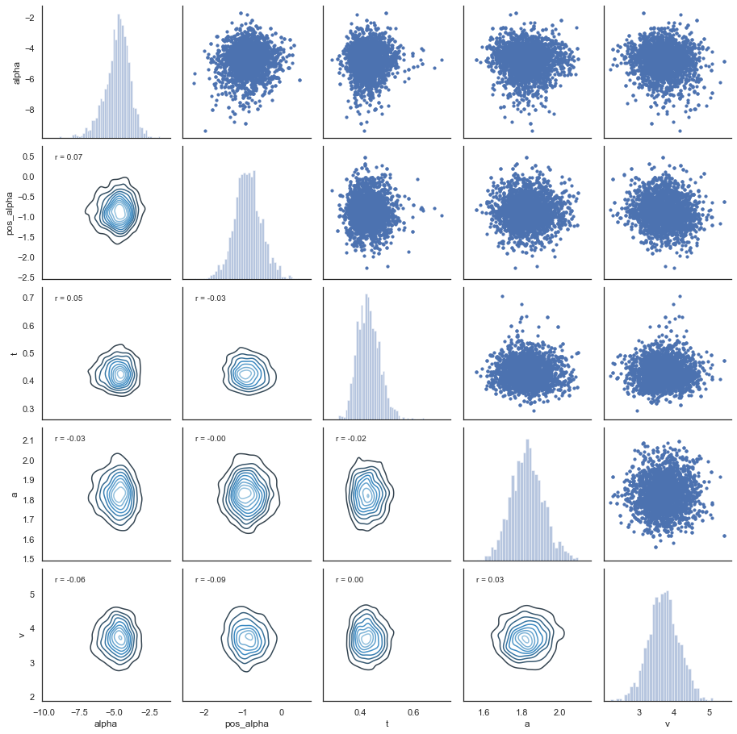

**Fig.** The correlation between parameters is generally low.

Posterior predictive check
--------------------------

The DIC for this dual learning rate model is better than for the single
learning rate model. We can therefore check whether we can detect this
improvement in the ability to recreate choice and RT patterns:

.. code:: ipython3

    # create empty dataframe to store simulated data
    sim_data = pd.DataFrame()
    # create a column samp to be used to identify the simulated data sets
    data["samp"] = 0
    # get traces, note here we extract traces from m_dual
    traces = m_dual.get_traces()
    # decide how many times to repeat simulation process. repeating this multiple times is generally recommended as it better captures the uncertainty in the posterior distribution, but will also take some time
    for i in tqdm(range(1, 51)):
        # randomly select a row in the traces to use for extracting parameter values
        sample = np.random.randint(0, traces.shape[0] - 1)
        # loop through all subjects in observed data
        for s in data.subj_idx.unique():
            # get number of trials for each condition.
            size0 = len(
                data[(data["subj_idx"] == s) & (data["split_by"] == 0)].trial.unique()
            )
            size1 = len(
                data[(data["subj_idx"] == s) & (data["split_by"] == 1)].trial.unique()
            )
            size2 = len(
                data[(data["subj_idx"] == s) & (data["split_by"] == 2)].trial.unique()
            )
            # set parameter values for simulation
            a = traces.loc[sample, "a_subj." + str(s)]
            t = traces.loc[sample, "t_subj." + str(s)]
            scaler = traces.loc[sample, "v_subj." + str(s)]
            # when generating data with two learning rates pos_alpha represents learning rate for positive prediction errors and alpha for negative prediction errors
            alphaInv = traces.loc[sample, "alpha_subj." + str(s)]
            pos_alphaInv = traces.loc[sample, "pos_alpha_subj." + str(s)]
            # take inverse logit of estimated alpha and pos_alpha
            alpha = np.exp(alphaInv) / (1 + np.exp(alphaInv))
            pos_alpha = np.exp(pos_alphaInv) / (1 + np.exp(pos_alphaInv))
            # simulate data for each condition changing only values of size, p_upper, p_lower and split_by between conditions.
            sim_data0 = hddm.generate.gen_rand_rlddm_data(
                a=a,
                t=t,
                scaler=scaler,
                alpha=alpha,
                pos_alpha=pos_alpha,
                size=size0,
                p_upper=0.8,
                p_lower=0.2,
                split_by=0,
            )
            sim_data1 = hddm.generate.gen_rand_rlddm_data(
                a=a,
                t=t,
                scaler=scaler,
                alpha=alpha,
                pos_alpha=pos_alpha,
                size=size1,
                p_upper=0.7,
                p_lower=0.3,
                split_by=1,
            )
            sim_data2 = hddm.generate.gen_rand_rlddm_data(
                a=a,
                t=t,
                scaler=scaler,
                alpha=alpha,
                pos_alpha=pos_alpha,
                size=size2,
                p_upper=0.6,
                p_lower=0.4,
                split_by=2,
            )
            # append the conditions
            sim_data0 = sim_data0.append([sim_data1, sim_data2], ignore_index=True)
            # assign subj_idx
            sim_data0["subj_idx"] = s
            # identify that these are simulated data
            sim_data0["type"] = "simulated"
            # identify the simulated data
            sim_data0["samp"] = i
            # append data from each subject
            sim_data = sim_data.append(sim_data0, ignore_index=True)
    # combine observed and simulated data
    ppc_dual_data = data[
        ["subj_idx", "response", "split_by", "rt", "trial", "feedback", "samp"]
    ].copy()
    ppc_dual_data["type"] = "observed"
    ppc_dual_sdata = sim_data[
        ["subj_idx", "response", "split_by", "rt", "trial", "feedback", "type", "samp"]
    ].copy()
    ppc_dual_data = ppc_dual_data.append(ppc_dual_sdata)

.. parsed-literal::

    100%|██████████| 50/50 [31:12<00:00, 37.44s/it]
    /Users/madslundpedersen/anaconda/envs/py36/lib/python3.6/site-packages/pandas/core/frame.py:7138: FutureWarning: Sorting because non-concatenation axis is not aligned. A future version
    of pandas will change to not sort by default.
    
    To accept the future behavior, pass 'sort=False'.
    
    To retain the current behavior and silence the warning, pass 'sort=True'.
    
      sort=sort,

.. code:: ipython3

    # for practical reasons we only look at the first 40 trials for each subject in a given condition
    plot_ppc_dual_data = ppc_dual_data[ppc_dual_data.trial < 41].copy()

Choice
~~~~~~

.. code:: ipython3

    # bin trials to for smoother estimate of response proportion across learning
    plot_ppc_dual_data["bin_trial"] = pd.cut(
        plot_ppc_dual_data.trial, 11, labels=np.linspace(0, 10, 11)
    ).astype("int64")
    # calculate means for each sample
    sums = (
        plot_ppc_dual_data.groupby(["bin_trial", "split_by", "samp", "type"])
        .mean()
        .reset_index()
    )
    # calculate the overall mean response across samples
    ppc_dual_sim = sums.groupby(["bin_trial", "split_by", "type"]).mean().reset_index()
    # initiate columns that will have the upper and lower bound of the hpd
    ppc_dual_sim["upper_hpd"] = 0
    ppc_dual_sim["lower_hpd"] = 0
    for i in range(0, ppc_dual_sim.shape[0]):
        # calculate the hpd/hdi of the predicted mean responses across bin_trials
        hdi = pymc.utils.hpd(
            sums.response[
                (sums["bin_trial"] == ppc_dual_sim.bin_trial[i])
                & (sums["split_by"] == ppc_dual_sim.split_by[i])
                & (sums["type"] == ppc_dual_sim.type[i])
            ],
            alpha=0.1,
        )
        ppc_dual_sim.loc[i, "upper_hpd"] = hdi[1]
        ppc_dual_sim.loc[i, "lower_hpd"] = hdi[0]
    # calculate error term as the distance from upper bound to mean
    ppc_dual_sim["up_err"] = ppc_dual_sim["upper_hpd"] - ppc_dual_sim["response"]
    ppc_dual_sim["low_err"] = ppc_dual_sim["response"] - ppc_dual_sim["lower_hpd"]
    ppc_dual_sim["model"] = "RLDDM_dual_learning"

.. code:: ipython3

    # plotting evolution of choice proportion for best option across learning for observed and simulated data.
    fig, axs = plt.subplots(figsize=(15, 5), nrows=1, ncols=3, sharex=True, sharey=True)
    for i in range(0, 3):
        ax = axs[i]
        d = ppc_dual_sim[(ppc_dual_sim.split_by == i) & (ppc_dual_sim.type == "simulated")]
        ax.errorbar(
            d.bin_trial,
            d.response,
            yerr=[d.low_err, d.up_err],
            label="simulated",
            color="orange",
        )
        d = ppc_sim[(ppc_dual_sim.split_by == i) & (ppc_dual_sim.type == "observed")]
        ax.plot(d.bin_trial, d.response, linewidth=3, label="observed")
        ax.set_title("split_by = %i" % i, fontsize=20)
        ax.set_ylabel("mean response")
        ax.set_xlabel("trial")
    plt.legend()

.. parsed-literal::

    <matplotlib.legend.Legend at 0x128f93208>

.. image:: demo_RLHDDMtutorial_files/demo_RLHDDMtutorial_64_1.png

**Fig.** The plots display the rate of choosing the best option
(response = 1) across learning and condition. The model generates data
(orange) that closely follows the observed behavior (blue), with the
exception of performance early in the most difficult condition
(split_by=2).

PPC for single vs. dual learning rate
~~~~~~~~~~~~~~~~~~~~~~~~~~~~~~~~~~~~~

To get a better sense of differences in ability to predict data between
the single and dual learning rate model we can plot them together:

.. code:: ipython3

    # plotting evolution of choice proportion for best option across learning for observed and simulated data. Compared for model with single and dual learning rate.
    fig, axs = plt.subplots(figsize=(15, 5), nrows=1, ncols=3, sharex=True, sharey=True)
    for i in range(0, 3):
        ax = axs[i]
        d_single = ppc_sim[(ppc_sim.split_by == i) & (ppc_sim.type == "simulated")]
        # slightly move bin_trial to avoid overlap in errorbars
        d_single["bin_trial"] += 0.2
        ax.errorbar(
            d_single.bin_trial,
            d_single.response,
            yerr=[d_single.low_err, d_single.up_err],
            label="simulated_single",
            color="orange",
        )
        d_dual = ppc_dual_sim[
            (ppc_dual_sim.split_by == i) & (ppc_dual_sim.type == "simulated")
        ]
        ax.errorbar(
            d_dual.bin_trial,
            d_dual.response,
            yerr=[d_dual.low_err, d_dual.up_err],
            label="simulated_dual",
            color="green",
        )
        d = ppc_sim[(ppc_dual_sim.split_by == i) & (ppc_dual_sim.type == "observed")]
        ax.plot(d.bin_trial, d.response, linewidth=3, label="observed")
        ax.set_title("split_by = %i" % i, fontsize=20)
        ax.set_ylabel("mean response")
        ax.set_xlabel("trial")
    plt.xlim(-0.5, 10.5)
    plt.legend()

.. parsed-literal::

    /Users/madslundpedersen/anaconda/envs/py36/lib/python3.6/site-packages/ipykernel/__main__.py:7: SettingWithCopyWarning: 
    A value is trying to be set on a copy of a slice from a DataFrame.
    Try using .loc[row_indexer,col_indexer] = value instead
    
    See the caveats in the documentation: http://pandas.pydata.org/pandas-docs/stable/user_guide/indexing.html#returning-a-view-versus-a-copy

.. parsed-literal::

    <matplotlib.legend.Legend at 0x128b7f5f8>

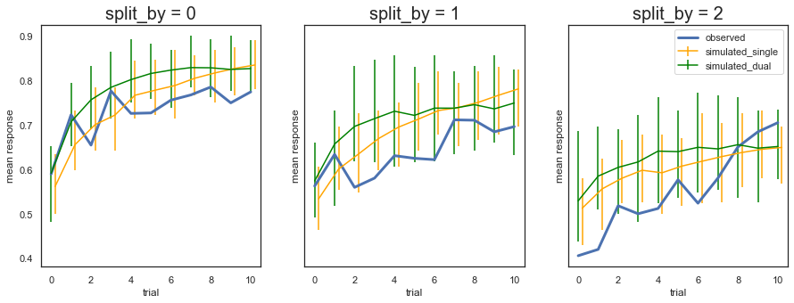

**Fig.** The predictions from the model with two learning rates are not
very different from the model with single learning rate, and a similar
overprediction of performance early on for the most difficult condition
(split_by =2).

RT
~~

.. code:: ipython3

    plot_ppc_data["type_compare"] = np.where(
        plot_ppc_data["type"] == "observed",
        plot_ppc_data["type"],
        "simulated_single_learning",
    )
    plot_ppc_dual_data["type_compare"] = np.where(
        plot_ppc_dual_data["type"] == "observed",
        plot_ppc_dual_data["type"],
        "simulated_dual_learning",
    )
    dual_vs_single_pcc = plot_ppc_data.append(plot_ppc_dual_data)
    dual_vs_single_pcc["reaction time"] = np.where(
        dual_vs_single_pcc["response"] == 1,
        dual_vs_single_pcc.rt,
        0 - dual_vs_single_pcc.rt,
    )
    # plotting evolution of choice proportion for best option across learning for observed and simulated data. We use bins of trials because plotting individual trials would be very noisy.
    g = sns.FacetGrid(dual_vs_single_pcc, col="split_by", hue="type_compare", height=5)
    g.map(sns.kdeplot, "reaction time", bw=0.01).set_ylabels("Density")
    g.add_legend()

.. parsed-literal::

    <seaborn.axisgrid.FacetGrid at 0x12d4b3e10>

.. image:: demo_RLHDDMtutorial_files/demo_RLHDDMtutorial_70_1.png

**Fig.** Again there’s not a big difference between the two models. Both
models slightly overpredict performance for the medium (split_by =1) and
hard (split_by = 2) conditions, as identified by lower densities for the
negative (worst option choices) in the simulated compared to observed
data.

Transform alpha and pos_alpha
~~~~~~~~~~~~~~~~~~~~~~~~~~~~~

To interpret the parameter estimates for alpha and pos_alpha you have to
transform them with the inverse logit where learning rate for negative
prediction error is alpha and learning rate for positive prediction
errors is pos_alpha. For this dataset the learning rate is estimated to
be higher for positive than negative prediction errors.

.. code:: ipython3

    # plot alpha for positive and negative learning rate
    traces = m_dual.get_traces()
    neg_alpha = np.exp(traces["alpha"]) / (1 + np.exp(traces["alpha"]))
    pos_alpha = np.exp(traces["pos_alpha"]) / (1 + np.exp(traces["pos_alpha"]))
    sns.kdeplot(
        neg_alpha, color="r", label="neg_alpha: " + str(np.round(np.mean(neg_alpha), 3))
    )
    sns.kdeplot(
        pos_alpha, color="b", label="pos_alpha: " + str(np.round(np.mean(pos_alpha), 3))
    )

.. parsed-literal::

    <matplotlib.axes._subplots.AxesSubplot at 0x128fe3358>

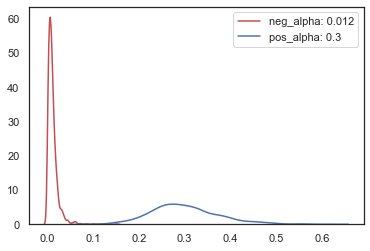

**Fig.** The positive learning rate is estimated to be stronger than the
negative learning rate. Sticky choice, tendencies to repeat choices,
could be driving some of this difference. The current model does not
allow to test for this, however, but it could be tested in the future if
we implement a regression version of RLDDM (similar to HDDMRegressor).

Simulate data with learning rates for positive and negative prediction errors
~~~~~~~~~~~~~~~~~~~~~~~~~~~~~~~~~~~~~~~~~~~~~~~~~~~~~~~~~~~~~~~~~~~~~~~~~~~~~

Here’s how you would simulate data with a learning rate for positive and
negative predictions of 0.2 and 0.4, respectively:

.. code:: ipython3

    hddm.generate.gen_rand_rlddm_data(
        a=1, t=0.3, alpha=0.2, pos_alpha=0.4, scaler=2, p_upper=0.8, p_lower=0.2, size=10
    )

.. raw:: html

    

    
    <table border="1" class="dataframe">
      <thead>
        <tr style="text-align: right;">
          <th></th>
          <th>q_up</th>
          <th>q_low</th>
          <th>sim_drift</th>
          <th>response</th>
          <th>rt</th>
          <th>feedback</th>
          <th>subj_idx</th>
          <th>split_by</th>
          <th>trial</th>
        </tr>
      </thead>
      <tbody>
        <tr>
          <th>0</th>
          <td>0.50000</td>
          <td>0.5000</td>
          <td>0.00000</td>
          <td>1.0</td>
          <td>0.583</td>
          <td>1.0</td>
          <td>0</td>
          <td>0</td>
          <td>1</td>
        </tr>
        <tr>
          <th>1</th>
          <td>0.70000</td>
          <td>0.5000</td>
          <td>0.40000</td>
          <td>0.0</td>
          <td>0.479</td>
          <td>0.0</td>
          <td>0</td>
          <td>0</td>
          <td>2</td>
        </tr>
        <tr>
          <th>2</th>
          <td>0.70000</td>
          <td>0.4000</td>
          <td>0.60000</td>
          <td>1.0</td>
          <td>0.450</td>
          <td>1.0</td>
          <td>0</td>
          <td>0</td>
          <td>3</td>
        </tr>
        <tr>
          <th>3</th>
          <td>0.82000</td>
          <td>0.4000</td>
          <td>0.84000</td>
          <td>1.0</td>
          <td>0.403</td>
          <td>1.0</td>
          <td>0</td>
          <td>0</td>
          <td>4</td>
        </tr>
        <tr>
          <th>4</th>
          <td>0.89200</td>
          <td>0.4000</td>
          <td>0.98400</td>
          <td>0.0</td>
          <td>0.732</td>
          <td>0.0</td>
          <td>0</td>
          <td>0</td>
          <td>5</td>
        </tr>
        <tr>
          <th>5</th>
          <td>0.89200</td>
          <td>0.3200</td>
          <td>1.14400</td>
          <td>0.0</td>
          <td>0.396</td>
          <td>0.0</td>
          <td>0</td>
          <td>0</td>
          <td>6</td>
        </tr>
        <tr>
          <th>6</th>
          <td>0.89200</td>
          <td>0.2560</td>
          <td>1.27200</td>
          <td>1.0</td>
          <td>0.964</td>
          <td>0.0</td>
          <td>0</td>
          <td>0</td>
          <td>7</td>
        </tr>
        <tr>
          <th>7</th>
          <td>0.71360</td>
          <td>0.2560</td>
          <td>0.91520</td>
          <td>1.0</td>
          <td>0.493</td>
          <td>1.0</td>
          <td>0</td>
          <td>0</td>
          <td>8</td>
        </tr>
        <tr>
          <th>8</th>
          <td>0.82816</td>
          <td>0.2560</td>
          <td>1.14432</td>
          <td>0.0</td>
          <td>0.360</td>
          <td>0.0</td>
          <td>0</td>
          <td>0</td>
          <td>9</td>
        </tr>
        <tr>
          <th>9</th>
          <td>0.82816</td>
          <td>0.2048</td>
          <td>1.24672</td>
          <td>1.0</td>
          <td>0.483</td>
          <td>1.0</td>
          <td>0</td>
          <td>0</td>
          <td>10</td>
        </tr>
      </tbody>
    </table>
    

10. depends_on vs. split_by
---------------------------

HDDMrl can be used to estimate separate parameters just as in the
standard HDDM. But in RL you typically estimate the same learning rates
and inverse temperature across conditions. That’s one reason why you
have to specify condition in the split_by-column instead of depends_on.
(The other is that if you use depends_on the expected rewards will not
get updated properly). But depends_on is still useful, for example if
you want to estimate the effect of group on parameters. As an example we
can simulate a dataset with two groups that have different decision
thresholds:

.. code:: ipython3

    data1 = hddm.generate.gen_rand_rlddm_data(
        a=1, t=0.3, alpha=0.4, scaler=2, p_upper=0.8, p_lower=0.2, subjs=50, size=50
    )
    data1["group"] = "group1"
    data2 = hddm.generate.gen_rand_rlddm_data(
        a=2, t=0.3, alpha=0.4, scaler=2, p_upper=0.8, p_lower=0.2, subjs=50, size=50
    )
    data2["group"] = "group2"
    group_data = data1.append(data2)
    group_data["q_init"] = 0.5
    m = hddm.HDDMrl(
        group_data, depends_on={"v": "group", "a": "group", "t": "group", "alpha": "group"}
    )
    m.sample(1500, burn=500, dbname="traces.db", db="pickle")

.. parsed-literal::

     [-----------------100%-----------------] 1500 of 1500 complete in 380.4 sec

.. parsed-literal::

    <pymc.MCMC.MCMC at 0x129c3eef0>

.. code:: ipython3

    # the plot shows that the model was able to recover the different decision threshold across groups.
    a_group1, a_group2 = m.nodes_db.node[["a(group1)", "a(group2)"]]
    hddm.analyze.plot_posterior_nodes([a_group1, a_group2])
    plt.xlabel("decision threshold")
    plt.ylabel("Posterior probability")
    plt.xlim(0.7, 2.3)
    plt.title("Posterior of decision threshold group means")

.. parsed-literal::

    Text(0.5, 1.0, 'Posterior of decision threshold group means')

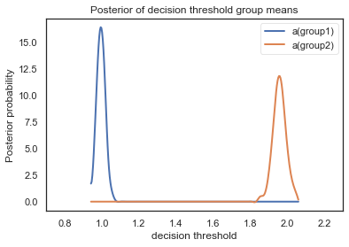

11. Probabilistic binary outcomes vs. normally distributed outcomes
-------------------------------------------------------------------

The examples so far have all been using a task structure where the
outcomes are binary and probabilistic. But the model can also be applied
to other types of outcomes. Here we show how you can generate and model
data with normally distributed outcomes. As you will see you don’t have
to do any modifications to the model estimation process, but you have to
change the input for generating data. Also note that the scaling
parameter (v) will scale negatively with the values of the observed
outcomes because the combined drift rate needs to be plausible.

.. code:: ipython3

    # This is how we generated data so far, defining the probability of reward (1) for actions/stimuli associated with upper and lower boundary.
    # binary probabilistic outcomes
    hddm.generate.gen_rand_rlddm_data(
        a=2, t=0.3, scaler=2, alpha=0.2, size=10, p_upper=0.2, p_lower=0.8
    )

.. raw:: html

    

    
    <table border="1" class="dataframe">
      <thead>
        <tr style="text-align: right;">
          <th></th>
          <th>q_up</th>
          <th>q_low</th>
          <th>sim_drift</th>
          <th>response</th>
          <th>rt</th>
          <th>feedback</th>
          <th>subj_idx</th>
          <th>split_by</th>
          <th>trial</th>
        </tr>
      </thead>
      <tbody>
        <tr>
          <th>0</th>
          <td>0.50</td>
          <td>0.500000</td>
          <td>0.000000</td>
          <td>0.0</td>
          <td>1.175</td>
          <td>1.0</td>
          <td>0</td>
          <td>0</td>
          <td>1</td>
        </tr>
        <tr>
          <th>1</th>
          <td>0.50</td>
          <td>0.600000</td>
          <td>-0.200000</td>
          <td>0.0</td>
          <td>1.056</td>
          <td>1.0</td>
          <td>0</td>
          <td>0</td>
          <td>2</td>
        </tr>
        <tr>
          <th>2</th>
          <td>0.50</td>
          <td>0.680000</td>
          <td>-0.360000</td>
          <td>0.0</td>
          <td>0.977</td>
          <td>1.0</td>
          <td>0</td>
          <td>0</td>
          <td>3</td>
        </tr>
        <tr>
          <th>3</th>
          <td>0.50</td>
          <td>0.744000</td>
          <td>-0.488000</td>
          <td>1.0</td>
          <td>0.918</td>
          <td>1.0</td>
          <td>0</td>
          <td>0</td>
          <td>4</td>
        </tr>
        <tr>
          <th>4</th>
          <td>0.60</td>
          <td>0.744000</td>
          <td>-0.288000</td>
          <td>0.0</td>
          <td>1.109</td>
          <td>1.0</td>
          <td>0</td>
          <td>0</td>
          <td>5</td>
        </tr>
        <tr>
          <th>5</th>
          <td>0.60</td>
          <td>0.795200</td>
          <td>-0.390400</td>
          <td>0.0</td>
          <td>1.761</td>
          <td>1.0</td>
          <td>0</td>
          <td>0</td>
          <td>6</td>
        </tr>
        <tr>
          <th>6</th>
          <td>0.60</td>
          <td>0.836160</td>
          <td>-0.472320</td>
          <td>0.0</td>
          <td>1.634</td>
          <td>1.0</td>
          <td>0</td>
          <td>0</td>
          <td>7</td>
        </tr>
        <tr>
          <th>7</th>
          <td>0.60</td>
          <td>0.868928</td>
          <td>-0.537856</td>
          <td>0.0</td>
          <td>3.159</td>
          <td>1.0</td>
          <td>0</td>
          <td>0</td>
          <td>8</td>
        </tr>
        <tr>
          <th>8</th>
          <td>0.60</td>
          <td>0.895142</td>
          <td>-0.590285</td>
          <td>1.0</td>
          <td>1.070</td>
          <td>0.0</td>
          <td>0</td>
          <td>0</td>
          <td>9</td>
        </tr>
        <tr>
          <th>9</th>
          <td>0.48</td>
          <td>0.895142</td>
          <td>-0.830285</td>
          <td>0.0</td>
          <td>1.455</td>
          <td>1.0</td>
          <td>0</td>
          <td>0</td>
          <td>10</td>
        </tr>
      </tbody>
    </table>
    

.. code:: ipython3

    # If instead the outcomes are drawn from a normal distribution you will have to set binary_outcome to False and instead of p_upper and p_upper define the mean (mu) and sd
    # of the normal distribution for both alternatives. Note that we change the initial q-value to 0, and that we reduce the scaling factor.
    # normally distributed outcomes
    hddm.generate.gen_rand_rlddm_data(
        a=2,
        t=0.3,
        scaler=0.2,
        alpha=0.2,
        size=10,
        mu_upper=8,
        mu_lower=2,
        sd_upper=1,
        sd_lower=1,
        binary_outcome=False,
        q_init=0,
    )

.. raw:: html

    

    
    <table border="1" class="dataframe">
      <thead>
        <tr style="text-align: right;">
          <th></th>
          <th>q_up</th>
          <th>q_low</th>
          <th>sim_drift</th>
          <th>response</th>
          <th>rt</th>
          <th>feedback</th>
          <th>subj_idx</th>
          <th>split_by</th>
          <th>trial</th>
        </tr>
      </thead>
      <tbody>
        <tr>
          <th>0</th>
          <td>0.000000</td>
          <td>0.000000</td>
          <td>0.000000</td>
          <td>0.0</td>
          <td>1.234</td>
          <td>2.756728</td>
          <td>0</td>
          <td>0</td>
          <td>1</td>
        </tr>
        <tr>
          <th>1</th>
          <td>0.000000</td>
          <td>0.551346</td>
          <td>-0.110269</td>
          <td>0.0</td>
          <td>2.057</td>
          <td>1.489547</td>
          <td>0</td>
          <td>0</td>
          <td>2</td>
        </tr>
        <tr>
          <th>2</th>
          <td>0.000000</td>
          <td>0.738986</td>
          <td>-0.147797</td>
          <td>0.0</td>
          <td>1.530</td>
          <td>3.807553</td>
          <td>0</td>
          <td>0</td>
          <td>3</td>
        </tr>
        <tr>
          <th>3</th>
          <td>0.000000</td>
          <td>1.352699</td>
          <td>-0.270540</td>
          <td>0.0</td>
          <td>2.645</td>
          <td>1.417042</td>
          <td>0</td>
          <td>0</td>
          <td>4</td>
        </tr>
        <tr>
          <th>4</th>
          <td>0.000000</td>
          <td>1.365568</td>
          <td>-0.273114</td>
          <td>0.0</td>
          <td>3.384</td>
          <td>3.729184</td>
          <td>0</td>
          <td>0</td>
          <td>5</td>
        </tr>
        <tr>
          <th>5</th>
          <td>0.000000</td>
          <td>1.838291</td>
          <td>-0.367658</td>
          <td>1.0</td>
          <td>1.082</td>
          <td>8.566567</td>
          <td>0</td>
          <td>0</td>
          <td>6</td>
        </tr>
        <tr>
          <th>6</th>
          <td>1.713313</td>
          <td>1.838291</td>
          <td>-0.024996</td>
          <td>0.0</td>
          <td>0.975</td>
          <td>-0.502434</td>
          <td>0</td>
          <td>0</td>
          <td>7</td>
        </tr>
        <tr>
          <th>7</th>
          <td>1.713313</td>
          <td>1.370146</td>
          <td>0.068633</td>
          <td>0.0</td>
          <td>1.712</td>
          <td>0.961576</td>
          <td>0</td>
          <td>0</td>
          <td>8</td>
        </tr>
        <tr>
          <th>8</th>
          <td>1.713313</td>
          <td>1.288432</td>
          <td>0.084976</td>
          <td>0.0</td>
          <td>0.578</td>
          <td>1.455894</td>
          <td>0</td>
          <td>0</td>
          <td>9</td>
        </tr>
        <tr>
          <th>9</th>
          <td>1.713313</td>
          <td>1.321924</td>
          <td>0.078278</td>
          <td>1.0</td>
          <td>0.489</td>
          <td>7.676751</td>
          <td>0</td>
          <td>0</td>
          <td>10</td>
        </tr>
      </tbody>
    </table>
    

.. code:: ipython3

    # We can generate a dataset where 30 subjects perform 50 trials each. Note that we set the scaler to be lower than for the binary outcomes as otherwise
    # the resulting drift will be unrealistically high.
    norm_data = hddm.generate.gen_rand_rlddm_data(
        a=2,
        t=0.3,
        scaler=0.2,
        alpha=0.2,
        size=50,
        subjs=30,
        mu_upper=8,
        mu_lower=2,
        sd_upper=2,
        sd_lower=2,
        binary_outcome=False,
        q_init=0,
    )

.. code:: ipython3

    # and then we can do estimation as usual
    # but first we need to define inital q-value
    norm_data["q_init"] = 0
    m_norm = hddm.HDDMrl(norm_data)
    m_norm.sample(1500, burn=500, dbname="traces.db", db="pickle")
    m_norm.print_stats()

.. parsed-literal::

     [-----------------100%-----------------] 1500 of 1500 complete in 129.7 sec                     mean        std         2.5q        25q         50q        75q       97.5q       mc err
    a                  2.0468  0.0536019      1.95032    2.00942     2.04105    2.08009     2.16837    0.0035593
    a_std            0.175061  0.0486853     0.093863   0.141152    0.169017   0.206255    0.283744    0.0035927
    a_subj.0          1.81258   0.113701      1.57347    1.74054     1.80911    1.89145     2.02223   0.00616892
    a_subj.1            1.995   0.115287      1.78409    1.91249     1.99215    2.07173     2.24415   0.00505574
    a_subj.2          2.10046   0.158471      1.81563    1.98915      2.0907    2.20196     2.44419   0.00836604
    a_subj.3          2.04535   0.154776      1.75446    1.94297     2.04519    2.14033     2.37878    0.0081907
    a_subj.4          2.11056   0.140498      1.86301    2.01461     2.09877    2.19815     2.41751    0.0069293
    a_subj.5          2.07355   0.112491      1.83959     1.9997     2.07454    2.14548     2.30438   0.00537188
    a_subj.6          2.26291   0.129638      2.02938    2.17024     2.26048    2.34975     2.53188   0.00680741
    a_subj.7          2.03049   0.107781      1.83493    1.95659      2.0282    2.09774     2.25601   0.00468564
    a_subj.8          2.08715   0.168081      1.79863    1.97309     2.07667    2.19388     2.44131   0.00960949
    a_subj.9          2.25886   0.146065       2.0005    2.15871     2.24743    2.34864     2.57902   0.00743169
    a_subj.10         2.06622   0.172669      1.73475    1.95747      2.0611    2.16824     2.42969     0.011364
    a_subj.11         2.02115   0.113176      1.81395    1.94275     2.01863    2.09408      2.2478    0.0048003
    a_subj.12         2.09186   0.177718      1.80659    1.96642     2.07669    2.20243     2.48253    0.0114258
    a_subj.13         1.93363   0.106509      1.73294    1.86603     1.93069    2.00203     2.15991   0.00461012
    a_subj.14         2.09264   0.151015      1.82527    1.98991     2.07868    2.18107     2.42324   0.00775361
    a_subj.15         1.87356   0.109896      1.66094    1.80327     1.87273    1.94391     2.09162    0.0054369
    a_subj.16         2.12601    0.15017      1.85307    2.02465     2.11056    2.22132     2.45531   0.00844835
    a_subj.17         2.08892   0.166451      1.79811    1.97397     2.08142    2.19379     2.43685    0.0105241
    a_subj.18         2.08784   0.111594      1.88463    2.01006     2.08313    2.16163      2.3176   0.00468967
    a_subj.19         2.09387   0.115955       1.8831    2.01124     2.09024    2.16957     2.32622   0.00545067
    a_subj.20         1.85169   0.110635      1.63657    1.77125     1.85063    1.93756     2.05856   0.00529842
    a_subj.21         2.08885   0.120506      1.86102    2.00784     2.08681    2.16516     2.33498   0.00558749
    a_subj.22         2.21513   0.145894      1.94684    2.11897     2.20254    2.31543     2.52187   0.00751394
    a_subj.23         1.91819   0.106314       1.7208    1.84408     1.91472    1.99031     2.13149   0.00428757
    a_subj.24         2.05808   0.140921      1.80389    1.96141     2.05945    2.14923     2.34153   0.00665896
    a_subj.25         2.09411   0.140064      1.83013    2.00687     2.08471    2.18133     2.38827      0.00716
    a_subj.26         1.95671   0.112607      1.73882    1.88039      1.9549    2.02937     2.18597   0.00529529
    a_subj.27         2.04572   0.114384      1.84768     1.9677     2.03161    2.11602     2.29497   0.00551299
    a_subj.28         2.10263    0.18054        1.756    1.98557     2.09147    2.21854     2.48967    0.0128191
    a_subj.29         1.83407   0.106468      1.62342    1.76493     1.83587    1.90038     2.04123   0.00488123
    v                0.207127  0.0454048     0.112879   0.178176    0.206344   0.237117    0.296185   0.00151393
    v_std            0.238834  0.0348918      0.18069   0.214688    0.234089    0.25966    0.320961   0.00138856
    v_subj.0         0.132183  0.0367945     0.064444   0.107929    0.132303   0.154313     0.20176   0.00169382
    v_subj.1         0.126948  0.0321378    0.0657139   0.105817    0.126667   0.147447     0.18956   0.00114552
    v_subj.2          0.34339  0.0404521     0.264445   0.317253    0.345803   0.368798    0.418265   0.00192124
    v_subj.3         0.446724  0.0469455     0.355037   0.416342    0.445804   0.475459    0.542584   0.00230013
    v_subj.4         0.277331  0.0422832     0.200936   0.247921    0.275922   0.303716    0.368423   0.00138794
    v_subj.5        0.0617608  0.0305126 -0.000781331  0.0409208   0.0621936  0.0820674    0.120859  0.000800699
    v_subj.6       -0.0993192  0.0364459    -0.174567  -0.122857  -0.0972494 -0.0748021  -0.0329812   0.00150237
    v_subj.7       0.00866781  0.0277908   -0.0475756 -0.0105093  0.00961383  0.0274172   0.0601009  0.000986111
    v_subj.8         0.407621  0.0474527     0.322054   0.375897    0.406726   0.437373    0.510173   0.00226811
    v_subj.9         0.148506  0.0274881    0.0965441   0.128953    0.148274   0.167524    0.201216   0.00105474
    v_subj.10        0.772346  0.0774504     0.631135   0.716998    0.770381   0.825135    0.932022   0.00432581
    v_subj.11        0.054916  0.0264027  -0.00264642  0.0383848    0.055866  0.0726346    0.103939  0.000857554
    v_subj.12        0.408833  0.0480559     0.312514    0.37718    0.409052   0.439918    0.507147   0.00257692
    v_subj.13      -0.0348383  0.0338409    -0.102274  -0.057942   -0.034102 -0.0119408   0.0326936   0.00103958
    v_subj.14            0.46  0.0512153     0.361429   0.425462    0.458361   0.495125    0.564835   0.00244512
    v_subj.15        0.180676   0.042378    0.0992386   0.151502    0.180093   0.209055    0.263642   0.00142222
    v_subj.16        0.287606  0.0354319     0.218997   0.263248     0.28645     0.3105    0.361431   0.00140243
    v_subj.17        0.525615  0.0520659     0.427884   0.490877     0.52542   0.560167    0.634517   0.00279298
    v_subj.18       0.0673117  0.0362668  0.000331506  0.0439006    0.065341   0.091114     0.13919   0.00124706
    v_subj.19      -0.0674596  0.0325468     -0.13112 -0.0888958  -0.0670646 -0.0455515 -0.00349396  0.000935541
    v_subj.20      -0.0574618  0.0334986    -0.124658 -0.0811746  -0.0562744 -0.0355873  0.00390093   0.00109521
    v_subj.21       -0.155706  0.0389281    -0.232985  -0.179231   -0.154729  -0.130489  -0.0823682   0.00144419
    v_subj.22        0.214576  0.0307167      0.15448   0.193983    0.213752   0.235424    0.276665   0.00117752
    v_subj.23       -0.059833  0.0350666    -0.127045 -0.0841814  -0.0585854 -0.0360151   0.0125069   0.00100009
    v_subj.24        0.294033  0.0393772     0.221657   0.266539    0.293383   0.319545    0.375446   0.00142609
    v_subj.25        0.320994  0.0371789      0.24801   0.295882    0.321048   0.345002    0.394664   0.00143723
    v_subj.26          0.1368  0.0275293    0.0843643   0.118364       0.137   0.155313     0.19292  0.000896608
    v_subj.27        0.230475  0.0384305     0.153695   0.205086    0.229636   0.255347    0.305544   0.00118598
    v_subj.28        0.622399  0.0605948     0.508147   0.582157     0.62458   0.663201    0.743411   0.00353847
    v_subj.29        0.098454   0.038291    0.0264416  0.0736775   0.0973446   0.123845    0.175047   0.00142713
    t                0.311471  0.0104444     0.291845   0.304584    0.311864    0.31831    0.331985   0.00057063
    t_std            0.042176  0.0116282    0.0230015  0.0337356   0.0411485  0.0489576   0.0681012  0.000831829
    t_subj.0         0.271808  0.0239216     0.220909    0.25729    0.273849   0.288473    0.313118   0.00133733
    t_subj.1         0.289015  0.0247081     0.236068   0.272624    0.291766   0.306302    0.332074    0.0010677
    t_subj.2         0.350626  0.0248798     0.300709   0.333715    0.352454   0.368136    0.395632   0.00132099
    t_subj.3         0.329624  0.0170745     0.293019   0.318091    0.330933   0.342599    0.358027  0.000895687
    t_subj.4         0.331685   0.026309     0.277054   0.314582    0.333171   0.348932    0.379397   0.00120263
    t_subj.5         0.349288    0.03978     0.277275   0.321021    0.348027   0.376941    0.429878   0.00186623
    t_subj.6         0.334817  0.0369956      0.26592   0.310166    0.332504   0.359589    0.408947   0.00164187
    t_subj.7         0.341245  0.0358381      0.27566   0.316126    0.340378   0.365847     0.41457   0.00163764
    t_subj.8         0.302421  0.0182791     0.262137   0.291113    0.303516   0.315223    0.335409  0.000868647
    t_subj.9         0.329121  0.0329576     0.261678   0.306752    0.330614   0.351794    0.391865    0.0015737
    t_subj.10        0.322908  0.0132598     0.294351   0.314622    0.323466   0.332253    0.346472  0.000732046
    t_subj.11        0.283264  0.0286011     0.224698   0.264878    0.285333   0.303607     0.33846   0.00135181
    t_subj.12        0.282543   0.016975     0.246674   0.272828    0.283683   0.294837    0.312956  0.000856325
    t_subj.13        0.257427   0.035286     0.182476    0.23348     0.26271    0.28482    0.312892   0.00186308
    t_subj.14        0.303918  0.0197952     0.259962   0.292273    0.305284   0.317511    0.339093  0.000984599
    t_subj.15         0.28707  0.0227087     0.238497   0.273363    0.287988   0.302814    0.328318  0.000927244
    t_subj.16        0.333212  0.0260286     0.275854   0.316065    0.334785    0.35189     0.37949   0.00125709
    t_subj.17        0.320054  0.0162727     0.286625    0.30946    0.320825   0.331745    0.349036  0.000800775
    t_subj.18        0.297605  0.0293918      0.23606   0.277601    0.299307   0.318675    0.351861   0.00120238
    t_subj.19        0.375603  0.0453625      0.29227    0.34179    0.373644   0.406377    0.465834    0.0025604
    t_subj.20        0.276961  0.0239293     0.227329   0.261752    0.279118   0.293672    0.318241   0.00110301
    t_subj.21        0.286664  0.0262939     0.230242   0.270731    0.288214    0.30506    0.330705   0.00103736
    t_subj.22        0.329827  0.0301522     0.272618   0.310038    0.330652   0.350854     0.38564   0.00124213
    t_subj.23        0.280108  0.0251048     0.229878    0.26419    0.281617   0.297259    0.326177   0.00106376
    t_subj.24        0.336226  0.0262563     0.284603   0.318298    0.335823   0.355083    0.384809   0.00117475
    t_subj.25        0.327697  0.0250668     0.271635   0.312589    0.327731   0.344458    0.376696   0.00119949
    t_subj.26         0.24109  0.0222991     0.188981   0.228091    0.242995   0.256659     0.27776   0.00126328
    t_subj.27        0.294464  0.0265627     0.240024   0.277921    0.294651   0.313277    0.346172   0.00106998
    t_subj.28        0.343507  0.0148519     0.312393   0.334009    0.344396   0.354342    0.369543  0.000831933
    t_subj.29        0.300298  0.0239198     0.248752   0.285717    0.301413   0.317786      0.3427   0.00105455
    alpha            -1.44914   0.115671     -1.69234   -1.52521    -1.45348   -1.37138    -1.21561   0.00945185
    alpha_std        0.200964   0.158712    0.0290696   0.095483    0.154491   0.250262    0.615164    0.0150051
    alpha_subj.0       -1.484   0.328065     -2.15223   -1.58673     -1.4551   -1.33083   -0.963143    0.0206994
    alpha_subj.1     -1.49184   0.293123     -2.19116    -1.5982    -1.46054   -1.34175    -0.97903    0.0153566
    alpha_subj.2     -1.40689    0.24871     -1.88173   -1.54268    -1.42506    -1.2883   -0.816268    0.0113676
    alpha_subj.3     -1.45178   0.204639     -1.87716   -1.56303    -1.45274   -1.33255    -1.04777     0.010443
    alpha_subj.4     -1.58624   0.262821     -2.26489   -1.69149    -1.53066   -1.41563    -1.21661    0.0188938
    alpha_subj.5      -1.4494   0.287225     -2.04193   -1.55648    -1.45409   -1.32699   -0.956172    0.0101776
    alpha_subj.6     -1.46865   0.275064      -2.1248   -1.59365    -1.45879   -1.32619   -0.932136    0.0143967
    alpha_subj.7     -1.44759   0.284702     -2.03823   -1.58353    -1.45685   -1.31121   -0.854635    0.0127353
    alpha_subj.8     -1.40073   0.217721      -1.7832   -1.51783    -1.42595   -1.29912   -0.805203    0.0110546
    alpha_subj.9     -1.45749   0.276126     -2.00804   -1.57036     -1.4507   -1.33385   -0.962471    0.0142888
    alpha_subj.10    -1.46191    0.19758     -1.83667   -1.58442    -1.46199    -1.3406    -1.07561    0.0101907
    alpha_subj.11    -1.40852   0.265999      -1.8973   -1.55127    -1.42526    -1.2891   -0.775706    0.0138842
    alpha_subj.12    -1.45683   0.194283     -1.87288   -1.56223    -1.45111   -1.34654    -1.08249   0.00982105
    alpha_subj.13    -1.45215   0.274524     -2.12609   -1.56785    -1.45046   -1.32527   -0.872875    0.0141906
    alpha_subj.14    -1.32056   0.247381     -1.68682   -1.47666    -1.36355   -1.21578   -0.669816    0.0169583
    alpha_subj.15     -1.5076   0.247053     -2.13849   -1.61248    -1.48256   -1.36286    -1.08032    0.0137718
    alpha_subj.16    -1.45571   0.229421      -1.9519   -1.57717    -1.46079   -1.33567   -0.944404    0.0093938
    alpha_subj.17    -1.35466   0.255454     -1.76349   -1.49684    -1.40117   -1.25804   -0.677636    0.0155708
    alpha_subj.18    -1.49004   0.297444     -2.12107   -1.60039    -1.46443   -1.34079   -0.974275    0.0167975
    alpha_subj.19    -1.43949   0.285234       -2.129   -1.56882    -1.43677   -1.30445   -0.870087    0.0144317
    alpha_subj.20    -1.46505   0.267245     -2.06976   -1.57809    -1.45624   -1.33421   -0.875432    0.0133098
    alpha_subj.21    -1.39249   0.262392     -1.85966   -1.52747    -1.42362   -1.27461   -0.828611    0.0155199
    alpha_subj.22    -1.47638    0.23897     -2.02443   -1.58855    -1.46515   -1.35555   -0.987678    0.0102749
    alpha_subj.23    -1.45153    0.25985     -2.01351   -1.58637    -1.45516   -1.31936   -0.887848    0.0128157
    alpha_subj.24    -1.50581   0.245688     -2.05445   -1.60868     -1.4752   -1.36868     -1.0773    0.0126809
    alpha_subj.25    -1.48933   0.253228     -2.10395   -1.59673    -1.47161   -1.34725    -1.00672    0.0134111
    alpha_subj.26    -1.41114   0.294241     -1.91771   -1.56868    -1.43884   -1.29592   -0.645555    0.0174492
    alpha_subj.27    -1.48966   0.249361     -2.11576   -1.58564    -1.46975   -1.35839     -1.0211     0.011644
    alpha_subj.28    -1.36908   0.197287       -1.684   -1.49582    -1.38804   -1.26639   -0.914559    0.0108378
    alpha_subj.29    -1.47392   0.263725     -2.07544   -1.58888    -1.46292    -1.3419   -0.950849    0.0120102
    DIC: 2319.090508
    deviance: 2254.222647
    pD: 64.867860

12. HDDMrlRegressor
-------------------

As of version 0.7.6. HDDM includes a module for estimating the impact of
continuous regressor onto RLDDM parameters. The module, called
HDDMrlRegressor, works the same way as the HDDMRegressor for the normal
DDM. The method allows estimation of the association of e.g. neural
measures onto parameters. To illustrate the method we extend the
function to generate rlddm_data by adding a normally distributed
regressor and including a coefficient called ‘neural’.Note that to run
the HDDMrlRegressor you need to include alpha when specifying the model.
For more information on how to set up regressor models look at the
tutorial for HDDM.

.. code:: ipython3

    # function to generate rlddm-data that adds a neural regressor to decision threshold
    def gen_rand_reg_rlddm_data(
        a,
        t,
        scaler,
        alpha,
        neural,
        size=1,
        p_upper=1,
        p_lower=0,
        z=0.5,
        q_init=0.5,
        split_by=0,
        subjs=1,
    ):
        all_data = []
        n = size
        # set sd for variables to generate subject-parameters from group distribution
        sd_t = 0.02
        sd_a = 0.1
        sd_alpha = 0.1
        sd_v = 0.25
        # save parameter values as group-values
        tg = t
        ag = a
        alphag = alpha
        scalerg = scaler
        for s in range(0, subjs):
            t = (
                np.maximum(0.05, np.random.normal(loc=tg, scale=sd_t, size=1))
                if subjs > 1
                else tg
            )
            a = (
                np.maximum(0.05, np.random.normal(loc=ag, scale=sd_a, size=1))
                if subjs > 1
                else ag
            )
            alpha = (
                np.minimum(
                    np.minimum(
                        np.maximum(0.001, np.random.normal(loc=alphag, scale=sd_a, size=1)),
                        alphag + alphag,
                    ),
                    1,
                )
                if subjs > 1
                else alphag
            )
            scaler = (
                np.random.normal(loc=scalerg, scale=sd_v, size=1) if subjs > 1 else scalerg
            )
            # create a normalized regressor that is combined with the neural coefficient to create trial-by-trial values for decision threshold
            neural_reg = np.random.normal(0, 1, size=n)
            q_up = np.tile([q_init], n)
            q_low = np.tile([q_init], n)
            response = np.tile([0.5], n)
            feedback = np.tile([0.5], n)
            rt = np.tile([0], n)
            rew_up = np.random.binomial(1, p_upper, n).astype(float)
            rew_low = np.random.binomial(1, p_lower, n).astype(float)
            sim_drift = np.tile([0], n)
            subj_idx = np.tile([s], n)
            d = {
                "q_up": q_up,
                "q_low": q_low,
                "sim_drift": sim_drift,
                "rew_up": rew_up,
                "rew_low": rew_low,
                "response": response,
                "rt": rt,
                "feedback": feedback,
                "subj_idx": subj_idx,
                "split_by": split_by,
                "trial": 1,
                "neural_reg": neural_reg,
            }
            df = pd.DataFrame(data=d)
            df = df[
                [
                    "q_up",
                    "q_low",
                    "sim_drift",
                    "rew_up",
                    "rew_low",
                    "response",
                    "rt",
                    "feedback",
                    "subj_idx",
                    "split_by",
                    "trial",
                    "neural_reg",
                ]
            ]
            # generate data trial-by-trial using the Intercept (a), regressor (neural_reg) and coefficient (neural) for decision threshold.
            data, params = hddm.generate.gen_rand_data(
                {
                    "a": a + neural * df.loc[0, "neural_reg"],
                    "t": t,
                    "v": df.loc[0, "sim_drift"],
                    "z": z,
                },
                subjs=1,
                size=1,
            )
            df.loc[0, "response"] = data.response[0]
            df.loc[0, "rt"] = data.rt[0]
            if data.response[0] == 1.0:
                df.loc[0, "feedback"] = df.loc[0, "rew_up"]
            else:
                df.loc[0, "feedback"] = df.loc[0, "rew_low"]
    
            for i in range(1, n):
                df.loc[i, "trial"] = i + 1
                df.loc[i, "q_up"] = (
                    df.loc[i - 1, "q_up"] * (1 - df.loc[i - 1, "response"])
                ) + (
                    (df.loc[i - 1, "response"])
                    * (
                        df.loc[i - 1, "q_up"]
                        + (alpha * (df.loc[i - 1, "rew_up"] - df.loc[i - 1, "q_up"]))
                    )
                )
                df.loc[i, "q_low"] = (
                    df.loc[i - 1, "q_low"] * (df.loc[i - 1, "response"])
                ) + (
                    (1 - df.loc[i - 1, "response"])
                    * (
                        df.loc[i - 1, "q_low"]
                        + (alpha * (df.loc[i - 1, "rew_low"] - df.loc[i - 1, "q_low"]))
                    )
                )
                df.loc[i, "sim_drift"] = (df.loc[i, "q_up"] - df.loc[i, "q_low"]) * (scaler)
                data, params = hddm.generate.gen_rand_data(
                    {
                        "a": a + neural * df.loc[i, "neural_reg"],
                        "t": t,
                        "v": df.loc[i, "sim_drift"],
                        "z": z,
                    },
                    subjs=1,
                    size=1,
                )
                df.loc[i, "response"] = data.response[0]
                df.loc[i, "rt"] = data.rt[0]
                if data.response[0] == 1.0:
                    df.loc[i, "feedback"] = df.loc[i, "rew_up"]
                else:
                    df.loc[i, "feedback"] = df.loc[i, "rew_low"]
            all_data.append(df)
        all_data = pd.concat(all_data, axis=0)
        all_data = all_data[
            [
                "q_up",
                "q_low",
                "sim_drift",
                "response",
                "rt",
                "feedback",
                "subj_idx",
                "split_by",
                "trial",
                "neural_reg",
            ]
        ]
    
        return all_data

.. code:: ipython3

    # Create data with function defined above.
    # This will create trial-by-trial values for decision threshold (a) by adding the coefficient neural (here set to 0.2)
    # multiplied by a normalized regressor (neural_reg) to the 'Intercept' value of a (here set to 1)
    data_neural = gen_rand_reg_rlddm_data(
        a=1,
        t=0.3,
        scaler=2,
        alpha=0.2,
        neural=0.2,
        size=100,
        p_upper=0.7,
        p_lower=0.3,
        subjs=25,
    )
    data_neural["q_init"] = 0.5
    data_neural.head()

.. raw:: html

    

    
    <table border="1" class="dataframe">
      <thead>
        <tr style="text-align: right;">
          <th></th>
          <th>q_up</th>
          <th>q_low</th>
          <th>sim_drift</th>
          <th>response</th>
          <th>rt</th>
          <th>feedback</th>
          <th>subj_idx</th>
          <th>split_by</th>
          <th>trial</th>
          <th>neural_reg</th>
          <th>q_init</th>
        </tr>
      </thead>
      <tbody>
        <tr>
          <th>0</th>
          <td>0.500000</td>
          <td>0.500000</td>
          <td>0.000000</td>
          <td>1.0</td>
          <td>0.506025</td>
          <td>1.0</td>
          <td>0</td>
          <td>0</td>
          <td>1</td>
          <td>-0.563624</td>
          <td>0.5</td>
        </tr>
        <tr>
          <th>1</th>
          <td>0.655194</td>
          <td>0.500000</td>
          <td>0.321482</td>
          <td>1.0</td>
          <td>0.612025</td>
          <td>1.0</td>
          <td>0</td>
          <td>0</td>
          <td>2</td>
          <td>-0.781290</td>
          <td>0.5</td>
        </tr>
        <tr>
          <th>2</th>
          <td>0.762217</td>
          <td>0.500000</td>
          <td>0.543180</td>
          <td>0.0</td>
          <td>0.473025</td>
          <td>1.0</td>
          <td>0</td>
          <td>0</td>
          <td>3</td>
          <td>1.264806</td>
          <td>0.5</td>
        </tr>
        <tr>
          <th>3</th>
          <td>0.762217</td>
          <td>0.655194</td>
          <td>0.221698</td>
          <td>0.0</td>
          <td>0.667025</td>
          <td>0.0</td>
          <td>0</td>
          <td>0</td>
          <td>4</td>
          <td>0.298274</td>
          <td>0.5</td>
        </tr>
        <tr>
          <th>4</th>
          <td>0.762217</td>
          <td>0.451830</td>
          <td>0.642964</td>
          <td>1.0</td>
          <td>0.409025</td>
          <td>1.0</td>
          <td>0</td>
          <td>0</td>
          <td>5</td>
          <td>0.229071</td>
          <td>0.5</td>
        </tr>
      </tbody>
    </table>
    

.. code:: ipython3

    # run a regressor model estimating the impact of 'neural' on decision threshold a. This should estimate the coefficient a_neural_reg to be 0.2
    # to run the HDDMrlRegressor you need to include alpha
    m_reg = hddm.HDDMrlRegressor(data_neural, "a ~ neural_reg", include=["v", "a", "t", "alpha")
    m_reg.sample(1000, burn=250)
    m_reg.print_stats()

.. parsed-literal::

    Adding these covariates:
    ['a_Intercept', 'a_neural_reg']
     [-----------------100%-----------------] 1001 of 1000 complete in 687.8 sec                          mean         std       2.5q        25q        50q       75q      97.5q       mc err
    v                      1.77982    0.179364    1.44742    1.65881    1.77016    1.8981    2.13252    0.0154737
    v_std                 0.347709    0.156495   0.106553   0.223578   0.334912  0.456798   0.685135    0.0139315
    v_subj.0               1.90511    0.349163    1.32363    1.67743    1.86487    2.0913    2.72363    0.0222543
    v_subj.1               1.95427    0.331428    1.38104    1.72245    1.92206   2.15408    2.74285    0.0202816
    v_subj.2               1.61025    0.356265   0.861761    1.36741    1.63258    1.8535      2.247    0.0207686
    v_subj.3               1.74581     0.27481    1.24771    1.55051    1.72674   1.92711    2.35696    0.0147636
    v_subj.4               1.86945     0.29564    1.34704    1.65746    1.85039   2.04593    2.56522    0.0163225
    v_subj.5               1.68867    0.324564    1.01272    1.48896    1.70361   1.89581    2.27888     0.017118
    v_subj.6               1.64349    0.381525   0.802838    1.43458    1.65374   1.89287    2.36464    0.0223372
    v_subj.7               1.88742    0.373531    1.26646    1.64926    1.84455   2.10085    2.70312    0.0224872
    v_subj.8               1.66977     0.31559   0.973319    1.48736     1.6766   1.86767    2.28301     0.018848
    v_subj.9               1.85236    0.322536    1.21233    1.64689    1.83482    2.0544    2.51566    0.0195298
    v_subj.10              1.70042    0.305035    1.07015     1.4969      1.718   1.89541    2.30115    0.0191062
    v_subj.11              1.64573    0.320567   0.989453    1.44342    1.64364   1.84708    2.28433     0.017135
    v_subj.12              2.20135    0.391638     1.5728    1.89279    2.16443    2.4557    2.99248    0.0279293
    v_subj.13              1.78782    0.359303    1.06838    1.57175    1.77936   2.00966    2.50523    0.0199364
    v_subj.14              1.79168     0.39231    1.09438    1.55402    1.77386   2.02228    2.60944     0.019079
    v_subj.15              2.02136    0.333282    1.43574    1.78695    2.00095   2.22829    2.72837     0.020582
    v_subj.16               1.4873    0.448577   0.450346    1.23733    1.53178   1.77857     2.2913    0.0298906
    v_subj.17              1.30504    0.457928   0.350866   0.990748    1.35994   1.62736    2.13265    0.0339991
    v_subj.18              1.81636    0.342669    1.10572    1.60926    1.79665   2.01522    2.58298    0.0191542
    v_subj.19              1.83012    0.345574    1.20663     1.5937    1.80984   2.01437    2.65742    0.0200001
    v_subj.20              1.84845     0.29811    1.28992    1.64385    1.83143   2.02842    2.50095    0.0151424
    v_subj.21              1.85729    0.286864    1.32509    1.66318     1.8555   2.03206    2.45078     0.016736
    v_subj.22              1.70419     0.35553   0.922894    1.47883    1.70195   1.93783     2.3878    0.0203197
    v_subj.23               1.8667    0.300426     1.3111     1.6686    1.85051   2.06635    2.49491    0.0174151
    v_subj.24              1.71575    0.344087    1.09664    1.49461    1.70604   1.89517    2.49041    0.0225805
    t                     0.298188  0.00654069   0.285417    0.29368   0.298304  0.302372   0.311928  0.000294325
    t_std                0.0324054  0.00547613  0.0238951  0.0286551  0.0316829   0.03562  0.0452491  0.000244488
    t_subj.0              0.264553  0.00737852   0.248014   0.259855   0.265397  0.270072   0.276868  0.000372492
    t_subj.1              0.319455  0.00465895   0.308307   0.316886   0.320295  0.322908   0.326405   0.00025667
    t_subj.2              0.308603  0.00366833   0.300445   0.306272   0.309031  0.311368   0.314476  0.000195408
    t_subj.3              0.320222  0.00655217    0.30696   0.316495   0.320962  0.324928   0.330346   0.00036611
    t_subj.4              0.291017  0.00706534   0.273739   0.286488   0.291779   0.29605   0.302464    0.0003973
    t_subj.5              0.331855  0.00549101    0.31982   0.328528   0.332045  0.335794   0.341727  0.000307285
    t_subj.6              0.309673  0.00488315   0.298544   0.306777   0.310401  0.313162   0.317526  0.000281754
    t_subj.7              0.266329  0.00740167   0.250178   0.261793   0.267524  0.271729   0.278576  0.000349668
    t_subj.8              0.252991  0.00636148   0.239175   0.248954   0.253764   0.25731   0.264281  0.000338265
    t_subj.9              0.269198  0.00429258   0.259328   0.266839   0.269525  0.272217   0.276128  0.000216084
    t_subj.10             0.281187  0.00594503   0.268281   0.277557   0.281764  0.285363   0.291345  0.000282572
    t_subj.11             0.304542  0.00615726   0.290571   0.300891   0.305228  0.309101   0.314534  0.000316772
    t_subj.12             0.326847  0.00782971   0.308872   0.322209   0.327398  0.332118   0.340609  0.000374158
    t_subj.13             0.339351  0.00523811   0.328162   0.336044   0.339929  0.342927   0.348845  0.000268213
    t_subj.14             0.292229  0.00698643   0.277252   0.288111   0.292938  0.296992   0.303587  0.000398644
    t_subj.15             0.293218  0.00655804   0.278841   0.289397   0.293951  0.297953   0.304262  0.000398055
    t_subj.16             0.253921  0.00629306   0.239556   0.250449    0.25447  0.258524   0.264746  0.000323669
    t_subj.17              0.34338  0.00516349   0.331029    0.34034   0.344104   0.34712   0.351557  0.000272505
    t_subj.18             0.317688   0.0057973   0.303721   0.314444   0.318549  0.321736   0.326704   0.00025511
    t_subj.19             0.262735  0.00605717    0.24914   0.258909   0.263085  0.267158   0.273459  0.000334358
    t_subj.20             0.334918  0.00819456    0.31673    0.32951   0.335776  0.340519   0.349704  0.000394479
    t_subj.21             0.325387  0.00621515   0.310942   0.321801   0.325992  0.329647   0.335828  0.000314864
    t_subj.22             0.264683  0.00634221   0.250899   0.260806   0.264882  0.268988   0.276698  0.000331978
    t_subj.23             0.303186  0.00497151   0.292099   0.299921   0.303812  0.306877   0.311227  0.000282781
    t_subj.24             0.253861  0.00607589   0.241005   0.249865   0.254104  0.258405   0.264717  0.000342499
    alpha                  -1.5388     0.30262   -2.18862   -1.71608   -1.52683  -1.35151  -0.939043    0.0275414
    alpha_std             0.561637    0.254317   0.188437   0.370688   0.531378  0.710956    1.16209    0.0225401
    alpha_subj.0          -1.48915    0.471831   -2.45218   -1.78235    -1.4687   -1.1843  -0.575602    0.0263753
    alpha_subj.1         -0.727243     0.48732   -1.58799   -1.07403  -0.740631  -0.40709   0.298202    0.0342327
    alpha_subj.2          -1.57709    0.661173   -3.18151     -1.932   -1.51195  -1.15704  -0.368125    0.0362954
    alpha_subj.3          -1.38443    0.571389   -2.55393   -1.76189   -1.36466  -1.02392  -0.212549    0.0320569
    alpha_subj.4          -1.52256     0.48803    -2.5578   -1.80418   -1.49869  -1.21256  -0.540501    0.0298234
    alpha_subj.5          -1.36699    0.522855   -2.71826   -1.62961   -1.31544  -1.04203   -0.48471    0.0313527
    alpha_subj.6          -1.91881    0.705414     -3.692   -2.33493   -1.84719  -1.43209  -0.783988     0.050397
    alpha_subj.7          -1.62302    0.532136    -2.7047   -1.94615    -1.5907  -1.29245  -0.569097    0.0331962
    alpha_subj.8          -1.71126    0.590274   -3.01687   -2.05861   -1.61785  -1.30785  -0.696978    0.0380833
    alpha_subj.9          -1.52384    0.515235   -2.58804   -1.86888   -1.49462  -1.17632  -0.486591    0.0307837
    alpha_subj.10         -1.59304    0.507594   -2.74371     -1.876   -1.55411  -1.27088  -0.723159    0.0323703
    alpha_subj.11         -1.44643    0.594432   -2.71529   -1.73834   -1.43861  -1.12066  -0.250293    0.0338927
    alpha_subj.12         -1.35321     0.47287   -2.23727    -1.6461   -1.37627  -1.07615  -0.353729    0.0261803
    alpha_subj.13         -1.59176    0.582033   -2.79097     -1.903   -1.53142  -1.23027  -0.539582    0.0364847
    alpha_subj.14         -1.58047    0.602659   -2.87655   -1.93766   -1.54757  -1.19166  -0.441487     0.037198
    alpha_subj.15         -1.08406    0.465382   -1.99835   -1.38774   -1.10747 -0.781884  -0.166816    0.0248745
    alpha_subj.16         -2.02693     0.76558   -3.74247   -2.53212    -1.9009  -1.44076   -0.86809     0.056568
    alpha_subj.17         -1.78021    0.919036   -4.24421   -2.20273   -1.55682   -1.2184  -0.374563    0.0695981
    alpha_subj.18         -1.56633    0.513318   -2.69067   -1.85372   -1.53263  -1.24246   -0.64389    0.0296384
    alpha_subj.19         -1.68639    0.517942   -2.74198     -2.018   -1.66011  -1.34442  -0.656102    0.0332752
    alpha_subj.20         -1.35127     0.47716   -2.48011   -1.62904   -1.32074  -1.05337  -0.389908    0.0252333
    alpha_subj.21         -1.32246    0.580595   -2.40304   -1.67919   -1.32849  -1.02621  0.0897752    0.0314216
    alpha_subj.22         -1.83935    0.671932   -3.45931   -2.25761    -1.7196  -1.39198  -0.718557    0.0447202
    alpha_subj.23         -1.70156    0.479866   -2.79362   -1.99478    -1.6883  -1.37244  -0.862226    0.0274342
    alpha_subj.24         -1.80201    0.600622    -3.1985   -2.12676   -1.70361  -1.41517  -0.793611    0.0436462
    a_Intercept            1.01282   0.0222038   0.971476   0.996606    1.01076   1.02878    1.05927   0.00106768
    a_Intercept_std      0.0948422    0.018925  0.0639246   0.081078  0.0925205  0.105625   0.136657   0.00108924
    a_Intercept_subj.0     1.06505   0.0443915   0.981879    1.03446    1.06258   1.09386     1.1563   0.00236131
    a_Intercept_subj.1     1.01544   0.0416811   0.943411   0.986366    1.01283    1.0421    1.09932   0.00208359
    a_Intercept_subj.2    0.812145   0.0366041   0.746886   0.786296   0.810174  0.836595   0.887469     0.002127
    a_Intercept_subj.3      1.0261   0.0440427   0.946544   0.995273    1.02444   1.05272    1.12888   0.00222425
    a_Intercept_subj.4     1.02805   0.0435711    0.94799   0.997437    1.02599   1.05782    1.11425   0.00251182
    a_Intercept_subj.5    0.971314   0.0406365   0.894895   0.942531   0.971106  0.999048     1.0542   0.00219676
    a_Intercept_subj.6    0.931071   0.0385461   0.863884   0.903476   0.928429  0.955591    1.01732   0.00229643
    a_Intercept_subj.7     1.16098   0.0478498    1.07088    1.12873    1.15835   1.19485    1.25131   0.00222676
    a_Intercept_subj.8     1.03296   0.0408615   0.956804    1.00625    1.03054   1.05996    1.11376   0.00192685
    a_Intercept_subj.9    0.959566   0.0398964   0.886919   0.933076    0.95861  0.983758    1.04295    0.0018792
    a_Intercept_subj.10    1.00909   0.0424419   0.934106   0.977941    1.00622   1.03894     1.0935   0.00202778
    a_Intercept_subj.11     1.0881   0.0444363    1.00907    1.05667    1.08355   1.11832     1.1818   0.00213301
    a_Intercept_subj.12    1.08052   0.0455087   0.989387    1.04928    1.08072   1.11129    1.17353   0.00237405
    a_Intercept_subj.13   0.890781   0.0396113   0.817139   0.862529   0.890319  0.918796   0.969185    0.0021704
    a_Intercept_subj.14    1.03764   0.0429662   0.962838    1.00603    1.03661   1.06403    1.12337   0.00240711
    a_Intercept_subj.15   0.973689   0.0454957   0.894411   0.941504   0.970952   1.00073    1.07563   0.00257554
    a_Intercept_subj.16    1.01024   0.0407784   0.932428   0.983057    1.00868   1.03768    1.09707   0.00183196
    a_Intercept_subj.17   0.910582   0.0381291   0.837526   0.884812   0.909782  0.934532   0.988974   0.00201244
    a_Intercept_subj.18   0.962727   0.0429818   0.883188   0.931343   0.962836   0.99014     1.0526   0.00201699
    a_Intercept_subj.19   0.957915   0.0403836   0.880067   0.931306   0.957415  0.982781    1.04252   0.00208297
    a_Intercept_subj.20    1.13501   0.0480892    1.04304    1.10407    1.13162   1.16588    1.23176   0.00257405
    a_Intercept_subj.21    1.06483   0.0429713   0.979812    1.03554    1.06315   1.09358    1.15422   0.00230302
    a_Intercept_subj.22    1.05345    0.043446   0.969941    1.02381    1.05374   1.08216    1.13855   0.00240664
    a_Intercept_subj.23    1.00161   0.0403246   0.927866     0.9747   0.999837   1.02992    1.07995   0.00223534
    a_Intercept_subj.24    1.12539   0.0433619    1.04065    1.09665    1.12353   1.15507    1.21458   0.00249173
    a_neural_reg          0.192445  0.00688622   0.178638   0.188456   0.192657  0.197062   0.205718  0.000300237
    DIC: 585.060365
    deviance: 524.769182
    pD: 60.291183

13. Regular RL without RT
-------------------------

HDDMrl also includes a module to run an RL-model that uses softmax to
transform q-values to probability of choosing options associated with
upper (response=1) or lower (response=0) boundary. To run this model you
type hddm.Hrl instead of hddm.HDDMrl. The setup is the same as for
HDDMrl, and for now, the model won’t run if you don’t include an
rt-column. This will be fixed for a future version, but for now, if you
don’t have RTs you can just create an rt-column where you set all rts to
e.g. 0.5. You can choose to estimate separate learning rates for
positive and negative learning rate by setting dual=True (see
`here <#9.-Separate-learning-rates-for-positive-and-negative-prediction-errors>`__
for more information). The model will by default estimate posterior
distributions for the alpha and v parameters. The probability of
choosing upper boundary is captured as:
      :math:`p_{up} =(e^{-2*z*d_t}-1)/ (e^{-2*d_t}-1)`, where
:math:`{d_t}=q_{up_t}-q_{low}*v` and z represents starting point (which
for now is fixed to be 0.5). This calculation is equivalent to soft-max
transformation when z=0.5.

.. code:: ipython3

    # run the model by calling hddm.Hrl (instead of hddm.HDDM for normal model and hddm.HDDMrl for rlddm-model)
    m_rl = hddm.Hrl(data)
    # set sample and burn-in
    m_rl.sample(1500, burn=500, dbname="traces.db", db="pickle")
    # print stats to get an overview of posterior distribution of estimated parameters
    m_rl.print_stats()

.. parsed-literal::

     [-----------------100%-----------------] 1500 of 1500 complete in 48.9 sec                    mean       std      2.5q       25q        50q       75q     97.5q      mc err
    v                5.14048  0.839714   3.63456   4.55786    5.09123   5.67719   6.87186   0.0577487
    v_std            3.16786   0.61562   2.09667   2.73734    3.10174   3.56384   4.48614   0.0402439
    v_subj.3         6.46254   2.61629   2.21694   4.63587    6.18972   8.02542   12.4269    0.186528
    v_subj.4          1.8161  0.297299   1.25087   1.61536    1.80061   2.00403   2.40958   0.0125741
    v_subj.5         6.00183    2.4693   2.18512   4.16315    5.75581   7.50916   11.7128    0.161611
    v_subj.6         4.94938   2.06436   2.19863    3.3915    4.54262   6.02127   10.0679    0.158656
    v_subj.8         9.22737   2.44838   5.02048   7.51998    9.01577   10.7196   14.8147    0.148344
    v_subj.12        3.44529  0.455461   2.58032   3.13456    3.44952   3.73523   4.37205   0.0159139
    v_subj.17        7.23105   2.19782   3.91867   5.63506    7.00177   8.37916   12.4014    0.144856
    v_subj.18        6.23558   1.59895   3.64971   5.09378    6.05111   7.16278    10.129    0.105015
    v_subj.19        12.9879   2.34123   8.78985   11.3431    12.8088   14.4949   18.1708    0.146644
    v_subj.20        9.08918   1.78054   6.23351   7.82381    8.89704   10.1861   13.1914   0.0929406
    v_subj.22        2.19178  0.326777   1.60536   1.96843    2.17251   2.39768   2.90606   0.0126586
    v_subj.23        3.92408   1.40194   2.11516   2.97809    3.64019   4.52494   7.57662   0.0984045
    v_subj.24        6.40779   1.23265   4.08482   5.54234    6.35451   7.23838   8.93554   0.0474659
    v_subj.26        1.06572  0.598597  0.449698  0.817361    1.02123   1.19697   1.84758   0.0330059
    v_subj.33        3.19125    2.1925  0.595736   1.69953    2.58095   4.20198   9.11667    0.131864
    v_subj.34        5.23295   2.46784   1.76062   3.52248    4.72168    6.5196   10.7389    0.150957
    v_subj.35        5.39632   2.19827   2.35718   3.81802    4.99475   6.47959   10.9115    0.152519
    v_subj.36        4.85592   2.21473   1.79412   3.20653    4.49632   6.01473   10.3622    0.156346
    v_subj.39        2.77537   1.92804  0.786927   1.62586    2.17228   3.27744   8.58766    0.139842
    v_subj.42        7.89607   2.12904   4.76294   6.39098     7.5436   9.03892   12.8054    0.162535
    v_subj.50        5.47573   2.25683   2.74142   3.85635    4.93099   6.59728   11.4567    0.192503
    v_subj.52        6.19523   1.92545   3.34178   4.69915     5.9159   7.38791   10.5952    0.134334
    v_subj.56        2.16141   1.92876  0.353802  0.876967    1.36078   2.81156   7.81351    0.152561
    v_subj.59        8.42817   1.70534   5.57636   7.20767    8.24582   9.52687   12.1827   0.0821291
    v_subj.63        4.29009    1.6713   1.99421   3.19971     3.9098   5.05409   8.51171    0.100517
    v_subj.71        2.39098   1.62547  0.815434   1.45656    1.87088    2.6741    7.4096    0.129583
    v_subj.75        3.99447  0.662463   2.84271    3.5132    3.98879   4.44952   5.32874   0.0285233
    v_subj.80        4.44083   2.11116   1.62633   2.88391    4.10381     5.533   9.49021    0.143342
    alpha           -2.13182  0.287442  -2.69953  -2.30697   -2.12197  -1.93288  -1.61584   0.0189458
    alpha_std        1.16767  0.260837  0.707461  0.991095    1.14976   1.32139   1.74141   0.0178763
    alpha_subj.3    -2.72743    0.7594  -3.81023  -3.23115   -2.87436  -2.35884 -0.749873   0.0540249
    alpha_subj.4   0.0113176  0.524853 -0.819203  -0.36341 -0.0361766  0.309612    1.1504   0.0226387
    alpha_subj.5    -2.91697  0.713892  -4.05535  -3.41106   -3.02513  -2.50774  -1.26763    0.048805
    alpha_subj.6    -2.81516  0.752684  -4.09916  -3.36933   -2.88947  -2.32021  -1.21857   0.0571369
    alpha_subj.8    -2.21303  0.379956  -2.95937  -2.47067   -2.22135  -1.95457  -1.41975   0.0217383
    alpha_subj.12  -0.942139  0.383711  -1.65932  -1.18141   -0.94197 -0.700033 -0.143936   0.0156457
    alpha_subj.17   -2.39441  0.524603  -3.38326  -2.72125   -2.40949  -2.09296  -1.35412   0.0358276
    alpha_subj.18   -1.76167  0.566112  -2.86707   -2.1458   -1.76134  -1.37477 -0.640318   0.0357993
    alpha_subj.19      -3.12  0.263948  -3.63128  -3.30243   -3.13348  -2.94294  -2.57995   0.0151048
    alpha_subj.20    -1.7036  0.346164  -2.38092  -1.94678   -1.69906  -1.45451  -1.06343   0.0178838
    alpha_subj.22   -1.02867  0.221313  -1.43232  -1.18136   -1.03809 -0.880085 -0.571247  0.00974896
    alpha_subj.23   -1.65721  0.673052  -3.13691  -2.07917    -1.6312  -1.20921 -0.345706   0.0425986
    alpha_subj.24   -1.47753  0.288573  -2.03806  -1.65553   -1.47573  -1.28202 -0.947528   0.0100576
    alpha_subj.26   0.104881   1.21726  -3.71006 -0.276283   0.247534  0.810179     1.966   0.0699385
    alpha_subj.33   -2.76665   1.13518  -4.89066  -3.53348   -2.79912  -1.93142 -0.692199   0.0708956
    alpha_subj.34   -2.64619  0.762381   -4.0739  -3.13906   -2.68416  -2.15506  -1.10478   0.0461447
    alpha_subj.35   -2.48689  0.727094  -3.77359  -3.00778   -2.51844  -2.04445 -0.975858   0.0481057
    alpha_subj.36   -2.44663  0.802067  -3.80515  -3.02743   -2.53502  -1.95624 -0.735304   0.0544657
    alpha_subj.39   -2.65697  0.959905  -4.67281  -3.29148   -2.56611  -1.96863  -0.99159   0.0644552
    alpha_subj.42    -2.2208  0.517228  -3.19507  -2.58736   -2.20951   -1.8591  -1.24904   0.0364116
    alpha_subj.50   -3.22932  0.894842  -4.81065  -3.90559   -3.28764  -2.56751  -1.55182   0.0730478
    alpha_subj.52    -2.8379  0.466178  -3.71205   -3.1641   -2.84155  -2.49667  -1.97442     0.03317
    alpha_subj.56   -3.21331   1.33392  -5.56117  -4.32803   -3.16609  -2.20826 -0.820651    0.103684
    alpha_subj.59    -2.1307  0.316159  -2.70072  -2.34828   -2.14507  -1.93096  -1.49157   0.0145967
    alpha_subj.63   -2.11201  0.758254  -3.62406  -2.59707   -2.09895  -1.61512 -0.461843   0.0465182
    alpha_subj.71   -2.75269   1.18507  -5.22145  -3.56475   -2.53774  -1.97246 -0.478718   0.0917664
    alpha_subj.75   -1.56128  0.427997  -2.39539  -1.85188   -1.54846  -1.27424 -0.745224   0.0187321
    alpha_subj.80   -2.41298  0.756663  -3.79018  -2.92344   -2.44542  -1.93866 -0.900164   0.0518927
    DIC: 5788.823997
    deviance: 5759.871554
    pD: 28.952442

Parameter estimates from the pure RL-model are a bit different compared
to the RLDDM. This is to be expected as probability of choice in DDM is
dependent both on the decsision threshold and the scaled difference in
q-values, whereas the RL model only uses the scaled difference in
q-values.

.. code:: ipython3

    m_rl.plot_posteriors()

.. parsed-literal::

    Plotting v
    Plotting v_std
    Plotting alpha
    Plotting alpha_std

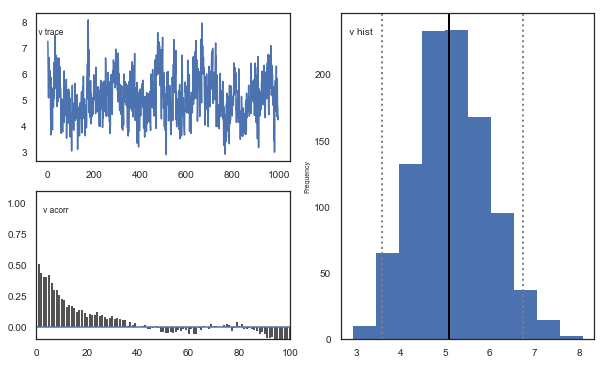

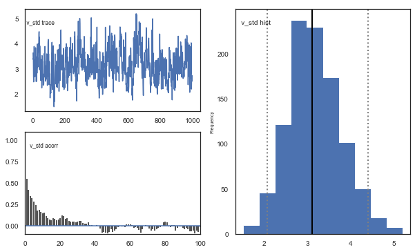

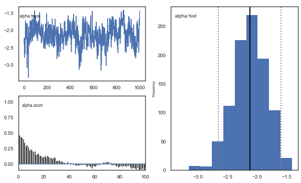

.. image:: demo_RLHDDMtutorial_files/demo_RLHDDMtutorial_92_4.png

**Fig.** Mixing and autocorrelation looks good.

.. code:: ipython3

    # estimate convergence
    models = []
    for i in range(3):
        m = hddm.Hrl(data=data)
        m.sample(1500, burn=500, dbname="traces.db", db="pickle")
        models.append(m)
    # get max gelman-statistic value. shouldn't be higher than 1.1
    np.max(list(gelman_rubin(models).values()))

.. parsed-literal::

     [-----------------100%-----------------] 1500 of 1500 complete in 48.7 sec

.. parsed-literal::

    /Users/madslundpedersen/anaconda/envs/py36/lib/python3.6/site-packages/kabuki/analyze.py:148: FutureWarning: 
    .ix is deprecated. Please use
    .loc for label based indexing or
    .iloc for positional indexing
    
    See the documentation here:
    http://pandas.pydata.org/pandas-docs/stable/user_guide/indexing.html#ix-indexer-is-deprecated
      samples[i,:] = model.nodes_db.ix[name, 'node'].trace()
    /Users/madslundpedersen/anaconda/envs/py36/lib/python3.6/site-packages/pandas/core/indexing.py:961: FutureWarning: 
    .ix is deprecated. Please use
    .loc for label based indexing or
    .iloc for positional indexing
    
    See the documentation here:
    http://pandas.pydata.org/pandas-docs/stable/user_guide/indexing.html#ix-indexer-is-deprecated
      return getattr(section, self.name)[new_key]

.. parsed-literal::

    1.0244990742970825

Convergence looks good, i.e. no parameters with gelman-rubin statistic >
1.1.

.. code:: ipython3

    # Create a new model that has all traces concatenated
    # of individual models.
    m_rl = kabuki.utils.concat_models(models)

.. code:: ipython3

    alpha, v = m_rl.nodes_db.node[["alpha", "v"]]
    samples = {"alpha": alpha.trace(), "v": v.trace()}
    samp = pd.DataFrame(data=samples)
    
    
    def corrfunc(x, y, **kws):
        r, _ = stats.pearsonr(x, y)
        ax = plt.gca()
        ax.annotate("r = {:.2f}".format(r), xy=(0.1, 0.9), xycoords=ax.transAxes)
    
    
    g = sns.PairGrid(samp, palette=["red"])
    g.map_upper(plt.scatter, s=10)
    g.map_diag(sns.distplot, kde=False)
    g.map_lower(sns.kdeplot, cmap="Blues_d")
    
    g.map_lower(corrfunc)

.. parsed-literal::

    <seaborn.axisgrid.PairGrid at 0x12a9d21d0>

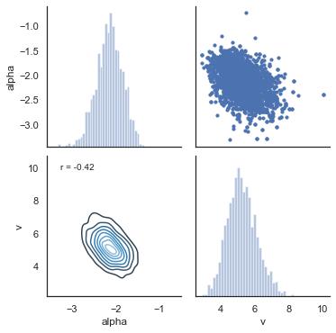

**Fig.** The correlation in the posterior distribution for alpha and
v/scaling is somewhat negative.

Posterior predictive check
--------------------------

We can also do posterior predictive check on the RL-model by generating
new data with hddm.generate.gen_rand_rl_data.

.. code:: ipython3

    # create empty dataframe to store simulated data
    sim_data = pd.DataFrame()
    # create a column samp to be used to identify the simulated data sets
    data["samp"] = 0
    # load traces
    traces = m_rl.get_traces()
    # decide how many times to repeat simulation process. repeating this multiple times is generally recommended as it better captures the uncertainty in the posterior distribution, but will also take some time
    for i in tqdm(range(1, 51)):
        # randomly select a row in the traces to use for extracting parameter values
        sample = np.random.randint(0, traces.shape[0] - 1)
        # loop through all subjects in observed data
        for s in data.subj_idx.unique():
            # get number of trials for each condition.
            size0 = len(
                data[(data["subj_idx"] == s) & (data["split_by"] == 0)].trial.unique()
            )
            size1 = len(
                data[(data["subj_idx"] == s) & (data["split_by"] == 1)].trial.unique()
            )
            size2 = len(
                data[(data["subj_idx"] == s) & (data["split_by"] == 2)].trial.unique()
            )
            # set parameter values for simulation
            scaler = traces.loc[sample, "v_subj." + str(s)]
            alphaInv = traces.loc[sample, "alpha_subj." + str(s)]
            # take inverse logit of estimated alpha
            alpha = np.exp(alphaInv) / (1 + np.exp(alphaInv))
            # simulate data for each condition changing only values of size, p_upper, p_lower and split_by between conditions.
            sim_data0 = hddm.generate.gen_rand_rl_data(
                scaler=scaler, alpha=alpha, size=size0, p_upper=0.8, p_lower=0.2, split_by=0
            )
            sim_data1 = hddm.generate.gen_rand_rl_data(
                scaler=scaler, alpha=alpha, size=size1, p_upper=0.7, p_lower=0.3, split_by=1
            )
            sim_data2 = hddm.generate.gen_rand_rl_data(
                scaler=scaler, alpha=alpha, size=size2, p_upper=0.6, p_lower=0.4, split_by=2
            )
            # append the conditions
            sim_data0 = sim_data0.append([sim_data1, sim_data2], ignore_index=True)
            # assign subj_idx
            sim_data0["subj_idx"] = s
            # identify that these are simulated data
            sim_data0["type"] = "simulated"
            # identify the simulated data
            sim_data0["samp"] = i
            # append data from each subject
            sim_data = sim_data.append(sim_data0, ignore_index=True)
    # combine observed and simulated data
    ppc_rl_data = data[
        ["subj_idx", "response", "split_by", "trial", "feedback", "samp"]
    ].copy()
    ppc_rl_data["type"] = "observed"
    ppc_rl_sdata = sim_data[
        ["subj_idx", "response", "split_by", "trial", "feedback", "type", "samp"]
    ].copy()
    ppc_rl_data = ppc_rl_data.append(ppc_rl_sdata)

.. parsed-literal::

    100%|██████████| 50/50 [12:53<00:00, 15.47s/it]
    /Users/madslundpedersen/anaconda/envs/py36/lib/python3.6/site-packages/pandas/core/frame.py:7138: FutureWarning: Sorting because non-concatenation axis is not aligned. A future version
    of pandas will change to not sort by default.
    
    To accept the future behavior, pass 'sort=False'.
    
    To retain the current behavior and silence the warning, pass 'sort=True'.
    
      sort=sort,

.. code:: ipython3

    # for practical reasons we only look at the first 40 trials for each subject in a given condition
    plot_ppc_rl_data = ppc_rl_data[ppc_rl_data.trial < 41].copy()

.. code:: ipython3

    # bin trials to for smoother estimate of response proportion across learning
    plot_ppc_rl_data["bin_trial"] = pd.cut(
        plot_ppc_rl_data.trial, 11, labels=np.linspace(0, 10, 11)
    ).astype("int64")
    # calculate means for each sample
    sums = (
        plot_ppc_rl_data.groupby(["bin_trial", "split_by", "samp", "type"])
        .mean()
        .reset_index()
    )
    # calculate the overall mean response across samples
    ppc_rl_sim = sums.groupby(["bin_trial", "split_by", "type"]).mean().reset_index()
    # initiate columns that will have the upper and lower bound of the hpd
    ppc_rl_sim["upper_hpd"] = 0
    ppc_rl_sim["lower_hpd"] = 0
    for i in range(0, ppc_rl_sim.shape[0]):
        # calculate the hpd/hdi of the predicted mean responses across bin_trials
        hdi = pymc.utils.hpd(
            sums.response[
                (sums["bin_trial"] == ppc_rl_sim.bin_trial[i])
                & (sums["split_by"] == ppc_rl_sim.split_by[i])
                & (sums["type"] == ppc_rl_sim.type[i])
            ],
            alpha=0.1,
        )
        ppc_rl_sim.loc[i, "upper_hpd"] = hdi[1]
        ppc_rl_sim.loc[i, "lower_hpd"] = hdi[0]
    # calculate error term as the distance from upper bound to mean
    ppc_rl_sim["up_err"] = ppc_rl_sim["upper_hpd"] - ppc_rl_sim["response"]
    ppc_rl_sim["low_err"] = ppc_rl_sim["response"] - ppc_rl_sim["lower_hpd"]
    ppc_rl_sim["model"] = "RL"

.. code:: ipython3

    # plotting evolution of choice proportion for best option across learning for observed and simulated data. Compared for RL and RLDDM models, both with single learnign rate.
    fig, axs = plt.subplots(figsize=(15, 5), nrows=1, ncols=3, sharex=True, sharey=True)
    for i in range(0, 3):
        ax = axs[i]
        d_single = ppc_sim[(ppc_sim.split_by == i) & (ppc_sim.type == "simulated")]
        # slightly move bin_trial to avoid overlap in errorbars
        d_single["bin_trial"] += 0.2
        ax.errorbar(
            d_single.bin_trial,
            d_single.response,
            yerr=[d_single.low_err, d_single.up_err],
            label="simulated_RLDDM",
            color="orange",
        )
        ax = axs[i]
        d_rl = ppc_rl_sim[(ppc_rl_sim.split_by == i) & (ppc_rl_sim.type == "simulated")]
        ax.errorbar(
            d_rl.bin_trial,
            d_rl.response,
            yerr=[d_rl.low_err, d_rl.up_err],
            label="simulated_RL",
            color="green",
        )
        ax = axs[i]
        d = ppc_sim[(ppc_dual_sim.split_by == i) & (ppc_dual_sim.type == "observed")]
        ax.plot(d.bin_trial, d.response, linewidth=3, label="observed")
        ax.set_title("split_by = %i" % i, fontsize=20)
        ax.set_ylabel("mean response")
        ax.set_xlabel("trial")
    plt.xlim(-0.5, 10.5)
    plt.legend()

.. parsed-literal::

    /Users/madslundpedersen/anaconda/envs/py36/lib/python3.6/site-packages/ipykernel/__main__.py:7: SettingWithCopyWarning: 
    A value is trying to be set on a copy of a slice from a DataFrame.
    Try using .loc[row_indexer,col_indexer] = value instead
    
    See the caveats in the documentation: http://pandas.pydata.org/pandas-docs/stable/user_guide/indexing.html#returning-a-view-versus-a-copy

.. parsed-literal::

    <matplotlib.legend.Legend at 0x128cb23c8>

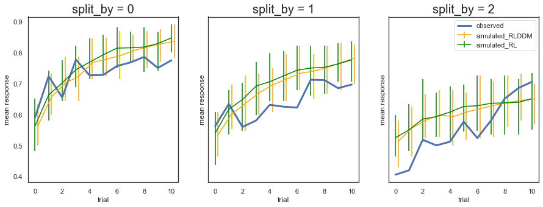

**Fig.** The predicted choice for the RL-model is very similar to what
was predicted in the RLDDM. That is not surprising given that they use
the same calculation to get the choice likelihood. The difference
between them is instead that the RLDDM could potentially detect the
unique contribution of the scaling/drift parameter and the decision
threshold onto choice.

Misprediction across learning
~~~~~~~~~~~~~~~~~~~~~~~~~~~~~

Another way to visualize this is to look at how the predicted choice
misses on the observed across learning, i.e. predicted-observed. As for
the other plots we see that the two methods are very similar.

.. code:: ipython3

    # rl
    error_prediction = (
        plot_ppc_rl_data.groupby(["split_by", "type", "bin_trial"])["response"]
        .mean()
        .reset_index()
    )
    ep = error_prediction.pivot_table(
        index=["split_by", "bin_trial"], columns="type", values="response"
    ).reset_index()
    ep["diff"] = ep["simulated"] - ep["observed"]
    ep["model"] = "RL"
    # rlddm
    error_prediction = (
        plot_ppc_data.groupby(["split_by", "type", "bin_trial"])["response"]
        .mean()
        .reset_index()
    )
    ep_rlddm = error_prediction.pivot_table(
        index=["split_by", "bin_trial"], columns="type", values="response"
    ).reset_index()
    ep_rlddm["diff"] = ep_rlddm["simulated"] - ep_rlddm["observed"]
    ep_rlddm["model"] = "RLDDM"
    # combine
    ep = ep.append(ep_rlddm)
    # plot
    g = sns.relplot(
        x="bin_trial",
        y="diff",
        col="split_by",
        hue="model",
        kind="line",
        ci=False,
        data=ep,
        palette="Set2_r",
    )
    g.map(plt.axhline, y=0, ls=":", c=".5")

.. parsed-literal::

    <seaborn.axisgrid.FacetGrid at 0x128b8f240>

.. image:: demo_RLHDDMtutorial_files/demo_RLHDDMtutorial_106_1.png

