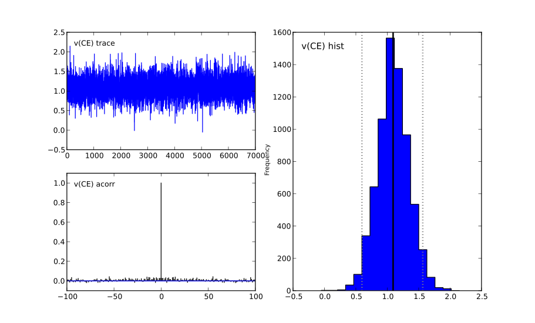

******
How-to
******

Code subject responses
######################

There are two ways to code subject responses placed in the 'response'
column in your data file.  You can either use *accuracy-coding*, where
1's and 0's correspond to correct and error trials, or you can use
*stimulus-coding*, where 1's and 0's correspond to the choice
(e.g. categorization of the stimulus). ``HDDM`` interprets 0 and 1
responses as lower and upper boundary responses, respectively, so in
principle either of these schemes is valid.

In most cases it is more direct to use accuracy coding because the
sign and magnitude of estimated drift-rate will be directly associated
with performance (higher drift rate indicates greater likelihood of
terminating on the accurate boundary). However, if a certain response
direction or stimulus type has a higher probability of selection and
you want to estimate a response bias (which could be captured by a
change in starting point of the drift process; see below), you can
*not* use accuracy coding. (For example if a subject is more likely to
press the left button than the right button, but left and right
responses are equally often correct, one could not capture the
response bias with a starting point toward the incorrect boundary
because it would imply that those trials in which the left response
was correct would be associated with a bias toward the right
response). Thus stimulus coding should be used in this case, using the
HDDMStimCoding model. For this, add a column to your data that codes
which stimulus was correct and instantiate the model like this:

::

    model = hddm.HDDMStimCoding(data, include='z', stim_col='stim', split_param='v')

This model expects data to have a column named stim with two distinct
identifiers. For identifier 1, drift-rate ``v`` will be used while for
identifier 2, ``-v`` will be used. So ultimately you only estimate one
drift-rate. Alternatively you can use bias ``z`` and ``1-z`` if you set
``split_param='z'``. See the HDDMStimCoding help doc for more information.

Include bias and inter-trial variability
########################################

Bias and inter-trial variability parameters are optional and can be
included as follows:

::

   model = hddm.HDDM(data, bias=True, include=('sv', 'st', 'sz'))

or:

::

   model = hddm.HDDM(data, include=('z', 'sv', 'st', 'sz'))

Where *sv* is inter-trial variability in drift-rate, *st* is inter-trial
variability in non-decision time and *sz* is inter-trial variability in
starting-point.

There is also a convenience argument that is identical to the above.

::

   model = hddm.HDDM(data, bias=True, include='all')

Note that you can also include a subset of parameters. This is
relevant because these parameters slow down sampling significantly. If
a certain parameter is estimated very close to zero or fails to
converge (which can happen with the sv parameter) you might want to
exclude it (or only include a group-node, see below). Finally,
parameter recovery studies show that it requires a lot of trials to
get meaningful estimates of these parameters.

Estimate parameters for different conditions
############################################

Most psychological experiments test how different conditions
(e.g. drug manipulations) affect certain parameters. You can build
arbitrarily complex models using the depends_on keyword.

::

   model = hddm.HDDM(data, depends_on={'a': 'drug', 'v': ['drug', 'difficulty']})

This will create model in which separate thresholds are estimated for
each drug condition and separate drift-rates for different drug
conditions and levels of difficulty.

Note that this requires the columns 'drug' and 'difficulty' to be
present in your data array. For readability it is often useful to use
string identifiers (e.g. drug: off/on rather than drug: 0/1).

As you can see, single or multiple columns can be supplied as values.

Outliers
########

The presence of outliers is notoriously challenging for likelihood
models, because the likelihood of a few outliers given the generative
model cab be quite low. In practice, even the model we have is
reasonable for a majority of trials, it may be that data from a
minority of trials is not well described by this model (e.g. due to
attentional lapses).  HDDM 0.4 (and upwards) supports estimation of a
mixture model that enables stable parameter estimation even with
outliers present in the data. You can either specify a fixed
probability for obtaining an outlier (e.g. 0.05 will assume 5% of the
RTs are outliers) or estimate this from the data. In practice, the
precise value of p_outlier does not matter.  Values greater than 0.001
and less than 0.1 are sufficient to capture the outliers, and the
effect on the recovered parameters is small.

To instantiate a model with a fixed probability of getting
an outlier run:

::

    m = hddm.HDDM(data, p_outlier=0.05)

HDDM assumes that outliers come from a uniform distribution
with a fixed density :math:``w_{outlier}`` (as suggested by Ratcliff and Tuerlinckx, 2002).
The resulting likelihood is as follows:

.. math::

   p(RT; v, a, t) = wfpt(RT; v, a, t) * (1-p_{outlier}) + w_{outlier} * p_{outlier}

The default value of :math:``w_{outlier}`` is 0.1, which is equivalent to uniform distribution
from 0 to 5 seconds. However, in practice, the outlier model is applied to all RTs, even
those larger than 5.

Assess model convergence
########################

When using MCMC sampling it is critical to make sure that our chains
have converged, to ensure that we are sampling from the actual
posterior distribution. Unfortunately, there is no 100% fool-proof way to
assess whether chains converged. However, there are various metrics in
the MCMC literature to evaluate convergence problems, and if
you follow some simple steps you can be more confident.

Look at MC error statistic
**************************

When calling:

::

    model.print_stats()

There is a column called MC error. These values should not be smaller then 1%
of the posterior std. However, this is a very weak statistic and by no
means sufficient to assess convergence.

Geweke statistic
****************

The Geweke statistic is a time-series approach that compares the mean
and variance of segments from the beginning and end of a single
chain. You can test your model by running:

::

    from kabuki.analyze import check_geweke
    print check_geweke(model)

This will print ``True`` if non of the test-statistics is larger than 2
and ``False`` otherwise. Check the ``PyMC documentation`` for more
information on this test.

Visually inspect chains
***********************

The next thing to look at are the traces of the posteriors. You can
plot them by calling:

::

   model.plot_posteriors()

This will create a figure for each parameter in your model. Here is an example of what a not-converged chain looks
like:

.. figure:: not_converged_trace.png

and an example of what a converged chain looks like:

As you can see, there are striking differences. In the not-converged
case, the trace in the upper left corner is very non-stationary. There
are also certain periods where no jumps are performed and the chain is
stuck (horizontal lines in the trace); this is due to the proposal
distribution not being tuned correctly.

Secondly, the auto-correlation (lower left plot) is quite high as you
can see from the long tails of the distribution. This is a further
indication that the samples are not independent draws from the
posterior.

Finally, the histogram (right plot) looks rather jagged in the
non-converged case. This is our approximation of the marginal
posterior distribution for this parameter. Generally, subject and
group mean posteriors are normal distributed (see the converged case)
while group variability posteriors are Gamma distributed.

Posterior predictive analysis
*****************************

Another way to assess how good your model fits the data is to perform
posterior predictive analysis:

::

    model.plot_posterior_predictive()

.. TODO: ADD NICE PLOT

This will plot the posterior predictive in blue on top of the RT
histogram in red for each subject and each condition. Since we are
getting a distribution rather than a single parameter in our analysis,
the posterior predictive is the average likelihood evaluated over
different samples from the posterior. The width of the posterior
predictive in light blue corresponds to the standard deviation.

R-hat convergence statistic
***************************

Another option to assess chain convergence is to compute the R-hat
(Gelman-Rubin) statistic. This requires multiple chains to be run. If
all chains converged to the same stationary distribution they should
be indistinguishable. The R-hat statistic compares between-chain
variance to within-chain variance.

To compute the R-hat statistic in kabuki you have to run
multiple copies of your model:

::

   from kabuki.analyze import gelman_rubin

   models = []
   for i in range(5):
       m = hddm.HDDM(data)
       m.find_starting_values()
       m.sample(5000, burn=200)
       models.append(m)

   gelman_rubin(models)

The output is a dictionary that provides the R-hat for each parameter:

::

   {'a': 1.0028806196268818,
    't': 1.0100017175108695,
    'v': 1.0232548747719443}

As of HDDM 0.4.1 you can also run multiple chains in parallel. One
convenient way to do this is the IPython parallel module. To launch a
cluster locally, in a shell (not Python) type::

    ipcluster start

This will launch the workers in the background. IPython Parallel is
much more feature rich, for more information, see the `IPython
parallel docs`.

::

   def run_model(id):
       import hddm
       data = hddm.load_csv('mydata.csv')
       m = hddm.HDDM(data)
       m.find_starting_values()
       m.sample(5000, burn=20, dbname='db%i'%id, db='pickle')
       return m

   from IPython.parallel import Client
   v = Client()[:]
   jobs = v.map(run_model, range(4)) # 4 is the number of CPUs
   models = jobs.get()
   gelman_rubin(models)

   # Create a new model that has all traces concatenated
   # of individual models.
   combined_model = kabuki.utils.concat_models(models)

What to do about lack of convergence
************************************

In the simplest case you just need to run a longer chain with more
burn-in and more thinning. E.g.:

::

    model.sample(10000, burn=5000, thin=5)

This will cause the first 5000 samples to be discarded. Of the
remaining 5000 samples only every 5th sample will be saved. Thus,
after sampling our trace will have a length of a 1000 samples.

You might also want to find a good starting point for running your
chains. This is commonly achieved by finding the maximum posterior
(MAP) via optimization. Before sampling, simply call:

::

    model.find_starting_values()

which will set the starting values to the MAP. Then sample as you
would normally. This is a good idea in general.

If that still does not work you might want to consider simplifying
your model. Certain parameters are just notoriously slow to converge;
especially inter-trial variability parameters. The reason is that
often individual subjects do not provide enough information to
meaningfully estimate these parameters on a per-subject basis. One way
around this is to not even try to estimate individual subject
parameters and instead use only group nodes. This can be achieved via
the group_only_nodes keyword argument:

::

    model = hddm.HDDM(data, include=['sv', 'st'], group_only_nodes=['sv', 'st'])

The resulting model will still have subject nodes for all parameters
but sv and st.

Estimate a regression model
###########################

``HDDM`` includes a regression model that allows estimation of
trial-by-trial influences of a covariate (e.g. a brain measure like
fMRI) onto DDM parameters. For example, if your prediction is that
activity of a particular brain area has a linear correlation with
drift-rate, you could specify the following regression model (make
sure to have a column with the brain activity in your data, in our
example name this column ``BOLD``):

::

   m = hddm.models.HDDMRegressor(data, 'v ~ BOLD:C(trial_type)')

This syntax is similar to what ``R`` uses for specifying
GLMs. Basically, this means that drift-rate ``v`` is distributed
according to the BOLD response and trial-type. ``HDDMRegression`` will
add an intercept and slope parameter for the BOLD trial-by-trial
measure for each condition. The ``C()`` specifies that ``trial_type``
(which might be a data column with ``A`` and ``B``) should be a
categorical variable which will be dummy-coded.

Internally, ``HDDM`` uses ``Patsy`` for the spcification of the linear
model. The `patsy documentation`_ gives a complete overview of the
functionality.

You can also pass a list to linear model descriptors if you want to
include multiple covariates. E.g.:

::

   m = hddm.models.HDDMRegressor(data, ['v ~ BOLD:C(trial_type)',
                                        'a ~ Theta'])

Stimulus coding with HDDMRegression
***********************************

Stimulus coding can also be implemented in ``HDDMRegression``. The
advantage of doing so is that more complex designs, including within
participant designs can be analysed (see below). The disadvantage is
the ``HDDMRegression`` is slower than ``HDDMStimCoding``.

To implement stimulus coding for ``z`` one has to define a link function for ``HDDMRegression``:
::

    import hddm
    import numpy as np
    from patsy import dmatrix

    def z_link_func(x, data=mydata):
        stim = (np.asarray(dmatrix('0 + C(s,[[1],[-1]])', {'s':data.stimulus.ix[x.index]})))
        return 1 / (1 + np.exp(-(x * stim)))

Similarly, the link function for v is:
::

    def v_link_func(x, data=mydata):
        stim = (np.asarray(dmatrix('0 + C(s,[[1],[-1]])', {'s':data.stimulus.ix[x.index]})))
        return x * stim

To specify a complete model you have to define a complete regression model and submit it with the data to the model.
::

    z_reg = {'model': 'z ~ 1 + C(condition)', 'link_func': z_link_func}
    v_reg = {'model': 'v ~ 1 + C(condition)', 'link_func': lambda x: x}
    reg_model = [z_reg, v_reg]
    hddm_regrssion_model = hddm.HDDMRegressor(data, reg_model, include='z')

Of course, your model could also regress either z or v. For example
::

    v_reg =  [{'model': 'v ~ 1 + C(condition)', 'link_func': v_link_func, group_only_regressors=True}]
    hddm_regrssion_model = hddm.HDDMRegressor(data, v_reg, include='z')

For a more elaborate example and parameter recovery study using
``HDDMRegression``, see the :ref:`tutorial on using HDDMRegression for
stimulus coding <chap_tutorial_hddm_regression>`.

Perform model comparison
########################

We can often come up with different viable hypotheses about which
parameters might be influenced by our experimental conditions. Above
you can see how you can create these different models using the
depends_on keyword.

DIC
***

To compare which model does a better job at explaining the data you
can compare the DIC_ scores (lower is better) emitted when calling:

::

    model.print_stats()

DIC, however, is far from being a perfect measure. So it shouldn't be your
only weapon in deciding which model is best.

Posterior predictive check
**************************

A very elegant method to compare models is to sample new data sets
from the estimated model and see how well these simulated data sets
corresponds to the actual data on some measurement (e.g. is the mean
RT well recovered by this model?).

The best place to learn about this is :ref:``Posterior Predictive Tutorial <chap_tutorial_post_pred>``.

Run Quantile Opimization
########################

Even though Hierarchical Bayesian estimation tends to produce better
fit -- especially with few number of trials -- it is quite a bit
slower than the Quantile optimization method that e.g. Roger Ratcliff
uses. If you have lots of data (>100 trials per condition) and you
don't care about posterior estimates you can use the `HDDM.optimize()`
method to run quantile optimization. The first argument is a string
identifier of which optimization method you want to run and can be one
of `chisquare`, `gsquare` or `ML`.

::

    model = hddm.HDDM(data, depends_on={'v': ['word_freq', 'reps']})
    params = model.optimize('chisquare')

Note that this function will by default not estimate individual
subject parameters but rather do quantile averaging to only estimate
group parameters. Running different models for each individual subject
is quite easy however:

::

   subj_params = []
   for subj_idx, subj_data in data.groupby('subj_idx'):
      m_subj = hddm.HDDM(subj_data, depends_on={'v': ['word_freq', 'reps']})
      subj_params.append(m_subj.optimize('chisquare'))
   params = pandas.DataFrame(subj_params)

Save and load models
####################

``HDDM`` models can be saved and reloaded in a separate python
session. Note that you have to save the traces to file by using
the db backend.

::

    model = hddm.HDDM(data, bias=True)  # a very simple model...
    model.sample(5000, burn=20, dbname='traces.db', db='pickle')
    model.save('mymodel')

Now assume that you start a new python session, after the chain
started above is completed.

::

   model = hddm.load('mymodel')

``HDDM`` uses the pickle module to save and load models.

Compare parameters to other papers
###################################

A lot of people are very used to the parameters that come from Ratcliff's
assumption, which is that the noise coefficient is 0.1, rather than 1. That
noise parameter is a "scaling parameter", meaning that you just need to
multiply HDDM's estimates of drift, starting point, and threshold (as well as
variabilities in these parameters) by 0.1, and you get estimates that are
commensurate with most of the parameter estimates in
the literature.  Ratcliff et al. mention that you can scale all the DDM
parameters in that way and you thereby get identical choice probabilities and
RTs in several papers, such as Ratcliff & Tuerlinckx, 2002.

Moreover, the `z` parameter in HDDM is relative to a (i.e. it ranges from `0`
to `1`). Ratcliff usually reports `z` as an absolute value (i.e. it ranges from
`0` to `a`). To transform HDDM `z` to Ratcliff's notation use `a*z`. 

Hypothesis testing
##################

Since HDDM uses Bayesian estimation it is straight forward to analyze the posterior directly for hypothesis testing. You can directly work with the posterior and ask statistically meaningful questions. For example, assume you two conditions for drift-rate:

::

    v_Win, v_Neutral= m.nodes_db.node[['v(Win)', 'v(Neutral)']]
    print "P_v(Win > Neutral) = ", (v_Win.trace() > v_Neutral.trace()).mean()

Would give you the probability that the drift-rate in the Win condition is higher than in the Neutral condition.

Note that it is wrong to just input the subject parameters of a hierarchical into a frequentist test like the T-test. The hierarchical model violates the independence assumption.

There are some excellent books on Bayesian data analysis for cognitive science, e.g. `Lee & Wagenmakers`_ and `Kruschke`_, or see the `BEST paper`_ for a single journal article comparing Bayesian estimation to the t-test. 

.. _PyMC docs: http://pymc-devs.github.com/pymc/database.html#saving-data-to-disk
.. _DIC: http://www.mrc-bsu.cam.ac.uk/bugs/winbugs/dicpage.shtml
.. _PyMC documentation: http://pymc-devs.github.com/pymc/modelchecking.html#formal-methods
.. _IPython Parallel Docs: http://ipython.org/ipython-doc/stable/parallel/index.html
.. _Patsy: http://patsy.readthedocs.org/en/latest/
.. _BEST paper: http://www.indiana.edu/~kruschke/BEST/BEST.pdf
.. _Lee & Wagenmakers: http://bayesmodels.com/
.. _Kruschke: http://www.indiana.edu/~kruschke/DoingBayesianDataAnalysis/
