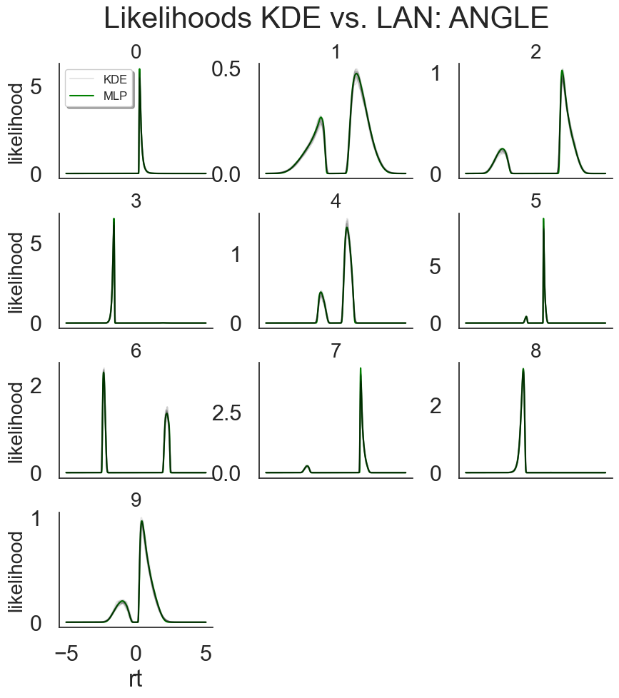
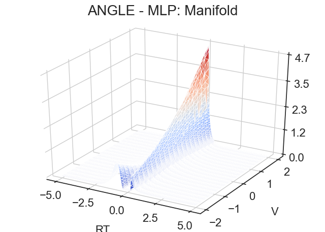

Network Inspectors
------------------

The ``network_inspectors()`` module allows you to inspect the LANs
directly. We will be grateful if you report any strange behavior you
might find.

.. code:: ipython3

    # MODULE IMPORTS ----
    import numpy as np
    import hddm

Direct access to batch predictions
~~~~~~~~~~~~~~~~~~~~~~~~~~~~~~~~~~

You can use the ``hddm.network_inspectors.get_torch_mlp()`` function to
access network predictions.

.. code:: ipython3

    # Specify model
    model = 'angle'
    lan_angle = hddm.network_inspectors.get_torch_mlp(model = model)

.. code:: ipython3

    # Make some random parameter set
    parameter_df = hddm.simulators.make_parameter_vectors_nn(model = model,
                                                             param_dict = None,
                                                             n_parameter_vectors = 1)
    
    parameter_matrix = np.tile(np.squeeze(parameter_df.values), (200, 1))
    
    # Initialize network input
    network_input = np.zeros((parameter_matrix.shape[0], parameter_matrix.shape[1] + 2)) # Note the + 2 on the right --> we append the parameter vectors with reaction times (+1 columns) and choices (+1 columns)
    
    # Add reaction times
    network_input[:, -2] = np.linspace(0, 3, parameter_matrix.shape[0])
    
    # Add choices
    network_input[:, -1] = np.repeat(np.random.choice([-1, 1]), parameter_matrix.shape[0])
    
    # Note: The networks expects float32 inputs
    network_input = network_input.astype(np.float32)
    
    # Show example output
    print('Some network outputs')
    print(lan_angle(network_input)[:10]) # printing the first 10 outputs
    print('Shape')
    print(lan_angle(network_input).shape) # original shape of output

.. parsed-literal::

    Some network outputs
    [[-6.5302606 ]
     [ 0.5264375 ]
     [ 0.410895  ]
     [-0.52280986]
     [-1.0521754 ]
     [-1.552991  ]
     [-2.0735168 ]
     [-2.6183672 ]
     [-3.2071779 ]
     [-3.878473  ]]
    Shape
    (200, 1)

Plotting Utilities
~~~~~~~~~~~~~~~~~~

HDDM provides two plotting function to investigate the network outputs
directly. The ``kde_vs_lan_likelihoods()`` plot and the
``lan_manifold()`` plot.

**NOTE**: These utilities are designed for 2-choice models at the
moment.

``kde_vs_lan_likelihoods()``
^^^^^^^^^^^^^^^^^^^^^^^^^^^^

.. code:: ipython3

    # Make some parameters
    parameter_df = hddm.simulators.make_parameter_vectors_nn(model = model,
                                                             param_dict = None,
                                                             n_parameter_vectors = 10)

.. code:: ipython3

    parameter_df

.. raw:: html

    

    
    <table border="1" class="dataframe">
      <thead>
        <tr style="text-align: right;">
          <th></th>
          <th>v</th>
          <th>a</th>
          <th>z</th>
          <th>t</th>
          <th>theta</th>
        </tr>
      </thead>
      <tbody>
        <tr>
          <th>0</th>
          <td>2.729321</td>
          <td>1.184634</td>
          <td>0.798893</td>
          <td>0.186882</td>
          <td>0.225510</td>
        </tr>
        <tr>
          <th>1</th>
          <td>0.550569</td>
          <td>1.473085</td>
          <td>0.389967</td>
          <td>0.583149</td>
          <td>0.317908</td>
        </tr>
        <tr>
          <th>2</th>
          <td>0.297733</td>
          <td>1.241166</td>
          <td>0.630780</td>
          <td>1.617812</td>
          <td>0.455768</td>
        </tr>
        <tr>
          <th>3</th>
          <td>-2.918573</td>
          <td>0.972126</td>
          <td>0.307551</td>
          <td>1.496773</td>
          <td>0.898875</td>
        </tr>
        <tr>
          <th>4</th>
          <td>0.666445</td>
          <td>1.882498</td>
          <td>0.530820</td>
          <td>0.259892</td>
          <td>1.028040</td>
        </tr>
        <tr>
          <th>5</th>
          <td>1.629646</td>
          <td>0.507156</td>
          <td>0.692670</td>
          <td>0.529111</td>
          <td>0.845566</td>
        </tr>
        <tr>
          <th>6</th>
          <td>-1.255036</td>
          <td>1.741760</td>
          <td>0.678846</td>
          <td>1.849304</td>
          <td>1.233386</td>
        </tr>
        <tr>
          <th>7</th>
          <td>0.891731</td>
          <td>0.795798</td>
          <td>0.721093</td>
          <td>1.705487</td>
          <td>0.704186</td>
        </tr>
        <tr>
          <th>8</th>
          <td>-2.954760</td>
          <td>1.518239</td>
          <td>0.419388</td>
          <td>0.623301</td>
          <td>0.607989</td>
        </tr>
        <tr>
          <th>9</th>
          <td>0.360199</td>
          <td>1.369782</td>
          <td>0.629768</td>
          <td>0.098295</td>
          <td>0.497529</td>
        </tr>
      </tbody>
    </table>
    

.. code:: ipython3

    hddm.network_inspectors.kde_vs_lan_likelihoods(parameter_df = parameter_df, 
                                                   model = model,
                                                   cols = 3,
                                                   n_samples = 2000,
                                                   n_reps = 10,
                                                   show = True)

.. parsed-literal::

    1 of 10
    2 of 10
    3 of 10
    4 of 10
    5 of 10
    6 of 10
    7 of 10
    8 of 10
    9 of 10
    10 of 10

``lan_manifold()``
^^^^^^^^^^^^^^^^^^

Lastly, you can use the ``lan_manifold()`` plot to investigate the LAN
likelihoods over a range of parameters.

The idea is to use a base parameter vector and vary one of the
parameters in a prespecificed range.

This plot can be informative if you would like to understand better how
a parameter affects model behavior.

.. code:: ipython3

    # Now plotting
    hddm.network_inspectors.lan_manifold(parameter_df = parameter_df,
                                         vary_dict = {'v': np.linspace(-2, 2, 20)},
                                         model = model,
                                         n_rt_steps = 300,
                                         fig_scale = 1.0,
                                         max_rt = 5,
                                         save = True,
                                         show = True)

.. parsed-literal::

    Using only the first row of the supplied parameter array !

