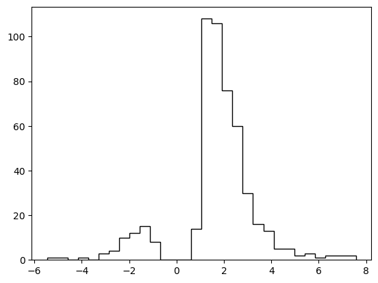
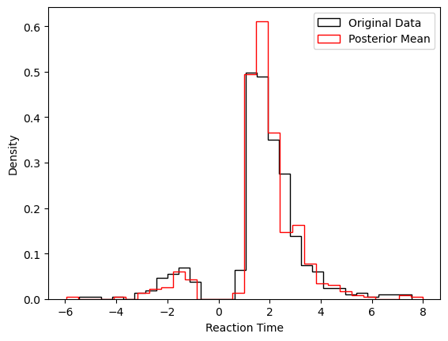
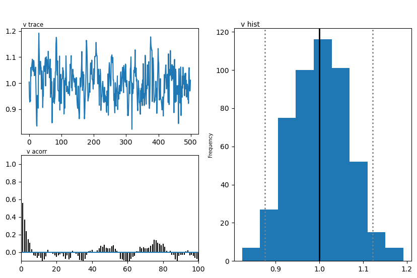
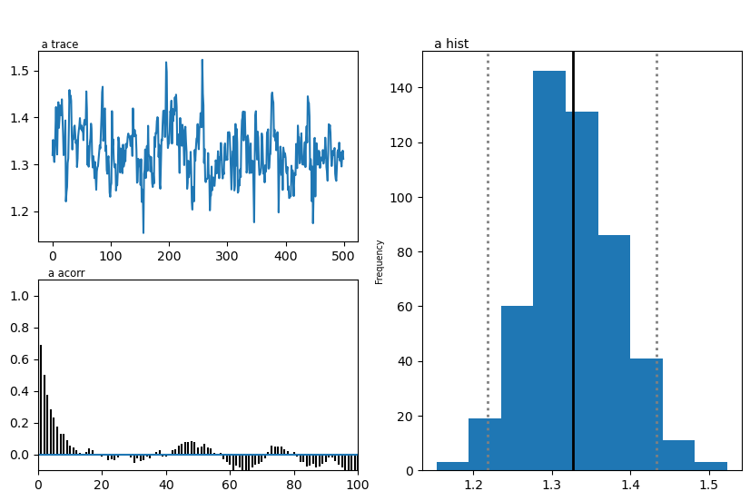
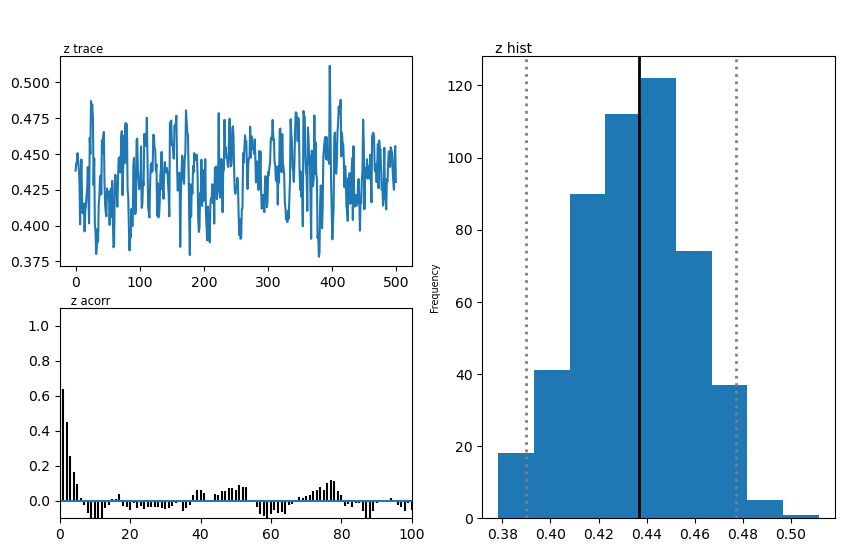
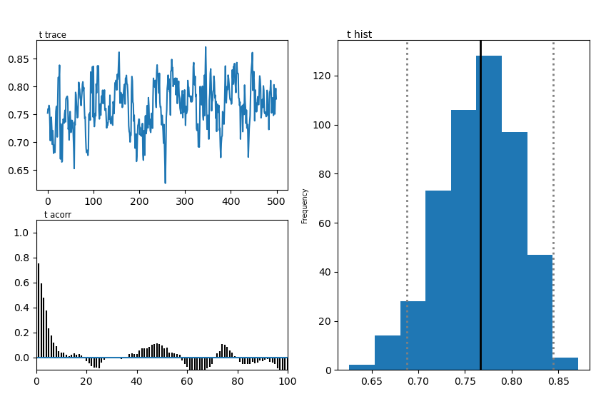

From simulator to Inference with HDDM (LAN version)
===================================================

This Tutorial serves as an example for a full LAN pipeline to inference
with HDDM. We start with a *simulator* of a *Sequential Sampling Model*
(SSM), use it to generate training data for a *LAN*, train the *LAN* and
then use **HDDM** to perform inference on a synthetic dataset from our
*simulator*.

The example uses the simple DDM for illustration, you can switch out the
DDM for your SSM of choice when utilizing this pipeline for your own
work.

We will make use of two packages in the *LAN ecosystem* (installation
instructions below), to help our process.

1. The ```ssms`` <https://github.com/AlexanderFengler/ssm_simulators>`__
   package, which holds a collection of fast simulators and training
   data generators for LANs
2. The
   ```LANfactory`` <https://github.com/AlexanderFengler/LANfactory>`__
   package, which makes defining and training LANs convenient.

The ```LANfactory`` <https://github.com/AlexanderFengler/LANfactory>`__
package is a light-weight convenience package for training
``likelihood approximation networks`` (LANs) in torch (or keras),
starting from supplied training data.

`LANs <https://elifesciences.org/articles/65074>`__, although more
general in potential scope of applications, were conceived in the
context of sequential sampling modeling to account for cognitive
processes giving rise to *choice* and *reaction time* data in
*n-alternative forced choice experiments* commonly encountered in the
cognitive sciences.

In this quick tutorial we will use the
```ssms`` <https://github.com/AlexanderFengler/ssm_simulators>`__
package to generate our training data using such a sequential sampling
model (SSM). The use of of the ``LANfactory`` package is in no way bound
to utilize this ``ssms`` package.

**NOTE**: The
```ssms`` <https://github.com/AlexanderFengler/ssm_simulators>`__
package directly generates training data as expected to train **LANs**
as per the ```LAN-paper`` <https://elifesciences.org/articles/65074>`__.

Install (colab)
~~~~~~~~~~~~~~~

.. code:: ipython3

    # package to help train networks
    # !pip install git+https://github.com/AlexanderFengler/LANfactory
    
    # package containing simulators for ssms
    # !pip install git+https://github.com/AlexanderFengler/ssm_simulators
    
    # packages related to hddm
    # !pip install cython
    # !pip install pymc==2.3.8
    # !pip install git+https://github.com/hddm-devs/kabuki
    # !pip install git+https://github.com/hddm-devs/hddm

Load Modules
------------

.. code:: ipython3

    # HDDM
    import hddm
    
    # Package to help train networks (explained above)
    import lanfactory
    
    # Package containing simulators for ssms (explained above)
    import ssms
    
    # Other misc packages
    import os 
    import numpy as np
    from copy import deepcopy
    import pandas as pd
    import matplotlib
    import matplotlib.pyplot as plt
    import torch


Make Training Data
------------------

Configs
~~~~~~~

To create the training data we need, we first specify a configuration
dictionary (``generator_config`` below), as expected by the
``ssms.dataset_generator.data_generator()`` function.

**NOTE:** Specific to ``ssms`` package. You can ignore this if you
provide your own training data.

.. code:: ipython3

    # MAKE CONFIGS
    from ssms.config import data_generator_config
    
    # Initialize the generator config (for MLP LANs)
    
    # (We start from a supplied example in the ssms package)
    generator_config = deepcopy(data_generator_config['lan']['mlp']) 
    
    # Specify generative model (one from the list of included models in the ssms package)
    generator_config['dgp_list'] = 'ddm' 
    
    # Specify number of parameter sets to simulate
    generator_config['n_parameter_sets'] = 5000
    
    # Specify how many samples a simulation run should entail
    generator_config['n_samples'] = 2000
    
    # Specify how many training examples to extract from 
    # a single parametervector
    generator_config['n_training_examples_by_parameter_set'] = 2000
    
    # Specify folder in which to save generated data
    generator_config['output_folder'] = 'lan_to_hddm_tmp_data/lan_mlp/'
    
    # Make model config dict
    model_config = ssms.config.model_config['ddm']
    
    # Show 
    model_config


.. parsed-literal::

    {'name': 'ddm',
     'params': ['v', 'a', 'z', 't'],
     'param_bounds': [[-3.0, 0.3, 0.1, 0.0], [3.0, 2.5, 0.9, 2.0]],
     'boundary': <function ssms.basic_simulators.boundary_functions.constant(t=0)>,
     'n_params': 4,
     'default_params': [0.0, 1.0, 0.5, 0.001],
     'hddm_include': ['z'],
     'nchoices': 2}


Run Simulator
~~~~~~~~~~~~~

The ``generate_data_training_uniform()`` function generates training
data as expected by the ``LANfactory`` package for LAN training.

.. code:: ipython3

    # MAKE DATA
    my_dataset_generator = ssms.dataset_generators.data_generator(generator_config = generator_config,
                                                                  model_config = model_config)
    
    training_data = my_dataset_generator.generate_data_training_uniform(save = True)


.. parsed-literal::

    checking:  lan_to_hddm_tmp_data/lan_mlp/
    simulation round: 1  of 10
    simulation round: 2  of 10
    simulation round: 3  of 10
    simulation round: 4  of 10
    simulation round: 5  of 10
    simulation round: 6  of 10
    simulation round: 7  of 10
    simulation round: 8  of 10
    simulation round: 9  of 10
    simulation round: 10  of 10
    Writing to file:  lan_to_hddm_tmp_data/lan_mlp/training_data_0_nbins_0_n_2000/ddm/training_data_ddm_9ff20d34691a11ed8cc7acde48001122.pickle


Train Network
-------------

Data Loaders
~~~~~~~~~~~~

The ``LANfactory`` package provides some convenience functions to create
so-called ``data loaders`` (finally ``DataLoader`` ``class`` in
``PyTorch``). These help with making neural network training efficient,
when loading training data from file.

.. code:: ipython3

    # MAKE DATALOADERS
    
    # List of datafiles (here only one)
    folder_ = 'lan_to_hddm_tmp_data/lan_mlp/training_data_0_nbins_0_n_2000/ddm/'
    file_list_ = [folder_ + file_ for file_ in os.listdir(folder_)]
    
    # Training dataset
    torch_training_dataset = lanfactory.trainers.DatasetTorch(file_IDs = file_list_,
                                                              batch_size = 128)
    
    torch_training_dataloader = torch.utils.data.DataLoader(torch_training_dataset,
                                                             shuffle = True,
                                                             batch_size = None,
                                                             num_workers = 1,
                                                             pin_memory = True)
    
    # Validation dataset
    torch_validation_dataset = lanfactory.trainers.DatasetTorch(file_IDs = file_list_,
                                                                batch_size = 128)
    
    torch_validation_dataloader = torch.utils.data.DataLoader(torch_validation_dataset,
                                                              shuffle = True,
                                                              batch_size = None,
                                                              num_workers = 1,
                                                              pin_memory = True)

Network Config
~~~~~~~~~~~~~~

``LANfactory`` networks take in a ``network_config`` dictionary, which
specifies the *network architecture*. This is necessary to construct our
network from the ``lanfactory.trainer.TorchMLP`` class.

.. code:: ipython3

    # SPECIFY NETWORK CONFIGS AND TRAINING CONFIGS
    
    network_config = lanfactory.config.network_configs.network_config_mlp
    
    print('Network config: ')
    print(network_config)


.. parsed-literal::

    Network config: 
    {'layer_sizes': [100, 100, 1], 'activations': ['tanh', 'tanh', 'linear'], 'train_output_type': 'logprob'}
    Train config: 
    {'cpu_batch_size': 128, 'gpu_batch_size': 256, 'n_epochs': 5, 'optimizer': 'adam', 'learning_rate': 0.002, 'lr_scheduler': 'reduce_on_plateau', 'lr_scheduler_params': {}, 'weight_decay': 0.0, 'loss': 'huber', 'save_history': True}


Train Config
~~~~~~~~~~~~

To train a network with the ``LANfactory`` package, we have to specify a
``train_config`` dictionary, which contains the necessary *training
hyperparameters*. In the ``config.network_configs`` module, an example
is provided, which we slightly adapt.

.. code:: ipython3

    from lanfactory.config.network_configs import train_config_mlp
    
    train_config_mlp


.. parsed-literal::

    {'cpu_batch_size': 128,
     'gpu_batch_size': 256,
     'n_epochs': 5,
     'optimizer': 'adam',
     'learning_rate': 0.002,
     'lr_scheduler': 'reduce_on_plateau',
     'lr_scheduler_params': {},
     'weight_decay': 0.0,
     'loss': 'huber',
     'save_history': True}


.. code:: ipython3

    train_config = deepcopy(train_config_mlp)
    train_config['save_history'] = False
    
    print('Train config: ')
    print(train_config)


.. parsed-literal::

    Train config: 
    {'cpu_batch_size': 128, 'gpu_batch_size': 256, 'n_epochs': 5, 'optimizer': 'adam', 'learning_rate': 0.002, 'lr_scheduler': 'reduce_on_plateau', 'lr_scheduler_params': {}, 'weight_decay': 0.0, 'loss': 'huber', 'save_history': False}


Initialize Network
~~~~~~~~~~~~~~~~~~

We can now initialize the network using the ``TorchMLP`` class provided
in the ``LANfactory`` package.

.. code:: ipython3

    from lanfactory.trainers import TorchMLP
    
    # LOAD NETWORK
    net = TorchMLP(network_config = deepcopy(network_config),
                   input_shape = torch_training_dataset.input_dim,
                   save_folder = 'lan_to_hddm_tmp_data/lan_mlp/',
                   generative_model_id = 'ddm')
    
    # SAVE CONFIGS
    lanfactory.utils.save_configs(model_id = net.model_id + '_torch_',
                                  save_folder = 'lan_to_hddm_tmp_data/lan_mlp/',
                                  network_config = network_config,
                                  train_config = train_config,
                                  allow_abs_path_folder_generation = True)

We pass the ``train_config`` dictionary, our network ``net`` and the
dataloaders to the ``ModelTrainerTorchMLP`` class from the
``LANfactory`` package, after which we can train our model with a simple
call to the ``train_model()`` function.

.. code:: ipython3

    # TRAIN MODEL
    model_trainer = lanfactory.trainers.ModelTrainerTorchMLP(train_config = train_config,
                                                             data_loader_train = torch_training_dataloader,
                                                             data_loader_valid = torch_validation_dataloader,
                                                             model = net,
                                                             output_folder = 'lan_to_hddm_tmp_data/lan_mlp/')
    
    model_trainer.train_model(save_history = False,
                              save_model = True,
                              verbose = 0)


.. parsed-literal::

    Torch Device:  cpu
    Found folder:  lan_to_hddm_tmp_data
    Moving on...
    Found folder:  lan_to_hddm_tmp_data/lan_mlp
    Moving on...
    wandb not available, not storing results there
    Epoch took 0 / 5,  took 136.11848092079163 seconds
    epoch 0 / 5, validation_loss: 0.03961
    Epoch took 1 / 5,  took 113.36870789527893 seconds
    epoch 1 / 5, validation_loss: 0.04193
    Epoch took 2 / 5,  took 112.76040506362915 seconds
    epoch 2 / 5, validation_loss: 0.03371
    Epoch took 3 / 5,  took 109.81652188301086 seconds
    epoch 3 / 5, validation_loss: 0.03548
    Epoch took 4 / 5,  took 111.44894003868103 seconds
    epoch 4 / 5, validation_loss: 0.03456
    Saving model state dict
    Training finished successfully...


Use in HDDM
-----------

We generated training data from model simulations, and trained our LAN.

Let’s proceed to use our freshly minted LAN in HDDM for inference on our
*custom model* (as a reminder, this was mundanely just a DDM for
purposes of this tutorial).

Define HDDM Model Config
~~~~~~~~~~~~~~~~~~~~~~~~

The ``HDDMnn()`` classes generally expect a ``model_config`` dictionary
which specifies details about parameters names, allowed parameters
values and other aspects of a given SSM.

If a valid *model string* is provided as an argument, HDDM will supply
the appropriate ``model_config`` (and respective LAN) internally from
the model bank that is already included in the package.

Instead, we can supply a custom ``model_config``, as well as a custom
*likelihood* (via the ``network`` argument), with very few a priori
restrictions.

We will now define such a custom ``model_config`` and then show how to
provide our LAN trained above as a custom likelihood, after which we can
sample from our custom HDDM model.

.. code:: ipython3

    my_model_config = {}
    
    # Parameter names associated to your model
    my_model_config["params"] = ["v", "a", "z", "t"]
    
    # The parameter boundaries you used for training your LAN
    my_model_config["param_bounds"] = [[-3.0, 0.3, 0.1, 1e-3], [3.0, 2.5, 0.9, 2.0]]
    
    # Suggestion for which parameters to include
    # via the include statement of an HDDM model
    # (usually you want all of the parameters from above)
    my_model_config["hddm_include"] = ["v", "a", "z", "t"]
    
    # choice labels (what your simulator spits out)
    my_model_config["choices"] = [-1, 1]

.. code:: ipython3

    # Specifies parameters which the sampler should tansform (optional)
    my_model_config["params_trans"] = [0, 0, 0, 0]
    
    # adds sampler settings for each parameter 
    # (optional: Can improve sampler speed if informed decision made here)
    my_model_config["slice_widths"] = {
                                        "v": 1.5,
                                        "v_std": 1,
                                        "a": 1,
                                        "a_std": 1,
                                        "z": 0.1,
                                        #"z_trans": 0.2,
                                        "z_std": 0.2,
                                        "t": 0.01,
                                        "t_std": 0.15,
                                      }
    
    # Default values for parameters
    # (Useful if you don't intend to fit one or more of them)
    my_model_config["params_default"] = [0.0, 1.0, 0.5, 1e-3]
    
    # Set a (reasonable) upper limit of group level standard deviations,
    # (optional: Can help with sampler stability)
    my_model_config["params_std_upper"] = [1.5, 1.0, None, 1.0]

Load the Network
~~~~~~~~~~~~~~~~

The ``LoadTorchMLPInfer()`` function is used to load a network in
inference mode. We explain more below.

.. code:: ipython3

    from lanfactory.trainers import LoadTorchMLPInfer
    net = LoadTorchMLPInfer(model_file_path = 'lan_to_hddm_tmp_data/lan_mlp/' + \
                                                    '2d4eedae67b911ed8acaacde48001122_ddm_torch_state_dict.pt',
                                                network_config = network_config,
                                                input_dim = 6)


.. parsed-literal::

    tanh
    tanh
    linear


The ``LoadTorchMLPInfer()`` class loads our network in ``eval`` mode and
stops gradients from being accumulated. Importantly, it exposes a
``predict_on_batch()`` method, which is what HDDM will call internally.

The naming of this function is a left-over from ``keras`` days, however
what it does internally may be important if you would like to supply a
fully custom likelihood at some point.

.. code:: ipython3

    # A look at the internals
    from lanfactory.trainers import TorchMLP
    
    class LoadTorchMLPInfer:
        def __init__(self, 
                     model_file_path = None,
                     network_config = None,
                     input_dim = None):
            
            torch.backends.cudnn.benchmark = True
            self.dev = torch.device("cuda") if torch.cuda.is_available() else torch.device("cpu")
            self.model_file_path = model_file_path
            self.network_config = network_config
            self.input_dim = input_dim
            
            self.net = TorchMLP(network_config = self.network_config,
                                input_shape = self.input_dim,
                                generative_model_id = None)
            self.net.load_state_dict(torch.load(self.model_file_path))
            self.net.to(self.dev)
            self.net.eval()
    
        @torch.no_grad()
        def __call__(self, x):
            return self.net(x)
    
        @torch.no_grad()
        def predict_on_batch(self, x = None):
            return self.net(torch.from_numpy(x).to(self.dev)).cpu().numpy()

The argument ``x``, to the ``predict_on_batch()``, when called from
within HDDM’s sampler, will be a matrix. Rows correspond to trials, and
columns are supplied in the following way.

The first few columns contain trial wise parameters (in the order
specific in the ``model_config`` above under the ``"params"`` ``key``).
The last two columns contain the trial wise *reaction times* and
*choices* respectively.

To understand better how HDDM calls such a custom likelihood
*internally*, see the code below.

**NOTE:** Don’t run the cell below, it is just for illustration!

.. code:: ipython3

    def wiener_like_nn_mlp_pdf(np.ndarray[float, ndim = 1] rt,
                               np.ndarray[float, ndim = 1] response,
                               np.ndarray[float, ndim = 1] params,
                               double p_outlier = 0, 
                               double w_outlier = 0,
                               bint logp = 0,
                               network = None):
        
        cdef Py_ssize_t size = rt.shape[0]
        cdef Py_ssize_t n_params = params.shape[0]
    
        cdef np.ndarray[float, ndim = 1] log_p = np.zeros(size, dtype = np.float32)
        cdef float ll_min = -16.11809
    
        cdef np.ndarray[float, ndim = 2] data = np.zeros((size, n_params + 2), dtype = np.float32)
        data[:, :n_params] = np.tile(params, (size, 1)).astype(np.float32)
        data[:, n_params:] = np.stack([rt, response], axis = 1)
    
        # Call to network:
        if p_outlier == 0: 
            log_p = np.squeeze(np.core.umath.maximum(network.predict_on_batch(data), ll_min))
        else: 
            log_p = np.squeeze(np.log(np.exp(np.core.umath.maximum(network.predict_on_batch(data), ll_min)) * (1.0 - p_outlier) + (w_outlier * p_outlier)))
        if logp == 0:
            log_p = np.exp(log_p)
        return log_p

We see that the *internal likelihood function* expects a network as
input and then finally calls the ``predict_on_batch()`` to get
log-likelihoods.

Generate Example Dataset
~~~~~~~~~~~~~~~~~~~~~~~~

We can now generate an example dataset and use our newly created LAN to
fit our custom DDM to the data.

.. code:: ipython3

    # Choose some parameters
    v = 0.9
    a = 1.4
    z = 0.45
    t = 0.7
    
    # Simulate Data
    data = ssms.basic_simulators.simulator(model = 'ddm', 
                                           theta = [v, a, z, t],
                                           n_samples = 500)
    
    # Bring into correct shape expected from HDDM
    data_df = pd.DataFrame(np.stack([data['rts'], data['choices']], axis = 1)[:, :, 0], columns = ['rt', 'response'])
    data_df['subj_idx'] = 0
    data_df['v'] = v
    data_df['a'] = a
    data_df['z'] = z
    data_df['t'] = t
    
    
    data_df


.. raw:: html

    <div>
    <style scoped>
        .dataframe tbody tr th:only-of-type {
            vertical-align: middle;
        }
    
        .dataframe tbody tr th {
            vertical-align: top;
        }
    
        .dataframe thead th {
            text-align: right;
        }
    </style>
    <table border="1" class="dataframe">
      <thead>
        <tr style="text-align: right;">
          <th></th>
          <th>rt</th>
          <th>response</th>
          <th>subj_idx</th>
          <th>v</th>
          <th>a</th>
          <th>z</th>
          <th>t</th>
        </tr>
      </thead>
      <tbody>
        <tr>
          <th>0</th>
          <td>1.133998</td>
          <td>1.0</td>
          <td>0</td>
          <td>0.9</td>
          <td>1.4</td>
          <td>0.45</td>
          <td>0.7</td>
        </tr>
        <tr>
          <th>1</th>
          <td>1.774994</td>
          <td>1.0</td>
          <td>0</td>
          <td>0.9</td>
          <td>1.4</td>
          <td>0.45</td>
          <td>0.7</td>
        </tr>
        <tr>
          <th>2</th>
          <td>2.028006</td>
          <td>1.0</td>
          <td>0</td>
          <td>0.9</td>
          <td>1.4</td>
          <td>0.45</td>
          <td>0.7</td>
        </tr>
        <tr>
          <th>3</th>
          <td>1.188997</td>
          <td>1.0</td>
          <td>0</td>
          <td>0.9</td>
          <td>1.4</td>
          <td>0.45</td>
          <td>0.7</td>
        </tr>
        <tr>
          <th>4</th>
          <td>1.822996</td>
          <td>1.0</td>
          <td>0</td>
          <td>0.9</td>
          <td>1.4</td>
          <td>0.45</td>
          <td>0.7</td>
        </tr>
        <tr>
          <th>...</th>
          <td>...</td>
          <td>...</td>
          <td>...</td>
          <td>...</td>
          <td>...</td>
          <td>...</td>
          <td>...</td>
        </tr>
        <tr>
          <th>495</th>
          <td>1.944002</td>
          <td>1.0</td>
          <td>0</td>
          <td>0.9</td>
          <td>1.4</td>
          <td>0.45</td>
          <td>0.7</td>
        </tr>
        <tr>
          <th>496</th>
          <td>1.384995</td>
          <td>1.0</td>
          <td>0</td>
          <td>0.9</td>
          <td>1.4</td>
          <td>0.45</td>
          <td>0.7</td>
        </tr>
        <tr>
          <th>497</th>
          <td>0.967000</td>
          <td>1.0</td>
          <td>0</td>
          <td>0.9</td>
          <td>1.4</td>
          <td>0.45</td>
          <td>0.7</td>
        </tr>
        <tr>
          <th>498</th>
          <td>3.996943</td>
          <td>1.0</td>
          <td>0</td>
          <td>0.9</td>
          <td>1.4</td>
          <td>0.45</td>
          <td>0.7</td>
        </tr>
        <tr>
          <th>499</th>
          <td>1.320996</td>
          <td>1.0</td>
          <td>0</td>
          <td>0.9</td>
          <td>1.4</td>
          <td>0.45</td>
          <td>0.7</td>
        </tr>
      </tbody>
    </table>
    <p>500 rows × 7 columns</p>
    </div>


.. code:: ipython3

    # Plotting the RTs
    plt.hist(data_df['rt'] * data_df['response'], 
             histtype = 'step',
             color = 'black',
             density = True,
             bins = 30)
    plt.xlabel('Reaction Time')
    plt.ylabel('Density')
    plt.show()





Define HDDM Model
~~~~~~~~~~~~~~~~~

.. code:: ipython3

    # Define the HDDM model
    hddmnn_model = hddm.HDDMnn(
        data=data_df,
        informative=False,
        include=my_model_config[
            "hddm_include"
        ],
        model_config=my_model_config,
        network=net,
    )


.. parsed-literal::

    Supplied model_config specifies params_std_upper for  z as  None.
    Changed to 10


Sample
~~~~~~

.. code:: ipython3

    hddmnn_model.sample(1000, burn=500)


.. parsed-literal::

     [-----------------100%-----------------] 1000 of 1000 complete in 71.1 sec


.. parsed-literal::

    <pymc.MCMC.MCMC at 0x14af06150>


.. code:: ipython3

    tmp = hddmnn_model.gen_stats()
    tmp['ground_truth'] = data_df.iloc[0, 3:]
    tmp[['ground_truth', 'mean', 'std']]


.. raw:: html

    <div>
    <style scoped>
        .dataframe tbody tr th:only-of-type {
            vertical-align: middle;
        }
    
        .dataframe tbody tr th {
            vertical-align: top;
        }
    
        .dataframe thead th {
            text-align: right;
        }
    </style>
    <table border="1" class="dataframe">
      <thead>
        <tr style="text-align: right;">
          <th></th>
          <th>ground_truth</th>
          <th>mean</th>
          <th>std</th>
        </tr>
      </thead>
      <tbody>
        <tr>
          <th>v</th>
          <td>0.90</td>
          <td>1.001513</td>
          <td>0.065515</td>
        </tr>
        <tr>
          <th>a</th>
          <td>1.40</td>
          <td>1.327698</td>
          <td>0.056254</td>
        </tr>
        <tr>
          <th>z</th>
          <td>0.45</td>
          <td>0.435518</td>
          <td>0.022863</td>
        </tr>
        <tr>
          <th>t</th>
          <td>0.70</td>
          <td>0.765093</td>
          <td>0.041211</td>
        </tr>
      </tbody>
    </table>
    </div>


Plots
~~~~~

We show two plots. *First*, we compare simulations fixing the parameters
at the posterior mean with the original data, to get a visual idea of
the model fit we obtained. *Second* we show the posterior traces.

.. code:: ipython3

    # Compare simulations from posterior mean parameters
    # to original data
    data_post_mean = data = ssms.basic_simulators.simulator(model = model, 
                                                            theta = list(tmp['mean'].values),
                                                            n_samples = 500)
    
    
    # Plotting the RTs
    plt.hist(data_df['rt'] * data_df['response'], 
             histtype = 'step',
             color = 'black',
             density = True,
             bins = 30,
             label = 'Original Data')
    plt.hist(data_post_mean['rts'] * data_post_mean['choices'],
             histtype = 'step',
             color = 'red',
             density = True,
             bins = 30,
             label = 'Posterior Mean')
    plt.xlabel('Reaction Time')
    plt.ylabel('Density')
    plt.legend()
    plt.show()   





.. code:: ipython3

    import matplotlib
    import matplotlib.pyplot as plt
    
    hddmnn_model.plot_posteriors()
    plt.show()


.. parsed-literal::

    Plotting v
    Plotting a
    Plotting z
    Plotting t














**END**
