.. index:: LANs
.. _chap_lan_tutorial

Welcome to the HDMM-LAN TUTORIAL!
=================================

This tutorial is a rather comprehensive introduction to **HDDM** with
focus on the new **LAN extension**. The methods behind the **new**
``HDDMnn()``, ``HDDMnnRegressor()`` and ``HDDMnnStimcoding()`` classes
can be found in our original dedicated
`publication <https://elifesciences.org/articles/65074>`__. These are
new featues. Please let us know on the HDDM forum and/or via github
reports regarding bugs or other limitations and we will do our best to
help as soon as we can.

Things to look out for:
'''''''''''''''''''''''

-  Networks were trained over a fairly wide range of parameters which
   hopefully capture the scope of common empirical data. The networks
   will not accurately report likelihoods outside that range, so we
   explicitly limit the range of parameters that can be sampled from. If
   you find that your posterior samples reach and get stuck at the
   allowed parameter bounds (which you will see in the posterior plots),
   please notify us and we will do our best to provide improved networks
   over time.

-  You may encounter more print output than with standard HDDM. These
   are sanity checks and the verbosity will vanish progressively.

SECTION 0.1: IMPORTS
''''''''''''''''''''

.. code:: ipython3

    %load_ext autoreload

.. parsed-literal::

    The autoreload extension is already loaded. To reload it, use:
      %reload_ext autoreload

.. code:: ipython3

    %reload_ext autoreload
    
    # MODULE IMPORTS ----
    
    # warning settings
    import warnings
    warnings.simplefilter(action='ignore', category=FutureWarning)
    
    # Data management
    import pandas as pd
    import numpy as np
    import pickle
    
    # Plotting
    import matplotlib.pyplot as plt
    import matplotlib
    import seaborn as sns
    
    # Stats functionality
    from statsmodels.distributions.empirical_distribution import ECDF
    
    # HDDM
    import hddm

SECTION 1: MODEL INFO / SIMULATION / BASIC PLOTTING
'''''''''''''''''''''''''''''''''''''''''''''''''''

The main concern of this notebook is to present the extended
capabilities of the HDDM toolbox as a result of the new ``HDDMnn``
classes.

Primarily we are interested in the additional models we can now be fit
to data. So let’s take stock of the models that were added to standard
**HDDM**.

2-Choice Models
---------------

ANGLE
~~~~~

A model with a linearly collapsing angle. Adds a parameter
:math:`\theta`, which specifies the angle of the bound.

WEIBULL
~~~~~~~

A model that includes a collapsing bound parameterized as the scaled
*cdf* of a Weibull distribution. This adds two parameters to the
standard **DDM**, :math:`\alpha` and :math:`\beta`.

LEVY
~~~~

The Levy model is essentially a standard **DDM** where noise is not
driven by a Gaussian distribution, but the noise process is now
parameterized by the new parameter :math:`\alpha`, which interpolates
between a Gausian :math:`\alpha = 2` and a Cauchy (heavy tailed)
:math:`\alpha = 1`.

ORNSTEIN
~~~~~~~~

This model implements the 2-choice **LCA**, which includes a an
inhibition / excitation parameter :math:`g`.

Find more details on these models in our companion
`paper <https://elifesciences.org/articles/65074>`__.

.. _choice-models-1:

3 / 4-Choice Models
-------------------

NOTE
~~~~

The addition of *3 choice* and *4 choice* models, comes with slightly
more limited functionality as compared to *2 choice* models.
Specifically, not all plot-concepts currently standard in **HDDM**
translate immediately to models with more choice options. We are trying
to align this functionality going forward.

LCA (Leaky Competing Accumulator)
~~~~~~~~~~~~~~~~~~~~~~~~~~~~~~~~~

Please find the original description in this
`paper <https://pubmed.ncbi.nlm.nih.gov/11488378/>`__.

RACE
~~~~

Race models simply take out the mutual and self-inhibition of **LCAs**.

ANGLE versions of LCA / RACE
~~~~~~~~~~~~~~~~~~~~~~~~~~~~

Implements an linearly collapsing bound as above under the respective *2
choice models*

1.1 ACCESS METADATA
-------------------

Let’s first take a look at some of the useful metadata we can use to set
up our models and simulators. If we type
``hddm.simulators.model_config``, we get back a dictionary that stores a
bunch of information for each of the models that are currently
implemented in HDDM. It lists,

-  A little ``doc`` string that informs about the status of the model. 
   Please read the ``doc`` string before using any of the new models.
-  The parameter names under ``params``,
-  The parameter bounds that where used for training the network under
   ``param_bounds``
-  The number of parameters (``n_params``)
-  The boundary_function (``boundary``)
-  Default parameter values (``default_params``).
-  Slice sampler settings by parameter (``slice_widths``)
-  Under ``params_trans`` you can choose parameters which will be logit
   transformed for sampling (order as in ``params``)
-  Under ``hddm_include``, it lists the parameters which we want to
   include when initializing our HDDM Model with one of the sequential
   sampling models available.

You won’t need most of these options if you are getting started, but
they do provide you with useful information and a couple extra degrees
of freedom when it comes to optimizing your sampler.

.. code:: ipython3

    # List the models currently available
    hddm.model_config.model_config.keys()

.. parsed-literal::

    dict_keys(['test', 'ddm', 'ddm_vanilla', 'angle', 'weibull', 'levy', 'full_ddm', 'full_ddm_vanilla', 'ornstein', 'ddm_sdv', 'ddm_par2', 'ddm_par2_no_bias', 'ddm_par2_angle_no_bias', 'ddm_par2_weibull_no_bias', 'ddm_seq2', 'ddm_seq2_no_bias', 'ddm_seq2_angle_no_bias', 'ddm_seq2_weibull_no_bias', 'ddm_mic2_adj', 'ddm_mic2_adj_no_bias', 'ddm_mic2_adj_angle_no_bias', 'ddm_mic2_adj_weibull_no_bias', 'race_no_bias_3', 'race_no_bias_angle_3', 'race_no_bias_4', 'race_no_bias_angle_4', 'lca_no_bias_3', 'lca_no_bias_angle_3', 'lca_no_bias_4', 'lca_no_bias_angle_4', 'weibull_cdf', 'full_ddm2'])

NOTE
~~~~

You find **two kinds of extra** models which were not mentioned in the
model listing above:

1. Experimental models, which eventually will be fully documented (or
   dropped)
2. ``vanilla`` models are used predominantly with the basic ``HDDM()``
   classes. These models are **not** to be used with the ``HDDMnn()``
   classes.

Now taking a closer look at the ``angle`` model

.. code:: ipython3

    # Metadata
    model = 'angle'
    n_samples = 1000

.. code:: ipython3

    # Config for our current model
    hddm.model_config.model_config[model]

.. parsed-literal::

    {'params': ['v', 'a', 'z', 't', 'theta'],
     'params_trans': [0, 0, 1, 0, 0],
     'params_std_upper': [1.5, 1.0, None, 1.0, 1.0],
     'param_bounds': [[-3.0, 0.3, 0.2, 0.001, -0.1], [3.0, 2.0, 0.8, 2.0, 1.45]],
     'param_bounds_cnn': [[-2.5, 0.2, 0.1, 0.0, 0.0],
      [2.5, 2.0, 0.9, 2.0, 1.3707963267948966]],
     'boundary': <function hddm.simulators.boundary_functions.angle(t=1, theta=1)>,
     'n_params': 5,
     'default_params': [0.0, 1.0, 0.5, 0.001, 0.0],
     'hddm_include': ['z', 'theta'],
     'n_choices': 2,
     'choices': [-1, 1],
     'slice_widths': {'v': 1.5,
      'v_std': 1,
      'a': 1,
      'a_std': 1,
      'z': 0.1,
      'z_trans': 0.2,
      't': 0.01,
      't_std': 0.15,
      'theta': 0.1,
      'theta_std': 0.2}}

Generate Data
~~~~~~~~~~~~~

Let’s start by generating some data from the ``angle`` model. For this
you have available the ``simulators`` module, specifically we will start
with the ``simulator_h_c`` function. If you are curious about all the
capabilities of this function, please check the ``help()`` function for
it.

.. code:: ipython3

    data, full_parameter_dict = hddm.simulators.hddm_dataset_generators.simulator_h_c(n_subjects = 1,
                                                                                      n_samples_by_subject = n_samples,
                                                                                      model = model,
                                                                                      p_outlier = 0.00,
                                                                                      conditions = None, 
                                                                                      depends_on = None, 
                                                                                      regression_models = None,
                                                                                      regression_covariates = None,
                                                                                      group_only_regressors = False,
                                                                                      group_only = None,
                                                                                      fixed_at_default = None)

A quick look into what the simulator spits out (you can also read about
it in the docs). We get back a ``tuple`` of two:

-  *First*, a DataFrame which holds a ``rt``, a ``response`` and a
   ``subj_idx`` column as well as trial-by-trial ground truth
   parameters.

-  *Second* a parameter dictionary which has parameter names in
   accordance with ``HDDM()`` trace names. This is useful for some of
   our plots.

.. code:: ipython3

    data

.. raw:: html

    

    
    <table border="1" class="dataframe">
      <thead>
        <tr style="text-align: right;">
          <th></th>
          <th>rt</th>
          <th>response</th>
          <th>subj_idx</th>
          <th>v</th>
          <th>a</th>
          <th>z</th>
          <th>t</th>
          <th>theta</th>
        </tr>
      </thead>
      <tbody>
        <tr>
          <th>0</th>
          <td>0.574734</td>
          <td>0.0</td>
          <td>0</td>
          <td>-2.92928</td>
          <td>1.888178</td>
          <td>0.755953</td>
          <td>0.199736</td>
          <td>1.251737</td>
        </tr>
        <tr>
          <th>1</th>
          <td>0.531735</td>
          <td>1.0</td>
          <td>0</td>
          <td>-2.92928</td>
          <td>1.888178</td>
          <td>0.755953</td>
          <td>0.199736</td>
          <td>1.251737</td>
        </tr>
        <tr>
          <th>2</th>
          <td>0.529735</td>
          <td>0.0</td>
          <td>0</td>
          <td>-2.92928</td>
          <td>1.888178</td>
          <td>0.755953</td>
          <td>0.199736</td>
          <td>1.251737</td>
        </tr>
        <tr>
          <th>3</th>
          <td>0.752732</td>
          <td>0.0</td>
          <td>0</td>
          <td>-2.92928</td>
          <td>1.888178</td>
          <td>0.755953</td>
          <td>0.199736</td>
          <td>1.251737</td>
        </tr>
        <tr>
          <th>4</th>
          <td>0.324736</td>
          <td>1.0</td>
          <td>0</td>
          <td>-2.92928</td>
          <td>1.888178</td>
          <td>0.755953</td>
          <td>0.199736</td>
          <td>1.251737</td>
        </tr>
        <tr>
          <th>...</th>
          <td>...</td>
          <td>...</td>
          <td>...</td>
          <td>...</td>
          <td>...</td>
          <td>...</td>
          <td>...</td>
          <td>...</td>
        </tr>
        <tr>
          <th>995</th>
          <td>0.651733</td>
          <td>0.0</td>
          <td>0</td>
          <td>-2.92928</td>
          <td>1.888178</td>
          <td>0.755953</td>
          <td>0.199736</td>
          <td>1.251737</td>
        </tr>
        <tr>
          <th>996</th>
          <td>0.560735</td>
          <td>1.0</td>
          <td>0</td>
          <td>-2.92928</td>
          <td>1.888178</td>
          <td>0.755953</td>
          <td>0.199736</td>
          <td>1.251737</td>
        </tr>
        <tr>
          <th>997</th>
          <td>0.618734</td>
          <td>0.0</td>
          <td>0</td>
          <td>-2.92928</td>
          <td>1.888178</td>
          <td>0.755953</td>
          <td>0.199736</td>
          <td>1.251737</td>
        </tr>
        <tr>
          <th>998</th>
          <td>0.755732</td>
          <td>0.0</td>
          <td>0</td>
          <td>-2.92928</td>
          <td>1.888178</td>
          <td>0.755953</td>
          <td>0.199736</td>
          <td>1.251737</td>
        </tr>
        <tr>
          <th>999</th>
          <td>0.545735</td>
          <td>0.0</td>
          <td>0</td>
          <td>-2.92928</td>
          <td>1.888178</td>
          <td>0.755953</td>
          <td>0.199736</td>
          <td>1.251737</td>
        </tr>
      </tbody>
    </table>
    
1000 rows × 8 columns

    

.. code:: ipython3

    # Here unspectacularly, parameter names are unchanged 
    # (single subject fits do not need any parameter name augmentation)
    full_parameter_dict

.. parsed-literal::

    {'v': -0.8491120146325952,
     't': 1.082943180849784,
     'z': 0.5654699167956244,
     'theta': 0.6958163277502043,
     'a': 0.8828284120664517}

1.2 First Plot
--------------

Now that we have our simulated data, we look to visualise it. Let’s look
at a couple of plots that we can use for this purpose.

The ``model_plot()`` is fairly flexible, and used throughout the
tutorial.

As a start, it allows you to plot simulations from a model, displayed as
two histograms.

-  The top histogram refers to the probability of choosing option
   :math:`1` across time.
-  The bottom (upside-down) histogram refers to the probability of
   choosing option :math:`-1` (may be coded as :math:`0` as well) across
   time.

The plot has many *style parameters* that you can set as well. Use
``help(hddm.plotting.model_plot)`` if you want to learn more.

.. code:: ipython3

    hddm.plotting.model_plot(dataset = data,
                             model_ground_truth = model,
                             cols = 1,
                             show_model = False,
                             scale_x = 0.4,
                             scale_y = 0.4)

.. parsed-literal::

    <Figure size 640x480 with 0 Axes>

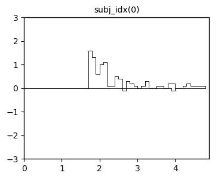

If we set ``show_model = True``, the ``hddm.plotting.model_plot()``
function will add a visualization of the ground truth model on top of
the histograms.

We will see later, that we can use this functionality to also add
posterior predictives, as well as model visualizations in accordance
with posterior samples.

CAUTION
~~~~~~~

This functionality is not yet implemented for all models, especially
models with more than 2 choice options.

Moreover, often useful for illustration purposes, we can include a bunch
of simulations trajectories into the model plot (note the corresponding
arguments). Common to all models currently included is their conceptual
reliance on there particle trajectories. Reaction times and choices are
simulated as *boundary crossings* of these particles. If you don’t want
to include these trajectories, just set ``show_trajectories = False``.

.. code:: ipython3

    # Model Plots (Only data)
    hddm.plotting.model_plot(dataset = data,
                           model_ground_truth = model,
                           show_trajectories = True,
                           n_trajectories = 10,
                           cols = 1,
                           show_model = True,
                           scale_x = 0.4,
                           scale_y = 0.4)

.. parsed-literal::

    <Figure size 640x480 with 0 Axes>

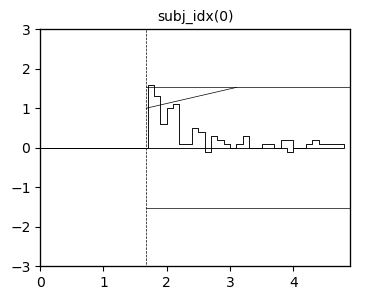

If you are interested, you can use this plot to investigate the behavior
of models across different parameters setups.

SECTION 2: SINGLE SUBJECT (OR COLLAPSED) DATA
'''''''''''''''''''''''''''''''''''''''''''''

Now, we try to fit these models to data! Let’s start with an simple
dataset. In other words, we have one single participant who provides
:math:`n` datatpoints (reaction times and choices) from some *two
alternative forced choice* task paradigm.

**Note**

In this demo we fit to simulated data. This serves as a template, and
you can easily adapt it to your needs.

.. code:: ipython3

    # Metadata
    nmcmc = 1500
    model = 'angle'
    n_samples = 1000
    includes = hddm.model_config.model_config[model]['hddm_include']

**Note**

When defining ``includes``, you can also pick only as subset of the
parameters suggested under ``hddm.model_config.model_config``.

.. code:: ipython3

    # Generate some simulatred data
    data, full_parameter_dict = hddm.simulators.hddm_dataset_generators.simulator_h_c(n_subjects = 1,
                                                                                      n_samples_by_subject = n_samples,
                                                                                      model = model,
                                                                                      p_outlier = 0.00,
                                                                                      conditions = None,
                                                                                      depends_on = None,
                                                                                      regression_models = None,
                                                                                      regression_covariates = None, # need this to make initial covariate matrix from which to use dmatrix (patsy)
                                                                                      group_only_regressors = False,
                                                                                      group_only = None,
                                                                                      fixed_at_default = None)

.. code:: ipython3

    data

.. raw:: html

    

    
    <table border="1" class="dataframe">
      <thead>
        <tr style="text-align: right;">
          <th></th>
          <th>rt</th>
          <th>response</th>
          <th>subj_idx</th>
          <th>v</th>
          <th>a</th>
          <th>z</th>
          <th>t</th>
          <th>theta</th>
        </tr>
      </thead>
      <tbody>
        <tr>
          <th>0</th>
          <td>3.006165</td>
          <td>0.0</td>
          <td>0</td>
          <td>0.831833</td>
          <td>1.799862</td>
          <td>0.493408</td>
          <td>0.767145</td>
          <td>0.51155</td>
        </tr>
        <tr>
          <th>1</th>
          <td>1.774136</td>
          <td>1.0</td>
          <td>0</td>
          <td>0.831833</td>
          <td>1.799862</td>
          <td>0.493408</td>
          <td>0.767145</td>
          <td>0.51155</td>
        </tr>
        <tr>
          <th>2</th>
          <td>2.386165</td>
          <td>1.0</td>
          <td>0</td>
          <td>0.831833</td>
          <td>1.799862</td>
          <td>0.493408</td>
          <td>0.767145</td>
          <td>0.51155</td>
        </tr>
        <tr>
          <th>3</th>
          <td>2.180155</td>
          <td>1.0</td>
          <td>0</td>
          <td>0.831833</td>
          <td>1.799862</td>
          <td>0.493408</td>
          <td>0.767145</td>
          <td>0.51155</td>
        </tr>
        <tr>
          <th>4</th>
          <td>1.371141</td>
          <td>1.0</td>
          <td>0</td>
          <td>0.831833</td>
          <td>1.799862</td>
          <td>0.493408</td>
          <td>0.767145</td>
          <td>0.51155</td>
        </tr>
        <tr>
          <th>...</th>
          <td>...</td>
          <td>...</td>
          <td>...</td>
          <td>...</td>
          <td>...</td>
          <td>...</td>
          <td>...</td>
          <td>...</td>
        </tr>
        <tr>
          <th>95</th>
          <td>1.693137</td>
          <td>1.0</td>
          <td>0</td>
          <td>0.831833</td>
          <td>1.799862</td>
          <td>0.493408</td>
          <td>0.767145</td>
          <td>0.51155</td>
        </tr>
        <tr>
          <th>96</th>
          <td>2.163154</td>
          <td>1.0</td>
          <td>0</td>
          <td>0.831833</td>
          <td>1.799862</td>
          <td>0.493408</td>
          <td>0.767145</td>
          <td>0.51155</td>
        </tr>
        <tr>
          <th>97</th>
          <td>2.013147</td>
          <td>1.0</td>
          <td>0</td>
          <td>0.831833</td>
          <td>1.799862</td>
          <td>0.493408</td>
          <td>0.767145</td>
          <td>0.51155</td>
        </tr>
        <tr>
          <th>98</th>
          <td>2.387165</td>
          <td>0.0</td>
          <td>0</td>
          <td>0.831833</td>
          <td>1.799862</td>
          <td>0.493408</td>
          <td>0.767145</td>
          <td>0.51155</td>
        </tr>
        <tr>
          <th>99</th>
          <td>2.139153</td>
          <td>1.0</td>
          <td>0</td>
          <td>0.831833</td>
          <td>1.799862</td>
          <td>0.493408</td>
          <td>0.767145</td>
          <td>0.51155</td>
        </tr>
      </tbody>
    </table>
    
100 rows × 8 columns

    

.. code:: ipython3

    # Define the HDDM model
    hddmnn_model = hddm.HDDMnn(data,
                               informative = False,
                               include = includes,
                               p_outlier = 0.01,
                               w_outlier = 0.1,
                               model = model,)

.. parsed-literal::

    Setting priors uninformative (LANs only work with uninformative priors for now)
    Includes supplied:  ['z', 'theta']

.. code:: ipython3

    # Sample
    hddmnn_model.sample(nmcmc,
                        burn = 500)

.. parsed-literal::

     [-----------------100%-----------------] 1500 of 1500 complete in 25.5 sec

.. parsed-literal::

    <pymc.MCMC.MCMC at 0x1462c50d0>

2.1 VISUALIZATION
-----------------

The ``caterpillar_plot()`` function below displays *parameterwise*,

-  as a red tick-mark the **ground truth**.
-  as a *thin* **black** line the :math:`1 - 99` percentile range of the
   posterior distribution
-  as a *thick* **black** line the :math:`5-95` percentile range of the
   posterior distribution

Again use the ``help()`` function to learn more.

.. code:: ipython3

    # Caterpillar Plot: (Parameters recovered ok?)
    hddm.plotting.caterpillar_plot(hddm_model = hddmnn_model,
                                 ground_truth_parameter_dict = full_parameter_dict,
                                 drop_sd = False,
                                 x_limits = [-3, 3])

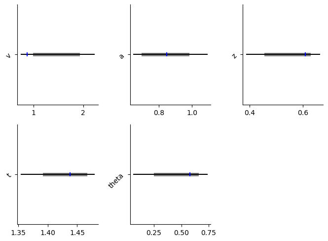

Posterior Predictive (via Model Plot)
~~~~~~~~~~~~~~~~~~~~~~~~~~~~~~~~~~~~~

Another way to examine whether or not our recovery was satisfactory is
to perform posterior predictive checks. Essentially, we are looking to
simulate datasets from the trace and check whether it aligns with the
ground truth participant data. This answers the question of whether or
not these parameters that you recovered can actually reproduce the data.
Note that the parameter ``n_posterior_parameters`` controls the number
of samples drawn from the trace.

.. code:: ipython3

    hddm.plotting.model_plot(hddm_model = hddmnn_model,
                             model_ground_truth = model,
                             n_posterior_parameters = 100,
                             scale_x = 0.5,
                             scale_y = 0.5,
                             ylimit = 3,
                             cols = 1,
                             legend_fontsize = 16)

.. parsed-literal::

    <Figure size 640x480 with 0 Axes>

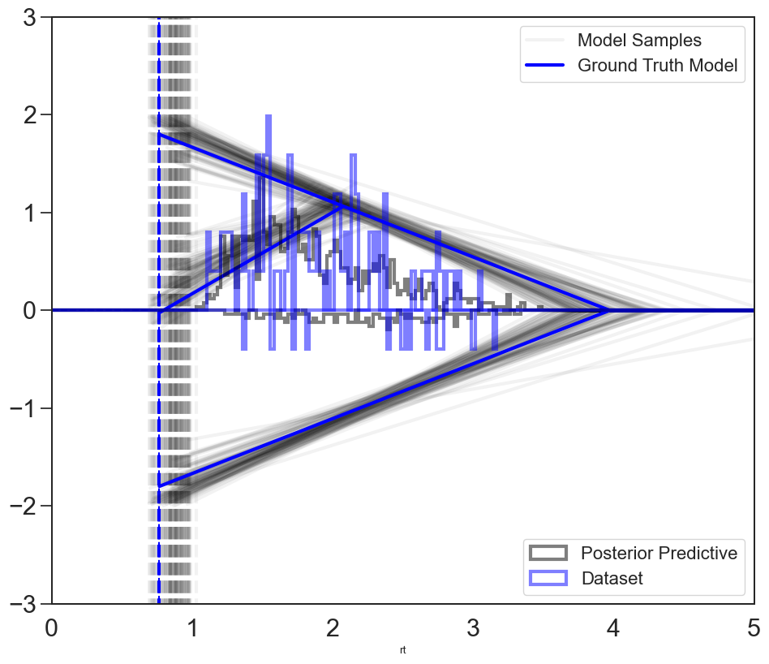

A small note on convergence
~~~~~~~~~~~~~~~~~~~~~~~~~~~

Note that the MCMC algorithm requires the chain to converge. There are
many heuristics that help you identifying problems with convergence,
such as the trace plot, auto correlation plot, and marginal posterior
histogram. In the trace plots, there might be a problem if you see large
jumps. In the autocorrelation plot, there might be a problem if it does
not drop rapidly. The ``HDDMnn()`` classes support the computation of
the *Gelman-Rubin*, *r-hat* statistic, as you would with any ``hddm``
model. Generally, by extracting the traces, you are free to compute any
convergence statistics you want of course.

.. code:: ipython3

    # TAKING A LOOK AT THE POSTERIOR TRACES
    hddmnn_model.plot_posteriors(hddm.simulators.model_config[model]['params'])
    plt.show()

.. parsed-literal::

    Plotting v
    Plotting a
    Plotting z
    Plotting t
    Plotting theta

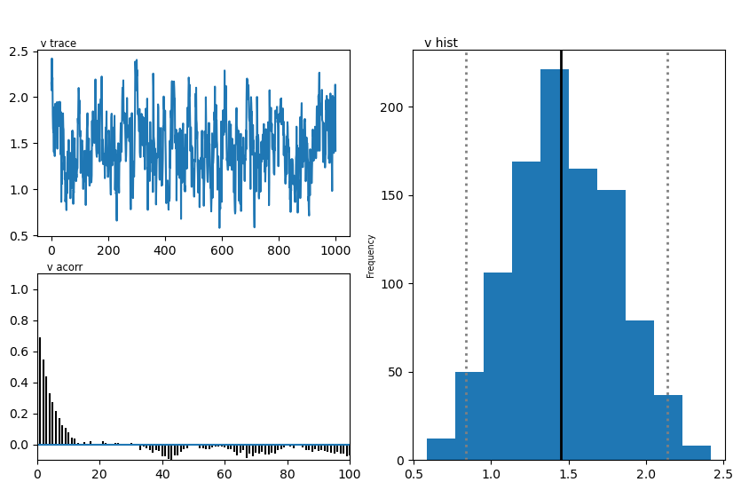

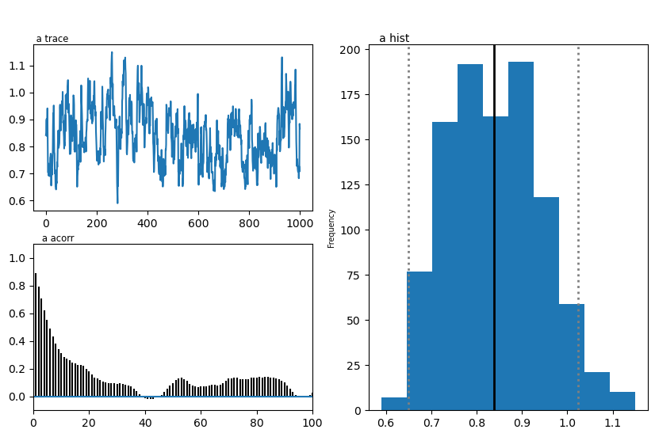

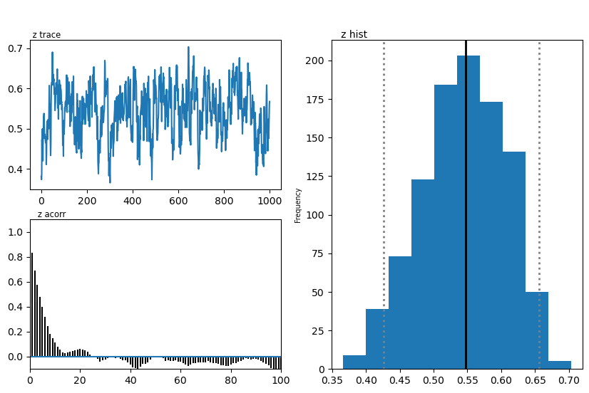

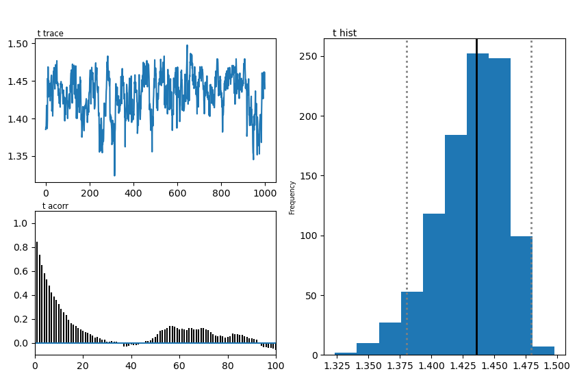

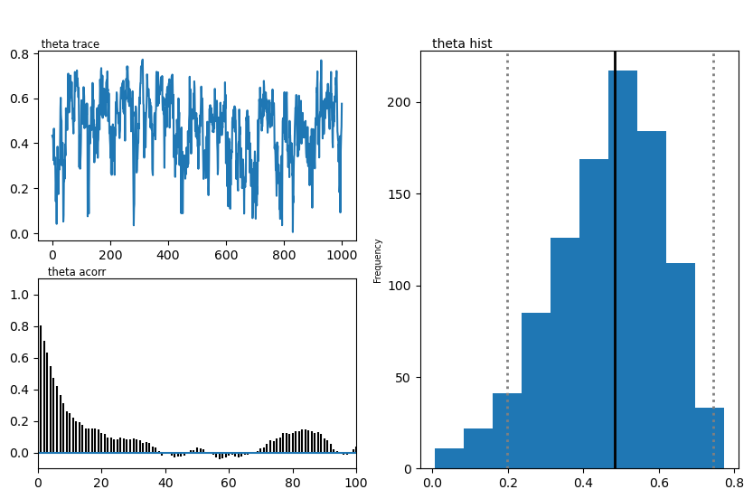

.. code:: ipython3

    hddm.plotting.posterior_pair_plot(hddm_model = hddmnn_model,
                                      model_ground_truth = model,
                                      axes_limits = 'samples',
                                      height = 2,
                                      aspect_ratio = 1,
                                      n_subsample = 100,
                                      )

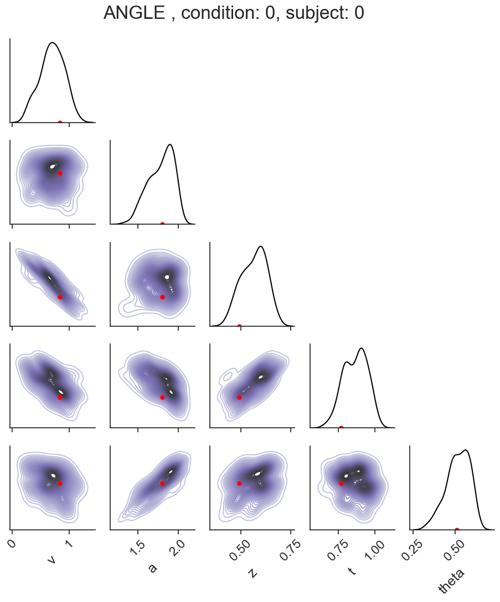

SECTION 3: HIERARCHICAL MODELS
''''''''''''''''''''''''''''''

The ‘h’ in ``hddm`` stands for hierarchical, so let’s do it! If we have
data from multiple participants and we assume that the parameters of
single participants are drawn from respective **group** or **global**
distributions, we can model this explicitly in ``hddm`` by specifying
``is_group_model = True``.

Implicitly we are fitting a model of the following kind,

.. math:: p(\{\theta_j\}, \{\theta_g\} | \mathbf{x}) \propto \left[ \prod_j^{J} \left[ \prod_i^{N_j} p(x_i^j | \theta_j) \right] p(\theta_j | \theta_g) \right] p( \theta_g | \theta_h )

where (let’s say for the **angle model**),

1. :math:`\theta_j = \{v_j, a_j, z_j, t_j, \theta_j \}`, are the model
   parameters for **subject j**.

2. :math:`\theta_g = \{v_g^{\mu}, a_g^{\mu}, z_g^{\mu}, t_g^{\mu}, \theta_g^{\mu}, v_g^{\sigma}, a_g^{\sigma}, z_g^{\sigma}, t_g^{\sigma}, \theta_g^{\sigma} \}`
   (scary, but for completeness), are the **mean** and **variance**
   parameters for our group level normal distributions, and
   :math:`\{ \theta_h \}` are **fixed hyperparameters**.

3. :math:`x_i^j = \{rt_i^j, c_i^j \}`, are the **choice and reaction
   time** of **subject j** during **trial i**.

In words, the right hand side of the equation tells us that we have a
**global parameter distribution** with certain **means** and
**variances** for each parameter (we want to figure these means and
variances out), from which the **subject level parameters** are drawn
and finally **subject level datapoints** follow the likelihood
distribution of our **ddm / angle / weibull / you name it** mdoels.

.. code:: ipython3

    # Metadata
    nmcmc = 1000
    model = 'angle'
    n_trials_per_subject = 200
    n_subjects = 10

.. code:: ipython3

    # test regressors only False
    # add p_outliers to the generator !
    data, full_parameter_dict = hddm.simulators.hddm_dataset_generators.simulator_h_c(data = None, 
                                                                                      n_subjects = n_subjects,
                                                                                      n_trials_per_subject = n_trials_per_subject,
                                                                                      model = model,
                                                                                      p_outlier = 0.00,
                                                                                      conditions = None, 
                                                                                      depends_on = None, 
                                                                                      regression_models = None,
                                                                                      regression_covariates = None,
                                                                                      group_only_regressors = False,
                                                                                      group_only = None,
                                                                                      fixed_at_default = None)

.. parsed-literal::

    new round of data simulation because parameter bounds where violated
    new round of data simulation because parameter bounds where violated

.. code:: ipython3

    hddmnn_model = hddm.HDDMnn(data,
                               model = model,
                               informative = False,
                               is_group_model = True,
                               include = hddm.simulators.model_config[model]['hddm_include'],
                               p_outlier = 0.0)

.. parsed-literal::

    Setting priors uninformative (LANs only work with uninformative priors for now)
    Includes supplied:  ['z', 'theta']

.. code:: ipython3

    hddmnn_model.sample(nmcmc,
                        burn = 100) # if you want to save the model specify extra arguments --> dbname='traces.db', db='pickle'. # hddmnn_model.save('test_model')

.. parsed-literal::

     [-----------------100%-----------------] 1000 of 1000 complete in 204.7 sec

.. parsed-literal::

    <pymc.MCMC.MCMC at 0x145074590>

.. code:: ipython3

    hddm.plotting.caterpillar_plot(hddm_model = hddmnn_model,
                                   ground_truth_parameter_dict = full_parameter_dict,
                                   drop_sd = False,
                                   tick_label_size_x = 14,
                                   tick_label_size_y = 10
                                  )

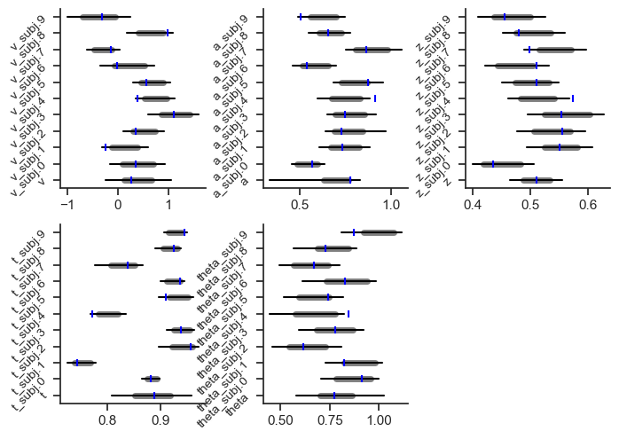

.. code:: ipython3

    hddm.plotting.model_plot(hddm_model = hddmnn_model,
                             model_ground_truth= model,
                             n_posterior_parameters = 100,
                             n_simulations_per_parameter = 10,
                             show_trajectories = True,
                             cols = 3,
                             show_model = True,
                             ylimit = 3,
                             max_t = 3,
                             scale_x = 1.0,
                             scale_y = 0.5,
                             legend_fontsize = 14,
                             )

.. parsed-literal::

    <Figure size 640x480 with 0 Axes>

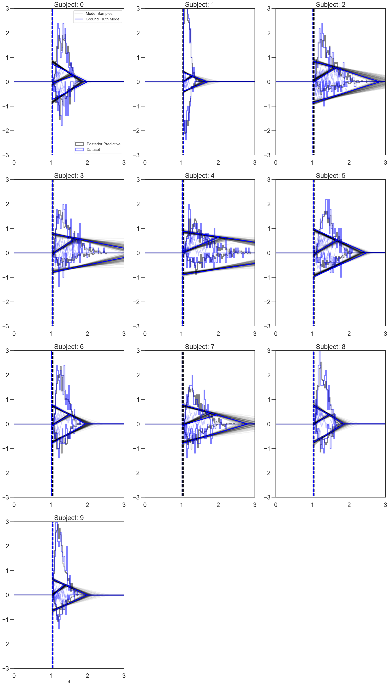

SECTION 4: PARAMETER VARIES BY CONDITION
''''''''''''''''''''''''''''''''''''''''

An important aspect of these posterior analysis, is the consideration of
experiment design. We may have an experiment in which subject are
exposed to a variety of conditions, such as for example different
degrees of difficulty of the same task

It is often reasonable to assume that all but the conceptually relevant
parameters are common across conditions.

As a by-product, such experiment designs can help us with the recovery
of the constant parameters, by probing those static aspects of the model
across varying kinds of datasets (driven by targeted manipulation of
variable aspects of the model).

Implicitly we fit the following kind of model,

.. math:: p( \{\theta_c \}, \theta | \mathbf{x} ) \propto  \left[ \prod_c^C  \left[ \prod_i^{N_i} p( x_i^c | \theta_c, \theta ) \right] p(\theta_c)  \right] p(\theta)

Where :math:`\theta_c` is the condition dependent part of the parameter
space, and :math:`\theta` forms the portion of parameters which remain
constant across condtions.

To give a more concrete example involving the **weibull model**,
consider a dataset for a single participant, who went through four
conditions of an experiment. Think of the conditions as manipulating the
payoff structure of the experiment to incentivize / disincentivize
accuracy in favor of speed. We operationalize this by treating the
:math:`a` parameter, the initial boundary separation, as affected by the
manipulation, while the rest of the parameters are constant across all
experiment conditions.

The resulting model would be of the form,

.. math::  p( {a_c}, v, z, t, \alpha, \beta | x ) \propto \left[ \prod_c^C  \left[ \prod_i^{N_c} p( x_i^c | a_c, v, z, t, \alpha, \beta)  \right] p(a_c) \right]  p(v, z, t, \alpha, \beta)

.. code:: ipython3

    # Metadata
    nmcmc = 1000
    model = 'angle'
    n_trials_per_subject = 500
    
    # We allow the boundary conditions to vary
    depends_on = {'a': ['c_one']}
    # They will depend on a fictious column 'c_one' that specifies
    # levels / conditions
    conditions = {'c_one': ['low', 'medium', 'high']}

.. code:: ipython3

    data, full_parameter_dict = hddm.simulators.hddm_dataset_generators.simulator_h_c(n_subjects = 1,
                                                                                      n_trials_per_subject = n_trials_per_subject,
                                                                                      model = model,
                                                                                      p_outlier = 0.00,
                                                                                      conditions = conditions,
                                                                                      depends_on = depends_on, 
                                                                                      regression_models = None,
                                                                                      regression_covariates = None,
                                                                                      group_only_regressors = False,
                                                                                      group_only = None,
                                                                                      fixed_at_default = None)

.. parsed-literal::

    depends_on is:  {'a': ['c_one']}

.. code:: ipython3

    # Let's check the resulting parameter vector
    full_parameter_dict

.. parsed-literal::

    {'t': 0.6817734595154115,
     'theta': 0.146645662081508,
     'z': 0.44192788466254684,
     'v': -1.9913588428255857,
     'a(high)': 0.5268907494201087,
     'a(low)': 0.5402240738914456,
     'a(medium)': 0.528512829260991}

.. code:: ipython3

    # Make HDDM Model 
    hddmnn_model = hddm.HDDMnn(data, 
                               model = model,
                               informative = False,
                               include = hddm.simulators.model_config[model]['hddm_include'],
                               p_outlier = 0.0,
                               is_group_model = False, 
                               depends_on = depends_on)

.. parsed-literal::

    Setting priors uninformative (LANs only work with uninformative priors for now)
    Includes supplied:  ['z', 'theta']

.. code:: ipython3

    # Sample
    hddmnn_model.sample(nmcmc, burn = 100)

.. parsed-literal::

     [-----------------100%-----------------] 1000 of 1000 complete in 74.0 sec

.. parsed-literal::

    <pymc.MCMC.MCMC at 0x1079b5d90>

.. code:: ipython3

    hddm.plotting.caterpillar_plot(hddm_model = hddmnn_model,
                                   ground_truth_parameter_dict = full_parameter_dict,
                                   drop_sd = False
                                  )

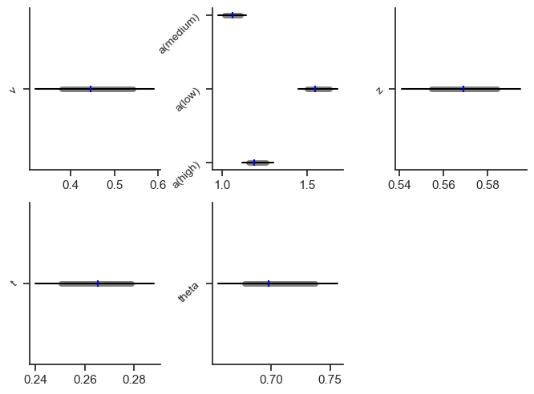

.. code:: ipython3

    hddm.plotting.model_plot(hddm_model = hddmnn_model,
                             model_ground_truth= model,
                             n_posterior_parameters = 100,
                             n_simulations_per_parameter = 10,
                             show_trajectories = False,
                             cols = 3,
                             show_model = True,
                             ylimit = 3,
                             max_t = 3,
                             scale_x = 1.0,
                             scale_y = 0.5,
                             legend_fontsize = 14)

.. parsed-literal::

    <Figure size 640x480 with 0 Axes>

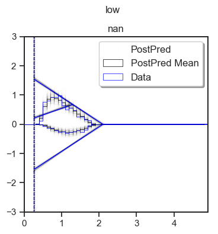

INTERMEZZO: We can of course combine Hierarchical and Condition data
--------------------------------------------------------------------

.. code:: ipython3

    # Metadata
    nmcmc = 1500
    model = 'angle'
    n_subjects = 5
    n_trials_per_subject = 500

.. code:: ipython3

    data, full_parameter_dict = hddm.simulators.hddm_dataset_generators.simulator_h_c(n_subjects = n_subjects,
                                                                                      n_trials_per_subject = n_trials_per_subject,
                                                                                      model = model,
                                                                                      p_outlier = 0.00,
                                                                                      conditions = {'c_one': ['low', 'medium', 'high']}, #, 'c_three': ['low', 'medium', 'high']},
                                                                                      depends_on = {'v': ['c_one']}, # 'theta': ['c_two']}, # 'theta': ['c_two']}, #regression_models = None, #
                                                                                      regression_models = None, #regression_covariates = None, 
                                                                                      regression_covariates = None, # need this to make initial covariate matrix from which to use dmatrix (patsy)
                                                                                      group_only_regressors = False,
                                                                                      group_only = None,
                                                                                      fixed_at_default = None)

.. parsed-literal::

    depends_on is:  {'v': ['c_one']}

.. code:: ipython3

    # Make HDDM Model 
    hddmnn_model = hddm.HDDMnn(data,
                               model = model,
                               informative = False,
                               include = hddm.simulators.model_config[model]['hddm_include'],
                               p_outlier = 0.0,
                               is_group_model = True,
                               depends_on = {'v': 'c_one'})

.. parsed-literal::

    Setting priors uninformative (LANs only work with uninformative priors for now)
    Includes supplied:  ['z', 'theta']

.. code:: ipython3

    hddmnn_model.sample(nmcmc, burn = 100)

.. parsed-literal::

     [-----------------100%-----------------] 1001 of 1000 complete in 945.9 sec

.. parsed-literal::

    <pymc.MCMC.MCMC at 0x10e5de550>

.. code:: ipython3

    hddm.plotting.caterpillar_plot(hddm_model = hddmnn_model,
                                   ground_truth_parameter_dict = full_parameter_dict,
                                   drop_sd = False,
                                   x_limits = (-3, 3))

.. image:: lan_tutorial_files/lan_tutorial_64_0.png

NOTE ON PLOTTING WITH THE MODEL PLOT
~~~~~~~~~~~~~~~~~~~~~~~~~~~~~~~~~~~~

You can now plot the resulting data in two ways, by changing the
``group_by`` argument to the model plot.

If you supply ``groupby = True``, you will get *one plot per condition*
which provides you with a group level posterior. This group level
posterior takes an average of single subject posteriors for the group.

If you set ``group_by=False``, you get a figure for each condition, with
subplots corresponding to single subjects.

.. code:: ipython3

    hddm.plotting.model_plot(hddm_model = hddmnn_model,
                             model_ground_truth= model,
                             grouped = False,
                             n_posterior_parameters = 100,
                             n_simulations_per_parameter = 10,
                             show_trajectories = False,
                             cols = 3,
                             show_model = True,
                             ylimit = 3,
                             max_t = 3,
                             scale_y = 0.5,
                             legend_fontsize = 14,
                             )

.. parsed-literal::

    <Figure size 640x480 with 0 Axes>

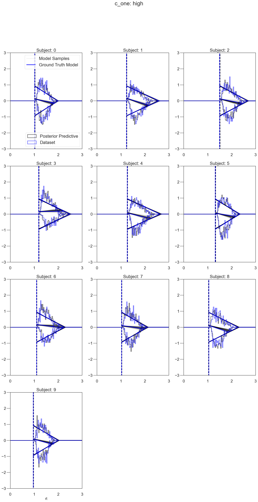

.. parsed-literal::

    <Figure size 640x480 with 0 Axes>

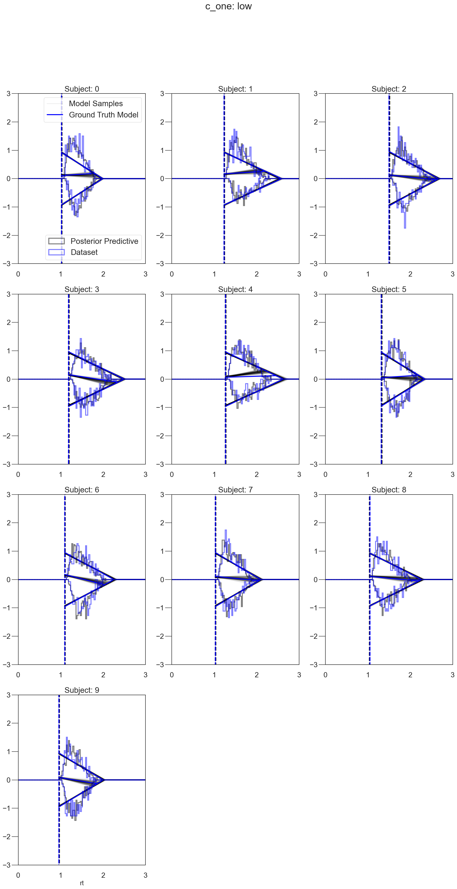

.. parsed-literal::

    <Figure size 640x480 with 0 Axes>

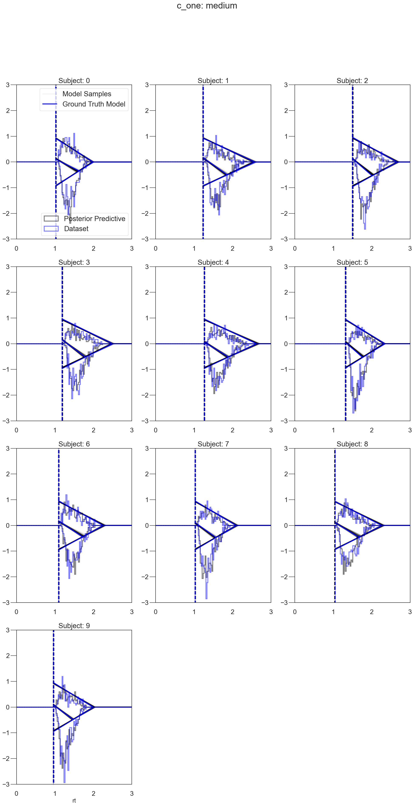

SECTION 5: REGRESSORS
'''''''''''''''''''''

This section provides a simple working example using the Neural Networks
with the Regression backend. The regression back-end allows linking
parameters to trial-by-trial covariates via a (general) linear model.

.. code:: ipython3

    # Metadata
    nmcmc = 1000
    model = 'angle'
    n_samples_by_subject = 500

.. code:: ipython3

    data, full_parameter_dict = hddm.simulators.hddm_dataset_generators.simulator_h_c(n_subjects = 3,
                                                                                      n_samples_by_subject = n_samples_by_subject,
                                                                                      model = model,
                                                                                      p_outlier = 0.00,
                                                                                      conditions = None, 
                                                                                      depends_on = None, 
                                                                                      regression_models = ['t ~ 1 + covariate_name', 'v ~ 1 + covariate_name'], 
                                                                                      regression_covariates = {'covariate_name': {'type': 'continuous', 'range': (0, 1)}},
                                                                                      group_only_regressors = False,
                                                                                      group_only = None,
                                                                                      fixed_at_default = None)

.. parsed-literal::

    new round of data simulation because parameter bounds where violated

.. code:: ipython3

    # Set up the regressor a regressor:
    reg_model_v = {'model': 'v ~ 1 + covariate_name', 'link_func': lambda x: x}
    reg_model_t = {'model': 't ~ 1 + covariate_name', 'link_func': lambda x: x}
    reg_descr = [reg_model_t, reg_model_v]

.. code:: ipython3

    # Make HDDM model
    hddmnn_reg = hddm.HDDMnnRegressor(data,
                                      reg_descr, 
                                      include = hddm.simulators.model_config[model]['hddm_include'],
                                      model = model,
                                      informative = False,
                                      p_outlier = 0.0)

.. parsed-literal::

    Setting priors uninformative (LANs only work with uninformative priors for now)
    Includes supplied:  ['z', 'theta']
    Reg Model:
    {'outcome': 't', 'model': ' 1 + covariate_name', 'params': ['t_Intercept', 't_covariate_name'], 'link_func': <function <lambda> at 0x1448bc710>}
    Uses Identity Link
    Reg Model:
    {'outcome': 'v', 'model': ' 1 + covariate_name', 'params': ['v_Intercept', 'v_covariate_name'], 'link_func': <function <lambda> at 0x1448bce60>}
    Uses Identity Link

.. code:: ipython3

    # Sample
    hddmnn_reg.sample(nmcmc, burn = 100)

.. parsed-literal::

    boundary violation of regressor part
     [-----------------100%-----------------] 1000 of 1000 complete in 281.9 sec

.. parsed-literal::

    <pymc.MCMC.MCMC at 0x1448a2190>

.. code:: ipython3

    hddm.plotting.caterpillar_plot(hddm_model = hddmnn_reg,
                                   ground_truth_parameter_dict = full_parameter_dict,
                                   drop_sd = False,
                                   x_limits = (-3, 3)
                                   )

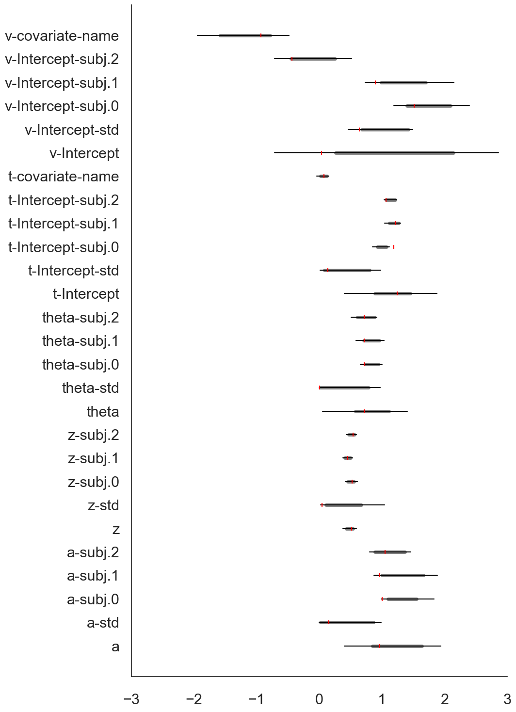

SECTION 6: STIM CODING
''''''''''''''''''''''

You can read more about **stimulus coding** in the
`documentation <https://hddm.readthedocs.io/en/latest/howto.html?highlight=stimulus%20coding#code-subject-responses>`__.

Here just an example.

.. code:: ipython3

    # Metadata
    nmcmc = 300
    model = 'ddm'
    n_samples_by_condition = 500
    split_param = 'v'

.. code:: ipython3

    sim_data_stimcoding, parameter_dict = hddm.simulators.simulator_stimcoding(model = model,
                                                                               split_by = split_param,
                                                                               drift_criterion = 0.3,
                                                                               n_samples_by_condition = 500)

.. code:: ipython3

    sim_data_stimcoding

.. raw:: html

    

    
    <table border="1" class="dataframe">
      <thead>
        <tr style="text-align: right;">
          <th></th>
          <th>rt</th>
          <th>response</th>
          <th>stim</th>
          <th>v</th>
          <th>a</th>
          <th>z</th>
          <th>t</th>
          <th>subj_idx</th>
        </tr>
      </thead>
      <tbody>
        <tr>
          <th>0</th>
          <td>5.652330</td>
          <td>0.0</td>
          <td>1</td>
          <td>-1.314013</td>
          <td>2.179732</td>
          <td>0.669262</td>
          <td>1.924418</td>
          <td>none</td>
        </tr>
        <tr>
          <th>1</th>
          <td>4.137441</td>
          <td>0.0</td>
          <td>1</td>
          <td>-1.314013</td>
          <td>2.179732</td>
          <td>0.669262</td>
          <td>1.924418</td>
          <td>none</td>
        </tr>
        <tr>
          <th>2</th>
          <td>3.885454</td>
          <td>0.0</td>
          <td>1</td>
          <td>-1.314013</td>
          <td>2.179732</td>
          <td>0.669262</td>
          <td>1.924418</td>
          <td>none</td>
        </tr>
        <tr>
          <th>3</th>
          <td>2.545414</td>
          <td>0.0</td>
          <td>1</td>
          <td>-1.314013</td>
          <td>2.179732</td>
          <td>0.669262</td>
          <td>1.924418</td>
          <td>none</td>
        </tr>
        <tr>
          <th>4</th>
          <td>2.820410</td>
          <td>0.0</td>
          <td>1</td>
          <td>-1.314013</td>
          <td>2.179732</td>
          <td>0.669262</td>
          <td>1.924418</td>
          <td>none</td>
        </tr>
        <tr>
          <th>...</th>
          <td>...</td>
          <td>...</td>
          <td>...</td>
          <td>...</td>
          <td>...</td>
          <td>...</td>
          <td>...</td>
          <td>...</td>
        </tr>
        <tr>
          <th>495</th>
          <td>2.589413</td>
          <td>1.0</td>
          <td>2</td>
          <td>1.914013</td>
          <td>2.179732</td>
          <td>0.669262</td>
          <td>1.924418</td>
          <td>none</td>
        </tr>
        <tr>
          <th>496</th>
          <td>2.982412</td>
          <td>1.0</td>
          <td>2</td>
          <td>1.914013</td>
          <td>2.179732</td>
          <td>0.669262</td>
          <td>1.924418</td>
          <td>none</td>
        </tr>
        <tr>
          <th>497</th>
          <td>2.856410</td>
          <td>1.0</td>
          <td>2</td>
          <td>1.914013</td>
          <td>2.179732</td>
          <td>0.669262</td>
          <td>1.924418</td>
          <td>none</td>
        </tr>
        <tr>
          <th>498</th>
          <td>2.633413</td>
          <td>1.0</td>
          <td>2</td>
          <td>1.914013</td>
          <td>2.179732</td>
          <td>0.669262</td>
          <td>1.924418</td>
          <td>none</td>
        </tr>
        <tr>
          <th>499</th>
          <td>2.366416</td>
          <td>1.0</td>
          <td>2</td>
          <td>1.914013</td>
          <td>2.179732</td>
          <td>0.669262</td>
          <td>1.924418</td>
          <td>none</td>
        </tr>
      </tbody>
    </table>
    
1000 rows × 8 columns

    

.. code:: ipython3

    parameter_dict

.. parsed-literal::

    {'v': 1.6140126698443504,
     'a': 2.1797323478366213,
     'z': 0.669262414376684,
     't': 1.924418483555181,
     'dc': 0.3}

.. code:: ipython3

    hddmnn_model = hddm.HDDMnnStimCoding(sim_data_stimcoding,
                                         include = hddm.simulators.model_config[model]['hddm_include'],
                                         model = model,
                                         stim_col = 'stim',
                                         p_outlier = 0.0,
                                         split_param = split_param,
                                         informative = False,
                                         drift_criterion = True)

.. parsed-literal::

    Setting priors uninformative (LANs only work with uninformative priors for now)
    Includes supplied:  ['z']

.. code:: ipython3

    hddmnn_model.sample(nmcmc, burn = 100)

.. parsed-literal::

     [-----------------100%-----------------] 300 of 300 complete in 14.8 sec

.. parsed-literal::

    <pymc.MCMC.MCMC at 0x144ea1590>

.. code:: ipython3

    hddmnn_model.gen_stats()

.. raw:: html

    

    
    <table border="1" class="dataframe">
      <thead>
        <tr style="text-align: right;">
          <th></th>
          <th>mean</th>
          <th>std</th>
          <th>2.5q</th>
          <th>25q</th>
          <th>50q</th>
          <th>75q</th>
          <th>97.5q</th>
          <th>mc err</th>
        </tr>
      </thead>
      <tbody>
        <tr>
          <th>v</th>
          <td>1.68431</td>
          <td>0.0509085</td>
          <td>1.58601</td>
          <td>1.65245</td>
          <td>1.68618</td>
          <td>1.71961</td>
          <td>1.79228</td>
          <td>0.00483229</td>
        </tr>
        <tr>
          <th>a</th>
          <td>2.29568</td>
          <td>0.0770001</td>
          <td>2.14422</td>
          <td>2.24712</td>
          <td>2.3006</td>
          <td>2.3515</td>
          <td>2.43424</td>
          <td>0.00743587</td>
        </tr>
        <tr>
          <th>z</th>
          <td>0.654377</td>
          <td>0.014122</td>
          <td>0.624026</td>
          <td>0.645505</td>
          <td>0.654532</td>
          <td>0.663257</td>
          <td>0.682383</td>
          <td>0.00135835</td>
        </tr>
        <tr>
          <th>t</th>
          <td>1.90255</td>
          <td>0.0209144</td>
          <td>1.85984</td>
          <td>1.88962</td>
          <td>1.90423</td>
          <td>1.9182</td>
          <td>1.94035</td>
          <td>0.00201974</td>
        </tr>
        <tr>
          <th>dc</th>
          <td>0.347919</td>
          <td>0.0572532</td>
          <td>0.236966</td>
          <td>0.306711</td>
          <td>0.35142</td>
          <td>0.384429</td>
          <td>0.454514</td>
          <td>0.00531654</td>
        </tr>
      </tbody>
    </table>
    

.. code:: ipython3

    hddm.plotting.caterpillar_plot(hddm_model = hddmnn_model,
                                 ground_truth_parameter_dict = parameter_dict,
                                 drop_sd = False,
                                 x_limits = [-3, 3])

.. image:: lan_tutorial_files/lan_tutorial_84_0.png

NOTE:
-----

The ``hddm.plotting.model_plot()`` does not yet accept *stimcoding*
data. This will be updated as soon as possible.

SECTION 7: MODEL RECOVERY
'''''''''''''''''''''''''

A crucial exercise in statistical modeling concern **model comparison**.

We are going to look at model recovery, in this section: Attempt to
recover which model generated a given dataset from a set of *candidate
models*.

For the little model recovery study we conduct here, we generate data
from the **weibull** model and fit the data once each to the
**weibull**, **angle** and **ddm** models.

We inspect the fits visually and then use the *DIC* (Deviance
information criterion, lower is better :)), to check if we can recover
the **true** model.

.. code:: ipython3

    # Metadata
    model = 'weibull_cdf'
    n_samples = 300

.. code:: ipython3

    # test regressors only False
    # add p_outliers to the generator !
    data, full_parameter_dict = hddm.simulators.hddm_dataset_generators.simulator_h_c(n_subjects = 1,
                                                                                      n_samples_by_subject = n_samples,
                                                                                      model = model,
                                                                                      p_outlier = 0.00,
                                                                                      conditions = None, #{'c_one': ['low', 'medium', 'high']}, #, 'c_three': ['low', 'medium', 'high']},
                                                                                      depends_on = None, #{'v': ['c_one']}, # 'theta': ['c_two']}, # 'theta': ['c_two']}, #regression_models = None, #
                                                                                      regression_models = None, #regression_covariates = None, 
                                                                                      regression_covariates = None, # need this to make initial covariate matrix from which to use dmatrix (patsy)
                                                                                      group_only_regressors = False,
                                                                                      group_only = None,
                                                                                      fixed_at_default = None)
                                                                                      #fixed_at_default = ['z'])

.. code:: ipython3

    data

.. raw:: html

    

    
    <table border="1" class="dataframe">
      <thead>
        <tr style="text-align: right;">
          <th></th>
          <th>rt</th>
          <th>response</th>
          <th>subj_idx</th>
          <th>v</th>
          <th>a</th>
          <th>z</th>
          <th>t</th>
          <th>alpha</th>
          <th>beta</th>
        </tr>
      </thead>
      <tbody>
        <tr>
          <th>0</th>
          <td>1.895880</td>
          <td>0.0</td>
          <td>0</td>
          <td>-0.187077</td>
          <td>1.464049</td>
          <td>0.414442</td>
          <td>0.726881</td>
          <td>2.204855</td>
          <td>3.188174</td>
        </tr>
        <tr>
          <th>1</th>
          <td>2.434905</td>
          <td>0.0</td>
          <td>0</td>
          <td>-0.187077</td>
          <td>1.464049</td>
          <td>0.414442</td>
          <td>0.726881</td>
          <td>2.204855</td>
          <td>3.188174</td>
        </tr>
        <tr>
          <th>2</th>
          <td>1.413876</td>
          <td>0.0</td>
          <td>0</td>
          <td>-0.187077</td>
          <td>1.464049</td>
          <td>0.414442</td>
          <td>0.726881</td>
          <td>2.204855</td>
          <td>3.188174</td>
        </tr>
        <tr>
          <th>3</th>
          <td>2.504908</td>
          <td>1.0</td>
          <td>0</td>
          <td>-0.187077</td>
          <td>1.464049</td>
          <td>0.414442</td>
          <td>0.726881</td>
          <td>2.204855</td>
          <td>3.188174</td>
        </tr>
        <tr>
          <th>4</th>
          <td>2.801913</td>
          <td>0.0</td>
          <td>0</td>
          <td>-0.187077</td>
          <td>1.464049</td>
          <td>0.414442</td>
          <td>0.726881</td>
          <td>2.204855</td>
          <td>3.188174</td>
        </tr>
        <tr>
          <th>...</th>
          <td>...</td>
          <td>...</td>
          <td>...</td>
          <td>...</td>
          <td>...</td>
          <td>...</td>
          <td>...</td>
          <td>...</td>
          <td>...</td>
        </tr>
        <tr>
          <th>95</th>
          <td>2.844910</td>
          <td>1.0</td>
          <td>0</td>
          <td>-0.187077</td>
          <td>1.464049</td>
          <td>0.414442</td>
          <td>0.726881</td>
          <td>2.204855</td>
          <td>3.188174</td>
        </tr>
        <tr>
          <th>96</th>
          <td>1.261878</td>
          <td>0.0</td>
          <td>0</td>
          <td>-0.187077</td>
          <td>1.464049</td>
          <td>0.414442</td>
          <td>0.726881</td>
          <td>2.204855</td>
          <td>3.188174</td>
        </tr>
        <tr>
          <th>97</th>
          <td>3.071893</td>
          <td>1.0</td>
          <td>0</td>
          <td>-0.187077</td>
          <td>1.464049</td>
          <td>0.414442</td>
          <td>0.726881</td>
          <td>2.204855</td>
          <td>3.188174</td>
        </tr>
        <tr>
          <th>98</th>
          <td>3.072893</td>
          <td>0.0</td>
          <td>0</td>
          <td>-0.187077</td>
          <td>1.464049</td>
          <td>0.414442</td>
          <td>0.726881</td>
          <td>2.204855</td>
          <td>3.188174</td>
        </tr>
        <tr>
          <th>99</th>
          <td>2.474907</td>
          <td>1.0</td>
          <td>0</td>
          <td>-0.187077</td>
          <td>1.464049</td>
          <td>0.414442</td>
          <td>0.726881</td>
          <td>2.204855</td>
          <td>3.188174</td>
        </tr>
      </tbody>
    </table>
    
100 rows × 9 columns

    

.. code:: ipython3

    # Now we fit for each model:
    hddmnn_model_weibull = hddm.HDDMnn(data, 
                                       informative = False,
                                       model = 'weibull',
                                       p_outlier = 0.0,
                                       include = hddm.simulators.model_config['weibull_cdf']['hddm_include'],
                                       is_group_model = False)
    
    hddmnn_model_angle = hddm.HDDMnn(data, 
                                     model = 'angle',
                                     informative = False,
                                     p_outlier = 0.0,
                                     include = hddm.simulators.model_config['angle']['hddm_include'],
                                     is_group_model = False)
    
    hddmnn_model_ddm = hddm.HDDMnn(data, 
                                   informative = False, 
                                   model = 'ddm',
                                   p_outlier = 0.0,
                                   include = hddm.simulators.model_config['ddm']['hddm_include'],
                                   is_group_model = False)

.. parsed-literal::

    Setting priors uninformative (LANs only work with uninformative priors for now)
    Includes supplied:  ['z', 'alpha', 'beta']
    Setting priors uninformative (LANs only work with uninformative priors for now)
    Includes supplied:  ['z', 'theta']
    Setting priors uninformative (LANs only work with uninformative priors for now)
    Includes supplied:  ['z']

.. code:: ipython3

    nmcmc = 1000
    hddmnn_model_weibull.sample(nmcmc, 
                                burn = 200)
    
    hddmnn_model_angle.sample(nmcmc, 
                              burn = 200)
    
    hddmnn_model_ddm.sample(nmcmc, 
                            burn = 200)

.. parsed-literal::

     [-----------------100%-----------------] 1000 of 1000 complete in 13.9 sec

.. parsed-literal::

    <pymc.MCMC.MCMC at 0x1448d1850>

7.1 CHECKING THE MODEL FITS VISUALLY
------------------------------------

Posterior Predictive: Do the ‘Posterior Models’ also make sense?

.. code:: ipython3

    # WEIBULL
    hddm.plotting.model_plot(hddm_model = hddmnn_model_weibull,
                           model_ground_truth = model,
                           n_posterior_parameters = 50,
                           cols = 1,
                           max_t = 5,
                           show_model = True,
                           scale_x = 0.4,
                           scale_y = 0.4,
                           legend_fontsize = 16
                           )

.. parsed-literal::

    <Figure size 640x480 with 0 Axes>

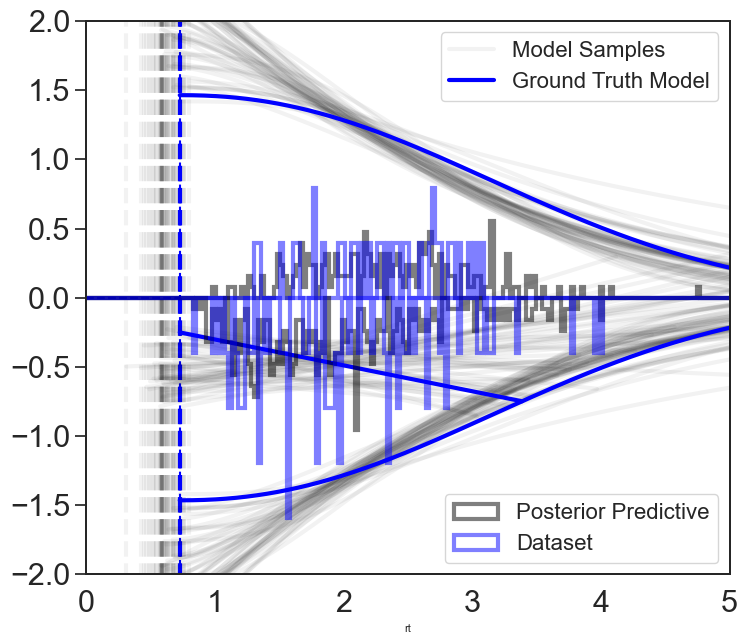

.. code:: ipython3

    # ANGLE
    hddm.plotting.model_plot(hddm_model = hddmnn_model_angle,
                           model_ground_truth = model,
                           n_posterior_parameters = 100,
                           cols = 1,
                           max_t = 5,
                           show_model = True,
                           scale_x = 0.4,
                           scale_y = 0.4,
                           legend_fontsize = 16
                           )

.. parsed-literal::

    <Figure size 640x480 with 0 Axes>

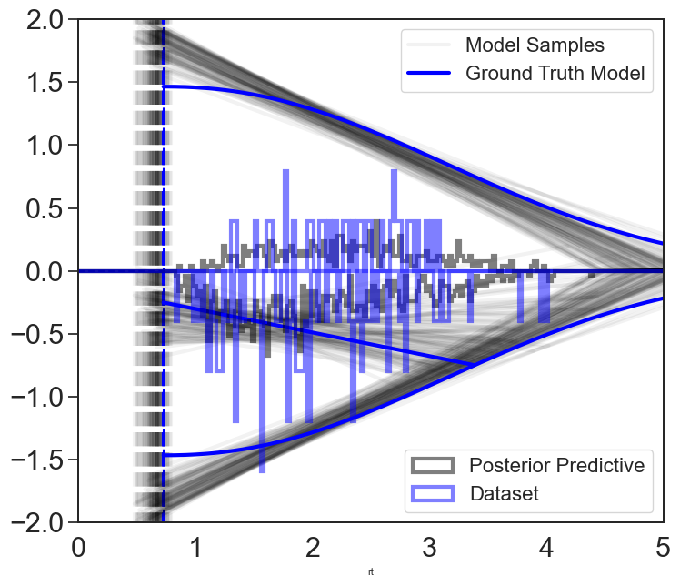

.. code:: ipython3

    # DDM
    hddm.plotting.model_plot(hddm_model = hddmnn_model_ddm, #ground_truth_parameters = sim_data_recov[2],
                           model_ground_truth = model,
                           n_posterior_parameters = 100,
                           cols = 1,
                           max_t = 5,
                           show_model = True,
                           scale_x = 0.4,
                           scale_y = 0.4,
                           legend_fontsize = 16
                           )

.. parsed-literal::

    <Figure size 640x480 with 0 Axes>

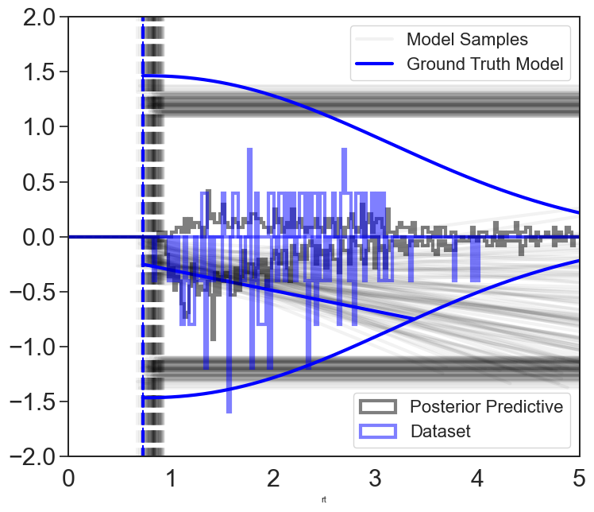

Let’s compare the DIC’s
~~~~~~~~~~~~~~~~~~~~~~~

.. code:: ipython3

    hddmnn_model_weibull.dic

.. parsed-literal::

    325.53708419799807

.. code:: ipython3

    hddmnn_model_angle.dic

.. parsed-literal::

    321.5858329772949

.. code:: ipython3

    hddmnn_model_ddm.dic

.. parsed-literal::

    359.50928085327143

**Fingers crossed** (this was a random run after all), the DIC usually
gives us a result that conforms with the intuition we get from looking
at the model plots.

SECTION 8: REAL DATA?
'''''''''''''''''''''

.. code:: ipython3

    # Metadata
    nmcmc = 1000
    burn = 500
    model = 'angle'

Load and Pre-process dataset
----------------------------

.. code:: ipython3

    # Load one of the datasets shipping with HDDM
    cav_data = hddm.load_csv(hddm.__path__[0] + '/examples/cavanagh_theta_nn.csv')

.. code:: ipython3

    cav_data

.. raw:: html

    

    
    <table border="1" class="dataframe">
      <thead>
        <tr style="text-align: right;">
          <th></th>
          <th>subj_idx</th>
          <th>stim</th>
          <th>rt</th>
          <th>response</th>
          <th>theta</th>
          <th>dbs</th>
          <th>conf</th>
        </tr>
      </thead>
      <tbody>
        <tr>
          <th>0</th>
          <td>0</td>
          <td>LL</td>
          <td>1.210</td>
          <td>1.0</td>
          <td>0.656275</td>
          <td>1</td>
          <td>HC</td>
        </tr>
        <tr>
          <th>1</th>
          <td>0</td>
          <td>WL</td>
          <td>1.630</td>
          <td>1.0</td>
          <td>-0.327889</td>
          <td>1</td>
          <td>LC</td>
        </tr>
        <tr>
          <th>2</th>
          <td>0</td>
          <td>WW</td>
          <td>1.030</td>
          <td>1.0</td>
          <td>-0.480285</td>
          <td>1</td>
          <td>HC</td>
        </tr>
        <tr>
          <th>3</th>
          <td>0</td>
          <td>WL</td>
          <td>2.770</td>
          <td>1.0</td>
          <td>1.927427</td>
          <td>1</td>
          <td>LC</td>
        </tr>
        <tr>
          <th>4</th>
          <td>0</td>
          <td>WW</td>
          <td>1.140</td>
          <td>0.0</td>
          <td>-0.213236</td>
          <td>1</td>
          <td>HC</td>
        </tr>
        <tr>
          <th>...</th>
          <td>...</td>
          <td>...</td>
          <td>...</td>
          <td>...</td>
          <td>...</td>
          <td>...</td>
          <td>...</td>
        </tr>
        <tr>
          <th>3983</th>
          <td>13</td>
          <td>LL</td>
          <td>1.450</td>
          <td>0.0</td>
          <td>-1.237166</td>
          <td>0</td>
          <td>HC</td>
        </tr>
        <tr>
          <th>3984</th>
          <td>13</td>
          <td>WL</td>
          <td>0.711</td>
          <td>1.0</td>
          <td>-0.377450</td>
          <td>0</td>
          <td>LC</td>
        </tr>
        <tr>
          <th>3985</th>
          <td>13</td>
          <td>WL</td>
          <td>0.784</td>
          <td>1.0</td>
          <td>-0.694194</td>
          <td>0</td>
          <td>LC</td>
        </tr>
        <tr>
          <th>3986</th>
          <td>13</td>
          <td>LL</td>
          <td>2.350</td>
          <td>0.0</td>
          <td>-0.546536</td>
          <td>0</td>
          <td>HC</td>
        </tr>
        <tr>
          <th>3987</th>
          <td>13</td>
          <td>WW</td>
          <td>1.250</td>
          <td>1.0</td>
          <td>0.752388</td>
          <td>0</td>
          <td>HC</td>
        </tr>
      </tbody>
    </table>
    
3988 rows × 7 columns

    

Basic Condition Split Model
---------------------------

.. code:: ipython3

    hddmnn_model_cav = hddm.HDDMnn(cav_data,
                                   model = model,
                                   informative = False,
                                   include = hddm.simulators.model_config[model]['hddm_include'],
                                   p_outlier = 0.05,
                                   is_group_model = False,
                                   depends_on = {'v': 'stim'})

.. parsed-literal::

    Setting priors uninformative (LANs only work with uninformative priors for now)
    Includes supplied:  ['z', 'theta']

.. code:: ipython3

    hddmnn_model_cav.sample(nmcmc, burn = burn)

.. parsed-literal::

     [-----------------100%-----------------] 1001 of 1000 complete in 155.0 sec

.. parsed-literal::

    <pymc.MCMC.MCMC at 0x14d608350>

.. code:: ipython3

    hddm.plotting.model_plot(hddm_model = hddmnn_model_cav,
                             model_ground_truth = None,
                             n_posterior_parameters = 50,
                             cols = 3,
                             max_t = 5,
                             scale_y = 0.2,
                             scale_x = 0.5,
                             show_model = True,
                             legend_fontsize = 14)

.. parsed-literal::

    <Figure size 640x480 with 0 Axes>

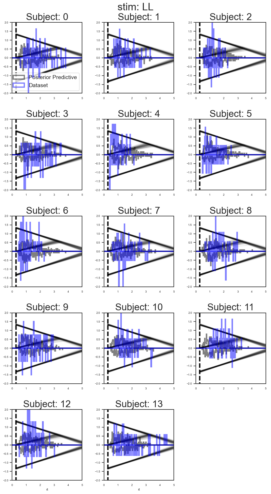

.. parsed-literal::

    <Figure size 640x480 with 0 Axes>

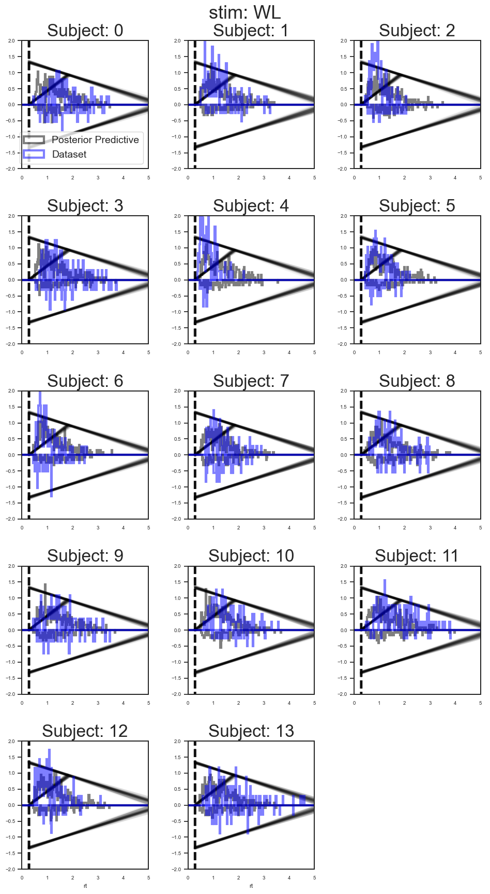

.. parsed-literal::

    <Figure size 640x480 with 0 Axes>

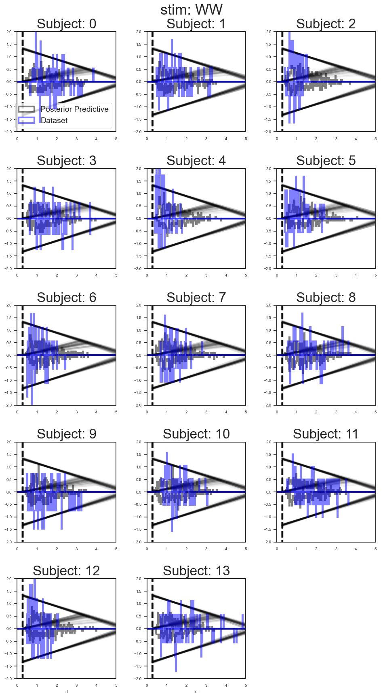

Basic Hierarchical Model
------------------------

.. code:: ipython3

    hddmnn_model_cav = hddm.HDDMnn(cav_data,
                                   model = model,
                                   informative = False,
                                   include = hddm.simulators.model_config[model]['hddm_include'], #is_group_model = True,
                                   p_outlier = 0.05)

.. parsed-literal::

    Setting priors uninformative (LANs only work with uninformative priors for now)
    Includes supplied:  ['z', 'theta']

.. code:: ipython3

    hddmnn_model_cav.sample(nmcmc, burn = burn)

.. parsed-literal::

     [-----------------100%-----------------] 1001 of 1000 complete in 402.0 sec

.. parsed-literal::

    <pymc.MCMC.MCMC at 0x14ce5db90>

.. code:: ipython3

    hddm.plotting.caterpillar_plot(hddm_model = hddmnn_model_cav,
                                   ground_truth_parameter_dict = None, #weibull_params.values[0],
                                   drop_sd = False)

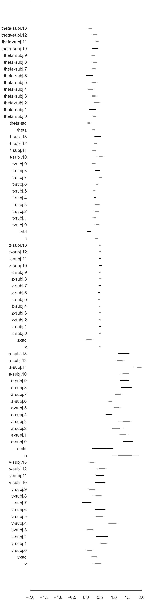

.. code:: ipython3

    hddm.plotting.model_plot(hddm_model = hddmnn_model_cav,
                             model_ground_truth = None,
                             n_posterior_parameters = 50,
                             cols = 3,
                             max_t = 5,
                             scale_y = 0.2,
                             scale_x = 0.5,
                             show_model = True,
                             legend_fontsize = 12)

.. parsed-literal::

    <Figure size 640x480 with 0 Axes>

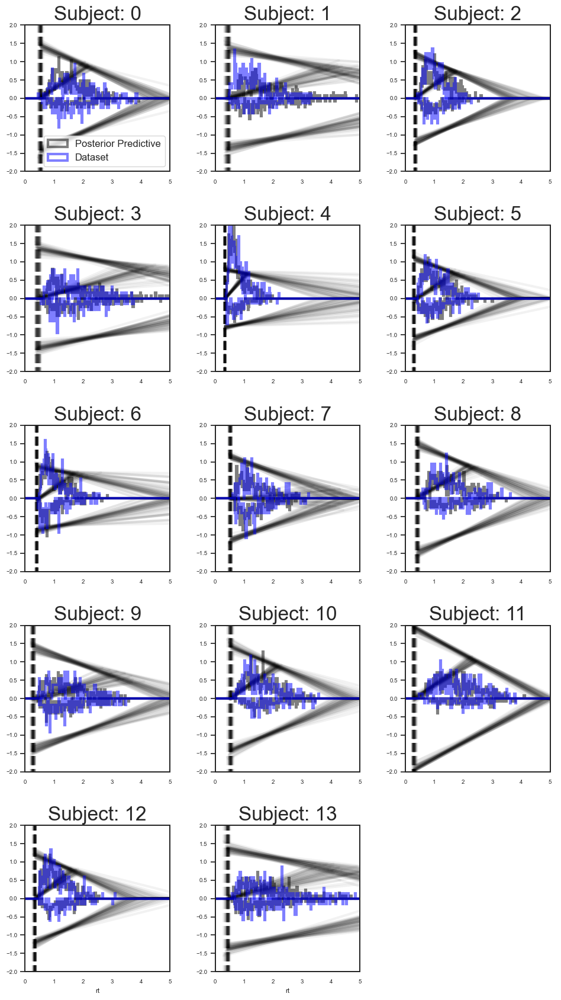

Note
~~~~

This is just an example. The angle model might not be the best choice
here, and we are moreover ignoring the supplied conditions.

9. ACCESSING THE NEURAL NETWORK DIRECTLY
''''''''''''''''''''''''''''''''''''''''

The ``network_inspectors`` module allows you to inspect the LANs
directly.

9.1 Direct access to batch predictions
--------------------------------------

You can use the ``hddm.network_inspectors.get_torch_mlp()`` function to
access network predictions.

.. code:: ipython3

    model = 'angle'

.. code:: ipython3

    lan_angle = hddm.network_inspectors.get_torch_mlp(model = model)

Let’s predict some likelihoods !

.. code:: ipython3

    # Make some random parameter set
    parameter_df = hddm.simulators.make_parameter_vectors_nn(model = model,
                                                             param_dict = None,
                                                             n_parameter_vectors = 1)
    parameter_matrix = np.tile(np.squeeze(parameter_df.values), (200, 1))
    
    # Initialize network input
    network_input = np.zeros((parameter_matrix.shape[0], parameter_matrix.shape[1] + 2)) # Note the + 2 on the right --> we append the parameter vectors with reaction times (+1 columns) and choices (+1 columns)
    
    # Add reaction times
    network_input[:, -2] = np.linspace(0, 3, parameter_matrix.shape[0])
    
    # Add choices
    network_input[:, -1] = np.repeat(np.random.choice([-1, 1]), parameter_matrix.shape[0])
    
    # Convert to float
    network_input = network_input.astype(np.float32)
    # Show example output
    print(lan_angle(network_input)[:10]) # printing the first 10 outputs
    print(lan_angle(network_input).shape) # original shape of output

.. parsed-literal::

    [[-6.5302606 ]
     [ 0.5264375 ]
     [ 0.410895  ]
     [-0.52280986]
     [-1.0521754 ]
     [-1.552991  ]
     [-2.0735168 ]
     [-2.6183672 ]
     [-3.2071779 ]
     [-3.878473  ]]
    (200, 1)

9.2 Plotting Utilities
----------------------

HDDM provides two plotting function to investigate the network outputs
directly. The ``kde_vs_lan_likelihoods()`` plot and the
``lan_manifold()`` plot.

9.2.1 ``kde_vs_lan_likelihoods()``
----------------------------------

The ``kde_vs_lan_likelihoods()`` plot allows you to check the
likelihoods produced by a LAN against Kernel Density Estimates (KDEs)
from model simulations. You can supply a panda ``DataFrame`` that holds
parameter vectors as rows.

.. code:: ipython3

    # Make some parameters
    parameter_df = hddm.simulators.make_parameter_vectors_nn(model = model,
                                                             param_dict = None,
                                                             n_parameter_vectors = 10)

.. code:: ipython3

    parameter_df

.. raw:: html

    

    
    <table border="1" class="dataframe">
      <thead>
        <tr style="text-align: right;">
          <th></th>
          <th>v</th>
          <th>a</th>
          <th>z</th>
          <th>t</th>
          <th>theta</th>
        </tr>
      </thead>
      <tbody>
        <tr>
          <th>0</th>
          <td>-2.822411</td>
          <td>1.857000</td>
          <td>0.597105</td>
          <td>1.265332</td>
          <td>1.127908</td>
        </tr>
        <tr>
          <th>1</th>
          <td>-2.480144</td>
          <td>0.790550</td>
          <td>0.370082</td>
          <td>0.135557</td>
          <td>1.267330</td>
        </tr>
        <tr>
          <th>2</th>
          <td>-1.805679</td>
          <td>1.067249</td>
          <td>0.789487</td>
          <td>1.343145</td>
          <td>0.782929</td>
        </tr>
        <tr>
          <th>3</th>
          <td>1.538892</td>
          <td>1.940111</td>
          <td>0.624851</td>
          <td>1.358304</td>
          <td>1.143875</td>
        </tr>
        <tr>
          <th>4</th>
          <td>1.154106</td>
          <td>0.693673</td>
          <td>0.201944</td>
          <td>0.964244</td>
          <td>1.218428</td>
        </tr>
        <tr>
          <th>5</th>
          <td>0.289881</td>
          <td>0.972925</td>
          <td>0.363896</td>
          <td>1.232385</td>
          <td>1.385627</td>
        </tr>
        <tr>
          <th>6</th>
          <td>-0.097920</td>
          <td>0.727295</td>
          <td>0.733222</td>
          <td>0.217358</td>
          <td>1.284991</td>
        </tr>
        <tr>
          <th>7</th>
          <td>1.530997</td>
          <td>0.322452</td>
          <td>0.492426</td>
          <td>0.539634</td>
          <td>0.167850</td>
        </tr>
        <tr>
          <th>8</th>
          <td>-2.425803</td>
          <td>1.765036</td>
          <td>0.670777</td>
          <td>0.356949</td>
          <td>0.947358</td>
        </tr>
        <tr>
          <th>9</th>
          <td>0.270504</td>
          <td>1.263645</td>
          <td>0.624119</td>
          <td>0.391290</td>
          <td>0.620432</td>
        </tr>
      </tbody>
    </table>
    

.. code:: ipython3

    hddm.network_inspectors.kde_vs_lan_likelihoods(parameter_df = parameter_df, 
                                                   model = model,
                                                   cols = 3,
                                                   n_samples = 2000,
                                                   n_reps = 2,
                                                   show = True)

.. parsed-literal::

    1 of 10
    2 of 10
    3 of 10
    4 of 10
    5 of 10
    6 of 10
    7 of 10
    8 of 10
    9 of 10
    10 of 10

.. image:: lan_tutorial_files/lan_tutorial_129_1.png

9.2.2 ``lan_manifold()``
------------------------

Lastly, you can use the ``lan_manifold()`` plot to investigate the LAN
likelihoods over a range of parameters.

The idea is to use a base parameter vector and vary one of the
parameters in a prespecificed range.

This plot can be informative if you would like to understand better how
a parameter affects model behavior.

.. code:: ipython3

    # Make some parameters
    parameter_df = hddm.simulators.make_parameter_vectors_nn(model = model,
                                                             param_dict = None,
                                                             n_parameter_vectors = 1)

.. code:: ipython3

    parameter_df

.. raw:: html

    

    
    <table border="1" class="dataframe">
      <thead>
        <tr style="text-align: right;">
          <th></th>
          <th>v</th>
          <th>a</th>
          <th>z</th>
          <th>t</th>
          <th>theta</th>
        </tr>
      </thead>
      <tbody>
        <tr>
          <th>0</th>
          <td>0.72663</td>
          <td>1.309131</td>
          <td>0.205633</td>
          <td>0.931494</td>
          <td>0.909723</td>
        </tr>
      </tbody>
    </table>
    

.. code:: ipython3

    # Now plotting
    hddm.network_inspectors.lan_manifold(parameter_df = parameter_df,
                                         vary_dict = {'v': np.linspace(-2, 2, 20)},
                                         model = model,
                                         n_rt_steps = 300,
                                         fig_scale = 1.0,
                                         max_rt = 5,
                                         save = True,
                                         show = True)

.. parsed-literal::

    Using only the first row of the supplied parameter array !

.. image:: lan_tutorial_files/lan_tutorial_134_1.png

END
'''

Hopefully this tutorial proves as a useful starting point for your
application.
