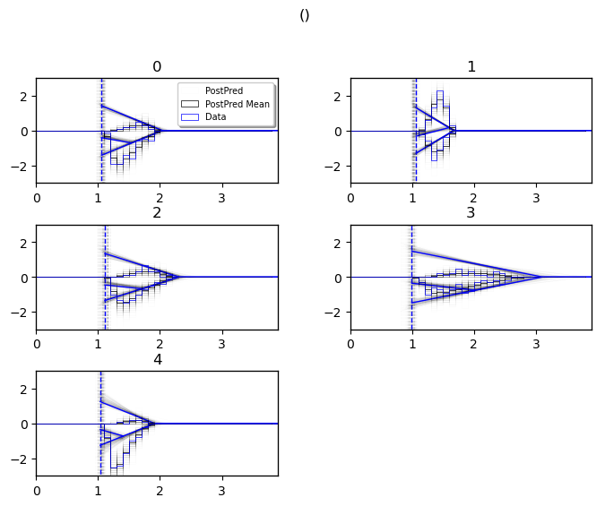
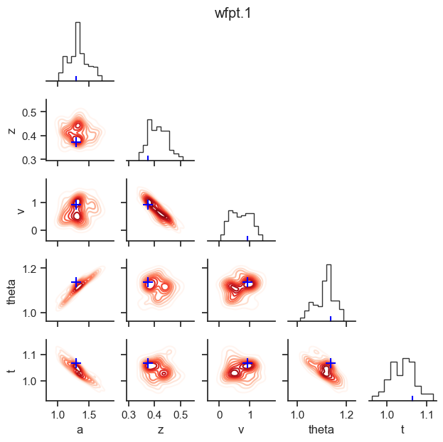
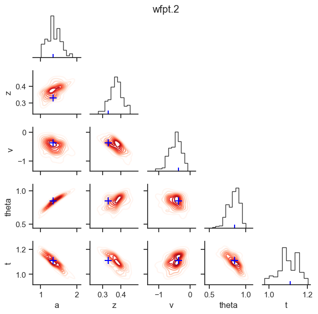
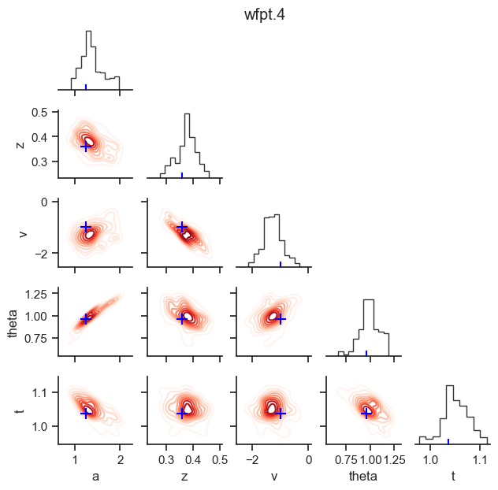

New Visualizations
------------------

.. code:: ipython3

    import hddm
    from matplotlib import pyplot as plt
    import numpy as np

Generate some Data
~~~~~~~~~~~~~~~~~~

.. code:: ipython3

    # Metadata
    nmcmc = 500
    model = 'angle'
    n_samples = 1000
    includes = hddm.simulators.model_config[model]['hddm_include']

.. code:: ipython3

    data, full_parameter_dict = hddm.simulators.hddm_dataset_generators.simulator_h_c(n_subjects = 5,
                                                                                      n_samples_by_subject = n_samples,
                                                                                      model = model,
                                                                                      p_outlier = 0.00,
                                                                                      conditions = None,
                                                                                      depends_on = None,
                                                                                      regression_models = None,
                                                                                      regression_covariates = None,
                                                                                      group_only_regressors = False,
                                                                                      group_only = None,
                                                                                      fixed_at_default = None)

.. code:: ipython3

    data

.. raw:: html

    

    
    <table border="1" class="dataframe">
      <thead>
        <tr style="text-align: right;">
          <th></th>
          <th>rt</th>
          <th>response</th>
          <th>subj_idx</th>
          <th>v</th>
          <th>a</th>
          <th>z</th>
          <th>t</th>
          <th>theta</th>
        </tr>
      </thead>
      <tbody>
        <tr>
          <th>0</th>
          <td>1.389325</td>
          <td>0.0</td>
          <td>0</td>
          <td>-0.614728</td>
          <td>1.419329</td>
          <td>0.354043</td>
          <td>1.057326</td>
          <td>0.965137</td>
        </tr>
        <tr>
          <th>1</th>
          <td>1.250326</td>
          <td>0.0</td>
          <td>0</td>
          <td>-0.614728</td>
          <td>1.419329</td>
          <td>0.354043</td>
          <td>1.057326</td>
          <td>0.965137</td>
        </tr>
        <tr>
          <th>2</th>
          <td>1.487324</td>
          <td>0.0</td>
          <td>0</td>
          <td>-0.614728</td>
          <td>1.419329</td>
          <td>0.354043</td>
          <td>1.057326</td>
          <td>0.965137</td>
        </tr>
        <tr>
          <th>3</th>
          <td>1.369326</td>
          <td>1.0</td>
          <td>0</td>
          <td>-0.614728</td>
          <td>1.419329</td>
          <td>0.354043</td>
          <td>1.057326</td>
          <td>0.965137</td>
        </tr>
        <tr>
          <th>4</th>
          <td>1.326326</td>
          <td>0.0</td>
          <td>0</td>
          <td>-0.614728</td>
          <td>1.419329</td>
          <td>0.354043</td>
          <td>1.057326</td>
          <td>0.965137</td>
        </tr>
        <tr>
          <th>...</th>
          <td>...</td>
          <td>...</td>
          <td>...</td>
          <td>...</td>
          <td>...</td>
          <td>...</td>
          <td>...</td>
          <td>...</td>
        </tr>
        <tr>
          <th>495</th>
          <td>1.393783</td>
          <td>0.0</td>
          <td>4</td>
          <td>-0.996139</td>
          <td>1.247421</td>
          <td>0.360008</td>
          <td>1.036784</td>
          <td>0.957094</td>
        </tr>
        <tr>
          <th>496</th>
          <td>1.277784</td>
          <td>0.0</td>
          <td>4</td>
          <td>-0.996139</td>
          <td>1.247421</td>
          <td>0.360008</td>
          <td>1.036784</td>
          <td>0.957094</td>
        </tr>
        <tr>
          <th>497</th>
          <td>1.249784</td>
          <td>0.0</td>
          <td>4</td>
          <td>-0.996139</td>
          <td>1.247421</td>
          <td>0.360008</td>
          <td>1.036784</td>
          <td>0.957094</td>
        </tr>
        <tr>
          <th>498</th>
          <td>1.447782</td>
          <td>0.0</td>
          <td>4</td>
          <td>-0.996139</td>
          <td>1.247421</td>
          <td>0.360008</td>
          <td>1.036784</td>
          <td>0.957094</td>
        </tr>
        <tr>
          <th>499</th>
          <td>1.614780</td>
          <td>1.0</td>
          <td>4</td>
          <td>-0.996139</td>
          <td>1.247421</td>
          <td>0.360008</td>
          <td>1.036784</td>
          <td>0.957094</td>
        </tr>
      </tbody>
    </table>
    
500 rows × 8 columns

    

.. code:: ipython3

    # Define the HDDM model
    hddmnn_model = hddm.HDDMnn(data,
                               informative = False,
                               include = includes,
                               p_outlier = 0.0,
                               w_outlier = 0.01,
                               model = model)

.. parsed-literal::

    Includes supplied:  ['z', 'theta']

.. code:: ipython3

    # Sample
    hddmnn_model.sample(nmcmc,
                        burn = 100)

.. parsed-literal::

     [-----------------100%-----------------] 500 of 500 complete in 57.7 sec

.. parsed-literal::

    <pymc.MCMC.MCMC at 0x1418ed590>

``caterpillar plot``
~~~~~~~~~~~~~~~~~~~~

The ``caterpillar_plot()`` function below displays *parameterwise*,

-  as a blue tick-mark the **ground truth**.
-  as a *thin* **black** line the :math:`1 - 99` percentile range of the
   posterior distribution
-  as a *thick* **black** line the :math:`5-95` percentile range of the
   posterior distribution

Again use the ``help()`` function to learn more.

.. code:: ipython3

    # Caterpillar Plot: (Parameters recovered ok?)
    hddm.plotting.caterpillar_plot(hddm_model = hddmnn_model,
                                   ground_truth_parameter_dict = full_parameter_dict,
                                   drop_sd = False,
                                   figsize = (8, 6))
    plt.show()

.. image:: lan_visualizations_files/lan_visualizations_10_0.png

``model cartoon plot``
~~~~~~~~~~~~~~~~~~~~~~

The **model plot** is useful to illustrate the behavior of a models
pictorially, including the uncertainty over model parameters embedded in
the posterior distribution.

This plot works only for **2-choice** models at this point.

Check out more of it’s capabilities with the ``help()`` function.

.. code:: ipython3

    hddm.plotting.plot_posterior_predictive(model = hddmnn_model,
                                            columns = 2, # groupby = ['subj_idx'],
                                            figsize = (8, 6),
                                            value_range = np.arange(0, 4, 0.1),
                                            plot_func = hddm.plotting._plot_func_model,
                                            parameter_recovery_mode = True,
                                            **{'alpha': 0.01,
                                            'ylim': 3,
                                            'add_model': True,
                                            'samples': 200,
                                            'legend_fontsize': 7})
    plt.show()

``posterior pair plot``
~~~~~~~~~~~~~~~~~~~~~~~

.. code:: ipython3

    hddm.plotting.plot_posterior_pair(hddmnn_model, save = False, 
                                      parameter_recovery_mode = True,
                                      samples = 200,
                                      figsize = (6, 6))

.. image:: lan_visualizations_files/lan_visualizations_15_0.png

.. image:: lan_visualizations_files/lan_visualizations_15_3.png

