New Visualizations
------------------

.. code:: ipython3

    import hddm
    from matplotlib import pyplot as plt
    import numpy as np
    from copy import deepcopy

Generate some Data
~~~~~~~~~~~~~~~~~~

.. code:: ipython3

    # Metadata
    nmcmc = 2000
    model = 'angle'
    n_samples = 1000
    includes = hddm.simulators.model_config[model]['hddm_include']

.. code:: ipython3

    data, full_parameter_dict = hddm.simulators.hddm_dataset_generators.simulator_h_c(n_subjects = 5,
                                                                                      n_trials_per_subject = n_samples,
                                                                                      model = model,
                                                                                      p_outlier = 0.00,
                                                                                      conditions = None,
                                                                                      depends_on = None,
                                                                                      regression_models = None,
                                                                                      regression_covariates = None,
                                                                                      group_only_regressors = False,
                                                                                      group_only = None,
                                                                                      fixed_at_default = None)

.. code:: ipython3

    data

.. raw:: html

    

    
    <table border="1" class="dataframe">
      <thead>
        <tr style="text-align: right;">
          <th></th>
          <th>rt</th>
          <th>response</th>
          <th>subj_idx</th>
          <th>v</th>
          <th>a</th>
          <th>z</th>
          <th>t</th>
          <th>theta</th>
        </tr>
      </thead>
      <tbody>
        <tr>
          <th>0</th>
          <td>1.590851</td>
          <td>0.0</td>
          <td>0</td>
          <td>-1.704336</td>
          <td>0.917225</td>
          <td>0.612362</td>
          <td>0.898857</td>
          <td>0.251476</td>
        </tr>
        <tr>
          <th>1</th>
          <td>1.784849</td>
          <td>0.0</td>
          <td>0</td>
          <td>-1.704336</td>
          <td>0.917225</td>
          <td>0.612362</td>
          <td>0.898857</td>
          <td>0.251476</td>
        </tr>
        <tr>
          <th>2</th>
          <td>1.927849</td>
          <td>0.0</td>
          <td>0</td>
          <td>-1.704336</td>
          <td>0.917225</td>
          <td>0.612362</td>
          <td>0.898857</td>
          <td>0.251476</td>
        </tr>
        <tr>
          <th>3</th>
          <td>1.390854</td>
          <td>0.0</td>
          <td>0</td>
          <td>-1.704336</td>
          <td>0.917225</td>
          <td>0.612362</td>
          <td>0.898857</td>
          <td>0.251476</td>
        </tr>
        <tr>
          <th>4</th>
          <td>1.839848</td>
          <td>0.0</td>
          <td>0</td>
          <td>-1.704336</td>
          <td>0.917225</td>
          <td>0.612362</td>
          <td>0.898857</td>
          <td>0.251476</td>
        </tr>
        <tr>
          <th>...</th>
          <td>...</td>
          <td>...</td>
          <td>...</td>
          <td>...</td>
          <td>...</td>
          <td>...</td>
          <td>...</td>
          <td>...</td>
        </tr>
        <tr>
          <th>4995</th>
          <td>1.441180</td>
          <td>0.0</td>
          <td>4</td>
          <td>-1.314454</td>
          <td>1.491856</td>
          <td>0.488526</td>
          <td>0.915183</td>
          <td>0.119143</td>
        </tr>
        <tr>
          <th>4996</th>
          <td>1.239182</td>
          <td>0.0</td>
          <td>4</td>
          <td>-1.314454</td>
          <td>1.491856</td>
          <td>0.488526</td>
          <td>0.915183</td>
          <td>0.119143</td>
        </tr>
        <tr>
          <th>4997</th>
          <td>1.708176</td>
          <td>0.0</td>
          <td>4</td>
          <td>-1.314454</td>
          <td>1.491856</td>
          <td>0.488526</td>
          <td>0.915183</td>
          <td>0.119143</td>
        </tr>
        <tr>
          <th>4998</th>
          <td>1.447180</td>
          <td>0.0</td>
          <td>4</td>
          <td>-1.314454</td>
          <td>1.491856</td>
          <td>0.488526</td>
          <td>0.915183</td>
          <td>0.119143</td>
        </tr>
        <tr>
          <th>4999</th>
          <td>1.729176</td>
          <td>0.0</td>
          <td>4</td>
          <td>-1.314454</td>
          <td>1.491856</td>
          <td>0.488526</td>
          <td>0.915183</td>
          <td>0.119143</td>
        </tr>
      </tbody>
    </table>
    
5000 rows × 8 columns

    

.. code:: ipython3

    # Define the HDDM model
    hddmnn_model = hddm.HDDMnn(data,
                               informative = False,
                               include = includes,
                               p_outlier = 0.0,
                               model = model)

.. code:: ipython3

    # Sample
    hddmnn_model.sample(nmcmc,
                        burn = 100)

.. parsed-literal::

     [-----------------100%-----------------] 2000 of 2000 complete in 450.8 sec

.. parsed-literal::

    <pymc.MCMC.MCMC at 0x14342cdd0>

.. code:: ipython3

    hddm.plotting.plot_posterior_predictive(model = hddmnn_model,
                                            columns = 2, # groupby = ['subj_idx'],
                                            figsize = (12, 8),
                                            value_range = np.arange(0, 3, 0.1),
                                            plot_func = hddm.plotting._plot_func_model,
                                            parameter_recovery_mode = True,
                                            **{'add_legend': False,
                                               'alpha': 0.01,
                                               'ylim': 6.0,
                                               'bin_size': 0.025,
                                               'add_posterior_mean_model': True,
                                               'add_posterior_mean_rts': True,
                                               'add_posterior_uncertainty_model': True,
                                               'add_posterior_uncertainty_rts': False,
                                               'samples': 200,
                                               'legend_fontsize': 7,
                                               'legend_loc': 'upper left',
                                               'linewidth_histogram': 1.0,
                                               'subplots_adjust': {'top': 0.9, 'hspace': 0.35, 'wspace': 0.3}})

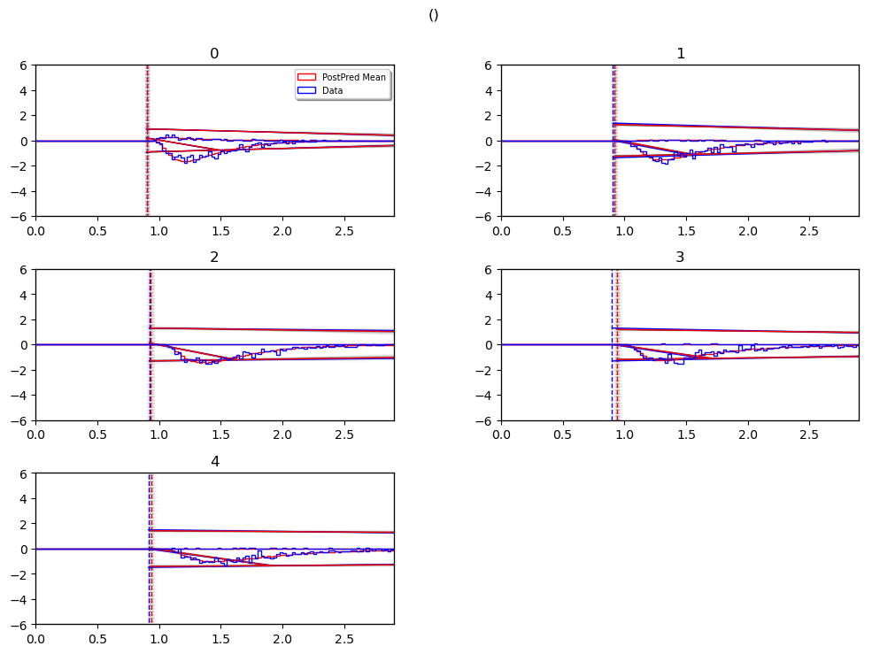

``caterpillar plot``
~~~~~~~~~~~~~~~~~~~~

The ``caterpillar_plot()`` function below displays *parameterwise*,

-  as a blue tick-mark the **ground truth**.
-  as a *thin* **black** line the :math:`1 - 99` percentile range of the
   posterior distribution
-  as a *thick* **black** line the :math:`5-95` percentile range of the
   posterior distribution

Again use the ``help()`` function to learn more.

.. code:: ipython3

    # Caterpillar Plot: (Parameters recovered ok?)
    hddm.plotting.plot_caterpillar(hddm_model = hddmnn_model,
                                   ground_truth_parameter_dict = full_parameter_dict,
                                   drop_sd = False,
                                   figsize = (8, 6))

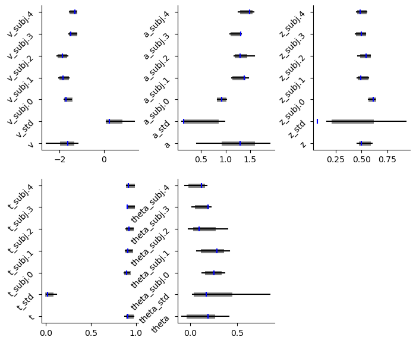

``posterior predictive`` (standard)
~~~~~~~~~~~~~~~~~~~~~~~~~~~~~~~~~~~

We have two versions of the *standard posterior predictive plots*. Both
are called via the ``plot_posterior_predictive`` function, however you
pick the ``plot_func`` argument accordingly.

If you pick ``hddm.plotting.plot_func_posterior_pdf_node_nn``, the
resulting plot uses likelihood *pdf* evaluations to show you the
posterior predictive including uncertainty.

If you pick ``hddm.plotting.plot_func_posterior_pdf_node_from_sim``, the
posterior predictives instead derive from actual simulation runs from
the model.

Both function have a number of options to customize styling.

Below we illustrate:

``_plot_func_posterior_pdf_node_nn``
^^^^^^^^^^^^^^^^^^^^^^^^^^^^^^^^^^^^

.. code:: ipython3

    hddm.plotting.plot_posterior_predictive(model = hddmnn_model,
                                            columns = 2, # groupby = ['subj_idx'],
                                            figsize = (8, 6),
                                            value_range = np.arange(-4, 4, 0.01),
                                            plot_func = hddm.plotting._plot_func_posterior_pdf_node_nn,
                                            parameter_recovery_mode = True,
                                            **{'alpha': 0.01,
                                               'ylim': 3,
                                               'bin_size': 0.05,
                                               'add_posterior_mean_rts': True,
                                               'add_posterior_uncertainty_rts': True,
                                               'samples': 200,
                                               'legend_fontsize': 7,
                                               'subplots_adjust': {'top': 0.9, 'hspace': 0.3, 'wspace': 0.3}})
    plt.show()

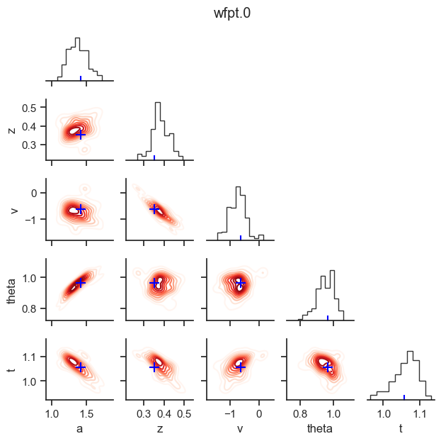

``_plot_func_posterior_node_from_sim``
^^^^^^^^^^^^^^^^^^^^^^^^^^^^^^^^^^^^^^

.. code:: ipython3

    hddm.plotting.plot_posterior_predictive(model = hddmnn_model,
                                            columns = 2, # groupby = ['subj_idx'],
                                            figsize = (8, 6),
                                            value_range = np.arange(-6, 6, 0.02),
                                            plot_func = hddm.plotting._plot_func_posterior_node_from_sim,
                                            parameter_recovery_mode = True,
                                            **{'alpha': 0.01,
                                               'ylim': 3,
                                               'bin_size': 0.1,
                                               'add_posterior_mean_rts': True,
                                               'add_posterior_uncertainty_rts': False,
                                               'samples': 200,
                                               'legend_fontsize': 7,
                                               'subplots_adjust': {'top': 0.9, 'hspace': 0.3, 'wspace': 0.3}})

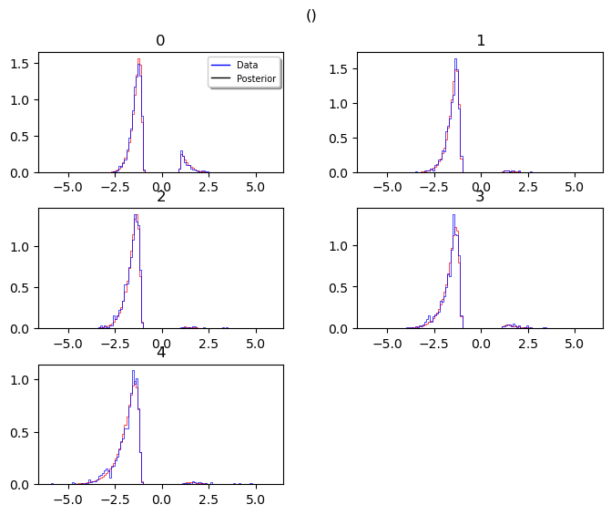

``posterior predictive`` (model cartoon)
~~~~~~~~~~~~~~~~~~~~~~~~~~~~~~~~~~~~~~~~

The **model plot** is useful to illustrate the behavior of a models
pictorially, including the uncertainty over model parameters embedded in
the posterior distribution.

This plot works only for **2-choice** models at this point.

Check out more of it’s capabilities with the ``help()`` function.

.. code:: ipython3

    hddm.plotting.plot_posterior_predictive(model = hddmnn_model,
                                            columns = 2, # groupby = ['subj_idx'],
                                            figsize = (8, 6),
                                            value_range = np.arange(0, 4, 0.1),
                                            plot_func = hddm.plotting._plot_func_model,
                                            parameter_recovery_mode = True,
                                            **{'alpha': 0.01,
                                               'ylim': 3,
                                               'add_posterior_mean_model': True,
                                               'add_posterior_mean_rts': True,
                                               'add_posterior_uncertainty_model': True,
                                               'add_posterior_uncertainty_rts': True,
                                               'samples': 200,
                                               'legend_fontsize': 7,
                                               'subplots_adjust': {'top': 0.9, 'hspace': 0.3, 'wspace': 0.3}})
    plt.show()

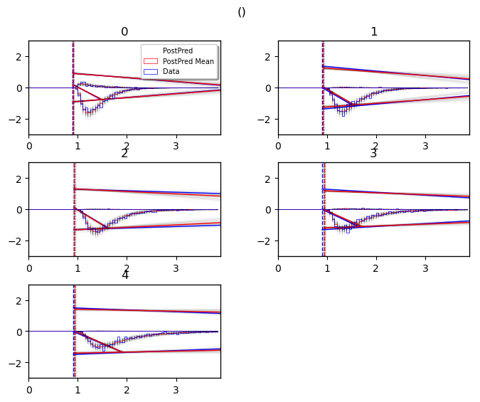

``posterior pair plot``
~~~~~~~~~~~~~~~~~~~~~~~

.. code:: ipython3

    hddm.plotting.plot_posterior_pair(hddmnn_model, save = False, 
                                      parameter_recovery_mode = True,
                                      samples = 200,
                                      figsize = (6, 6))

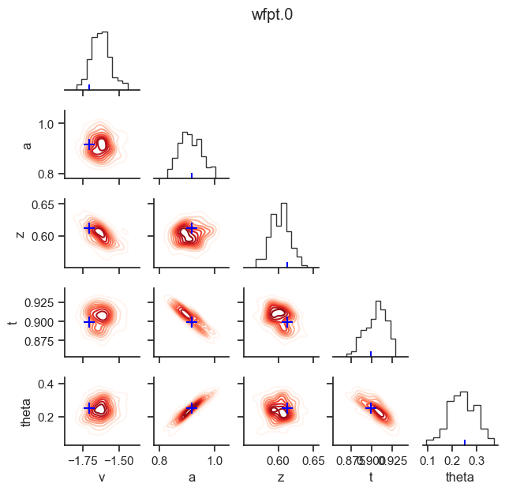

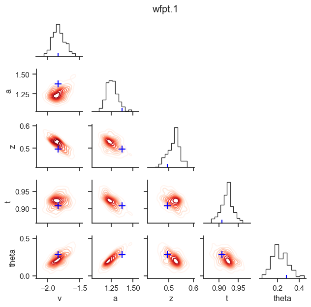

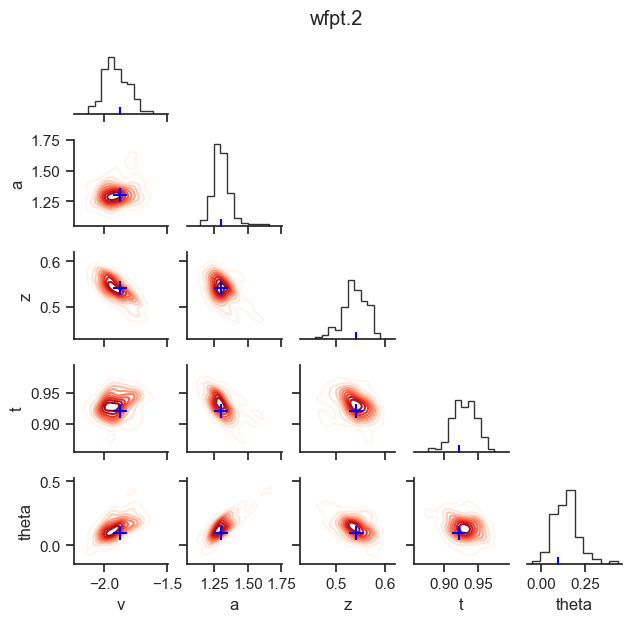

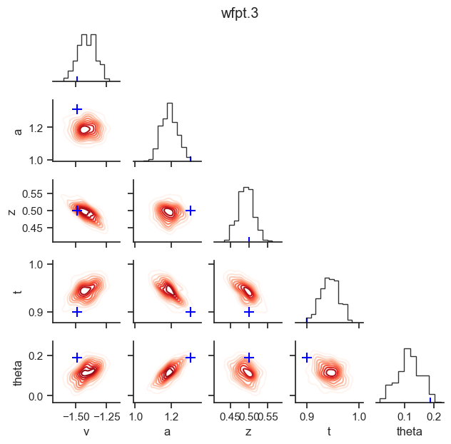

.. image:: lan_visualizations_files/lan_visualizations_22_4.png

NEW (v0.9.3): Plots for :math:`n>2` choice models
~~~~~~~~~~~~~~~~~~~~~~~~~~~~~~~~~~~~~~~~~~~~~~~~~

.. code:: ipython3

    # Metadata
    nmcmc = 1000
    model = 'race_no_bias_angle_4'
    n_samples = 1000
    includes = deepcopy(hddm.simulators.model_config[model]['hddm_include'])
    includes.remove('z')

.. code:: ipython3

    data, full_parameter_dict = hddm.simulators.hddm_dataset_generators.simulator_h_c(n_subjects = 5,
                                                                                      n_trials_per_subject = n_samples,
                                                                                      model = model,
                                                                                      p_outlier = 0.00,
                                                                                      conditions = None,
                                                                                      depends_on = None,
                                                                                      regression_models = None,
                                                                                      regression_covariates = None,
                                                                                      group_only_regressors = False,
                                                                                      group_only = None,
                                                                                      fixed_at_default = ['z'])

.. code:: ipython3

    data

.. raw:: html

    

    
    <table border="1" class="dataframe">
      <thead>
        <tr style="text-align: right;">
          <th></th>
          <th>rt</th>
          <th>response</th>
          <th>subj_idx</th>
          <th>v0</th>
          <th>v1</th>
          <th>v2</th>
          <th>v3</th>
          <th>a</th>
          <th>z</th>
          <th>t</th>
          <th>theta</th>
        </tr>
      </thead>
      <tbody>
        <tr>
          <th>0</th>
          <td>1.723548</td>
          <td>1.0</td>
          <td>0</td>
          <td>0.973732</td>
          <td>2.066200</td>
          <td>0.541262</td>
          <td>1.266078</td>
          <td>1.988639</td>
          <td>0.5</td>
          <td>1.559548</td>
          <td>0.656266</td>
        </tr>
        <tr>
          <th>1</th>
          <td>1.784549</td>
          <td>2.0</td>
          <td>0</td>
          <td>0.973732</td>
          <td>2.066200</td>
          <td>0.541262</td>
          <td>1.266078</td>
          <td>1.988639</td>
          <td>0.5</td>
          <td>1.559548</td>
          <td>0.656266</td>
        </tr>
        <tr>
          <th>2</th>
          <td>2.076545</td>
          <td>3.0</td>
          <td>0</td>
          <td>0.973732</td>
          <td>2.066200</td>
          <td>0.541262</td>
          <td>1.266078</td>
          <td>1.988639</td>
          <td>0.5</td>
          <td>1.559548</td>
          <td>0.656266</td>
        </tr>
        <tr>
          <th>3</th>
          <td>1.811549</td>
          <td>3.0</td>
          <td>0</td>
          <td>0.973732</td>
          <td>2.066200</td>
          <td>0.541262</td>
          <td>1.266078</td>
          <td>1.988639</td>
          <td>0.5</td>
          <td>1.559548</td>
          <td>0.656266</td>
        </tr>
        <tr>
          <th>4</th>
          <td>1.748549</td>
          <td>3.0</td>
          <td>0</td>
          <td>0.973732</td>
          <td>2.066200</td>
          <td>0.541262</td>
          <td>1.266078</td>
          <td>1.988639</td>
          <td>0.5</td>
          <td>1.559548</td>
          <td>0.656266</td>
        </tr>
        <tr>
          <th>...</th>
          <td>...</td>
          <td>...</td>
          <td>...</td>
          <td>...</td>
          <td>...</td>
          <td>...</td>
          <td>...</td>
          <td>...</td>
          <td>...</td>
          <td>...</td>
          <td>...</td>
        </tr>
        <tr>
          <th>4995</th>
          <td>1.931315</td>
          <td>1.0</td>
          <td>4</td>
          <td>0.622314</td>
          <td>1.956002</td>
          <td>0.706355</td>
          <td>1.264215</td>
          <td>2.106691</td>
          <td>0.5</td>
          <td>1.569316</td>
          <td>0.661371</td>
        </tr>
        <tr>
          <th>4996</th>
          <td>1.851316</td>
          <td>1.0</td>
          <td>4</td>
          <td>0.622314</td>
          <td>1.956002</td>
          <td>0.706355</td>
          <td>1.264215</td>
          <td>2.106691</td>
          <td>0.5</td>
          <td>1.569316</td>
          <td>0.661371</td>
        </tr>
        <tr>
          <th>4997</th>
          <td>1.910315</td>
          <td>3.0</td>
          <td>4</td>
          <td>0.622314</td>
          <td>1.956002</td>
          <td>0.706355</td>
          <td>1.264215</td>
          <td>2.106691</td>
          <td>0.5</td>
          <td>1.569316</td>
          <td>0.661371</td>
        </tr>
        <tr>
          <th>4998</th>
          <td>1.751316</td>
          <td>1.0</td>
          <td>4</td>
          <td>0.622314</td>
          <td>1.956002</td>
          <td>0.706355</td>
          <td>1.264215</td>
          <td>2.106691</td>
          <td>0.5</td>
          <td>1.569316</td>
          <td>0.661371</td>
        </tr>
        <tr>
          <th>4999</th>
          <td>1.908315</td>
          <td>0.0</td>
          <td>4</td>
          <td>0.622314</td>
          <td>1.956002</td>
          <td>0.706355</td>
          <td>1.264215</td>
          <td>2.106691</td>
          <td>0.5</td>
          <td>1.569316</td>
          <td>0.661371</td>
        </tr>
      </tbody>
    </table>
    
5000 rows × 11 columns

    

.. code:: ipython3

    # Define the HDDM model
    hddmnn_model = hddm.HDDMnn(data,
                               informative = False,
                               include = includes,
                               p_outlier = 0.0,
                               model = model)

.. code:: ipython3

    # Sample
    hddmnn_model.sample(nmcmc,
                        burn = 100)

.. parsed-literal::

     [-----------------100%-----------------] 1001 of 1000 complete in 475.6 sec

.. parsed-literal::

    <pymc.MCMC.MCMC at 0x106755050>

``caterpillar plot``
^^^^^^^^^^^^^^^^^^^^

.. code:: ipython3

    # Caterpillar Plot: (Parameters recovered ok?)
    hddm.plotting.plot_caterpillar(hddm_model = hddmnn_model,
                                   ground_truth_parameter_dict = full_parameter_dict,
                                   drop_sd = False,
                                   figsize = (8, 6))
    plt.show()

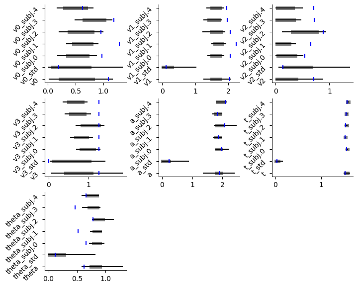

``posterior_predictive_plot``
^^^^^^^^^^^^^^^^^^^^^^^^^^^^^

.. code:: ipython3

    hddm.plotting.plot_posterior_predictive(model = hddmnn_model,
                                            columns = 2, # groupby = ['subj_idx'],
                                            figsize = (8, 6),
                                            value_range = np.arange(0, 4, 0.02),
                                            plot_func = hddm.plotting._plot_func_posterior_node_from_sim,
                                            parameter_recovery_mode = True,
                                            **{'alpha': 0.01,
                                               'ylim': 3,
                                               'bin_size': 0.1,
                                               'add_posterior_mean_rts': True,
                                               'add_posterior_uncertainty_rts': False,
                                               'samples': 200,
                                               'legend_fontsize': 7,
                                               'subplots_adjust': {'top': 0.9, 'hspace': 0.3, 'wspace': 0.3}})

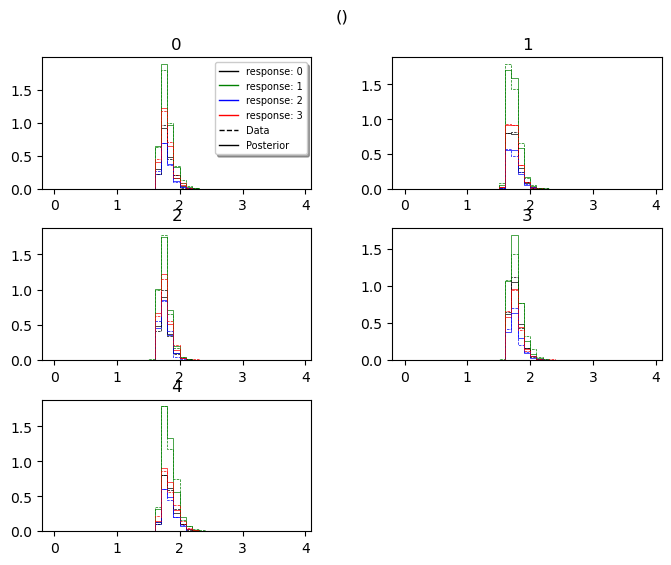

``model_cartoon_plot``
^^^^^^^^^^^^^^^^^^^^^^

**WARNING:** The plot below should not be taken as representative for a
particular model fit. The chain may need to be run for much longer than
the number of samples allotted in this tutorial script.

.. code:: ipython3

    hddm.plotting.plot_posterior_predictive(model = hddmnn_model,
                                            columns = 2, # groupby = ['subj_idx'],
                                            figsize = (12, 8),
                                            value_range = np.arange(0, 3, 0.1),
                                            plot_func = hddm.plotting._plot_func_model_n,
                                            parameter_recovery_mode = True,
                                            **{'add_legend': False,
                                               'alpha': 0.01,
                                               'ylim': 6.0,
                                               'bin_size': 0.025,
                                               'add_posterior_mean_model': True,
                                               'add_posterior_mean_rts': True,
                                               'add_posterior_uncertainty_model': True,
                                               'add_posterior_uncertainty_rts': False,
                                               'samples': 200,
                                               'legend_fontsize': 7,
                                               'legend_loc': 'upper left',
                                               'linewidth_histogram': 1.0,
                                               'subplots_adjust': {'top': 0.9, 'hspace': 0.35, 'wspace': 0.3}})
    plt.show()

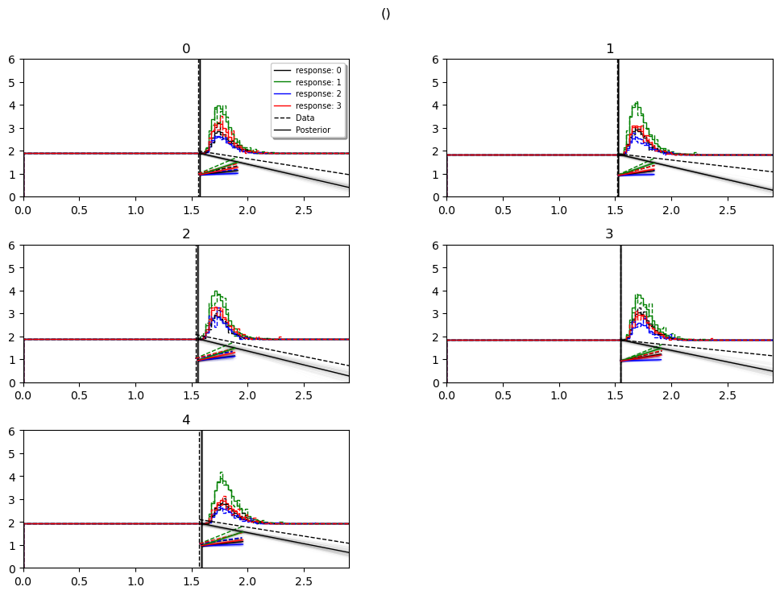

