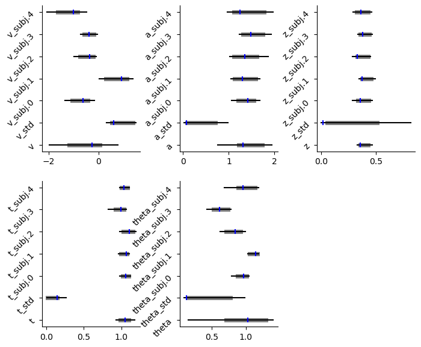
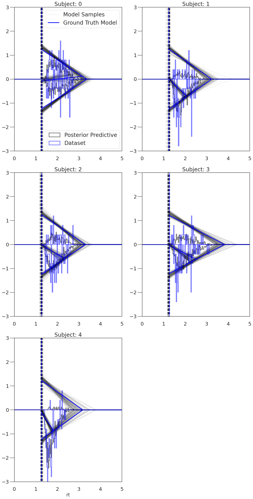
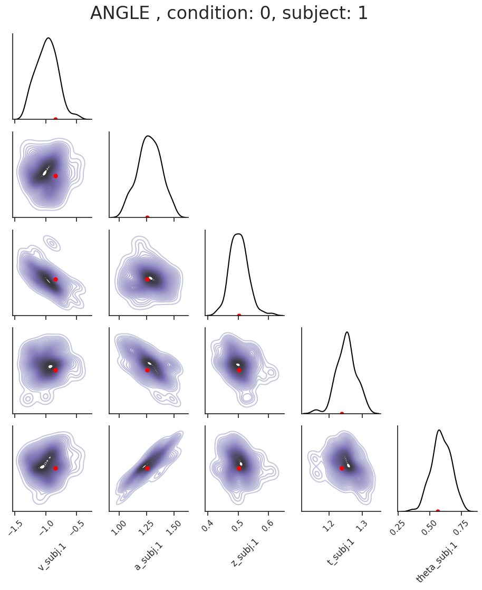
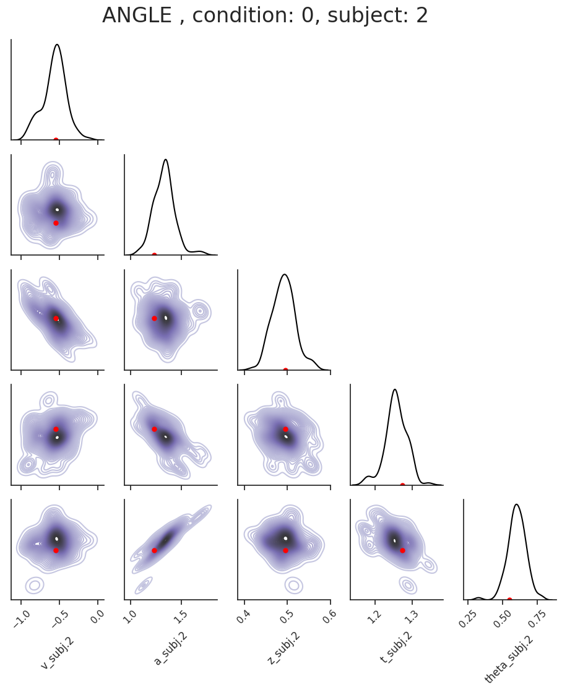
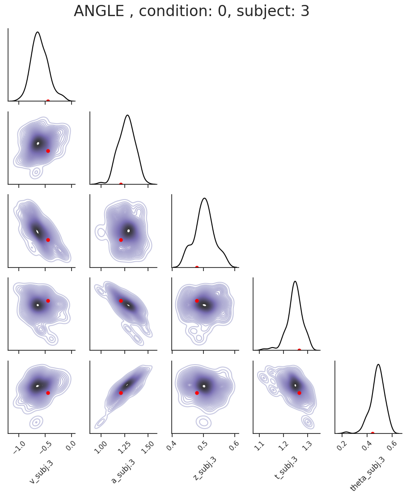
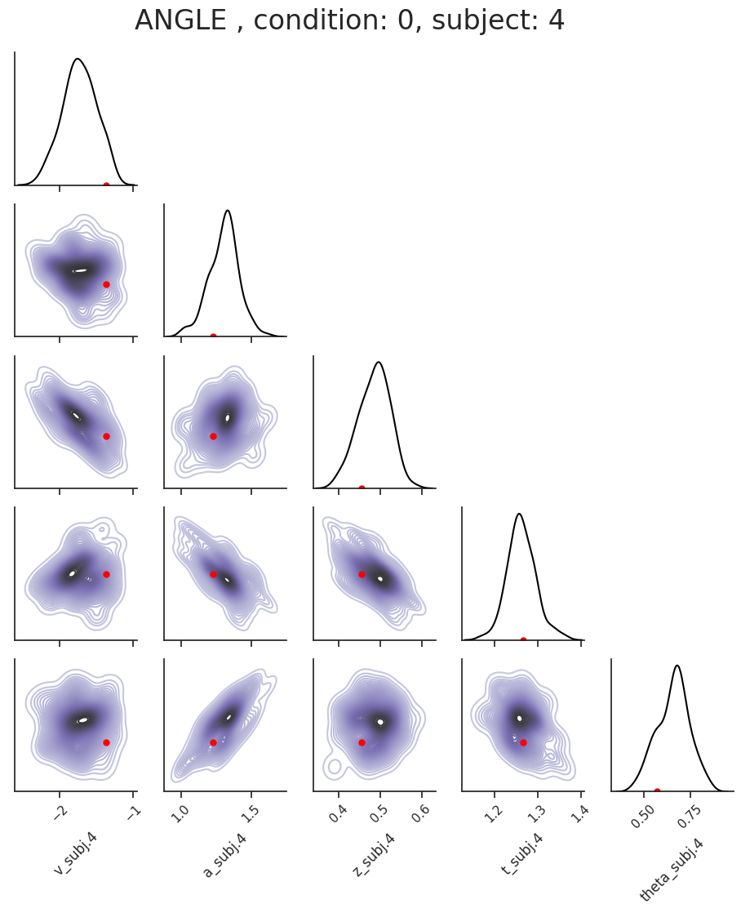

.. index:: LANs
.. _chap_visualizations:

New Visualizations
------------------

.. code:: ipython3

    import hddm

Generate some Data
~~~~~~~~~~~~~~~~~~

.. code:: ipython3

    # Metadata
    nmcmc = 2500
    model = 'angle'
    n_samples = 1000
    includes = hddm.simulators.model_config[model]['hddm_include']

.. code:: ipython3

    data, full_parameter_dict = hddm.simulators.hddm_dataset_generators.simulator_h_c(n_subjects = 5,
                                                                                      n_samples_by_subject = n_samples,
                                                                                      model = model,
                                                                                      p_outlier = 0.00,
                                                                                      conditions = None,
                                                                                      depends_on = None,
                                                                                      regression_models = None,
                                                                                      regression_covariates = None,
                                                                                      group_only_regressors = False,
                                                                                      group_only = None,
                                                                                      fixed_at_default = None)

.. code:: ipython3

    data

.. raw:: html

    

    
    <table border="1" class="dataframe">
      <thead>
        <tr style="text-align: right;">
          <th></th>
          <th>rt</th>
          <th>response</th>
          <th>subj_idx</th>
          <th>v</th>
          <th>a</th>
          <th>z</th>
          <th>t</th>
          <th>theta</th>
        </tr>
      </thead>
      <tbody>
        <tr>
          <th>0</th>
          <td>1.737320</td>
          <td>1.0</td>
          <td>0</td>
          <td>0.105478</td>
          <td>1.231885</td>
          <td>0.468836</td>
          <td>1.273322</td>
          <td>0.532642</td>
        </tr>
        <tr>
          <th>1</th>
          <td>1.614321</td>
          <td>1.0</td>
          <td>0</td>
          <td>0.105478</td>
          <td>1.231885</td>
          <td>0.468836</td>
          <td>1.273322</td>
          <td>0.532642</td>
        </tr>
        <tr>
          <th>2</th>
          <td>1.897318</td>
          <td>1.0</td>
          <td>0</td>
          <td>0.105478</td>
          <td>1.231885</td>
          <td>0.468836</td>
          <td>1.273322</td>
          <td>0.532642</td>
        </tr>
        <tr>
          <th>3</th>
          <td>1.783319</td>
          <td>1.0</td>
          <td>0</td>
          <td>0.105478</td>
          <td>1.231885</td>
          <td>0.468836</td>
          <td>1.273322</td>
          <td>0.532642</td>
        </tr>
        <tr>
          <th>4</th>
          <td>1.605321</td>
          <td>0.0</td>
          <td>0</td>
          <td>0.105478</td>
          <td>1.231885</td>
          <td>0.468836</td>
          <td>1.273322</td>
          <td>0.532642</td>
        </tr>
        <tr>
          <th>...</th>
          <td>...</td>
          <td>...</td>
          <td>...</td>
          <td>...</td>
          <td>...</td>
          <td>...</td>
          <td>...</td>
          <td>...</td>
        </tr>
        <tr>
          <th>495</th>
          <td>1.879133</td>
          <td>0.0</td>
          <td>4</td>
          <td>-1.364279</td>
          <td>1.226657</td>
          <td>0.455551</td>
          <td>1.266137</td>
          <td>0.571162</td>
        </tr>
        <tr>
          <th>496</th>
          <td>1.741134</td>
          <td>0.0</td>
          <td>4</td>
          <td>-1.364279</td>
          <td>1.226657</td>
          <td>0.455551</td>
          <td>1.266137</td>
          <td>0.571162</td>
        </tr>
        <tr>
          <th>497</th>
          <td>1.889132</td>
          <td>0.0</td>
          <td>4</td>
          <td>-1.364279</td>
          <td>1.226657</td>
          <td>0.455551</td>
          <td>1.266137</td>
          <td>0.571162</td>
        </tr>
        <tr>
          <th>498</th>
          <td>1.724134</td>
          <td>0.0</td>
          <td>4</td>
          <td>-1.364279</td>
          <td>1.226657</td>
          <td>0.455551</td>
          <td>1.266137</td>
          <td>0.571162</td>
        </tr>
        <tr>
          <th>499</th>
          <td>1.520137</td>
          <td>0.0</td>
          <td>4</td>
          <td>-1.364279</td>
          <td>1.226657</td>
          <td>0.455551</td>
          <td>1.266137</td>
          <td>0.571162</td>
        </tr>
      </tbody>
    </table>
    
500 rows × 8 columns

    

.. code:: ipython3

    # Define the HDDM model
    hddmnn_model = hddm.HDDMnn(data,
                               informative = False,
                               include = includes,
                               p_outlier = 0.0,
                               w_outlier = 0.01,
                               model = model)

.. parsed-literal::

    Setting priors uninformative (LANs only work with uninformative priors for now)
    Includes supplied:  ['z', 'theta']

.. code:: ipython3

    # Sample
    hddmnn_model.sample(nmcmc,
                        burn = 500)

.. parsed-literal::

     [-----------------100%-----------------] 2500 of 2500 complete in 219.1 sec

.. parsed-literal::

    <pymc.MCMC.MCMC at 0x7fdb2490b250>

Caterpillar Plot
~~~~~~~~~~~~~~~~

The ``caterpillar_plot()`` function below displays *parameterwise*,

-  as a red tick-mark the **ground truth**.
-  as a *thin* **black** line the :math:`1 - 99` percentile range of the
   posterior distribution
-  as a *thick* **black** line the :math:`5-95` percentile range of the
   posterior distribution

Again use the ``help()`` function to learn more.

.. code:: ipython3

    # Caterpillar Plot: (Parameters recovered ok?)
    hddm.plotting.caterpillar_plot(hddm_model = hddmnn_model,
                                   ground_truth_parameter_dict = full_parameter_dict,
                                   drop_sd = False,
                                   x_limits = [-3, 3])

Model Plot
~~~~~~~~~~

The **model plot** is useful to illustrate the behavior of a models
pictorially, including the uncertainty over model parameters embedded in
the posterior distribution.

This plot works only for **2-choice** models at this point.

Check out more of it’s capabilities with the ``help()`` function.

.. code:: ipython3

    hddm.plotting.model_plot(hddm_model = hddmnn_model,
                             model_ground_truth = model,
                             n_posterior_parameters = 100,
                             scale_x = 0.8,
                             scale_y = 0.6,
                             ylimit = 3,
                             cols = 2)

.. parsed-literal::

    <Figure size 640x480 with 0 Axes>

Note
~~~~

Above we used the model plot with *empirical data* (here empirical as in
our original simulator data, which we fit the model to) as opposed to
specificying. Such *empirical data*, supplied under the
``ground_truths_data = ...`` argument is signified in blue. This is in
contrast to supplying a *ground truth model* under
``model_ground_truth = ...``, with corresponding *ground truth
parameterization* (potentially multiple for subject and / or condition
separated datasets) under ``ground_truths_parameters = ...``, where the
``model_plot()`` will simulate data for these on the fly. Empirical data
doesn’t have a *true* model of course, so we *don’t* see a blue model
caricature here, but simply our posterior model parameterizations.

Posterior Pair Plot
~~~~~~~~~~~~~~~~~~~

.. code:: ipython3

    out = hddm.plotting.posterior_pair_plot(hddm_model = hddmnn_model,
                                      model_ground_truth = model,
                                      axes_limits = 'samples',
                                      height = 2,
                                      aspect_ratio = 1,
                                      n_subsample = 100,
                                      font_scale = 1.0
                                      )

.. image:: lan_visualizations_files/lan_visualizations_16_0.png

