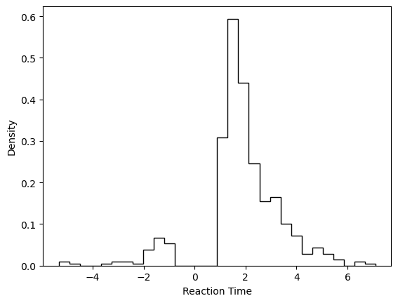
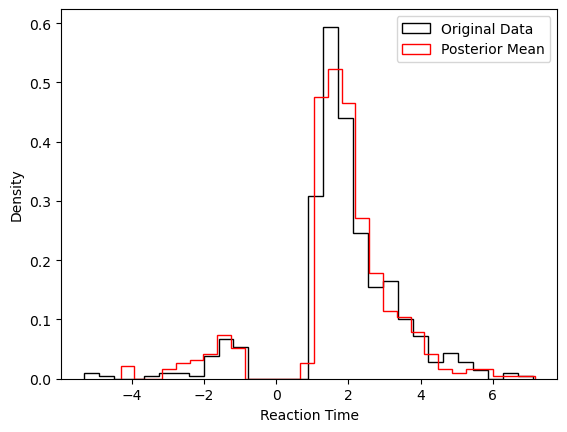
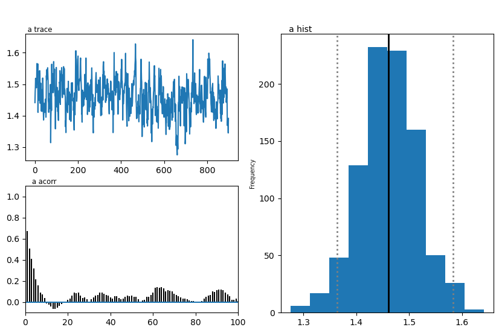
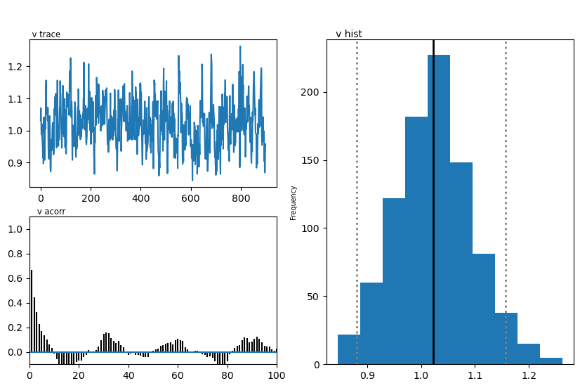
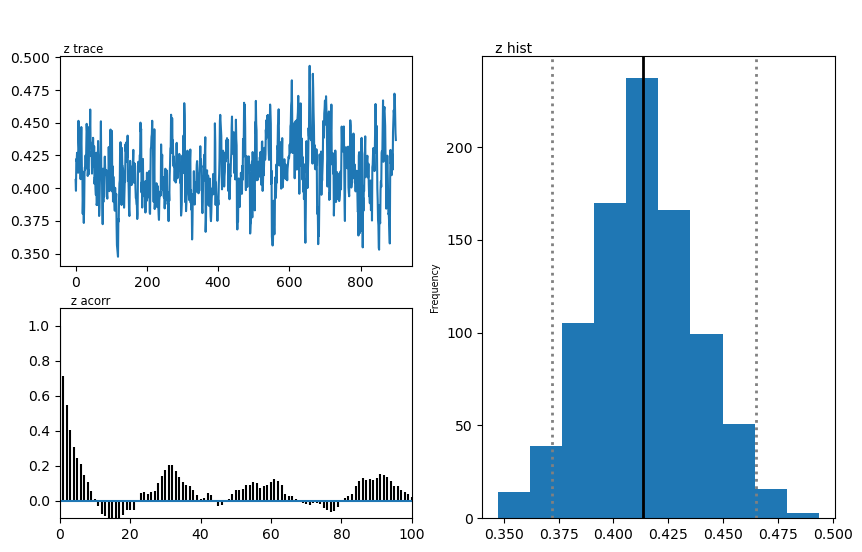
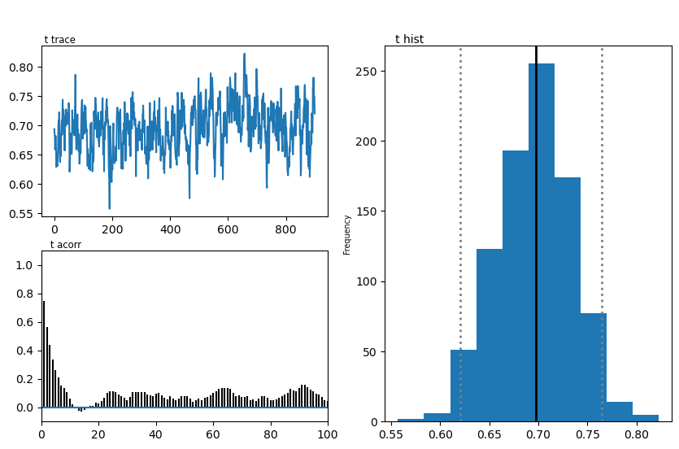

From simulator to Inference with HDDM (MNLE Version)
====================================================

In this tutorial we show how to proceed from a *simulator model* to
Bayesian Inference with HDDM, via training a *likelihood approximator*
of the `MNLE <https://elifesciences.org/articles/77220>`__ type.

MNLE stands for Mixed Neural Likelihood Estimator, which in turn is a
Neural Network composed of the combination of a
`Flow <https://en.wikipedia.org/wiki/Flow-based_generative_model>`__,
and a basic classifier
`MLP <https://en.wikipedia.org/wiki/Multilayer_perceptron>`__. MNLEs are
designed for predicting (and generating data from) likelihoods over
*mixed* data containing a continuous and a discrete part.

In the context of *Sequential Sampling Models*, the continuous part
refers to the *reaction times*, while the discrete part refers to
*choices*.

We will make use of two python packages which help facilitate this
tutorial:

1. The ```ssms`` <https://github.com/AlexanderFengler/ssm_simulators>`__
   package, which holds a collection of fast simulators and training
   data generators for LANs (here we make use only of the basic
   simulators and ignore the LAN integration)
2. The ```sbi`` <https://github.com/AlexanderFengler/LANfactory>`__
   package, which makes training MNLEs easy. The package has a much
   broader scope, which we suggest the interested user to explore,
   however not all aspects of the ``sbi`` toolbox allow for an interface
   with HDDM.

In this tutorial we will start by simulating data from the DDM, using
the ```ssms`` <https://github.com/AlexanderFengler/ssm_simulators>`__,
then use this data to train a MNLE via the
```sbi`` <https://github.com/AlexanderFengler/LANfactory>`__ toolbox and
finally define a wrapper around the resulting MNLE to make it usable in
HDDM.

Installation (colab)
--------------------

**NOTE:** If you run this Tutorial in a **google colab**, don’t forget
to change the **runtime** to a **GPU** machine for better performance.

.. code:: ipython3

    # !pip install sbi
    # !pip install cython
    # !pip install pymc==2.3.8
    # !pip install git+https://github.com/hddm-devs/kabuki
    # !pip install git+https://github.com/hddm-devs/hddm
    # !pip install git+https://github.com/AlexanderFengler/ssm_simulators

Load Modules
------------

.. code:: ipython3

    # ssms for simulation
    from ssms.basic_simulators import simulator
    
    # sbi for network training
    import sbi
    from sbi.inference import MNLE
    
    # HDDM
    import hddm
    
    # Misc
    from copy import deepcopy
    import ssms
    import torch
    import numpy as np
    import pandas as pd
    import matplotlib
    import matplotlib.pyplot as plt

Simulate Data
-------------

.. code:: ipython3

    from ssms.config import model_config
    
    # Define our model
    model = 'ddm'
    
    # Load corresponding config dictionary
    model_config_tmp = deepcopy(model_config['ddm'])
    model_config_tmp["choices"] = [-1, 1] # simple addition to make ssms model config hddm ready
    
    # Choose number of training examples
    n_training_examples = 100000
    
    # Generate a matrix of model parameters
    # We sample this uniformly from an allowed parameter space
    thetas = np.random.uniform(low = model_config_tmp['param_bounds'][0],
                               high = model_config_tmp['param_bounds'][1],
                               size = (n_training_examples, len(model_config_tmp['params'])))
    thetas_torch = torch.Tensor(thetas)
    
    # For every row in thetas, draw 1 sample from the DDM.
    model_simulations = ssms.basic_simulators.simulator(model = 'ddm', 
                                                        theta = thetas, 
                                                        n_samples = 1)
    
    # Format the output of the simulator
    model_simulations_torch = torch.Tensor(np.hstack((model_simulations['rts'], model_simulations['choices'])))
    
    # Edit choices to [0,1] (the simulator produces [-1, 1]) since that is the format MNLE expects.
    model_simulations_torch[:, 1] = (model_simulations_torch[:, 1] + 1)/2

Train Network
-------------

.. code:: ipython3

    # Set device
    torch_device = torch.device("cuda") if torch.cuda.is_available() else torch.device("cpu")
    
    #Initialise Prior
    prior = sbi.utils.BoxUniform(low=torch.tensor(ssms.config.model_config['ddm']['param_bounds'][0]),
                                 high=torch.tensor(ssms.config.model_config['ddm']['param_bounds'][1]),
                                 device = torch_device.type)
    
    # Initialise the MNLE trainer
    trainer = MNLE(prior = prior, 
                   device = torch_device.type)
    
    # Add presimulated training data to the MNLE trainer
    trainer = trainer.append_simulations(thetas_torch, 
                                         model_simulations_torch)
    
    # Train the network and return the resulting MNLE
    mnle = trainer.train(training_batch_size = 128 if torch_device.type == "cpu" else 1000)


.. parsed-literal::

    /Users/afengler/opt/miniconda3/envs/hddmnn_tutorial/lib/python3.7/site-packages/sbi/neural_nets/mnle.py:64: UserWarning: The mixed neural likelihood estimator assumes that x contains
            continuous data in the first n-1 columns (e.g., reaction times) and
            categorical data in the last column (e.g., corresponding choices). If
            this is not the case for the passed `x` do not use this function.
      this is not the case for the passed `x` do not use this function."""


.. parsed-literal::

     Neural network successfully converged after 74 epochs.

Run in HDDM
-----------

Define HDDM Network
~~~~~~~~~~~~~~~~~~~

.. code:: ipython3

    class MNLEWrapper():
        def __init__(
            self, MNLE):
            self.mnle = MNLE
            self.dev = torch.device("cuda") if torch.cuda.is_available() else torch.device("cpu")
        
        # We need to define a predict on batch method for compatibility with HDDM
        def predict_on_batch(self, data):
            # HDDM supplies decisions as [-1, 1], which we adjust
            # to [0, 1] for the MNLE
            data[:, -1] = (data[:, -1] + 1) / 2
            
            return self.mnle.log_prob(torch.tensor(data[:,-2:]).to(self.dev), # supply (rt, choice)
                                      torch.tensor(data[:,:-2]).to(self.dev) # supply (theta)
                                      ).cpu().detach().numpy() # send back to cpu (for MCMC sampler to proceed)

The argument ``x``, to the ``predict_on_batch()``, when called from
within HDDM’s sampler, will be a matrix. Rows correspond to trials, and
columns are supplied in the following way.

The first few columns contain trial wise parameters (in the order
specific in the ``model_config`` above under the ``"params"`` ``key``).
The last two columns contain the trial wise *reaction times* and
*choices* respectively.

To understand how the network is actually called in HDDM, let’s take a
peak into the *generic internal likelihood function*.

**NOTE:** Don’t actually run the cell below. It is just for
illustration.

.. code:: ipython3

    def wiener_like_nn_mlp_pdf(np.ndarray[float, ndim = 1] rt,
                               np.ndarray[float, ndim = 1] response,
                               np.ndarray[float, ndim = 1] params,
                               double p_outlier = 0, 
                               double w_outlier = 0,
                               bint logp = 0,
                               network = None):
        
        cdef Py_ssize_t size = rt.shape[0]
        cdef Py_ssize_t n_params = params.shape[0]
    
        cdef np.ndarray[float, ndim = 1] log_p = np.zeros(size, dtype = np.float32)
        cdef float ll_min = -16.11809
    
        cdef np.ndarray[float, ndim = 2] data = np.zeros((size, n_params + 2), dtype = np.float32)
        data[:, :n_params] = np.tile(params, (size, 1)).astype(np.float32)
        data[:, n_params:] = np.stack([rt, response], axis = 1)
    
        # Call to network:
        if p_outlier == 0: 
            log_p = np.squeeze(np.core.umath.maximum(network.predict_on_batch(data), ll_min))
        else: # ddm_model
            log_p = np.squeeze(np.log(np.exp(np.core.umath.maximum(network.predict_on_batch(data), ll_min)) * (1.0 - p_outlier) + (w_outlier * p_outlier)))
        if logp == 0:
            log_p = np.exp(log_p) 
        return log_p

We see that the *internal likelihood function* expects a network as
input and then finally calls the ``predict_on_batch()`` to get
log-likelihoods.

We can now initialize the HDDM-ready MNLE via our ``MNLEWrapper()``
class, after which we are essentially good to go for an HDDM
application.

.. code:: ipython3

    # Initalize HDDM ready MNLE
    mnle_hddm = MNLEWrapper(MNLE = mnle)

Generate Example Data
~~~~~~~~~~~~~~~~~~~~~

.. code:: ipython3

    # Choose some parameters
    v = 0.9
    a = 1.4
    z = 0.45
    t = 0.7
    
    # Simulate Data
    data = ssms.basic_simulators.simulator(model = model, 
                                           theta = [v, a, z, t],
                                           n_samples = 500)
    
    # Bring into correct shape expected from HDDM
    data_df = pd.DataFrame(np.stack([data['rts'], data['choices']], axis = 1)[:, :, 0], 
                           columns = ['rt', 'response'])
    data_df['subj_idx'] = 0
    data_df['v'] = v
    data_df['a'] = a
    data_df['z'] = z
    data_df['t'] = t
    
    data_df


.. raw:: html

    <div>
    <style scoped>
        .dataframe tbody tr th:only-of-type {
            vertical-align: middle;
        }
    
        .dataframe tbody tr th {
            vertical-align: top;
        }
    
        .dataframe thead th {
            text-align: right;
        }
    </style>
    <table border="1" class="dataframe">
      <thead>
        <tr style="text-align: right;">
          <th></th>
          <th>rt</th>
          <th>response</th>
          <th>subj_idx</th>
          <th>v</th>
          <th>a</th>
          <th>z</th>
          <th>t</th>
        </tr>
      </thead>
      <tbody>
        <tr>
          <th>0</th>
          <td>1.106998</td>
          <td>1.0</td>
          <td>0</td>
          <td>0.9</td>
          <td>1.4</td>
          <td>0.45</td>
          <td>0.7</td>
        </tr>
        <tr>
          <th>1</th>
          <td>1.396995</td>
          <td>1.0</td>
          <td>0</td>
          <td>0.9</td>
          <td>1.4</td>
          <td>0.45</td>
          <td>0.7</td>
        </tr>
        <tr>
          <th>2</th>
          <td>2.062008</td>
          <td>1.0</td>
          <td>0</td>
          <td>0.9</td>
          <td>1.4</td>
          <td>0.45</td>
          <td>0.7</td>
        </tr>
        <tr>
          <th>3</th>
          <td>5.708819</td>
          <td>1.0</td>
          <td>0</td>
          <td>0.9</td>
          <td>1.4</td>
          <td>0.45</td>
          <td>0.7</td>
        </tr>
        <tr>
          <th>4</th>
          <td>1.877999</td>
          <td>1.0</td>
          <td>0</td>
          <td>0.9</td>
          <td>1.4</td>
          <td>0.45</td>
          <td>0.7</td>
        </tr>
        <tr>
          <th>...</th>
          <td>...</td>
          <td>...</td>
          <td>...</td>
          <td>...</td>
          <td>...</td>
          <td>...</td>
          <td>...</td>
        </tr>
        <tr>
          <th>495</th>
          <td>3.119007</td>
          <td>1.0</td>
          <td>0</td>
          <td>0.9</td>
          <td>1.4</td>
          <td>0.45</td>
          <td>0.7</td>
        </tr>
        <tr>
          <th>496</th>
          <td>1.972003</td>
          <td>1.0</td>
          <td>0</td>
          <td>0.9</td>
          <td>1.4</td>
          <td>0.45</td>
          <td>0.7</td>
        </tr>
        <tr>
          <th>497</th>
          <td>1.719992</td>
          <td>1.0</td>
          <td>0</td>
          <td>0.9</td>
          <td>1.4</td>
          <td>0.45</td>
          <td>0.7</td>
        </tr>
        <tr>
          <th>498</th>
          <td>1.735992</td>
          <td>1.0</td>
          <td>0</td>
          <td>0.9</td>
          <td>1.4</td>
          <td>0.45</td>
          <td>0.7</td>
        </tr>
        <tr>
          <th>499</th>
          <td>2.010005</td>
          <td>1.0</td>
          <td>0</td>
          <td>0.9</td>
          <td>1.4</td>
          <td>0.45</td>
          <td>0.7</td>
        </tr>
      </tbody>
    </table>
    <p>500 rows × 7 columns</p>
    </div>


.. code:: ipython3

    # Plotting the RTs
    plt.hist(data_df['rt'] * data_df['response'], 
             histtype = 'step',
             color = 'black',
             density = True,
             bins = 30)
    plt.xlabel('Reaction Time')
    plt.ylabel('Density')
    plt.show()





Define HDDM Model
~~~~~~~~~~~~~~~~~

.. code:: ipython3

    # Define the HDDM model
    hddmmnle_model = hddm.HDDMnn(data = data_df,
                                 informative = False,
                                 include = model_config_tmp['hddm_include'],# Note: This include statement is an example, you may pick any other subset of the parameters of your model here
                                 model = model,
                                 model_config = model_config_tmp,
                                 network = mnle_hddm)


.. parsed-literal::

    Supplied model_config does not have a params_std_upper argument.
    Set to a default of 10
    Supplied model_config does not have a params_std_upper argument.
    Set to a default of 10
    Supplied model_config does not have a params_std_upper argument.
    Set to a default of 10
    Supplied model_config does not have a params_std_upper argument.
    Set to a default of 10


Sample
~~~~~~

.. code:: ipython3

    # Sample from the model
    n_mcmc = 1000
    n_burn = 100
    
    hddmmnle_model.sample(n_mcmc, burn = n_burn)


.. parsed-literal::

     [-----------------100%-----------------] 1001 of 1000 complete in 360.0 sec


.. parsed-literal::

    <pymc.MCMC.MCMC at 0x16d777490>


.. code:: ipython3

    # Show posterior summary
    tmp = hddmmnle_model.gen_stats()
    tmp['ground_truth'] = data_df.iloc[0, 3:]
    tmp[['ground_truth', 'mean', 'std']]


.. raw:: html

    <div>
    <style scoped>
        .dataframe tbody tr th:only-of-type {
            vertical-align: middle;
        }
    
        .dataframe tbody tr th {
            vertical-align: top;
        }
    
        .dataframe thead th {
            text-align: right;
        }
    </style>
    <table border="1" class="dataframe">
      <thead>
        <tr style="text-align: right;">
          <th></th>
          <th>ground_truth</th>
          <th>mean</th>
          <th>std</th>
        </tr>
      </thead>
      <tbody>
        <tr>
          <th>v</th>
          <td>0.90</td>
          <td>1.024209</td>
          <td>0.071095</td>
        </tr>
        <tr>
          <th>a</th>
          <td>1.40</td>
          <td>1.461075</td>
          <td>0.054512</td>
        </tr>
        <tr>
          <th>z</th>
          <td>0.45</td>
          <td>0.413947</td>
          <td>0.02392</td>
        </tr>
        <tr>
          <th>t</th>
          <td>0.70</td>
          <td>0.695977</td>
          <td>0.037936</td>
        </tr>
      </tbody>
    </table>
    </div>


Plots
~~~~~

We show two plots. *First*, we compare simulations fixing the parameters
at the posterior mean with the original data, to get a visual idea of
the model fit we obtained. *Second* we show the posterior traces.

.. code:: ipython3

    # Compare simulations from posterior mean parameters
    # to original data
    data_post_mean = data = ssms.basic_simulators.simulator(model = model, 
                                                            theta = list(tmp['mean'].values),
                                                            n_samples = 500)
    
    
    # Plotting the RTs
    plt.hist(data_df['rt'] * data_df['response'], 
             histtype = 'step',
             color = 'black',
             density = True,
             bins = 30,
             label = 'Original Data')
    plt.hist(data_post_mean['rts'] * data_post_mean['choices'],
             histtype = 'step',
             color = 'red',
             density = True,
             bins = 30,
             label = 'Posterior Mean')
    plt.xlabel('Reaction Time')
    plt.ylabel('Density')
    plt.legend()
    plt.show()                     
    





.. code:: ipython3

    # Plot the posteriors
    hddmmnle_model.plot_posteriors()
    plt.show()


.. parsed-literal::

    Plotting v
    Plotting a
    Plotting z
    Plotting t


.. image:: mnle_to_hddm_end_to_end_files/mnle_to_hddm_end_to_end_29_1.png





.. image:: mnle_to_hddm_end_to_end_files/mnle_to_hddm_end_to_end_29_3.png


.. image:: mnle_to_hddm_end_to_end_files/mnle_to_hddm_end_to_end_29_4.png





.. image:: mnle_to_hddm_end_to_end_files/mnle_to_hddm_end_to_end_29_6.png








