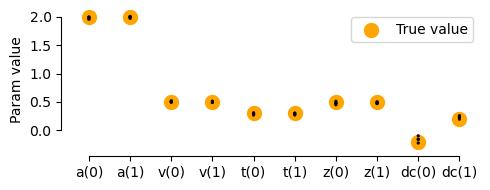
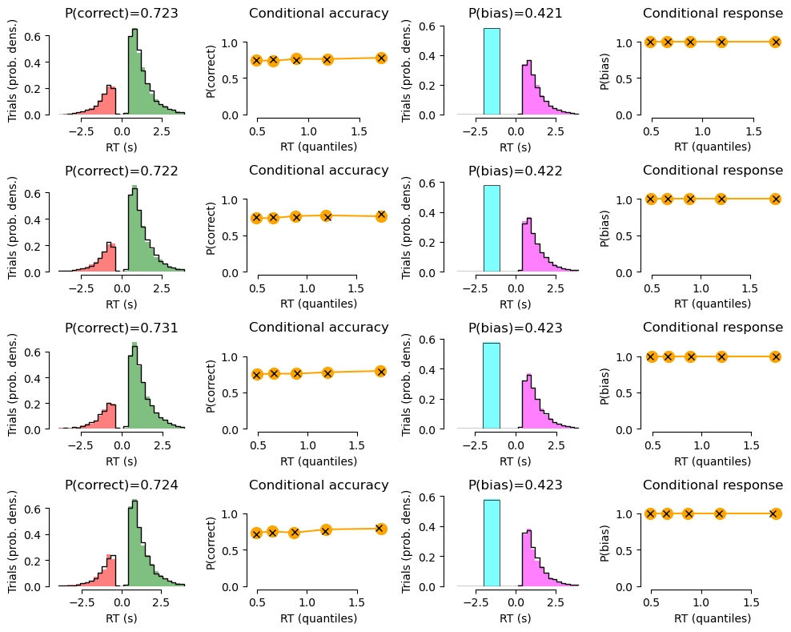

Fitting go/no-go using the chi-qsuare approach
----------------------------------------------

by Jan Willem de Gee (jwdegee@gmail.com)
~~~~~~~~~~~~~~~~~~~~~~~~~~~~~~~~~~~~~~~~

This is a demo of fitting go/no-go data with HDDM using the chi-qsuare
method, as described in

::

   de Gee JW, Tsetsos T, McCormick DA, McGinley MJ & Donner TH. 2018. Phasic arousal optimizes decision computations in mice and humans. bioRxiv. (https://www.biorxiv.org/content/early/2018/10/19/447656).

See also

::

   Ratcliff, R., Huang-Pollock, C., & McKoon, G. (2016). Modeling individual differences in the go/no-go task with a diffusion model. Decision, 5(1), 42-62 (http://psycnet.apa.org/record/2016-39470-001).

.. code:: ipython3

    # Load packages
    import numpy as np
    import pandas as pd
    import matplotlib.pyplot as plt
    import seaborn as sns
    import hddm
    from joblib import Parallel, delayed

Let’s start with defining some functionality

.. code:: ipython3

    def get_choice(row):
        
        if row.condition == 'present':
            if row.response == 1:
                return 1
            else:
                return 0
        elif row.condition == 'absent':
            if row.response == 0:
                return 1
            else:
                return 0
    
    def simulate_data(a, v, t, z, dc, sv=0, sz=0, st=0, condition=0, nr_trials1=1000, nr_trials2=1000):
        
        """
        Simulates stim-coded data.
        """
        
        parameters1 = {'a':a, 'v':v+dc, 't':t, 'z':z, 'sv':sv, 'sz': sz, 'st': st}
        parameters2 = {'a':a, 'v':v-dc, 't':t, 'z':1-z, 'sv':sv, 'sz': sz, 'st': st}
        df_sim1, params_sim1 = hddm.generate.gen_rand_data(params=parameters1, size=nr_trials1, subjs=1, subj_noise=0)
        df_sim1['condition'] = 'present'
        df_sim2, params_sim2 = hddm.generate.gen_rand_data(params=parameters2, size=nr_trials2, subjs=1, subj_noise=0)
        df_sim2['condition'] = 'absent'
        df_sim = pd.concat((df_sim1, df_sim2))
        df_sim['bias_response'] = df_sim.apply(get_choice, 1)
        df_sim['correct'] = df_sim['response'].astype(int)
        df_sim['response'] = df_sim['bias_response'].astype(int)
        df_sim['stimulus'] = np.array((np.array(df_sim['response']==1) & np.array(df_sim['correct']==1)) + (np.array(df_sim['response']==0) & np.array(df_sim['correct']==0)), dtype=int)
        df_sim['condition'] = condition
        df_sim = df_sim.drop(columns=['bias_response'])
        
        return df_sim
    
    def fit_subject(data, quantiles):
        
        """
        Simulates stim-coded data.
        """
        
        subj_idx = np.unique(data['subj_idx'])
        m = hddm.HDDMStimCoding(data, stim_col='stimulus', split_param='v', drift_criterion=True, bias=True, p_outlier=0,
                                depends_on={'v':'condition', 'a':'condition', 't':'condition', 'z':'condition', 'dc':'condition', })
        m.optimize('gsquare', quantiles=quantiles, n_runs=8)
        res = pd.concat((pd.DataFrame([m.values], index=[subj_idx]), pd.DataFrame([m.bic_info], index=[subj_idx])), axis=1)
        return res
    
    def summary_plot(df_group, df_sim_group=None, quantiles=[0, 0.1, 0.3, 0.5, 0.7, 0.9,], xlim=None):
    
        """
        Generates a 
        """
    
        nr_subjects = len(np.unique(df_group['subj_idx']))
    
        fig = plt.figure(figsize=(10,nr_subjects*2))
        plt_nr = 1
        for s in np.unique(df_group['subj_idx']):
            df = df_group.copy().loc[(df_group['subj_idx']==s),:]
            df_sim = df_sim_group.copy().loc[(df_sim_group['subj_idx']==s),:]
            df['rt_acc'] = df['rt'].copy()
            df.loc[df['correct']==0, 'rt_acc'] = df.loc[df['correct']==0, 'rt_acc'] * -1
            df['rt_resp'] = df['rt'].copy()
            df.loc[df['response']==0, 'rt_resp'] = df.loc[df['response']==0, 'rt_resp'] * -1
            df_sim['rt_acc'] = df_sim['rt'].copy()
            df_sim.loc[df_sim['correct']==0, 'rt_acc'] = df_sim.loc[df_sim['correct']==0, 'rt_acc'] * -1
            df_sim['rt_resp'] = df_sim['rt'].copy()
            df_sim.loc[df_sim['response']==0, 'rt_resp'] = df_sim.loc[df_sim['response']==0, 'rt_resp'] * -1
            max_rt = np.percentile(df_sim.loc[~np.isnan(df_sim['rt']), 'rt'], 99)
            bins = np.linspace(-max_rt,max_rt,30)
            # rt distributions correct vs error:
            ax = fig.add_subplot(nr_subjects,4,plt_nr)
            N, bins, patches = ax.hist(df.loc[:, 'rt_acc'], bins=bins, 
                                       density=True, color='green', alpha=0.5)       
            
            
            for bin_size, bin, patch in zip(N, bins, patches):
                if bin < 0:
                    plt.setp(patch, 'facecolor', 'r')
            if df_sim is not None:
                ax.hist(df_sim.loc[:, 'rt_acc'], bins=bins, density=True, 
                        histtype='step', color='k', alpha=1, label=None)   
            ax.set_title('P(correct)={}'.format(round(df.loc[:, 'correct'].mean(), 3),))
            ax.set_xlabel('RT (s)')
            ax.set_ylabel('Trials (prob. dens.)')
            plt_nr += 1
    
            # condition accuracy plots:
            ax = fig.add_subplot(nr_subjects,4,plt_nr)
            df.loc[:,'rt_bin'] = pd.qcut(df['rt'], quantiles, labels=False)
            d = df.groupby(['rt_bin']).mean().reset_index()
            ax.errorbar(d.loc[:, "rt"], d.loc[:, "correct"], fmt='-o', color='orange', markersize=10)
            if df_sim is not None:
                df_sim.loc[:,'rt_bin'] = pd.qcut(df_sim['rt'], quantiles, labels=False)
                d = df_sim.groupby(['rt_bin']).mean().reset_index()
                ax.errorbar(d.loc[:, "rt"], d.loc[:, "correct"], fmt='x', color='k', markersize=6)
            if xlim:
                ax.set_xlim(xlim)
            ax.set_ylim(0, 1.25)
            ax.set_title('Conditional accuracy')
            ax.set_xlabel('RT (quantiles)')
            ax.set_ylabel('P(correct)')
            plt_nr += 1
            
            # rt distributions response 1 vs 0:
            ax = fig.add_subplot(nr_subjects,4,plt_nr)
            if np.isnan(df['rt']).sum() > 0:
                # some initial computations
                bar_width = 1
                fraction_yes = df['response'].mean()
                fraction_yes_sim = df_sim['response'].mean()
                no_height = (1 - fraction_yes) / bar_width 
                no_height_sim = (1 - fraction_yes_sim) / bar_width 
    
                hist, edges = np.histogram(df.loc[:, 'rt_resp'], bins=bins, density=True,)
                hist = hist * fraction_yes
                hist_sim, edges_sim = np.histogram(df_sim.loc[:, 'rt_resp'], bins=bins, density=True,)
                hist_sim = hist_sim * fraction_yes_sim
                
                # Add histogram from go choices
                # ground truth
                ax.bar(edges[:-1], hist, width=np.diff(edges)[0], align='edge', 
                       color='magenta', alpha=0.5, linewidth=0,)
                # simulations
                ax.step(edges_sim[:-1] + np.diff(edges)[0], hist_sim, color='black', lw=1)
    
                # Add bar for the no-go choices (on the negative rt scale)
                # This just illustrates the probability of no-go choices
                
                # ground truth
                ax.bar(x=-1.5, height=no_height, width=bar_width, alpha=0.5, color='cyan', align='center')
                
                # simulations
                ax.hlines(y=no_height_sim, xmin=-2, xmax=-1, lw=0.5, colors='black',)
                ax.vlines(x=-2, ymin=0, ymax=no_height_sim, lw=0.5, colors='black')
                ax.vlines(x=-1, ymin=0, ymax=no_height_sim, lw=0.5, colors='black')
            else:
                N, bins, patches = ax.hist(df.loc[:, 'rt_resp'], bins=bins, 
                                       density=True, color='magenta', alpha=0.5)       
                for bin_size, bin, patch in zip(N, bins, patches):
                    if bin < 0:
                        plt.setp(patch, 'facecolor', 'cyan')
                ax.hist(df_sim.loc[:, 'rt_resp'], bins=bins, density=True, 
                        histtype='step', color='k', alpha=1, label=None)
    
            ax.set_title('P(bias)={}'.format(round(df.loc[:, 'response'].mean(), 3),))
            ax.set_xlabel('RT (s)')
            ax.set_ylabel('Trials (prob. dens.)')
            plt_nr += 1
            
            # condition response plots:
            ax = fig.add_subplot(nr_subjects,4,plt_nr)
            df.loc[:,'rt_bin'] = pd.qcut(df['rt'], quantiles, labels=False)
            d = df.groupby(['rt_bin']).mean().reset_index()
            ax.errorbar(d.loc[:, "rt"], d.loc[:, "response"], fmt='-o', color='orange', markersize=10)
            if df_sim is not None:
                df_sim.loc[:,'rt_bin'] = pd.qcut(df_sim['rt'], quantiles, labels=False)
                d = df_sim.groupby(['rt_bin']).mean().reset_index()
                ax.errorbar(d.loc[:, "rt"], d.loc[:, "response"], fmt='x', color='k', markersize=6)
            if xlim:
                ax.set_xlim(xlim)
            ax.set_ylim(0,1.25)
            ax.set_title('Conditional response')
            ax.set_xlabel('RT (quantiles)')
            ax.set_ylabel('P(bias)')
            plt_nr += 1
            
        sns.despine(offset=3, trim=True)
        plt.tight_layout()
    
        return fig    

Let’s simulate our own data, so we know what the fitting procedure
should converge on:

.. code:: ipython3

    # settings
    go_nogo = True # should we put all RTs for one choice alternative to NaN (go-no data)?
    n_subjects = 4
    trials_per_level = 10000
    
    # parameters:
    params0 = {'cond':0, 'v':0.5, 'a':2.0, 't':0.3, 'z':0.5, 'dc':-0.2, 'sz':0, 'st':0, 'sv':0}
    params1 = {'cond':1, 'v':0.5, 'a':2.0, 't':0.3, 'z':0.5, 'dc':0.2, 'sz':0, 'st':0, 'sv':0}
    
    # simulate:
    dfs = []
    for i in range(n_subjects):
        df0 = simulate_data(z=params0['z'], a=params0['a'], v=params0['v'], dc=params0['dc'], 
                            t=params0['t'], sv=params0['sv'], st=params0['st'], sz=params0['sz'], 
                            condition=params0['cond'], nr_trials1=trials_per_level, nr_trials2=trials_per_level)
        df1 = simulate_data(z=params1['z'], a=params1['a'], v=params1['v'], dc=params1['dc'], 
                            t=params1['t'], sv=params1['sv'], st=params1['st'], sz=params1['sz'], 
                            condition=params1['cond'], nr_trials1=trials_per_level, nr_trials2=trials_per_level)
        df = pd.concat((df0, df1))
        df['subj_idx'] = i
        dfs.append(df)
    
    # combine in one dataframe:
    df_emp = pd.concat(dfs)
    if go_nogo:
        df_emp.loc[df_emp["response"]==0, 'rt'] = np.NaN

.. code:: ipython3

    df_emp

.. raw:: html

    

    
    <table border="1" class="dataframe">
      <thead>
        <tr style="text-align: right;">
          <th></th>
          <th>rt</th>
          <th>response</th>
          <th>subj_idx</th>
          <th>condition</th>
          <th>correct</th>
          <th>stimulus</th>
        </tr>
      </thead>
      <tbody>
        <tr>
          <th>0</th>
          <td>0.880</td>
          <td>1</td>
          <td>0</td>
          <td>0</td>
          <td>1</td>
          <td>1</td>
        </tr>
        <tr>
          <th>1</th>
          <td>NaN</td>
          <td>0</td>
          <td>0</td>
          <td>0</td>
          <td>0</td>
          <td>1</td>
        </tr>
        <tr>
          <th>2</th>
          <td>1.499</td>
          <td>1</td>
          <td>0</td>
          <td>0</td>
          <td>1</td>
          <td>1</td>
        </tr>
        <tr>
          <th>3</th>
          <td>NaN</td>
          <td>0</td>
          <td>0</td>
          <td>0</td>
          <td>0</td>
          <td>1</td>
        </tr>
        <tr>
          <th>4</th>
          <td>NaN</td>
          <td>0</td>
          <td>0</td>
          <td>0</td>
          <td>0</td>
          <td>1</td>
        </tr>
        <tr>
          <th>...</th>
          <td>...</td>
          <td>...</td>
          <td>...</td>
          <td>...</td>
          <td>...</td>
          <td>...</td>
        </tr>
        <tr>
          <th>9995</th>
          <td>0.829</td>
          <td>1</td>
          <td>3</td>
          <td>1</td>
          <td>0</td>
          <td>0</td>
        </tr>
        <tr>
          <th>9996</th>
          <td>0.938</td>
          <td>1</td>
          <td>3</td>
          <td>1</td>
          <td>0</td>
          <td>0</td>
        </tr>
        <tr>
          <th>9997</th>
          <td>1.674</td>
          <td>1</td>
          <td>3</td>
          <td>1</td>
          <td>0</td>
          <td>0</td>
        </tr>
        <tr>
          <th>9998</th>
          <td>NaN</td>
          <td>0</td>
          <td>3</td>
          <td>1</td>
          <td>1</td>
          <td>0</td>
        </tr>
        <tr>
          <th>9999</th>
          <td>NaN</td>
          <td>0</td>
          <td>3</td>
          <td>1</td>
          <td>1</td>
          <td>0</td>
        </tr>
      </tbody>
    </table>
    
160000 rows × 6 columns

    

Fit using the g-quare method.

.. code:: ipython3

    # fit chi-square:
    quantiles = [.1, .3, .5, .7, .9]
    params_fitted = pd.concat(Parallel(n_jobs=n_subjects)(delayed(fit_subject)(data[1], quantiles) 
                                                          for data in df_emp.groupby('subj_idx')))

.. code:: ipython3

    params_fitted.drop(['bic', 'likelihood', 'penalty', 'z_trans(0)', 'z_trans(1)'], axis=1, inplace=True)
    print(params_fitted)

.. parsed-literal::

           a(0)      a(1)      v(0)      v(1)      t(0)      t(1)      z(0)  \
    0  1.957684  1.997512  0.506885  0.503210  0.291217  0.304618  0.476925   
    1  1.992596  2.009814  0.495720  0.514267  0.286401  0.271875  0.481426   
    2  1.971131  1.996191  0.522817  0.495448  0.270259  0.283106  0.451006   
    3  1.999619  1.972885  0.501150  0.493823  0.309258  0.298655  0.512594   
    
           z(1)     dc(0)     dc(1)  
    0  0.503880 -0.157141  0.197714  
    1  0.470882 -0.158436  0.259854  
    2  0.478944 -0.096833  0.231788  
    3  0.489152 -0.223152  0.236227  

.. code:: ipython3

    # simulate data based on fitted params:
    dfs = []
    for i in range(n_subjects):
        df0 = simulate_data(a=params_fitted.loc[i,'a(0)'], v=params_fitted.loc[i,'v(0)'], 
                            t=params_fitted.loc[i,'t(0)'], z=params_fitted.loc[i,'z(0)'], 
                            dc=params_fitted.loc[i,'dc(0)'], condition=0, nr_trials1=trials_per_level, 
                            nr_trials2=trials_per_level)
        df1 = simulate_data(a=params_fitted.loc[i,'a(1)'], v=params_fitted.loc[i,'v(1)'], 
                            t=params_fitted.loc[i,'t(1)'], z=params_fitted.loc[i,'z(1)'], 
                            dc=params_fitted.loc[i,'dc(1)'], condition=1, nr_trials1=trials_per_level, 
                            nr_trials2=trials_per_level)
        df = pd.concat((df0, df1))
        df['subj_idx'] = i
        dfs.append(df)
    df_sim = pd.concat(dfs)
    if go_nogo:
        df_sim.loc[df_sim["response"]==0, 'rt'] = np.NaN

.. code:: ipython3

    df_sim

.. raw:: html

    

    
    <table border="1" class="dataframe">
      <thead>
        <tr style="text-align: right;">
          <th></th>
          <th>rt</th>
          <th>response</th>
          <th>subj_idx</th>
          <th>condition</th>
          <th>correct</th>
          <th>stimulus</th>
        </tr>
      </thead>
      <tbody>
        <tr>
          <th>0</th>
          <td>1.668217</td>
          <td>1</td>
          <td>0</td>
          <td>0</td>
          <td>1</td>
          <td>1</td>
        </tr>
        <tr>
          <th>1</th>
          <td>1.870217</td>
          <td>1</td>
          <td>0</td>
          <td>0</td>
          <td>1</td>
          <td>1</td>
        </tr>
        <tr>
          <th>2</th>
          <td>3.025217</td>
          <td>1</td>
          <td>0</td>
          <td>0</td>
          <td>1</td>
          <td>1</td>
        </tr>
        <tr>
          <th>3</th>
          <td>0.914217</td>
          <td>1</td>
          <td>0</td>
          <td>0</td>
          <td>1</td>
          <td>1</td>
        </tr>
        <tr>
          <th>4</th>
          <td>1.033217</td>
          <td>1</td>
          <td>0</td>
          <td>0</td>
          <td>1</td>
          <td>1</td>
        </tr>
        <tr>
          <th>...</th>
          <td>...</td>
          <td>...</td>
          <td>...</td>
          <td>...</td>
          <td>...</td>
          <td>...</td>
        </tr>
        <tr>
          <th>9995</th>
          <td>NaN</td>
          <td>0</td>
          <td>3</td>
          <td>1</td>
          <td>1</td>
          <td>0</td>
        </tr>
        <tr>
          <th>9996</th>
          <td>NaN</td>
          <td>0</td>
          <td>3</td>
          <td>1</td>
          <td>1</td>
          <td>0</td>
        </tr>
        <tr>
          <th>9997</th>
          <td>NaN</td>
          <td>0</td>
          <td>3</td>
          <td>1</td>
          <td>1</td>
          <td>0</td>
        </tr>
        <tr>
          <th>9998</th>
          <td>0.676655</td>
          <td>1</td>
          <td>3</td>
          <td>1</td>
          <td>0</td>
          <td>0</td>
        </tr>
        <tr>
          <th>9999</th>
          <td>0.853655</td>
          <td>1</td>
          <td>3</td>
          <td>1</td>
          <td>0</td>
          <td>0</td>
        </tr>
      </tbody>
    </table>
    
160000 rows × 6 columns

    

.. code:: ipython3

    # Plot true vs recovered parameters:
    x = np.arange(5) * 2
    y0 = np.array([params0['a'], params0['v'], params0['t'], params0['z'], params0['dc']])
    y1 = np.array([params1['a'], params1['v'], params1['t'], params1['z'], params1['dc']])
    fig = plt.figure(figsize=(5,2))
    ax = fig.add_subplot(111)
    ax.scatter(x, y0, marker="o", s=100, color='orange', label='True value')
    ax.scatter(x+1, y1, marker="o", s=100, color='orange',)
    sns.stripplot(data=params_fitted, jitter=False, size=2, edgecolor='black', linewidth=0.25, alpha=1, palette=['black', 'black'], ax=ax)
    plt.ylabel('Param value')
    plt.legend()
    sns.despine(offset=5, trim=True,)
    plt.tight_layout()
    plt.show()

.. code:: ipython3

    # Plot data with model fit on top:
    for c in np.unique(df_emp['condition']):
        print('CONDITION {}'.format(c))
        summary_plot(df_group=df_emp.loc[(df_emp['condition']==c),:], 
                     df_sim_group=df_sim.loc[(df_emp['condition']==c),:])
        plt.show()

.. parsed-literal::

    CONDITION 0

.. parsed-literal::

    CONDITION 1

.. image:: tutorial_gonogo_chisquare_files/tutorial_gonogo_chisquare_14_3.png

