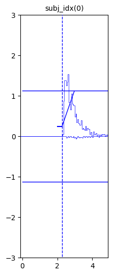
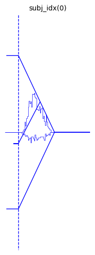
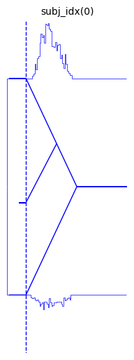
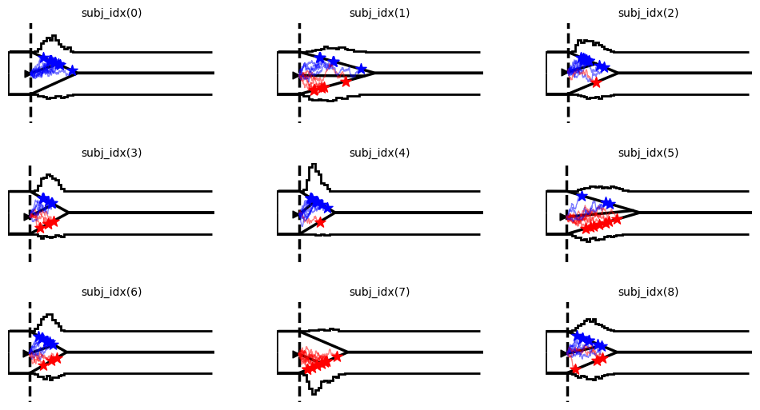

Tutorial on the “Model Plot”
============================

The ``hddm.plotting._plot_func_model`` model, which we can supply to
``hddm.plotting.plot_from_data`` or ``hddm.plotting.plot_posteriors``
functions has become quite versatile (complex).

This tutorial is meant to illustrate some of it’s capabilities. We can
generate didactically useful plots of a variety of generative models.
The **LAN Tutorial** also shows some of the usecases.

Install (colab)
---------------

.. code:: ipython3

    # package to help train networks
    # !pip install git+https://github.com/AlexanderFengler/LANfactory
    
    # package containing simulators for ssms
    # !pip install git+https://github.com/AlexanderFengler/ssm_simulators
    
    # packages related to hddm
    # !pip install cython
    # !pip install pymc==2.3.8
    # !pip install git+https://github.com/hddm-devs/kabuki
    # !pip install git+https://github.com/hddm-devs/hddm

Import modules
--------------

.. code:: ipython3

    # MODULE IMPORTS ----
    
    # warning settings
    import warnings
    
    warnings.simplefilter(action="ignore", category=FutureWarning)
    
    # Data management
    import pandas as pd
    import numpy as np
    import pickle
    
    # Plotting
    import matplotlib.pyplot as plt
    import matplotlib
    import seaborn as sns
    
    # Stats functionality
    from statsmodels.distributions.empirical_distribution import ECDF
    
    # HDDM
    import hddm
    from hddm.simulators.hddm_dataset_generators import simulator_h_c

**Note** a slight difference in how we treat generative models. Thanks
to the LAN-extension, we have many generative models available to us,
which we can broadbly classify as:

1. Legacy models, now titled: ``ddm_hddm_base`` and
   ``full_ddm_hddm_base``. The ``full_ddm_hddm_base`` model is used when
   any of the ``sv``, ``st`` or ``sz`` parameters are positive.
2. 2-choice models enabled by the LAN-extension: amongst others the
   ``levy``, ``weibull`` and ``angle`` models.
3. n-choice models enables by the LAN-extension: amongst others the
   ``race_3`` and ``race_4`` models.

The **model plots** work best with the 2-choice models enabled by the
LAN-extension. A n-choice version for the **model plots** exists (see
the ``_plot_func_model_n`` function) but is less well tested. **Model
plots** also work for the ``hddm_base`` models, however the positioning
of the *reaction time and choice* histograms is a little more tricky,
and will sometimes lead to unsatisfactory results.

Example 1: Simple Data from ``ddm_hddm_base`` model
---------------------------------------------------

.. code:: ipython3

    from hddm.simulators.hddm_dataset_generators import simulator_h_c
    model = 'ddm_hddm_base'
    n_samples = 1000
    
    data, full_parameter_dict = simulator_h_c(
        n_subjects=1,
        n_trials_per_subject=n_samples,
        model=model,
        p_outlier=0.00,
        conditions=None,
        depends_on=None,
        regression_models=None,
        regression_covariates=None,
        group_only_regressors=False,
        group_only=None,
        fixed_at_default=None,
    )

.. code:: ipython3

    data

.. raw:: html

    

    
    <table border="1" class="dataframe">
      <thead>
        <tr style="text-align: right;">
          <th></th>
          <th>rt</th>
          <th>response</th>
          <th>subj_idx</th>
          <th>v</th>
          <th>a</th>
          <th>z</th>
          <th>t</th>
        </tr>
      </thead>
      <tbody>
        <tr>
          <th>0</th>
          <td>3.279359</td>
          <td>1.0</td>
          <td>0</td>
          <td>1.241863</td>
          <td>2.258145</td>
          <td>0.605863</td>
          <td>2.262367</td>
        </tr>
        <tr>
          <th>1</th>
          <td>2.632366</td>
          <td>1.0</td>
          <td>0</td>
          <td>1.241863</td>
          <td>2.258145</td>
          <td>0.605863</td>
          <td>2.262367</td>
        </tr>
        <tr>
          <th>2</th>
          <td>3.041361</td>
          <td>1.0</td>
          <td>0</td>
          <td>1.241863</td>
          <td>2.258145</td>
          <td>0.605863</td>
          <td>2.262367</td>
        </tr>
        <tr>
          <th>3</th>
          <td>2.648366</td>
          <td>1.0</td>
          <td>0</td>
          <td>1.241863</td>
          <td>2.258145</td>
          <td>0.605863</td>
          <td>2.262367</td>
        </tr>
        <tr>
          <th>4</th>
          <td>2.437368</td>
          <td>1.0</td>
          <td>0</td>
          <td>1.241863</td>
          <td>2.258145</td>
          <td>0.605863</td>
          <td>2.262367</td>
        </tr>
        <tr>
          <th>...</th>
          <td>...</td>
          <td>...</td>
          <td>...</td>
          <td>...</td>
          <td>...</td>
          <td>...</td>
          <td>...</td>
        </tr>
        <tr>
          <th>995</th>
          <td>2.478368</td>
          <td>1.0</td>
          <td>0</td>
          <td>1.241863</td>
          <td>2.258145</td>
          <td>0.605863</td>
          <td>2.262367</td>
        </tr>
        <tr>
          <th>996</th>
          <td>2.711365</td>
          <td>1.0</td>
          <td>0</td>
          <td>1.241863</td>
          <td>2.258145</td>
          <td>0.605863</td>
          <td>2.262367</td>
        </tr>
        <tr>
          <th>997</th>
          <td>3.343362</td>
          <td>1.0</td>
          <td>0</td>
          <td>1.241863</td>
          <td>2.258145</td>
          <td>0.605863</td>
          <td>2.262367</td>
        </tr>
        <tr>
          <th>998</th>
          <td>2.670366</td>
          <td>1.0</td>
          <td>0</td>
          <td>1.241863</td>
          <td>2.258145</td>
          <td>0.605863</td>
          <td>2.262367</td>
        </tr>
        <tr>
          <th>999</th>
          <td>2.893363</td>
          <td>1.0</td>
          <td>0</td>
          <td>1.241863</td>
          <td>2.258145</td>
          <td>0.605863</td>
          <td>2.262367</td>
        </tr>
      </tbody>
    </table>
    
1000 rows × 7 columns

    

.. code:: ipython3

    hddm.plotting.plot_from_data(df = data,
                                generative_model = model,
                                save = False,
                                make_transparent = False,
                                path = 'tmp_figures',
                                value_range = np.arange(-.1, 5, 0.1),
                                plot_func = hddm.plotting._plot_func_model,
                                keep_frame = True,
                                **{'hist_bottom': 0.})
    plt.show()

Example 2: Simple Data from a model enabled by LAN-extension
------------------------------------------------------------

.. code:: ipython3

    from hddm.simulators.hddm_dataset_generators import simulator_h_c
    model = 'angle'
    n_samples = 1000
    
    data, full_parameter_dict = simulator_h_c(
        n_subjects=1,
        n_trials_per_subject=n_samples,
        model=model,
        p_outlier=0.00,
        conditions=None,
        depends_on=None,
        regression_models=None,
        regression_covariates=None,
        group_only_regressors=False,
        group_only=None,
        fixed_at_default=None,
    )

.. code:: ipython3

    data

.. raw:: html

    

    
    <table border="1" class="dataframe">
      <thead>
        <tr style="text-align: right;">
          <th></th>
          <th>rt</th>
          <th>response</th>
          <th>subj_idx</th>
          <th>v</th>
          <th>a</th>
          <th>z</th>
          <th>t</th>
          <th>theta</th>
        </tr>
      </thead>
      <tbody>
        <tr>
          <th>0</th>
          <td>1.117624</td>
          <td>1.0</td>
          <td>0</td>
          <td>0.832015</td>
          <td>1.953756</td>
          <td>0.426032</td>
          <td>0.685626</td>
          <td>0.745569</td>
        </tr>
        <tr>
          <th>1</th>
          <td>2.047633</td>
          <td>0.0</td>
          <td>0</td>
          <td>0.832015</td>
          <td>1.953756</td>
          <td>0.426032</td>
          <td>0.685626</td>
          <td>0.745569</td>
        </tr>
        <tr>
          <th>2</th>
          <td>1.491619</td>
          <td>1.0</td>
          <td>0</td>
          <td>0.832015</td>
          <td>1.953756</td>
          <td>0.426032</td>
          <td>0.685626</td>
          <td>0.745569</td>
        </tr>
        <tr>
          <th>3</th>
          <td>1.583618</td>
          <td>1.0</td>
          <td>0</td>
          <td>0.832015</td>
          <td>1.953756</td>
          <td>0.426032</td>
          <td>0.685626</td>
          <td>0.745569</td>
        </tr>
        <tr>
          <th>4</th>
          <td>1.662617</td>
          <td>1.0</td>
          <td>0</td>
          <td>0.832015</td>
          <td>1.953756</td>
          <td>0.426032</td>
          <td>0.685626</td>
          <td>0.745569</td>
        </tr>
        <tr>
          <th>...</th>
          <td>...</td>
          <td>...</td>
          <td>...</td>
          <td>...</td>
          <td>...</td>
          <td>...</td>
          <td>...</td>
          <td>...</td>
        </tr>
        <tr>
          <th>995</th>
          <td>1.283622</td>
          <td>0.0</td>
          <td>0</td>
          <td>0.832015</td>
          <td>1.953756</td>
          <td>0.426032</td>
          <td>0.685626</td>
          <td>0.745569</td>
        </tr>
        <tr>
          <th>996</th>
          <td>2.259643</td>
          <td>1.0</td>
          <td>0</td>
          <td>0.832015</td>
          <td>1.953756</td>
          <td>0.426032</td>
          <td>0.685626</td>
          <td>0.745569</td>
        </tr>
        <tr>
          <th>997</th>
          <td>1.866625</td>
          <td>0.0</td>
          <td>0</td>
          <td>0.832015</td>
          <td>1.953756</td>
          <td>0.426032</td>
          <td>0.685626</td>
          <td>0.745569</td>
        </tr>
        <tr>
          <th>998</th>
          <td>1.129624</td>
          <td>1.0</td>
          <td>0</td>
          <td>0.832015</td>
          <td>1.953756</td>
          <td>0.426032</td>
          <td>0.685626</td>
          <td>0.745569</td>
        </tr>
        <tr>
          <th>999</th>
          <td>2.129637</td>
          <td>1.0</td>
          <td>0</td>
          <td>0.832015</td>
          <td>1.953756</td>
          <td>0.426032</td>
          <td>0.685626</td>
          <td>0.745569</td>
        </tr>
      </tbody>
    </table>
    
1000 rows × 8 columns

    

.. code:: ipython3

    hddm.plotting.plot_from_data(df = data,
                                generative_model = model,
                                save = False,
                                make_transparent = False,
                                path = 'tmp_figures',
                                value_range = np.arange(-.1, 5, 0.1),
                                plot_func = hddm.plotting._plot_func_model,
                                keep_frame = False,
                                **{'hist_bottom': 0})
    plt.show()

We can move around the histograms with the ``hist_bottom``, argument
(``kwarg``).

.. code:: ipython3

    hddm.plotting.plot_from_data(df = data,
                                generative_model = model,
                                save = False,
                                make_transparent = False,
                                path = 'tmp_figures',
                                value_range = np.arange(-.1, 5, 0.1),
                                plot_func = hddm.plotting._plot_func_model,
                                keep_frame = False,
                                **{'hist_bottom': data.a.values[0],
                                   'ylim': 3})
    plt.show()

We can look at a few other arguments to illustrate the range of styling
options.

.. code:: ipython3

    hddm.plotting.plot_from_data(df = data,
                                generative_model = model,
                                save = False,
                                make_transparent = False,
                                path = 'tmp_figures',
                                value_range = np.arange(-.1, 7, 0.1),
                                plot_func = hddm.plotting._plot_func_model,
                                keep_frame = False,
                                figsize = (14, 6),
                                **{"hist_bottom": data.a.values[0],
                                   "ylim": 3,   
                                    "add_trajectories": True, 
                                    "n_trajectories": 10, 
                                    "markersize_trajectory_rt_choice": 100,
                                    "markertype_trajectory_rt_choice": "*",
                                    "color_trajectories": {-1.:"red", 1.:"blue"},
                                    "markercolor_trajectory_rt_choice": {-1.:"red",1.:'blue'},     
                                    "add_data_model_markersize_starting_point": 40,
                                    "add_data_model_markertype_starting_point": '>',
                                    "add_data_model_markershift_starting_point": -0.1,
                                    "linewidth_histogram": 2,
                                    "linewidth_model": 2,
                                    "bin_size": 0.1,
                                    "data_color": "black"})
    plt.show()

.. image:: tutorial_model_plot_files/tutorial_model_plot_17_0.png

Example 3: More complex data
----------------------------

.. code:: ipython3

    model = 'angle'
    n_samples = 500
    
    data, full_parameter_dict = simulator_h_c(
        n_subjects=9,
        n_trials_per_subject=n_samples,
        model=model,
        p_outlier=0.00,
        conditions=None,
        depends_on=None,
        regression_models=None,
        regression_covariates=None,
        group_only_regressors=False,
        group_only=None,
        fixed_at_default=None,
    )

.. code:: ipython3

    hddm.plotting.plot_from_data(df = data,
                                generative_model = model,
                                save = False,
                                columns = 3,
                                make_transparent = False,
                                path = 'tmp_figures',
                                value_range = np.arange(-.1, 7, 0.1),
                                plot_func = hddm.plotting._plot_func_model,
                                keep_frame = False,
                                figsize = (12, 6),
                                **{"hist_bottom": data.a.values[0],
                                   "ylim": 4,   
                                    "add_trajectories": True, 
                                    "n_trajectories": 10, 
                                    "markersize_trajectory_rt_choice": 100,
                                    "markertype_trajectory_rt_choice": "*",
                                    "color_trajectories": {-1.:"red", 1.:"blue"},
                                    "markercolor_trajectory_rt_choice": {-1.:"red",1.:'blue'},     
                                    "add_data_model_markersize_starting_point": 40,
                                    "add_data_model_markertype_starting_point": '>',
                                    "add_data_model_markershift_starting_point": -0.1,
                                    "linewidth_histogram": 2,
                                    "linewidth_model": 2,
                                    "bin_size": 0.1,
                                    "data_color": "black"})
    plt.show()

Example 4: Making gifs
----------------------

Using the model plot, we can create fairly exciting gifs to illustrate
the workings of various Sequential Sampling Models.

.. code:: ipython3

    import os
    import imageio # package for gifs
    from hddm.simulators.basic_simulator import simulator
    from hddm.simulators import hddm_preprocess
    
    
    #
    theta = np.array([[.1, .6, 0.5, .5]])
    theta_secondary = np.array([-.3, 1., 0.5, 1.0])
    model = 'ddm'
    model_secondary = 'ddm'
    n_samples=20000
    n_samples_secondary=500 # If we want to have another reference dataset (can be useful for illustrating e.g. likelihood)
    
    create_frames=True 
    make_gif=True 
    add_secondary_data=False
    
    # Create trajectories (have to presimulate, then use for frame generation)
    n_trajectories = 1
    trajectories = []
    trajectory_choices = []
    for i in range(n_trajectories):
        out_tmp = hddm.simulators.basic_simulator.simulator(theta = theta,
                                                            model = model,
                                                            n_samples = 1,
                                                            delta_t = 0.001)
        trajectories.append(out_tmp[2]['trajectory'].T)
        trajectory_choices.append(out_tmp[1].flatten())
    
    trajectories_to_supply = np.concatenate(trajectories)
    trajectory_choices_to_supply = np.concatenate(trajectory_choices)
    
    trajectory_supply_dict = {'trajectories': trajectories_to_supply,
                              'trajectory_choices':trajectory_choices_to_supply}
    
    # Create data
    out = simulator(theta = theta,
                    model = model,
                    n_samples = n_samples,
                    delta_t = 0.001)
    
    data = hddm_preprocess(out, 
                           subj_id = '0', 
                           add_model_parameters = True)
    
    out_secondary = simulator(theta = theta_secondary,
                              model = model_secondary,
                              n_samples = n_samples_secondary,
                              delta_t = 0.001)
    
    data_secondary = hddm_preprocess(out_secondary,
                           subj_id = '0', 
                           add_model_parameters = True)
    
    
    if create_frames:
        frames = []
        cnt = 0
        for i in range(n_trajectories):
            # Subset precomputed trajectories for current plot
            tmp_trajectories = {}
            tmp_trajectories['trajectories'] = trajectory_supply_dict['trajectories'][:(i + 1), :]
            tmp_trajectories['trajectory_choices'] = trajectory_supply_dict['trajectory_choices'][:(i + 1)]
            tmp_maxid = np.argmax(np.where(tmp_trajectories['trajectories'][i, :] > -999))
    
            for j in range(10, tmp_maxid + 110, 10):
                # Define all the plot options via a kwarg dict
                plot_options_dict = {"alpha": 1.0, "ylim": 3.0,
                                    "hist_bottom": data.a.values[0],
                                    "add_data_rts": True, "add_data_model": True, 
                                    'add_trajectories': True, 
                                    "alpha_trajectories": 0.1,
                                    'n_trajectories': None,
                                    "supplied_trajectory": tmp_trajectories, #out[2]['trajectory'][:, 0][np.arange(0, out[2]['trajectory'][:, 0].shape[0], 10)],
                                    "maxid_supplied_trajectory": j,
                                    "color_trajectories": {-1.:"red", 1.:"blue"},
                                    "data_color": "black",
                                    "bin_size": 0.1,
                                    "linewidth_histogram": 2,
                                    "linewidth_model": 2,
                                    "markersize_trajectory_rt_choice": 100,
                                    "markertype_trajectory_rt_choice": "*",
                                    "markercolor_trajectory_rt_choice": {-1.:"red",1.:'blue'},
                                    "highlight_trajectory_rt_choice": True,
                                    "add_data_model_keep_boundary": True,
                                    "add_data_model_keep_slope": True,
                                    "add_data_model_keep_ndt": True,
                                    "add_data_model_keep_starting_point": True,
                                    "add_data_model_markersize_starting_point": 40,
                                    "add_data_model_markertype_starting_point": '>',
                                    "add_data_model_markershift_starting_point": -0.05,
                                    "secondary_data": None, #data_secondary,
                                    "secondary_data_color": 'blue',
                                    "secondary_data_label": None}
    
                # Create plot
                hddm.plotting.plot_from_data(
                                            df=data,
                                            generative_model=model,
                                            save=True,
                                            make_transparent = False,
                                            path='tmp_figures',
                                            save_name='myfig_' + str(cnt),
                                            columns=1,
                                            groupby=["subj_idx"],
                                            figsize=(6, 4),
                                            value_range=np.arange(-.2, 5, 0.1),
                                            delta_t_model = 0.001,
                                            keep_frame=False,
                                            keep_title=False,
                                            plot_func=hddm.plotting._plot_func_model,
                                            **plot_options_dict)
    
                plt.close('all')
    
                # Read image, append to frames and delete it from disk
                image = imageio.v2.imread('./tmp_figures/myfig_' + str(cnt) + '.png')
                frames.append(image)
                os.remove('./tmp_figures/myfig_' + str(cnt) + '.png')
                
                cnt += 1
        # Append a few frames with the last image to make the gif a bit better to view
        for j in range(100):
            frames.append(image)
    
    imageio.mimsave('./tmp_gifs/example.gif',
                    frames,
                    fps = 50)

.. figure:: ./tmp_gifs/example_model_plot_tutorial.gif
   :alt: SegmentLocal

   SegmentLocal

END
~~~
