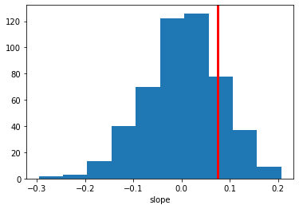

Posterior Predictive Checks
---------------------------

In this tutorial you will learn how to run posterior predictive checks
in HDDM.

A posterior predictive check is a very useful tool when you want to
evaluate if your model can reproduce key patterns in your data.
Specifically, you can define a summary statistic that describes the
pattern you are interested in (e.g. accuracy in your task) and then
simulate new data from the posterior of your fitted model. You can the
apply the the summary statistic to each of the data sets you simulated
from the posterior and see if the model does a good job of reproducing
this pattern by comparing the summary statistics from the simulations to
the summary statistic caluclated over the model.

What is critical is that you do not only get a single summary statistic
from the simulations but a whole distribution which captures the
uncertainty in our model estimate.

Lets do a simple analysis using simulated data. First, import HDDM.

.. code:: ipython3

    import hddm
    import matplotlib.pyplot as plt
    import numpy as np
    %matplotlib inline
    
    import warnings
    warnings.filterwarnings('ignore')

Simulate data from known parameters and two conditions (easy and hard).

.. code:: ipython3

    data, params = hddm.generate.gen_rand_data(params={'easy': {'v': 1, 'a': 2, 't': .3},
                                                       'hard': {'v': 1, 'a': 2, 't': .3}})

First, lets estimate the same model that was used to generate the data.

.. code:: ipython3

    m = hddm.HDDM(data, depends_on={'v': 'condition'})
    m.sample(1000, burn=20)

.. parsed-literal::

    No model attribute --> setting up standard HDDM
    Set model to ddm
     [-----------------100%-----------------] 1000 of 1000 complete in 12.5 sec

.. parsed-literal::

    <pymc.MCMC.MCMC at 0x104066090>

Next, we’ll want to simulate data from the model. By default,
``post_pred_gen()`` will use 500 parameter values from the posterior
(i.e. posterior samples) and simulate a different data set for each
parameter value.

.. code:: ipython3

    print(m.nodes_db)

.. parsed-literal::

               knode_name stochastic observed   subj        node      tag  \
    a                   a       True    False  False           a       ()   
    v(easy)             v       True    False  False     v(easy)  (easy,)   
    v(hard)             v       True    False  False     v(hard)  (hard,)   
    t                   t       True    False  False           t       ()   
    wfpt(easy)       wfpt      False     True  False  wfpt(easy)  (easy,)   
    wfpt(hard)       wfpt      False     True  False  wfpt(hard)  (hard,)   
    
                    depends hidden   rt response subj_idx condition      mean  \
    a                    []  False  NaN      NaN      NaN       NaN   1.90643   
    v(easy)     [condition]  False  NaN      NaN      NaN      easy   1.06179   
    v(hard)     [condition]  False  NaN      NaN      NaN      hard  0.943137   
    t                    []  False  NaN      NaN      NaN       NaN  0.341715   
    wfpt(easy)  [condition]  False  NaN      NaN      NaN      easy       NaN   
    wfpt(hard)  [condition]  False  NaN      NaN      NaN      hard       NaN   
    
                      std      2.5q       25q       50q       75q     97.5q  \
    a            0.123325   1.70192   1.81497   1.89453   1.97966   2.18115   
    v(easy)      0.213885  0.672581  0.925245   1.05542    1.1914   1.49813   
    v(hard)       0.17852  0.605106  0.817572  0.944719   1.06105   1.27941   
    t           0.0261543  0.278789  0.325973  0.344599  0.362117  0.383125   
    wfpt(easy)        NaN       NaN       NaN       NaN       NaN       NaN   
    wfpt(hard)        NaN       NaN       NaN       NaN       NaN       NaN   
    
                    mc err  
    a           0.00666755  
    v(easy)     0.00718197  
    v(hard)     0.00616936  
    t           0.00127485  
    wfpt(easy)         NaN  
    wfpt(hard)         NaN  

.. code:: ipython3

    hddm.analyze.plot_posterior_nodes(m.nodes_db.loc[['v(easy)', 'v(hard)'], 'node'])

.. image:: tutorial_post_pred_files/tutorial_post_pred_9_0.png

.. code:: ipython3

    ppc_data = hddm.utils.post_pred_gen(m)

.. parsed-literal::

     [--------------------------150%---------------------------] 3 of 2 complete in 5.9 sec

.. code:: ipython3

    hddm.utils.post_pred_stats(data, ppc_data)

.. raw:: html

    

    
    <table border="1" class="dataframe">
      <thead>
        <tr style="text-align: right;">
          <th></th>
          <th>observed</th>
          <th>mean</th>
          <th>std</th>
          <th>SEM</th>
          <th>MSE</th>
          <th>credible</th>
          <th>quantile</th>
          <th>mahalanobis</th>
        </tr>
        <tr>
          <th>stat</th>
          <th></th>
          <th></th>
          <th></th>
          <th></th>
          <th></th>
          <th></th>
          <th></th>
          <th></th>
        </tr>
      </thead>
      <tbody>
        <tr>
          <th>accuracy</th>
          <td>0.910000</td>
          <td>0.927500</td>
          <td>0.050637</td>
          <td>0.000306</td>
          <td>0.002870</td>
          <td>True</td>
          <td>31.500000</td>
          <td>0.345593</td>
        </tr>
        <tr>
          <th>mean_ub</th>
          <td>0.935440</td>
          <td>0.951484</td>
          <td>0.098785</td>
          <td>0.000257</td>
          <td>0.010016</td>
          <td>True</td>
          <td>46.400002</td>
          <td>0.162416</td>
        </tr>
        <tr>
          <th>std_ub</th>
          <td>0.421473</td>
          <td>0.464852</td>
          <td>0.111991</td>
          <td>0.001882</td>
          <td>0.014424</td>
          <td>True</td>
          <td>37.700001</td>
          <td>0.387345</td>
        </tr>
        <tr>
          <th>10q_ub</th>
          <td>0.501000</td>
          <td>0.521309</td>
          <td>0.039991</td>
          <td>0.000412</td>
          <td>0.002012</td>
          <td>True</td>
          <td>32.200001</td>
          <td>0.507850</td>
        </tr>
        <tr>
          <th>30q_ub</th>
          <td>0.686000</td>
          <td>0.658764</td>
          <td>0.057687</td>
          <td>0.000742</td>
          <td>0.004070</td>
          <td>True</td>
          <td>71.500000</td>
          <td>0.472135</td>
        </tr>
        <tr>
          <th>50q_ub</th>
          <td>0.832000</td>
          <td>0.820630</td>
          <td>0.088531</td>
          <td>0.000129</td>
          <td>0.007967</td>
          <td>True</td>
          <td>59.900002</td>
          <td>0.128429</td>
        </tr>
        <tr>
          <th>70q_ub</th>
          <td>1.008000</td>
          <td>1.053636</td>
          <td>0.134238</td>
          <td>0.002083</td>
          <td>0.020102</td>
          <td>True</td>
          <td>40.200001</td>
          <td>0.339962</td>
        </tr>
        <tr>
          <th>90q_ub</th>
          <td>1.573000</td>
          <td>1.542863</td>
          <td>0.247801</td>
          <td>0.000908</td>
          <td>0.062314</td>
          <td>True</td>
          <td>59.599998</td>
          <td>0.121618</td>
        </tr>
        <tr>
          <th>mean_lb</th>
          <td>-1.049667</td>
          <td>-0.990737</td>
          <td>0.350941</td>
          <td>0.003473</td>
          <td>0.126632</td>
          <td>True</td>
          <td>33.798283</td>
          <td>0.167918</td>
        </tr>
        <tr>
          <th>std_lb</th>
          <td>0.430255</td>
          <td>0.297619</td>
          <td>0.251784</td>
          <td>0.017592</td>
          <td>0.080988</td>
          <td>True</td>
          <td>74.248924</td>
          <td>0.526784</td>
        </tr>
        <tr>
          <th>10q_lb</th>
          <td>0.491400</td>
          <td>0.726807</td>
          <td>0.332695</td>
          <td>0.055416</td>
          <td>0.166103</td>
          <td>True</td>
          <td>9.442060</td>
          <td>0.707575</td>
        </tr>
        <tr>
          <th>30q_lb</th>
          <td>0.799600</td>
          <td>0.819943</td>
          <td>0.335312</td>
          <td>0.000414</td>
          <td>0.112848</td>
          <td>True</td>
          <td>61.266094</td>
          <td>0.060669</td>
        </tr>
        <tr>
          <th>50q_lb</th>
          <td>1.130000</td>
          <td>0.928716</td>
          <td>0.356847</td>
          <td>0.040515</td>
          <td>0.167855</td>
          <td>True</td>
          <td>80.686699</td>
          <td>0.564064</td>
        </tr>
        <tr>
          <th>70q_lb</th>
          <td>1.192800</td>
          <td>1.076653</td>
          <td>0.398996</td>
          <td>0.013490</td>
          <td>0.172688</td>
          <td>True</td>
          <td>69.849785</td>
          <td>0.291099</td>
        </tr>
        <tr>
          <th>90q_lb</th>
          <td>1.516800</td>
          <td>1.302383</td>
          <td>0.520954</td>
          <td>0.045975</td>
          <td>0.317368</td>
          <td>True</td>
          <td>71.995705</td>
          <td>0.411585</td>
        </tr>
      </tbody>
    </table>
    

The returned data structure is a pandas ``DataFrame`` object with a
hierarchical index.

.. code:: ipython3

    ppc_data.head(10)

.. raw:: html

    

    
    <table border="1" class="dataframe">
      <thead>
        <tr style="text-align: right;">
          <th></th>
          <th></th>
          <th></th>
          <th>rt</th>
          <th>response</th>
        </tr>
        <tr>
          <th>node</th>
          <th>sample</th>
          <th></th>
          <th></th>
          <th></th>
        </tr>
      </thead>
      <tbody>
        <tr>
          <th rowspan="10" valign="top">wfpt(easy)</th>
          <th rowspan="10" valign="top">0</th>
          <th>0</th>
          <td>0.481109</td>
          <td>1</td>
        </tr>
        <tr>
          <th>1</th>
          <td>0.755106</td>
          <td>1</td>
        </tr>
        <tr>
          <th>2</th>
          <td>0.713106</td>
          <td>1</td>
        </tr>
        <tr>
          <th>3</th>
          <td>1.100101</td>
          <td>1</td>
        </tr>
        <tr>
          <th>4</th>
          <td>0.905104</td>
          <td>1</td>
        </tr>
        <tr>
          <th>5</th>
          <td>0.716106</td>
          <td>1</td>
        </tr>
        <tr>
          <th>6</th>
          <td>-0.873104</td>
          <td>0</td>
        </tr>
        <tr>
          <th>7</th>
          <td>0.404109</td>
          <td>1</td>
        </tr>
        <tr>
          <th>8</th>
          <td>1.566114</td>
          <td>1</td>
        </tr>
        <tr>
          <th>9</th>
          <td>1.419107</td>
          <td>1</td>
        </tr>
      </tbody>
    </table>
    

The first level of the ``DataFrame`` contains each observed node. In
this case the easy condition. If we had multiple subjects we would get
one for each subject.

The second level contains the simulated data sets. Since we simulated
500, these will go from 0 to 499 – each with generated from a different
parameter value sampled from the posterior.

The third level is the same index as used in the data and numbers each
trial in your data.

For more information on how to work with hierarchical indices, see the
`Pandas
documentation <http://pandas.pydata.org/pandas-docs/stable/indexing.html#hierarchical-indexing-multiindex>`__.

There are also some helpful options like ``append_data`` you can pass to
``post_pred_gen()``.

.. code:: ipython3

    help(hddm.utils.post_pred_gen)

.. parsed-literal::

    Help on function post_pred_gen in module kabuki.analyze:
    
    post_pred_gen(model, groupby=None, samples=500, append_data=False, add_model_parameters=False, progress_bar=True)
        Run posterior predictive check on a model.
        
        :Arguments:
            model : kabuki.Hierarchical
                Kabuki model over which to compute the ppc on.
        
        :Optional:
            samples : int
                How many samples to generate for each node.
            groupby : list
                Alternative grouping of the data. If not supplied, uses splitting
                of the model (as provided by depends_on).
            append_data : bool (default=False)
                Whether to append the observed data of each node to the replicatons.
            progress_bar : bool (default=True)
                Display progress bar
        
        :Returns:
            Hierarchical pandas.DataFrame with multiple sampled RT data sets.
            1st level: wfpt node
            2nd level: posterior predictive sample
            3rd level: original data index
        
        :See also:
            post_pred_stats
    

Now we want to compute the summary statistics over each simulated data
set and compare that to the summary statistic of our actual data by
calling ``post_pred_stats()``.

.. code:: ipython3

    ppc_compare = hddm.utils.post_pred_stats(data, ppc_data)

.. code:: ipython3

    print(ppc_compare)

.. parsed-literal::

              observed      mean       std       SEM       MSE credible  \
    stat                                                                  
    accuracy  0.910000  0.927500  0.050637  0.000306  0.002870     True   
    mean_ub   0.935440  0.951484  0.098785  0.000257  0.010016     True   
    std_ub    0.421473  0.464852  0.111991  0.001882  0.014424     True   
    10q_ub    0.501000  0.521309  0.039991  0.000412  0.002012     True   
    30q_ub    0.686000  0.658764  0.057687  0.000742  0.004070     True   
    50q_ub    0.832000  0.820630  0.088531  0.000129  0.007967     True   
    70q_ub    1.008000  1.053636  0.134238  0.002083  0.020102     True   
    90q_ub    1.573000  1.542863  0.247801  0.000908  0.062314     True   
    mean_lb  -1.049667 -0.990737  0.350941  0.003473  0.126632     True   
    std_lb    0.430255  0.297619  0.251784  0.017592  0.080988     True   
    10q_lb    0.491400  0.726807  0.332695  0.055416  0.166103     True   
    30q_lb    0.799600  0.819943  0.335312  0.000414  0.112848     True   
    50q_lb    1.130000  0.928716  0.356847  0.040515  0.167855     True   
    70q_lb    1.192800  1.076653  0.398996  0.013490  0.172688     True   
    90q_lb    1.516800  1.302383  0.520954  0.045975  0.317368     True   
    
               quantile  mahalanobis  
    stat                              
    accuracy  31.500000     0.345593  
    mean_ub   46.400002     0.162416  
    std_ub    37.700001     0.387345  
    10q_ub    32.200001     0.507850  
    30q_ub    71.500000     0.472135  
    50q_ub    59.900002     0.128429  
    70q_ub    40.200001     0.339962  
    90q_ub    59.599998     0.121618  
    mean_lb   33.798283     0.167918  
    std_lb    74.248924     0.526784  
    10q_lb     9.442060     0.707575  
    30q_lb    61.266094     0.060669  
    50q_lb    80.686699     0.564064  
    70q_lb    69.849785     0.291099  
    90q_lb    71.995705     0.411585  

As you can see, we did not have to define the summary statistics as by
default, ``HDDM`` already calculates a bunch of useful statistics for RT
analysis such as the accuracy, mean RT of the upper and lower boundary
(ub and lb respectively), standard deviation and quantiles. These are
listed in the rows of the DataFrame.

For each distribution of summary statistics there are multiple ways to
compare them to the summary statistic obtained on the observerd data.
These are listed in the columns. ``observed`` is just the value of the
summary statistic of your data. ``mean`` is the mean of the summary
statistics of the simulated data sets (they should be a good match if
the model reproduces them). ``std`` is a measure of how much variation
is produced in the summary statistic.

The rest of the columns are measures of how far the summary statistic of
the data is away from the summary statistics of the simulated data.
``SEM`` = standard error from the mean, ``MSE`` = mean-squared error,
``credible`` = in the 95% credible interval.

Finally, we can also tell ``post_pred_stats()`` to return the summary
statistics themselves by setting ``call_compare=False``:

.. code:: ipython3

    ppc_stats = hddm.utils.post_pred_stats(data, ppc_data, call_compare=False)

.. code:: ipython3

    print(ppc_stats.head())

.. parsed-literal::

                       accuracy   mean_ub    std_ub    10q_ub    30q_ub    50q_ub  \
    node       sample                                                               
    wfpt(easy) 0           0.86  1.062849  0.724248  0.484509  0.667707  0.905104   
               1           0.98  0.977835  0.474633  0.498661  0.680059  0.882057   
               2           0.82  0.996223  0.515579  0.555150  0.671149  0.817147   
               3           0.88  0.875679  0.305067  0.510363  0.733061  0.835860   
               4           0.92  0.815038  0.503699  0.510257  0.593757  0.626257   
    
                         70q_ub    90q_ub   mean_lb    std_lb    10q_lb    30q_lb  \
    node       sample                                                               
    wfpt(easy) 0       1.078501  1.749323 -1.398971  0.610027  0.740706  1.084301   
               1       1.133453  1.642467 -0.624060  0.000000  0.624060  0.624060   
               2       1.004145  1.785162 -1.002371  0.407241  0.611750  0.756748   
               3       0.951658  1.376258 -0.928192  0.198288  0.706861  0.757861   
               4       0.779755  1.143250 -1.067014  0.635796  0.646857  0.666057   
    
                         50q_lb    70q_lb    90q_lb  
    node       sample                                
    wfpt(easy) 0       1.268101  1.595516  2.214336  
               1       0.624060  0.624060  0.624060  
               2       0.802147  1.145143  1.375747  
               3       0.916359  1.091857  1.161356  
               4       0.733756  0.934758  1.753776  

This ``DataFrame`` has a row for each simulated data set. The columns
are the different summary statistics.

Using PPC for model comparison with the ``groupby`` argument
~~~~~~~~~~~~~~~~~~~~~~~~~~~~~~~~~~~~~~~~~~~~~~~~~~~~~~~~~~~~

One useful application of PPC is to perform model comparison.
Specifically, you might estimate two models, one for which a certain
parameter is split for a condition (say drift-rate ``v`` for hard and
easy conditions to stay with our example above) and one in which those
conditions are pooled and you only estimate one drift-rate.

You then want to test which model explains the data better to assess
whether the two conditions are really different. To do this, we can
generate data from both models and see if the pooled model
systematically misses aspects of the RT data of the two conditions. This
is what the ``groupby`` keyword argument is for. Without it, if you ran
``post_pred_gen()`` on the pooled model you would get simulated RT data
which was not split by conditions. Note that while the RT data will be
split by condition, the exact same parameters are used to simulate data
of the two conditions as the pooled model does not separate them. It
simply allows us to match the two conditions present in the data to the
jointly simulated data more easily.

.. code:: ipython3

    m_pooled = hddm.HDDM(data) # v does not depend on conditions
    m_pooled.sample(1000, burn=20)
    ppc_data_pooled = hddm.utils.post_pred_gen(m_pooled, groupby=['condition'])

You could then compare ``ppc_data_pooled`` to ``ppc_data`` above (by
passing them to ``post_pred_stats``) and find that the model with
separate drift-rates accounts for accuracy (``mean_ub``) in both
conditions, while the pooled model can’t account for accuracy in either
condition (e.g. lower ``MSE``).

Defining your own summary statistics
~~~~~~~~~~~~~~~~~~~~~~~~~~~~~~~~~~~~

You can also define your own summary statistics and pass them to
``post_pred_stats()``:

.. code:: ipython3

    ppc_stats = hddm.utils.post_pred_stats(data, ppc_data, stats=lambda x: np.mean(x), call_compare=False)

.. code:: ipython3

    ppc_stats.head()

.. raw:: html

    

    
    <table border="1" class="dataframe">
      <thead>
        <tr style="text-align: right;">
          <th></th>
          <th></th>
          <th>stat</th>
        </tr>
        <tr>
          <th>node</th>
          <th>sample</th>
          <th></th>
        </tr>
      </thead>
      <tbody>
        <tr>
          <th rowspan="5" valign="top">wfpt(easy)</th>
          <th>0</th>
          <td>0.718194</td>
        </tr>
        <tr>
          <th>1</th>
          <td>0.945797</td>
        </tr>
        <tr>
          <th>2</th>
          <td>0.636476</td>
        </tr>
        <tr>
          <th>3</th>
          <td>0.659214</td>
        </tr>
        <tr>
          <th>4</th>
          <td>0.664474</td>
        </tr>
      </tbody>
    </table>
    

Note that ``stats`` can also be a dictionary mapping the name of the
summary statistic to its function.

Summary statistics relating to outside variables
~~~~~~~~~~~~~~~~~~~~~~~~~~~~~~~~~~~~~~~~~~~~~~~~

Another useful way to apply posterior predictive checks is if you have
trial-by-trial measure (e.g. EEG brain measure). In that case the
``append_data`` keyword argument is useful.

Lets add a dummy column to our data. This is going to be uncorrelated to
anything but you’ll get the idea.

.. code:: ipython3

    from numpy.random import randn
    data['trlbytrl'] = randn(len(data))

.. code:: ipython3

    m_reg = hddm.HDDMRegressor(data, 'v ~ trlbytrl')
    m_reg.sample(1000, burn=20)
    
    ppc_data = hddm.utils.post_pred_gen(m_reg, append_data=True)

.. parsed-literal::

    No model attribute --> setting up standard HDDM
    Set model to ddm
     [-----------------100%-----------------] 1 of 1 complete in 0.0 sec1.4 sec

.. code:: ipython3

    from scipy.stats import linregress
    ppc_regression = []
    for (node, sample), sim_data in ppc_data.groupby(level=(0, 1)):
        ppc_regression.append(linregress(sim_data.trlbytrl, sim_data.rt_sampled)[0]) # slope
        
    orig_regression = linregress(data.trlbytrl, data.rt)[0]

.. code:: ipython3

    cnt = 0
    for (node, sample), sim_data in ppc_data.groupby(level=(0, 1)):
        print(sim_data)
        cnt += 1
        if cnt > 2:
            break

.. parsed-literal::

                    rt_sampled  response_sampled  index     rt  response  \
    node sample                                                            
    wfpt 0      0     1.121020                 1      0  0.934       1.0   
                1     0.487028                 1      1  0.802       1.0   
                2     1.383025                 1      2  1.394       1.0   
                3     0.762025                 1      3  1.213       1.0   
                4     1.609036                 1      4 -1.434       0.0   
    ...                    ...               ...    ...    ...       ...   
                95    0.717025                 1     95  1.015       1.0   
                96    0.711025                 1     96  0.827       1.0   
                97    0.805024                 1     97  0.468       1.0   
                98    1.552033                 1     98 -0.612       0.0   
                99    0.672026                 1     99  1.138       1.0   
    
                    subj_idx condition  trlbytrl  
    node sample                                   
    wfpt 0      0          0      easy  0.588377  
                1          0      easy -0.247001  
                2          0      easy -0.347119  
                3          0      easy  2.098002  
                4          0      easy -0.850838  
    ...                  ...       ...       ...  
                95         0      hard  2.381048  
                96         0      hard  0.181995  
                97         0      hard  0.374229  
                98         0      hard  0.278482  
                99         0      hard  1.971242  
    
    [100 rows x 8 columns]
                    rt_sampled  response_sampled  index     rt  response  \
    node sample                                                            
    wfpt 1      0     0.859229                 1      0  0.934       1.0   
                1     0.430233                 1      1  0.802       1.0   
                2     0.728231                 1      2  1.394       1.0   
                3     0.570233                 1      3  1.213       1.0   
                4     0.584233                 1      4 -1.434       0.0   
    ...                    ...               ...    ...    ...       ...   
                95    2.195267                 1     95  1.015       1.0   
                96   -0.518234                 0     96  0.827       1.0   
                97    0.573233                 1     97  0.468       1.0   
                98    0.705231                 1     98 -0.612       0.0   
                99    0.475234                 1     99  1.138       1.0   
    
                    subj_idx condition  trlbytrl  
    node sample                                   
    wfpt 1      0          0      easy  0.588377  
                1          0      easy -0.247001  
                2          0      easy -0.347119  
                3          0      easy  2.098002  
                4          0      easy -0.850838  
    ...                  ...       ...       ...  
                95         0      hard  2.381048  
                96         0      hard  0.181995  
                97         0      hard  0.374229  
                98         0      hard  0.278482  
                99         0      hard  1.971242  
    
    [100 rows x 8 columns]
                    rt_sampled  response_sampled  index     rt  response  \
    node sample                                                            
    wfpt 2      0     0.646321                 1      0  0.934       1.0   
                1     0.688321                 1      1  0.802       1.0   
                2     0.417322                 1      2  1.394       1.0   
                3    -0.748320                 0      3  1.213       1.0   
                4     0.575322                 1      4 -1.434       0.0   
    ...                    ...               ...    ...    ...       ...   
                95    0.631321                 1     95  1.015       1.0   
                96    0.563322                 1     96  0.827       1.0   
                97    0.737320                 1     97  0.468       1.0   
                98    0.640321                 1     98 -0.612       0.0   
                99    0.515322                 1     99  1.138       1.0   
    
                    subj_idx condition  trlbytrl  
    node sample                                   
    wfpt 2      0          0      easy  0.588377  
                1          0      easy -0.247001  
                2          0      easy -0.347119  
                3          0      easy  2.098002  
                4          0      easy -0.850838  
    ...                  ...       ...       ...  
                95         0      hard  2.381048  
                96         0      hard  0.181995  
                97         0      hard  0.374229  
                98         0      hard  0.278482  
                99         0      hard  1.971242  
    
    [100 rows x 8 columns]

.. code:: ipython3

    plt.hist(ppc_regression)
    plt.axvline(orig_regression, c='r', lw=3)
    plt.xlabel('slope')

.. parsed-literal::

    Text(0.5, 0, 'slope')

As you can see, the simulated data sets have on average no correlation
to our trial-by-trial measure (just as in the data) but we also get a
nice sense of the uncertainty in our estimation.
