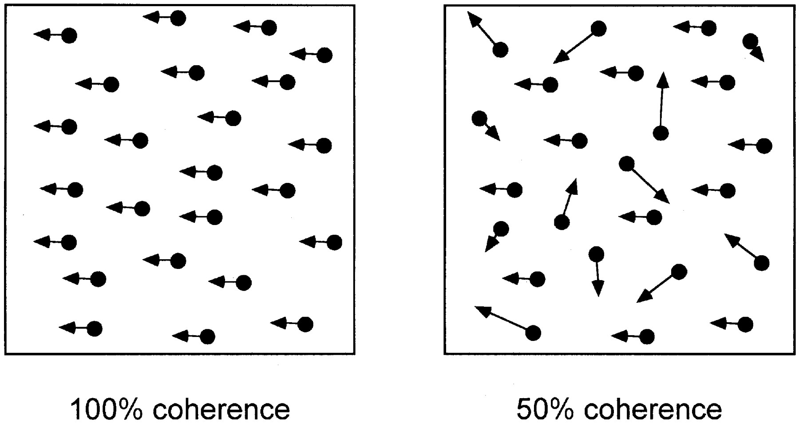
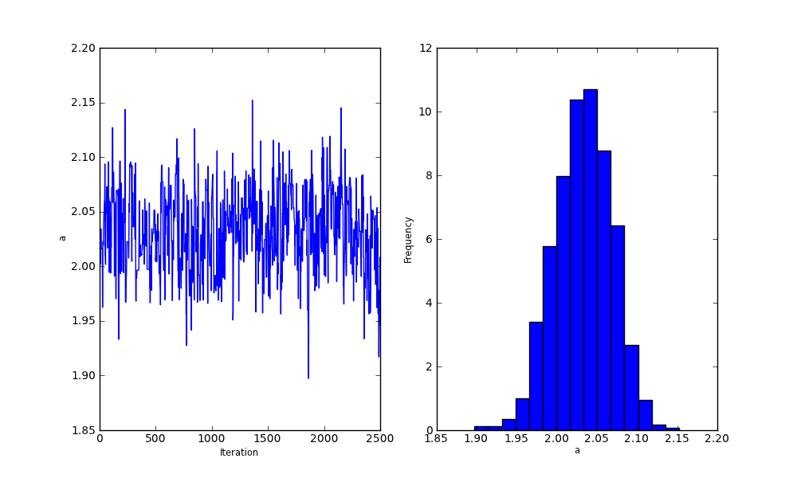
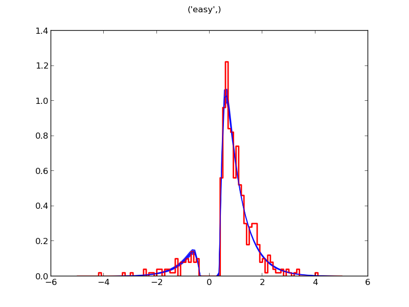
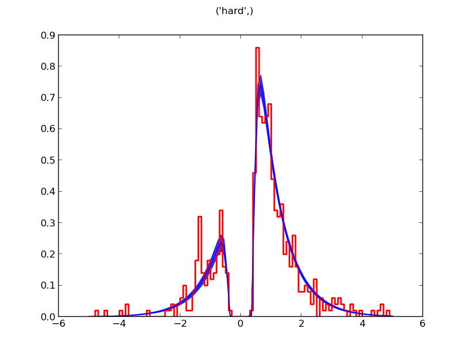

.. index:: Tutorial
.. _chap_tutorial_python:

Build your first model
======================

Imagine that we collected data from one subject on the moving dots or
coherent motion task (e.g., :cite:`RoitmanShadlen02`). In this task,
participants indicate, via a keypress, in which of two directions dots are
moving on a screen. Only some proportion of the dots move in a coherent
direction; the remaining dots move in random directions (i.e. incoherent; see the figure). In our
working example, consider an experiment in which subjects are presented with two conditions,
an easy, high coherence and a hard, low coherence condition. In the
following, we will walk through the steps on creating a model in HDDM
to estimate the underlying psychological decision making parameters of
this task.

First, you have to prepare your data to be in a specific format
(e.g. comma separated value; csv). The data that we use here were
generated from a simulated DDM processes (i.e. they are not real
data), so that we know the true underlying generative parameters. The
data file can be found in the examples directory and is named
simple_difficulty.csv (under Windows, these files can probably be
found in ``C:\Python27\Lib\site-packages\hddm\examples``). Lets take a
look at what it looks like:

.. literalinclude :: ../../hddm/examples/simple_difficulty.csv
   :lines: 1,101-105,579-582

The first line contains the header and specifies which columns contain
which data.

IMPORTANT: There must be one column named 'rt' with reaction time in
seconds and one named 'response'. Make sure there are only numerical
values in these columns.

First, you have to import hddm:

.. literalinclude :: ../../hddm/examples/simple_model.py
   :lines: 1

Next, we have to load the data into Python. HDDM expects a NumPy
structured array or a pandas_ DataFrame. You can load the data from a
csv files as follows:

.. literalinclude :: ../../hddm/examples/simple_model.py
   :lines: 4

HDDM requires the data frame to be in a specific format. It has to
have an RT column called 'rt', a column for which response was made
called 'response' and, if you have multiple subjects, a column
containing subject ids (these have to be integers) called 'subj_idx'.

After you loaded the data you can create the model object:

.. literalinclude :: ../../hddm/examples/simple_model.py
   :lines: 7

This model object contains your data, the corresponding model
specification and a number of methods to perform inference, do model
analysis etc. You may then sample from the posterior distribution by
calling:

.. literalinclude :: ../../hddm/examples/simple_model.py
   :lines: 10

Depending on the model and amount of data this can take some
time. After enough samples were generated, you may want to print some
statistics on the screen:

.. literalinclude :: ../../hddm/examples/simple_model.py
   :lines: 13

The parameters of DDM are usually abbreviated and have the following
meaning:

    * a: threshold
    * t: non-decision time
    * v: drift-rate
    * z: bias (optional)
    * sv: inter-trial variability in drift-rate (optional)
    * sz: inter-trial variability in bias (optional)
    * st: inter-trial variability in non-decision time (optional)

You can currently generate two plots to examine model fit. To see if
your chains converged and what the posteriors for each parameter looks
like you can call:

.. literalinclude :: ../../hddm/examples/simple_model.py
   :lines: 16

One of the outputs generated by this call produce a plot as follows.

The plot contains the generated samples (i.e. the chain) in the upper
left corner, the autocorrelation in the lower left corner aand
histogram of the posterior (i.e. the marginal) on the right side. As
pointed out in the introduction, we can rarely compute the posterior
analytically so we have to estimate it. MCMC is a standard methods
which allows you to draw samples from the posterior. On the left upper
side of the plot we see the trace of this sampling. The main thing to
look out for is if the chain drifts around such that the mean value is
not stable or if there are periods where it seems stuck in one place
(see the :role:`How-To` for tips on what to do if your chains did not
converge). In our case the chain of the parameter "a" (threshold)
seems to have converged nicely to the correct value. This is also
illustrated in the right side plot which is the histogram of the trace
and gives a feel for how to the posterior distribution looks like. In
our case, it looks like a normal distribution centered around a value
close to 2 -- the parameter that was used to generate the
data. Finally, plotted in the lower left corner is the
auto-correlation.

To see how well the model fits the RT distributions we analyze the
posterior predictive pdf:

.. literalinclude :: ../../hddm/examples/simple_model.py
   :lines: 17

In addition, HDDM generates some useful plots such as the posterior
predictive probability density on top of the normalized RT
distribution for each condition:

Note that error responses have been mirrored along the y-axis (to the
left) to display both RT distributions in one plot.

This function evaluates the DDM likelihood function from samples of
the posterior and plots it on top of the observed RTs. The solid blue
line thus represents the mean expected RT distribution and its width
(in transparent light blue) the model uncertainty in that region of
the RT distribution. The closer the two distributions look like, the
better the fit. Note that the RT distribution for the second response
is mirrored on the y-axis.

These plots allow you to see how good the estimation fits our
data. Here, we also see that our subjects make more errors and are
slower in the difficult condition. This combination is well captured
by the reduced drift-rate estimated for this condition.

The final program then looks as follows:

.. literalinclude :: ../../hddm/examples/simple_model.py

More complex models can be generated by specifying different
parameters during model creation. Say we wanted to create a model where
each subject receives its own set of parameters which are themselves
sampled from a group parameter distribution. Moreover, as in the
example above, we have two trial types in our data, easy and
hard. Based on previous research, we assume that difficulty affects
drift-rate 'v'. Thus, we want to fit different drift rate parameters
for those two conditions while keeping the other parameters fixed
across conditions. Finally, we want to use the full DDM with
inter-trial variability for drift, non-decision time ter and starting
point z. The full model requires integration of these variability
parameters and is hence much slower. The model creation and sampling
then might look like this (assuming we imported hddm and loaded the
data as above):

>>> model = hddm.HDDM(data, include=('sv', 'sz', 'st'), bias=True, depends_on={'v':'difficulty'})
>>> model.sample(5000, burn=20)

.. _pandas: http://pandas.pydata.org/
