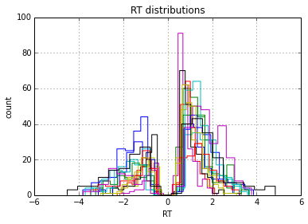
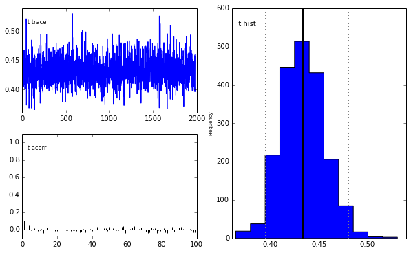
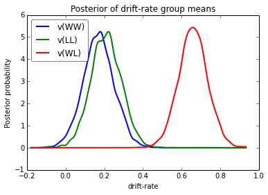
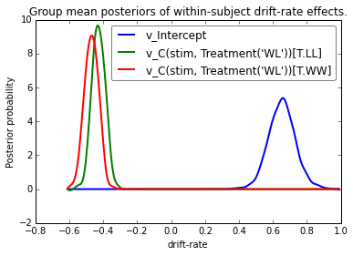

Demo
----

In the following we will show an example session of using HDDM to
analyze a real-world dataset. The main purpose is to provide an overview
of some of the funcionality and interface. By no means, however, is it a
complete overview of all the functionality in HDDM. For more
information, including on how to use HDDM as a command-line utility, we
refer to the online tutorial at
http://ski.clps.brown.edu/hddm\_docs/tutorial.html and the how-to at
http://ski.clps.brown.edu/hddm\_docs/howto.html. For a reference manual,
see http://ski.clps.brown.edu/hddm\_docs.

First, we have to import the modules we are going to use so that they
are available in our namespace. Pandas provides a table-oriented
data-structure and matplotlib is a module for generating graphs and
plots.

.. code:: python

    import pandas as pd
    import matplotlib.pyplot as plt
Next, we will import HDDM. At the time of this writing, this version was
used.

.. code:: python

    %matplotlib inline
    import hddm
    print hddm.__version__

.. parsed-literal::

    0.5.4.dev

Loading data
~~~~~~~~~~~~

Next, we will load in a data set. The easiest way to get your data into
HDDM is by storing it in a csv (comma-separated-value, see below) file.
In this example we will be using data collected in a reward-based
decision making experiment in our lab (Cavanagh et al 2011). In brief,
subjects choose between two symbols that have different histories of
reinforcement, which they first acquire through a learning phase: some
symbols more often leads to wins (W; 80%, 70% and 60% of trials in which
they are selected), whereas others only lead to win on 40%, 30%, or 20%
of the time and otherwise lead to losses (L). A test phase ensures in
which subjects choose between all paired combination of symbols without
feedback. These test trials can be devided into win-win (WW) trials, in
which they select between two symbols that had led to wins before (but
one more often than another); lose-lose trials (LL), and win-lose (WL)
trials, which are the easiest because one symbol had been a winner most
of the time. Thus WW and LL decisions together comprise high conflict
(HC) test trials (although there are other differences between them, we
don't focus on those here), whereas WL decisions are low conflict (LC).
The main hypothesis of the study was that high conflict trials induce an
increase in the decision threshold, and that the mechanism for this
threshold modulation depends on communication between mediofrontal
cortex (which exhibits increased activity under conditions of choice
uncertainty or conflict) and the subthalamic nucleus (STN) of the basal
ganglia (which provides a temporary brake on response selection by
increasing the decision threshold). The details of this mechanism are
described in other modeling papers (e.g., Ratcliff & Frank 2012).
Cavanagh et al 2011 tested this theory by measuring EEG activity over
mid-frontal cortex, focusing on the theta band, given prior associations
with conflict, and testing whether trial-to-trial variations in frontal
theta were related to adjustments in decision threshold during high
conflict trials. They tested the STN component of the theory by
administering the same experiment to patients who had deep brain
stimulation (dbs) of the STN, which interferes with normal processing.

The first ten lines of the data file look as follows:

.. code:: python

    !head cavanagh_theta_nn.csv

.. parsed-literal::

    subj_idx,stim,rt,response,theta,dbs,conf
    0,LL,1.21,1.0,0.65627512226100004,1,HC
    0,WL,1.6299999999999999,1.0,-0.32788867166199998,1,LC
    0,WW,1.03,1.0,-0.480284512399,1,HC
    0,WL,2.77,1.0,1.9274273452399999,1,LC
    0,WW,1.1399999999999999,0.0,-0.21323572605999999,1,HC
    0,WL,1.1499999999999999,1.0,-0.43620365940099998,1,LC
    0,LL,2.0,1.0,-0.27447891439400002,1,HC
    0,WL,1.04,0.0,0.66695707371400004,1,LC
    0,WW,0.85699999999999998,1.0,0.11861689909799999,1,HC

We use the ``hddm.load_csv()`` function to load this file.

.. code:: python

    data = hddm.load_csv('./cavanagh_theta_nn.csv')
.. code:: python

    data.head(10)

.. raw:: html

    

    <table border="1" class="dataframe">
      <thead>
        <tr style="text-align: right;">
          <th></th>
          <th>subj_idx</th>
          <th>stim</th>
          <th>rt</th>
          <th>response</th>
          <th>theta</th>
          <th>dbs</th>
          <th>conf</th>
        </tr>
      </thead>
      <tbody>
        <tr>
          <th>0</th>
          <td> 0</td>
          <td> LL</td>
          <td> 1.210</td>
          <td> 1</td>
          <td> 0.656275</td>
          <td> 1</td>
          <td> HC</td>
        </tr>
        <tr>
          <th>1</th>
          <td> 0</td>
          <td> WL</td>
          <td> 1.630</td>
          <td> 1</td>
          <td>-0.327889</td>
          <td> 1</td>
          <td> LC</td>
        </tr>
        <tr>
          <th>2</th>
          <td> 0</td>
          <td> WW</td>
          <td> 1.030</td>
          <td> 1</td>
          <td>-0.480285</td>
          <td> 1</td>
          <td> HC</td>
        </tr>
        <tr>
          <th>3</th>
          <td> 0</td>
          <td> WL</td>
          <td> 2.770</td>
          <td> 1</td>
          <td> 1.927427</td>
          <td> 1</td>
          <td> LC</td>
        </tr>
        <tr>
          <th>4</th>
          <td> 0</td>
          <td> WW</td>
          <td> 1.140</td>
          <td> 0</td>
          <td>-0.213236</td>
          <td> 1</td>
          <td> HC</td>
        </tr>
        <tr>
          <th>5</th>
          <td> 0</td>
          <td> WL</td>
          <td> 1.150</td>
          <td> 1</td>
          <td>-0.436204</td>
          <td> 1</td>
          <td> LC</td>
        </tr>
        <tr>
          <th>6</th>
          <td> 0</td>
          <td> LL</td>
          <td> 2.000</td>
          <td> 1</td>
          <td>-0.274479</td>
          <td> 1</td>
          <td> HC</td>
        </tr>
        <tr>
          <th>7</th>
          <td> 0</td>
          <td> WL</td>
          <td> 1.040</td>
          <td> 0</td>
          <td> 0.666957</td>
          <td> 1</td>
          <td> LC</td>
        </tr>
        <tr>
          <th>8</th>
          <td> 0</td>
          <td> WW</td>
          <td> 0.857</td>
          <td> 1</td>
          <td> 0.118617</td>
          <td> 1</td>
          <td> HC</td>
        </tr>
        <tr>
          <th>9</th>
          <td> 0</td>
          <td> WL</td>
          <td> 1.500</td>
          <td> 0</td>
          <td> 0.823626</td>
          <td> 1</td>
          <td> LC</td>
        </tr>
      </tbody>
    </table>
    

Lets look at the RT distributions of each individual subject using
pandas' ``groupby()`` functionality. Because there are two possible
responses (here we are using accuracy coding where 1 means the more
rewarding symbol was chosen, and 0 the less rewarding) we flip error RTs
to be negative.

.. code:: python

    data = hddm.utils.flip_errors(data)
    
    fig = plt.figure()
    ax = fig.add_subplot(111, xlabel='RT', ylabel='count', title='RT distributions')
    for i, subj_data in data.groupby('subj_idx'):
        subj_data.rt.hist(bins=20, histtype='step', ax=ax)
    
    plt.savefig('hddm_demo_fig_00.pdf')

Fitting a hierarchical model
~~~~~~~~~~~~~~~~~~~~~~~~~~~~

Lets fit a hierarchical DDM to this data set, starting off first with
the simplest model that does not allow parameters to vary by condition.

.. code:: python

    # Instantiate model object passing it our data (no need to call flip_errors() before passing it).
    # This will tailor an individual hierarchical DDM around your dataset.
    m = hddm.HDDM(data)
    # find a good starting point which helps with the convergence.
    m.find_starting_values()
    # start drawing 7000 samples and discarding 5000 as burn-in
    m.sample(2000, burn=20)

.. parsed-literal::

     [-----------------100%-----------------] 2000 of 2000 complete in 132.9 sec

.. parsed-literal::

    <pymc.MCMC.MCMC at 0x63455d0>

We now want to analyze our estimated model. ``m.print_stats()`` will
print a table of summary statistics for each parameters' posterior.
Because that is quite long we only print a subset of the parameters
using pandas selection functionality.

.. code:: python

    stats = m.gen_stats()
    stats[stats.index.isin(['a', 'a_std', 'a_subj.0', 'a_subj.1'])]

.. raw:: html

    

    <table border="1" class="dataframe">
      <thead>
        <tr style="text-align: right;">
          <th></th>
          <th>mean</th>
          <th>std</th>
          <th>2.5q</th>
          <th>25q</th>
          <th>50q</th>
          <th>75q</th>
          <th>97.5q</th>
          <th>mc err</th>
        </tr>
      </thead>
      <tbody>
        <tr>
          <th>a</th>
          <td>   2.06164</td>
          <td> 0.09584521</td>
          <td>  1.885639</td>
          <td>  1.995637</td>
          <td>  2.056966</td>
          <td>  2.123793</td>
          <td>  2.252141</td>
          <td> 0.002345797</td>
        </tr>
        <tr>
          <th>a_std</th>
          <td> 0.3774947</td>
          <td>  0.0855874</td>
          <td> 0.2473591</td>
          <td> 0.3179562</td>
          <td> 0.3635182</td>
          <td> 0.4216091</td>
          <td> 0.5746741</td>
          <td> 0.002728459</td>
        </tr>
        <tr>
          <th>a_subj.0</th>
          <td>  2.382019</td>
          <td> 0.05949433</td>
          <td>  2.271485</td>
          <td>  2.342974</td>
          <td>  2.380001</td>
          <td>  2.418977</td>
          <td>  2.506824</td>
          <td> 0.001894819</td>
        </tr>
        <tr>
          <th>a_subj.1</th>
          <td>   2.13155</td>
          <td> 0.06310563</td>
          <td>  2.018179</td>
          <td>  2.088753</td>
          <td>  2.127594</td>
          <td>  2.173424</td>
          <td>  2.259581</td>
          <td> 0.001932201</td>
        </tr>
      </tbody>
    </table>
    

As you can see, the model estimated the group mean parameter for
threshold ``a``, group variability ``a_std`` and individual subject
parameters ``a_subj.0``. Other parameters are not shown here.

The inference algorithm, MCMC, requires the chains of the model to have
properly converged. While there is no way to guarantee convergence for a
finite set of samples in MCMC, there are many heuristics that allow you
identify problems of convergence. One main analysis to look at is the
trace, the autocorrelation, and the marginal posterior. You can plot
these using the ``plot_posteriors()`` function. For the sake of brevity
we only plot three here. In practice, however, you will always want to
examine all of them.

.. code:: python

    m.plot_posteriors(['a', 't', 'v', 'a_std'])

.. parsed-literal::

    Plotting a
    Plotting a_std
    Plotting v
    Plotting t

.. image:: hddm_demo_files/hddm_demo_20_1.png

.. image:: hddm_demo_files/hddm_demo_20_2.png

.. image:: hddm_demo_files/hddm_demo_20_3.png

As you can see, there are no drifts or large jumps in the trace. The
autocorrelation is also very low.

The Gelman-Rubin statistic provides a more formal test for convergence
that compares the intra-chain variance to the intra-chain variance of
different runs of the same model.

.. code:: python

    models = []
    for i in range(5):
        m = hddm.HDDM(data)
        m.find_starting_values()
        m.sample(5000, burn=20)
        models.append(m)
    
    hddm.analyze.gelman_rubin(models)

.. parsed-literal::

     [-----------------100%-----------------] 5000 of 5000 complete in 316.2 sec

.. parsed-literal::

    {'a': 0.99986111768771579,
     'a_std': 1.0004196099896612,
     'a_subj.0': 0.99988274311195402,
     'a_subj.1': 0.99987965313220728,
     'a_subj.10': 0.99985357520291229,
     'a_subj.11': 1.0005899502201789,
     'a_subj.12': 0.99993678545304787,
     'a_subj.13': 1.000461174627318,
     'a_subj.2': 1.0002035092619752,
     'a_subj.3': 1.0003262048143702,
     'a_subj.4': 1.0005947420163532,
     'a_subj.5': 0.99990445731401401,
     'a_subj.6': 1.0001622164718598,
     'a_subj.7': 0.99994557169043841,
     'a_subj.8': 0.99994052775154385,
     'a_subj.9': 0.99989195463691227,
     't': 0.9999066460778635,
     't_std': 0.99991507324567064,
     't_subj.0': 1.000073590917147,
     't_subj.1': 1.000057511405243,
     't_subj.10': 0.9999291543784008,
     't_subj.11': 1.0004279776213225,
     't_subj.12': 1.0000997478798959,
     't_subj.13': 1.0000684865636429,
     't_subj.2': 1.000043538704473,
     't_subj.3': 1.0007462032289922,
     't_subj.4': 1.0002421010918123,
     't_subj.5': 0.99991250131955678,
     't_subj.6': 1.0001841340922351,
     't_subj.7': 1.0001766144445334,
     't_subj.8': 0.99995599640658817,
     't_subj.9': 0.99989323480149928,
     'v': 1.0000003467296055,
     'v_std': 1.0006659255610744,
     'v_subj.0': 1.0000443557902641,
     'v_subj.1': 0.99996462251437535,
     'v_subj.10': 1.0000527253445828,
     'v_subj.11': 1.0000646148050987,
     'v_subj.12': 0.99997817143162659,
     'v_subj.13': 0.99998310938217094,
     'v_subj.2': 0.99983001503178104,
     'v_subj.3': 0.99991527650060885,
     'v_subj.4': 1.0000620164315519,
     'v_subj.5': 1.0000205893384675,
     'v_subj.6': 0.99988826203280401,
     'v_subj.7': 0.99986755400860694,
     'v_subj.8': 0.99991341960306523,
     'v_subj.9': 1.000209824432152}

We might also be interested in how well the model fits the data. To
inspect this visually you can call ``plot_posterior_predictive()`` to
plot individual subject RT distributions in red on top of the predictive
likelihood in blue.

.. code:: python

    m.plot_posterior_predictive(figsize=(14, 10))

.. image:: hddm_demo_files/hddm_demo_25_0.png

While visually the fit looks decent, we also have prior knowledge about
our experiment which could be leveraged to improve the model. For
example, we would expect that because LL and WW trials are harder than
WL trials, drift rate would be higher in WL, which has lower uncertainty
about the correct choice. (One could also develop a posterior predictive
check statistic that would evaluate whether accuracy and mean RT are
different in the different conditions. Since the parameters of the model
were estimated to be the same across conditions, the posterior
predictive distributions for these conditions would not look different
from each other, whereas those in the data do. A formal posterior
predictive check would thus show that the data violates the simple
assumptions of the model. This is not evident above because we simply
plotted the distributions collapsed across conditions).

In any case, we can create a new model quite easily which estimates
separate drift-rate ``v`` for those different conditions by using the
``depends_on`` keyword argument. This argument expects a Python ``dict``
which maps the parameter to be split to the column name containing the
conditions we want to split by.

.. code:: python

    m_stim = hddm.HDDM(data, depends_on={'v': 'stim'})
    m_stim.find_starting_values()
    m_stim.sample(10000, burn=1000)

.. parsed-literal::

     [-----------------100%-----------------] 10000 of 10000 complete in 769.5 sec

.. parsed-literal::

    <pymc.MCMC.MCMC at 0x8e13d10>

We will skip examining the traces for this model and instead look at the
posteriors of ``v`` for the different conditions. Below you can see that
the drift rate for the low conflict WL condition is substantially
greater than that for the other two conditions, which are fairly similar
to each other.

.. code:: python

    v_WW, v_LL, v_WL = m_stim.nodes_db.node[['v(WW)', 'v(LL)', 'v(WL)']]
    hddm.analyze.plot_posterior_nodes([v_WW, v_LL, v_WL])
    plt.xlabel('drift-rate')
    plt.ylabel('Posterior probability')
    plt.title('Posterior of drift-rate group means')
    plt.savefig('hddm_demo_fig_06.pdf')

While it would be easy to provide syntacic sugar for the above
expression there are many cases where you want access to the underlying
distributions. These are stored inside of ``nodes_db`` which is a pandas
``DataFrame`` containing information about each distribution. Here we
retrieve the actual node objects containing the trace from the ``node``
colum.

One benefit of estimating the model in a Bayesian framework is that we
can do significance testing directly on the posterior rather than
relying on frequentist statistics (See Kruschke's book for many examples
of the advantages of this approach). For example, we might be interested
in whether the drift-rate for WW is larger than that for LL, or whether
drift-rate for LL is larger than WL. The below code allows us to examine
the proportion of the posteriors in which the drift rate for one
condition is greater than the other. It can be seen that the posteriors
for LL do not overlap at all for WL, and thus the probability that LL is
greater than WL should be near zero.

.. code:: python

    print "P(WW > LL) = ", (v_WW.trace() > v_LL.trace()).mean()
    print "P(LL > WL) = ", (v_LL.trace() > v_WL.trace()).mean()

.. parsed-literal::

    P(WW > LL) =  0.368555555556
    P(LL > WL) =  0.000111111111111

                Lets compare the two models using the deviance information criterion (DIC; lower is better). Note that the DIC measures the fit of the model to the data, penalizing for complexity in the addition of degrees of freedom (the model with three drift rates has more dF than the model with one). The DIC is known to be somewhat biased in selecting the model with greater complexity, although alternative forms exist (see Plummer 2008). One should use the DIC with caution, although other forms of model comparison such as the Bayes Factor (BF) have other problems, such as being overly sensitive to the prior parameter distributions of the models. Future versions of HDDM will include the partial Bayes Factor, which allows the BF to be computed based on informative priors taken from a subset of the data, and which we generally believe to provide a better measure of model fit. Nevertheless, DIC can be a useful metric with these caveats in mind.
                
.. code:: python

    print "Lumped model DIC: %f" % m.dic
    print "Stimulus model DIC: %f" % m_stim.dic

.. parsed-literal::

    Lumped model DIC: 10960.879362
    Stimulus model DIC: 10774.754010

Within-subject effects
----------------------

Note that while the ``m_stim`` model we created above estimates
different drift-rates ``v`` for each subject, it implicitly assumes that
the different conditions are completely independent of each other,
because each drift rate was sampled from a separate group prior.
However, there may be individual differences in overall performance, and
if so it is reasonable to assume that someone who would be better at
``WL`` would also be better at ``LL``. To model this intuition we can
use a within-subject model where an intercept is used to capture overall
performance in the 'WL' condition as a baseline, and then the other
``LL`` and ``WW`` conditions are expressed relative to ``WL``. (Perhaps
every subject has a higher drift in WL than LL but there is huge
variance in their overall drift rates. In this scenario, the earlier
model would not have the power to detect the effect of condition on this
within subject effect, because there would be large posterior variance
in all of the drift rates, which would then overlap with each other. In
contrast, the within-subject model would estimate large variance in the
intercept but still allow the model to infer a non-zero effect of
condition with high precision).

``HDDM`` supports this via the ``patsy`` module which transforms model
strings to design matrices.

.. code:: python

    from patsy import dmatrix
    dmatrix("C(stim, Treatment('WL'))", data.head(10))

.. parsed-literal::

    DesignMatrix with shape (10, 3)
      Intercept  C(stim, Treatment('WL'))[T.LL]  C(stim, Treatment('WL'))[T.WW]
              1                               1                               0
              1                               0                               0
              1                               0                               1
              1                               0                               0
              1                               0                               1
              1                               0                               0
              1                               1                               0
              1                               0                               0
              1                               0                               1
              1                               0                               0
      Terms:
        'Intercept' (column 0)
        "C(stim, Treatment('WL'))" (columns 1:3)

``Patsy`` model specifications can be passed to the ``HDDMRegressor``
class as part of a descriptor that contains the string describing the
linear model and the ``outcome`` variable that should be replaced with
the output of the linear model -- in this case ``v``.

.. code:: python

    m_within_subj = hddm.HDDMRegressor(data, "v ~ C(stim, Treatment('WL'))")

.. parsed-literal::

    Adding these covariates:
    ['v_Intercept', "v_C(stim, Treatment('WL'))[T.LL]", "v_C(stim, Treatment('WL'))[T.WW]"]

.. code:: python

    m_within_subj.sample(5000, burn=200)

.. parsed-literal::

     [-----------------100%-----------------] 5001 of 5000 complete in 1736.3 sec

.. parsed-literal::

    <pymc.MCMC.MCMC at 0x7e20590>

.. code:: python

    v_WL, v_LL, v_WW = m_within_subj.nodes_db.ix[["v_Intercept", 
                                                  "v_C(stim, Treatment('WL'))[T.LL]", 
                                                  "v_C(stim, Treatment('WL'))[T.WW]"], 'node']
    hddm.analyze.plot_posterior_nodes([v_WL, v_LL, v_WW])
    plt.xlabel('drift-rate')
    plt.ylabel('Posterior probability')
    plt.title('Group mean posteriors of within-subject drift-rate effects.')
    plt.savefig('hddm_demo_fig_07.pdf')

Note that in the above plot ``LL`` and ``WW`` are expressed relative to
the ``WL`` condition (i.e. ``v_Intercept``). You can see that the
overall drift rate intercept, here applying to WL condition, is positive
(mode value roughly 0.7), whereas the within subject effects of
condition (WW and LL) are negative and do not overlap with zero.

Fitting regression models
-------------------------

As mentioned above, cognitive neuroscience has embraced the DDM as it
enables to link psychological processes to cognitive brain measures. The
Cavanagh et al (2011) study is a great example of this. EEG recordings
provided a trial-ty-trial measure of brain activity (frontal theta), and
it was found that this activity correlated with increases in decision
threshold in high conflict trials. Note that the data set and results
exhibit more features than we consider here for the time being
(specifically the manipulation of deep brain stimulation), but for
illustrative purposes, we replicate here that main theta-threshold
relationship in a model restricted to participants without brain
stimulation. For more information, see
http://ski.clps.brown.edu/papers/Cavanagh\_DBSEEG.pdf

.. code:: python

    m_reg = hddm.HDDMRegressor(data[data.dbs == 0], 
                               "a ~ theta:C(conf, Treatment('LC'))", 
                               depends_on={'v': 'stim'})

.. parsed-literal::

    Adding these covariates:
    ['a_Intercept', "a_theta:C(conf, Treatment('LC'))[HC]", "a_theta:C(conf, Treatment('LC'))[LC]"]

Instead of estimating one static threshold per subject across trials,
this model assumes the threshold to vary on each trial according to the
linear model specified above (as a function of their measured theta
activity). We also test whether this effect interacts with decision
conflict. For the stimuli we use dummy treatment coding with the
intercept being set on the WL condition. Internally, HDDM uses Patsy for
the linear model specification, see the `Patsy
documentation <https://patsy.readthedocs.org/en/latest/>`__ for more
details. The output notifies us about the different variables that being
estimated as part of the linear model. The Cavanagh paper, and results
shown later below, illustrate that this brain/behavior relationship
differs as a function of whether patients are on or off STN deep brain
stimulation, as hypothesized by the model that STN is responsible for
increasing the decision threshold when cortical theta rises).

.. code:: python

    m_reg.sample(5000, burn=200)

.. parsed-literal::

     [-----------------100%-----------------] 5000 of 5000 complete in 2382.3 sec

.. parsed-literal::

    <pymc.MCMC.MCMC at 0x710ee50>

.. code:: python

    theta = m_reg.nodes_db.node["a_theta:C(conf, Treatment('LC'))[HC]"]
    hddm.analyze.plot_posterior_nodes([theta], bins=20)
    plt.xlabel('Theta coeffecient in ')
    print "P(a_theta < 0) = ", (theta.trace() < 0).mean()

.. parsed-literal::

    P(a_theta < 0) =  0.0304166666667

.. image:: hddm_demo_files/hddm_demo_48_1.png

The above posterior shows that the effect of trial to trial variations
in frontal theta are to increase the estimated decision threshold: the
regression coefficient is positive, and more than 96% of it is greater
than zero.

As noted above, this experiment also tested patients on deep brain
stimulation (dbs). The full model in the paper thus allowed an
additional factor to estimate how dbs interacts with theta-threshold
relationship. Here we show for illustrative purposes that we can capture
the same effect by simply fitting a separate model to data only
including the case when dbs was turned on. You should see below that in
this case, the influence of theta on threshold reverses. This exercise
thus shows that HDDM can be used both to assess the influence of
trial-by-trial brain measures on DDM parameters, but also how parameters
vary when brain state is manipulated.

.. code:: python

    m_reg_off = hddm.HDDMRegressor(data[data.dbs == 1], 
                                   "a ~ theta:C(conf, Treatment('LC'))", 
                                   depends_on={'v': 'stim'})

.. parsed-literal::

    Adding these covariates:
    ['a_Intercept', "a_theta:C(conf, Treatment('LC'))[HC]", "a_theta:C(conf, Treatment('LC'))[LC]"]

.. code:: python

    m_reg_off.sample(5000, burn=200)

.. parsed-literal::

     [-----------------100%-----------------] 5000 of 5000 complete in 2383.0 sec

.. parsed-literal::

    <pymc.MCMC.MCMC at 0x855b210>

.. code:: python

    theta = m_reg_off.nodes_db.node["a_theta:C(conf, Treatment('LC'))[HC]"]
    hddm.analyze.plot_posterior_nodes([theta], bins=10)
    print "P(a_theta > 0) = ", (theta.trace() > 0).mean()

.. parsed-literal::

    P(a_theta > 0) =  0.019375

.. image:: hddm_demo_files/hddm_demo_52_1.png

Dealing with outliers
---------------------

It is common to have outliers in any data set and RT data is no
exception. Outliers present a serious challenge to likelihood-based
approaches, as used in HDDM. Consider the possibility that 5% of trials
are not generated by the DDM process, but by some other process (e.g.
due to an attentional lapse). The observed data in those trials may be
very unlikely given the best DDM parameters that fit 95% of the data. In
the extreme case, the likelihood of a single trial may be zero (e.g. if
subjects respond very quickly, faster than the non-decision time ``t``
parameter that would fit the rest of the data). Thus this single outlier
would force the DDM parameters to adjust substantially. To see the
effect of this we will generate data with outliers, but fit a standard
DDM model without taking outliers into account.

.. code:: python

    outlier_data, params = hddm.generate.gen_rand_data(params={'a': 2, 't': .4, 'v': .5}, 
                                                       size=200, n_fast_outliers=10)
.. code:: python

    m_no_outlier = hddm.HDDM(outlier_data)
    m_no_outlier.sample(2000, burn=50)

.. parsed-literal::

     [-----------------100%-----------------] 2000 of 2000 complete in 7.0 sec

.. parsed-literal::

    <pymc.MCMC.MCMC at 0x872d5d0>

.. code:: python

    m_no_outlier.plot_posterior_predictive()
    plt.title('Posterior predictive')
    plt.xlabel('RT')
    plt.ylabel('Probability density')
    plt.savefig('hddm_demo_fig_10.pdf')

.. image:: hddm_demo_files/hddm_demo_57_0.png

As you can see, the predictive likelihood does not fit the RT data very
well. The model predicts far more RTs near the leading edge of the
distribution than are actually observed. This is because non-decision
time ``t`` is forced to be estimated small enough to account for a few
fast RTs.

What we can do instead is fit a mixture model which assumes that
outliers come from a uniform distribution. (Note, outliers do not have
to be very fast or very slow, and the above example is just an obvious
illustration. Some proportion of the trials can be assumed to simply
come from a different process for which we make no assumptions about its
generation, and hence use a uniform distribution. This allows the model
to find the best DDM parameters that capture the majority of trials).
Here, we specify that we expect roughly 5% outliers in our data.

.. code:: python

    m_outlier = hddm.HDDM(outlier_data, p_outlier=.05)
    m_outlier.sample(2000, burn=20)

.. parsed-literal::

     [-----------------100%-----------------] 2000 of 2000 complete in 7.2 sec

.. parsed-literal::

    <pymc.MCMC.MCMC at 0x8ba56d0>

.. code:: python

    m_outlier.plot_posterior_predictive()
    plt.title('Posterior predictive')
    plt.xlabel('RT')
    plt.ylabel('Probability density')
    plt.savefig('hddm_demo_fig_11.pdf')

.. image:: hddm_demo_files/hddm_demo_60_0.png

As you can see, the model provides a much better fit. The outlier RTs
are having less of an effect because they get assigned to the uniform
outlier distribution.
