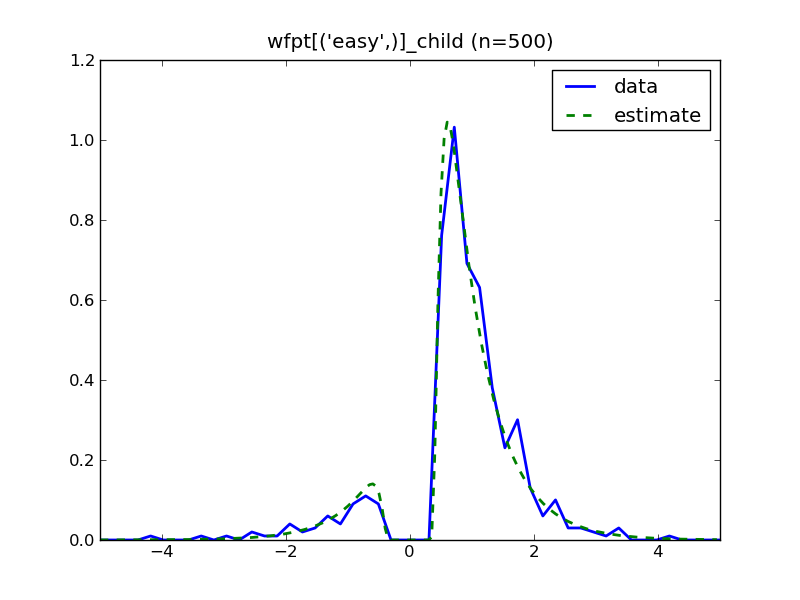
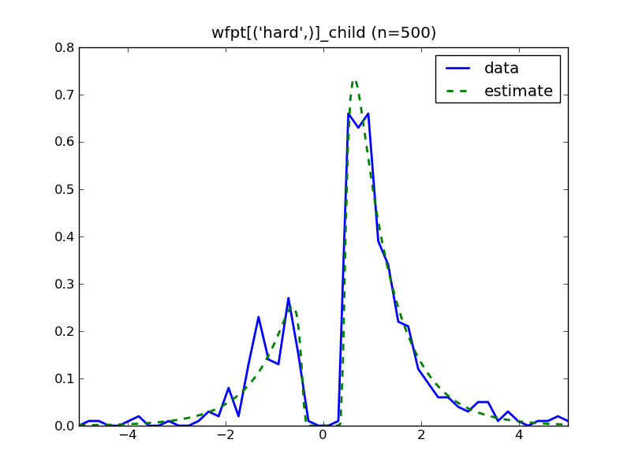
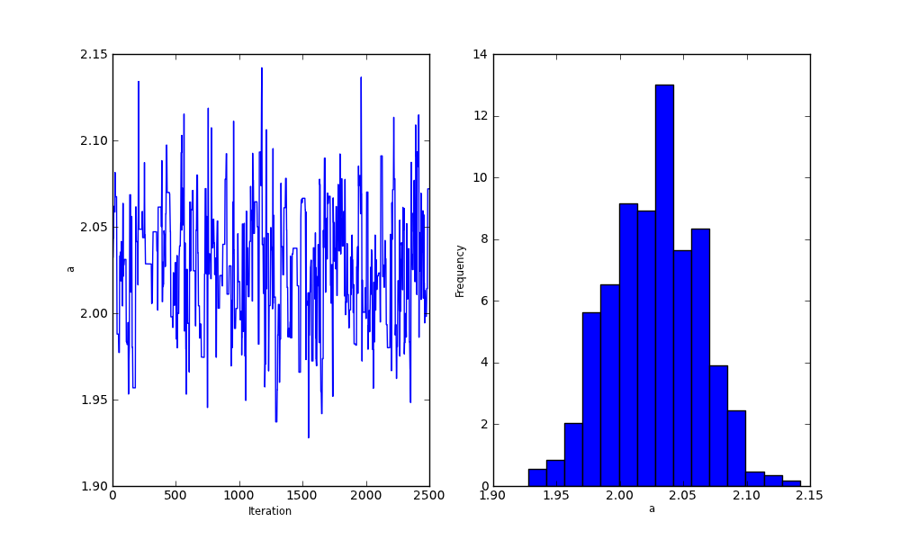

.. index:: Tutorial
.. _chap_tutorial_config:

*****************
A note of caution
*****************

Although HDDM tries to make hierarchical Bayesian estimation as easy
and automatic as possible, the statistical methods used to estimate
the posterior (i.e. Markov-Chain Monte Carlo) rely on certain
assumptions (e.g. chain-convergence). Although we encourage everyone
to try this software, we would like to stress that you are responsible
for making sure that the model actually works. In order to assess
whether the necessary conditions for interpreting your results are met
you have to have some basic grasp on what those methods do and on what
assumptions they rest.

There are multiple books introducing you to the world of hierarchical
Bayesian estimation. Two of which we like are:

`A Practical Course in Bayesian Graphical Modeling`_ by E.J. Wagenmakers and M. Lee

`Doing Bayesian Data Analysis\: A Tutorial with R and BUGS`_ by J. Kruschke

****************************************
Getting started: Creating a simple model
****************************************

Imagine that we collected data from one subject on the moving dots or
coherent motion task (e.g., Roitman & Shadlen, 2002). In this task,
participants indicate via keypress in which of two directions dots are
moving on a screen. Only some of the dots are moving in a coherent
direction; depending on the difficulty, more or less of the dots are
moving in random directions (see the figure). In our working example,
we used two conditions, an easy and a hard condition. In the
following, we will walk through the steps on creating a model in HDDM
to estimate the underlying psychological decision making parameters of
this task.

..  figure:: moving_dots.jpg
    :scale: 20%

The easiest way to use HDDM is to create a configuration file. First,
you have to prepare your data to be in a specific format (csv). The
data that we use here were generated from simulated DDM processes
(i.e. they are not real data), so that we know the true underlying
generative parameters. The data file can be found in the examples
directory and is named simple_difficulty.csv (under Windows, these
files can probably be found in
``C:\Python27\Lib\site-packages\hddm\examples``). Lets take a look at what
it looks like:

.. literalinclude :: ../hddm/examples/simple_difficulty.csv
   :lines: 1,101-105,579-582

The first line contains the header and specifies which columns contain
which data.

IMPORTANT: There must be one column named 'rt' and one named
'response'.

The rows following the header contain the response made
(e.g. 1=correct, 0=error or 1=left, 0=right), followed by the reaction
time of the trial, followed by the difficulty of the trial. Note, that
'difficulty' is just an example, you can call them whatever you like.

The following configuration file specifies a model in which
drift-rate depends on difficulty:

.. literalinclude :: ../hddm/examples/simple_difficulty.conf

The (optional) tag [depends] specifies DDM parameters that depend on
data. In our case, we want to estimate separate drift-rates (v) for
the conditions found in the data column 'difficulty'.

The optional [mcmc] tag specifies parameter of the Markov chain
Monte-Carlo estimation such as how many samples to draw from the
posterior and how many samples to discard as burn-in (as in any MCMC
case, often it takes the MCMC chains some time to converge to the true
posterior so that one would not want to use the initial samples to
draw inferences about the true parameters; for details please read up
on MCMC approaches). Note that you can also specify these parameters
via the command line.

Our model specification is now complete and we can fit the model by
calling hddmfit:

::

    hddm_fit.py simple_difficulty.conf simple_difficulty.csv

The first argument tells HDDM which model specification to use, the
second argument is the data file to apply the model to.

Calling hddmfit in this way will generate the following output (note
that the numbers will be slightly different each time you run this):

::

    Creating model...
    Sampling: 100% [0000000000000000000000000000000000] Iterations: 10000

       name       mean   std    2.5q   25q    50q    75q    97.5  mc_err
    a         :  2.029  0.034  1.953  2.009  2.028  2.049  2.090  0.002
    t         :  0.297  0.007  0.282  0.292  0.297  0.302  0.311  0.001
    v('easy',):  0.992  0.051  0.902  0.953  0.987  1.028  1.102  0.003
    v('hard',):  0.522  0.049  0.429  0.485  0.514  0.561  0.612  0.002

    logp: -1171.276303
    DIC: 2329.069932

The parameters of DDM are usually abbreviated and have the following meaning:

    * a: threshold
    * t: non-decision time
    * v: drift-rate
    * z: bias (optional)
    * V: inter-trial variability in drift-rate (optional)
    * Z: inter-trial variability in bias (optional)
    * T: inter-trial variability in non-decision time (optional)

Because we used simulated data in this example, we know the true
parameters that generated the data (i.e. a=2, t=0.3, v_easy=1,
v_hard=0.5). As you can see, the mean posterior values are very close
to the true parameters -- our estimation worked! However, often we are
not only interested in the best fitting value but also how confident
we are in that estimation and how good other values are fitting. This
is one of advantages of the Bayesian approach -- it gives us the
complete posterior distribution, rather than just a single best guess
(in principle the maximum likelihood estimate could be only slightly
better fit than a range of other values, in which case the posterior
would have high variance). As such the next columns are statistics on the
shape of the distribution, such as the standard deviation and
different quantiles to give you a feel for how certain you can be in
the estimates.

Lastly, logp and DIC give you a measure of how well the model fits the
data. These values are not all that useful if looked at in isolation
but they provide a tool to do model comparison. Logp is the summed
log-likelihood of the best-fitting values (higher is better). DIC
stands for deviance information criterion and is a measure that takes
model complexity into account for bayesian models, similar to BIC or AIC (see here for the relationship
http://www.mrc-bsu.cam.ac.uk/bugs/winbugs/dicpage.shtml). Lower values
are better.

:Exercise:

    Create a new model that ignores the different difficulties (i.e. only
    estimate a single drift-rate). Compare the resulting DIC score with that of
    the previous model -- does the increased complexity of the first model
    result in a sufficient increase in model fit to justify using it? Why
    does the drift-rate estimate of the second model make sense?

Output plots
************

In addition, HDDM generates some useful plots such as the posterior
predictive probability density on top of the normalized RT
distribution for each condition:

Note that error responses have been mirrored along the y-axis (on the
left) to
display both RT distributions in one plot.

These plots allow you to see how good the estimation fits your
data. Here, we also see that our subject makes more errors and are
slower in the difficult condition. This combination is well captured
by the reduced estimated drift-rate parameter in this condition.

Moreover, HDDM generates the trace and histogram of the posterior
samples. As pointed out in the introduction, we can rarely compute the
posterior analytically so we have to estimate it. One standard method
is MCMC which allows you to draw samples from the posterior. On the
left side of the plot we see the trace of this sampling. The main
thing to look out for is if the chain drifts around such that the mean
value is not stable (i.e. has not converged) or if there are periods
where it seems stuck in one place (i.e. proposal distribution too
wide). In our case the chain of the parameter "a" (threshold) seems to
have converged nicely to the correct value. This is also illustrated
in the right side plot which is the histogram of the trace and gives a
feel for how to the posterior distribution looks like. In our case, it
looks like a normal distribution centered around a value close to 2.

Now we are ready for :ref:`part two of the tutorial <chap_tutorial_config_subjects>`.

.. _A Practical Course in Bayesian Graphical Modeling: http://www.ejwagenmakers.com/BayesCourse/BayesBook.html
.. _Doing Bayesian Data Analysis\: A Tutorial with R and BUGS: http://www.indiana.edu/~kruschke/DoingBayesianDataAnalysis/
