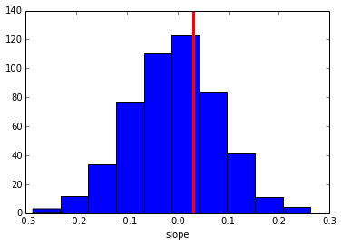

.. index:: Tutorial
.. _chap_tutorial_post_pred:

Posterior Predictive Checks
===========================

In this tutorial you will learn how to run posterior predictive checks
in HDDM.

A posterior predictive check is a very useful tool when you want to
evaluate if your model can reproduce key patterns in your data.
Specifically, you can define a summary statistic that describes the
pattern you are interested in (e.g. accuracy in your task) and then
simulate new data from the posterior of your fitted model. You can the
apply the the summary statistic to each of the data sets you simulated
from the posterior and see if the model does a good job of reproducing
this pattern by comparing the summary statistics from the simulations to
the summary statistic caluclated over the model.

What is critical is that you do not only get a single summary statistic
from the simulations but a whole distribution which captures the
uncertainty in our model estimate.

Lets do a simple analysis using simulated data. First, import HDDM.

.. code:: python

    import hddm

Simulate data from known parameters and two conditions (easy and hard).

.. code:: python

    data, params = hddm.generate.gen_rand_data(params={'easy': {'v': 1, 'a': 2, 't': .3},
                                                       'hard': {'v': 1, 'a': 2, 't': .3}})
First, lets estimate the same model that was used to generate the data.

.. code:: python

    m = hddm.HDDM(data, depends_on={'v': 'condition'})
    m.sample(1000, burn=20)

Next, we'll want to simulate data from the model. By default,
``post_pred_gen()`` will use 500 parameter values from the posterior
(i.e. posterior samples) and simulate a different data set for each
parameter value.

.. code:: python

    ppc_data = hddm.utils.post_pred_gen(m)

The returned data structure is a pandas ``DataFrame`` object with a
hierarchical index.

.. code:: python

    ppc_data.head(10)

.. raw:: html

    

    <table border="1" class="dataframe">
      <thead>
        <tr style="text-align: right;">
          <th></th>
          <th></th>
          <th></th>
          <th>rt</th>
          <th>response</th>
        </tr>
        <tr>
          <th>node</th>
          <th>sample</th>
          <th></th>
          <th></th>
          <th></th>
        </tr>
      </thead>
      <tbody>
        <tr>
          <th rowspan="10" valign="top">wfpt(easy)</th>
          <th rowspan="10" valign="top">0</th>
          <th>0</th>
          <td> 0.41009</td>
          <td> 1</td>
        </tr>
        <tr>
          <th>1</th>
          <td> 0.79089</td>
          <td> 1</td>
        </tr>
        <tr>
          <th>2</th>
          <td>-0.67769</td>
          <td> 0</td>
        </tr>
        <tr>
          <th>3</th>
          <td> 0.49359</td>
          <td> 1</td>
        </tr>
        <tr>
          <th>4</th>
          <td> 1.59039</td>
          <td> 1</td>
        </tr>
        <tr>
          <th>5</th>
          <td> 0.99669</td>
          <td> 1</td>
        </tr>
        <tr>
          <th>6</th>
          <td> 5.51089</td>
          <td> 1</td>
        </tr>
        <tr>
          <th>7</th>
          <td> 0.73069</td>
          <td> 1</td>
        </tr>
        <tr>
          <th>8</th>
          <td> 0.82829</td>
          <td> 1</td>
        </tr>
        <tr>
          <th>9</th>
          <td> 0.92839</td>
          <td> 1</td>
        </tr>
      </tbody>
    </table>
    

The first level of the ``DataFrame`` contains each observed node. In
this case the easy condition. If we had multiple subjects we would get
one for each subject.

The second level contains the simulated data sets. Since we simulated
500, these will go from 0 to 499 -- each with generated from a different
parameter value sampled from the posterior.

The third level is the same index as used in the data and numbers each
trial in your data.

For more information on how to work with hierarchical indices, see the
`Pandas
documentation <http://pandas.pydata.org/pandas-docs/stable/indexing.html#hierarchical-indexing-multiindex>`__.

There are also some helpful options like ``append_data`` you can pass to
``post_pred_gen()``.

.. code:: python

    help(hddm.utils.post_pred_gen)

.. parsed-literal::

    Help on function post_pred_gen in module kabuki.analyze:

    post_pred_gen(model, groupby=None, samples=500, append_data=False, progress_bar=True)
        Run posterior predictive check on a model.

        :Arguments:
            model : kabuki.Hierarchical
                Kabuki model over which to compute the ppc on.

        :Optional:
            samples : int
                How many samples to generate for each node.
            groupby : list
                Alternative grouping of the data. If not supplied, uses splitting
                of the model (as provided by depends_on).
            append_data : bool (default=False)
                Whether to append the observed data of each node to the replicatons.
            progress_bar : bool (default=True)
                Display progress bar

        :Returns:
            Hierarchical pandas.DataFrame with multiple sampled RT data sets.
            1st level: wfpt node
            2nd level: posterior predictive sample
            3rd level: original data index

        :See also:
            post_pred_stats

Now we want to compute the summary statistics over each simulated data
set and compare that to the summary statistic of our actual data by
calling ``post_pred_stats()``.

.. code:: python

    ppc_compare = hddm.utils.post_pred_stats(data, ppc_data)
.. code:: python

    print ppc_compare

.. parsed-literal::

              observed      mean       std       SEM       MSE  credible  \\

    stat
    accuracy  0.890000  0.874580  0.063930  0.000238  0.004325         1
    mean_ub   1.084831  1.048314  0.111169  0.001334  0.013692         1
    std_ub    0.654891  0.542704  0.129186  0.012586  0.029275         1
    10q_ub    0.510200  0.549030  0.045206  0.001508  0.003551         1
    30q_ub    0.649200  0.704437  0.067714  0.003051  0.007636         1
    50q_ub    0.818000  0.891622  0.099117  0.005420  0.015244         1
    70q_ub    1.253800  1.165027  0.149496  0.007881  0.030230         1
    90q_ub    1.884400  1.741424  0.282329  0.020442  0.100152         1
    mean_lb  -0.970818 -1.046499  0.269939  0.005728  0.078595         1
    std_lb    0.543502  0.423627  0.251797  0.014370  0.077772         1
    10q_lb    0.547000  0.660271  0.203289  0.012830  0.054157         1
    30q_lb    0.648000  0.785022  0.223779  0.018775  0.068852         1
    50q_lb    0.693000  0.939898  0.269239  0.060958  0.133448         1
    70q_lb    1.022000  1.158692  0.346341  0.018685  0.138637         1
    90q_lb    1.666000  1.532752  0.515372  0.017755  0.283363         1

               quantile  mahalanobis
    stat
    accuracy  55.500000     0.241202
    mean_ub   64.699997     0.328490
    std_ub    81.500000     0.868420
    10q_ub    18.900000     0.858949
    30q_ub    20.700001     0.815736
    50q_ub    23.400000     0.742775
    70q_ub    73.500000     0.593812
    90q_ub    71.500000     0.506417
    mean_lb   57.517658     0.280362
    std_lb    72.754791     0.476077
    10q_lb    26.538849     0.557192
    30q_lb    25.933401     0.612307
    50q_lb    14.228052     0.917022
    70q_lb    40.060543     0.394675
    90q_lb    65.893036     0.258547

As you can see, we did not have to define the summary statistics as by
default, ``HDDM`` already calculates a bunch of useful statistics for RT
analysis such as the accuracy, mean RT of the upper and lower boundary
(ub and lb respectively), standard deviation and quantiles. These are
listed in the rows of the DataFrame.

For each distribution of summary statistics there are multiple ways to
compare them to the summary statistic obtained on the observerd data.
These are listed in the columns. ``observed`` is just the value of the
summary statistic of your data. ``mean`` is the mean of the summary
statistics of the simulated data sets (they should be a good match if
the model reproduces them). ``std`` is a measure of how much variation
is produced in the summary statistic.

The rest of the columns are measures of how far the summary statistic of
the data is away from the summary statistics of the simulated data.
``SEM`` = standard error from the mean, ``MSE`` = mean-squared error,
``credible`` = in the 95% credible interval.

Finally, we can also tell ``post_pred_stats()`` to return the summary
statistics themselves by setting ``call_compare=False``:

.. code:: python

    ppc_stats = hddm.utils.post_pred_stats(data, ppc_data, call_compare=False)
.. code:: python

    print ppc_stats.head()

.. parsed-literal::

                     accuracy   mean_ub    std_ub    10q_ub    30q_ub    50q_ub  \\

    (wfpt(easy), 0)      0.96  1.164858  0.825420  0.500940  0.736800  0.909940
    (wfpt(easy), 1)      0.92  1.066229  0.500696  0.552553  0.725853  0.842753
    (wfpt(easy), 2)      0.84  1.106792  0.660981  0.538767  0.708527  0.852747
    (wfpt(easy), 3)      0.90  0.949962  0.524693  0.507878  0.634398  0.784638
    (wfpt(easy), 4)      0.88  0.967202  0.523246  0.509131  0.638661  0.781231

                       70q_ub    90q_ub   mean_lb    std_lb    10q_lb    30q_lb  \\

    (wfpt(easy), 0)  1.388660  1.902310 -1.270140  0.592450  0.796180  1.033160
    (wfpt(easy), 1)  1.298903  1.815803 -0.921803  0.204067  0.720703  0.842803
    (wfpt(easy), 2)  1.137547  1.791117 -1.610109  1.577114  0.813307  0.843867
    (wfpt(easy), 3)  1.013418  1.533458 -1.125698  0.371009  0.667518  1.004518
    (wfpt(easy), 4)  0.958081  1.826761 -0.765531  0.363230  0.545531  0.599181

                       50q_lb    70q_lb    90q_lb
    (wfpt(easy), 0)  1.270140  1.507120  1.744100
    (wfpt(easy), 1)  0.899403  0.964963  1.140823
    (wfpt(easy), 2)  1.084597  1.183127  2.654677
    (wfpt(easy), 3)  1.334438  1.347158  1.454438
    (wfpt(easy), 4)  0.614681  0.665531  1.136381

This ``DataFrame`` has a row for each simulated data set. The columns
are the different summary statistics.

Defining your own summary statistics
------------------------------------

You can also define your own summary statistics and pass them to
``post_pred_stats()``:

.. code:: python

    ppc_stats = hddm.utils.post_pred_stats(data, ppc_data, stats=lambda x: np.mean(x), call_compare=False)
.. code:: python

    ppc_stats.head()

.. raw:: html

    

    <table border="1" class="dataframe">
      <thead>
        <tr style="text-align: right;">
          <th></th>
          <th>stat</th>
        </tr>
      </thead>
      <tbody>
        <tr>
          <th>(wfpt(easy), 0)</th>
          <td> 1.067459</td>
        </tr>
        <tr>
          <th>(wfpt(easy), 1)</th>
          <td> 0.907187</td>
        </tr>
        <tr>
          <th>(wfpt(easy), 2)</th>
          <td> 0.672088</td>
        </tr>
        <tr>
          <th>(wfpt(easy), 3)</th>
          <td> 0.742396</td>
        </tr>
        <tr>
          <th>(wfpt(easy), 4)</th>
          <td> 0.759274</td>
        </tr>
      </tbody>
    </table>
    

Note that ``stats`` can also be a dictionary mapping the name of the
summary statistic to its function.

Using PPC for model comparison with the groupby argument
--------------------------------------------------------

One useful application of PPC is to perform model
comparison. Specifically, you might estimate two models, one for which
a certain parameter is split for a condition (say drift-rate ``v`` for
hard and easy conditions to stay with our example above) and one in
which those conditions are pooled and you only estimate one
drift-rate.

You then want to test which model explains the data better to assess
whether the two conditions are really different. To do this, we can
generate data from both models and see if the pooled model
systematically misses aspects of the RT data of the two
conditions. This is what the ``groupby`` keyword argument is
for. Without it, if you ran ``post_pred_gen()`` on the pooled model
you would get simulated RT data which was not split by
conditions. Note that while the RT data will be split by condition,
the exact same parameters are used to simulate data of the two
conditions as the pooled model does not separate them. It simply
allows us to match the two conditions present in the data to the
jointly simulated data more easily.

.. code:: python

    m_pooled = hddm.HDDM(data) # v does not depend on conditions
    m_pooled.sample(1000, burn=20)

    ppc_data_pooled = hddm.utils.post_pred_gen(m_pooled, groupby=['condition'])

You could then compare ``ppc_data_pooled`` to ``ppc_data`` above (by
passing them to ``post_pred_stats``) and find that the model with
separate drift-rates accounts for accuracy (``mean_ub``) in both
conditions, while the pooled model can't account for accuracy in
either condition (e.g. lower ``MSE``).

Summary statistics relating to outside variables
------------------------------------------------

Another useful way to apply posterior predictive checks is if you have
trial-by-trial measure (e.g. EEG brain measure). In that case the
``append_data`` keyword argument is useful.

Lets add a dummy column to our data. This is going to be uncorrelated to
anything but you'll get the idea.

.. code:: python

    from numpy.random import randn
    data['trlbytrl'] = randn(len(data))
.. code:: python

    m_reg = hddm.HDDMRegressor(data, 'v ~ trlbytrl')
    m_reg.sample(1000, burn=20)

    ppc_data = hddm.utils.post_pred_gen(m_reg, append_data=True)

.. code:: python

    from scipy.stats import linregress
    ppc_regression = []
    for (node, sample), sim_data in ppc_data.groupby(level=(0, 1)):
        ppc_regression.append(linregress(sim_data.trlbytrl, sim_data.rt_sampled)[0]) # slope

    orig_regression = linregress(data.trlbytrl, data.rt)[0]
.. code:: python

    plt.hist(ppc_regression)
    plt.axvline(orig_regression, c='r', lw=3)
    plt.xlabel('slope')

As you can see, the simulated data sets have on average no correlation
to our trial-by-trial measure (just as in the data) but we also get a
nice sense of the uncertainty in our estimation.
